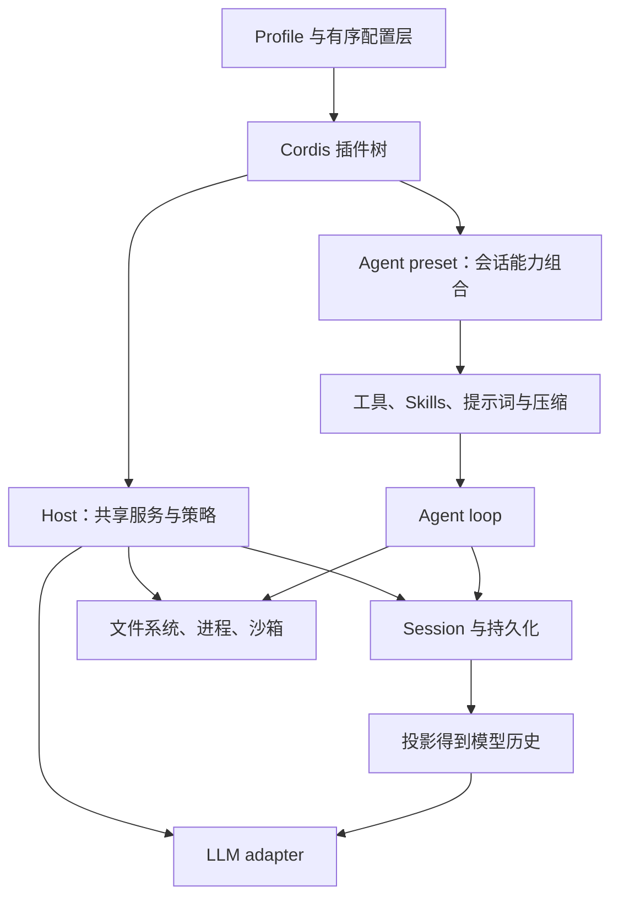
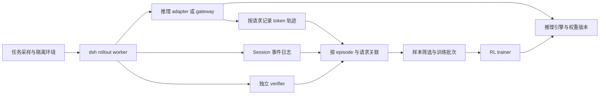

# DeepSeek Harness 深入调研：插件运行时、事件轨迹与 Agent RL 边界

DeepSeek Harness（`dsh`）最有价值的设计，是把 Agent 的能力组合和运行历史都变成可检查、可替换的对象：Cordis 管理组件的依赖与生命周期，Session 日志承载已经发生的事实，Agent loop 从日志投影出对话请求。模型、工具、上下文策略和界面因此可以分别演化，同时保留追查某次行为的依据。[^1][^3]

对 Agent 系统与强化学习研究，值得关注的是三个判断：

1. **它提供了完整的 Agent 运行底座，尤其适合研究 harness 本身。** 可以在同一套系统里替换工具呈现方式、上下文压缩、模型适配器和控制循环，比较这些变量如何影响行为。
2. **它的事件轨迹很适合诊断，但还需要一层训练数据协议。** 可还原的消息、流式文本和 token 用量，并不自动包含采样 token ID、逐 token logprob、loss mask 和训练权重版本。
3. **公开证据支持架构与工程能力，尚不足以给出任务效果排名。** 当前官方 benchmark 入口没有提供可审计的 SWE-bench 或 Terminal-Bench 对比结果，也没有公开与该 harness 绑定的完整 RL 训练配方。[^17][^18][^23]

## 1. 对象、版本与证据边界

本文对象是 DeepSeek 官方仓库 `deepseek-ai/deepseek-harness`，npm 入口为 `@deepseek-ai/dsh`，许可证为 MIT。它处于 developer preview，官方明确提示可能发生破坏兼容性的改动。本文实现分析固定在 **`v0.1.5-alpha.2` / `b2e3b2a0125854567a4a5fcba75782e42fe84901`**，该提交时间为 2026-09-09 22:13:03 +08:00；公开网页与发布记录核验截至 2026-09-10。以下固定提交链接是实现判断的依据。[^1][^2]

证据按用途区分：源码说明当前做了什么，随源码的测试说明维护者要保证哪些行为，文档解释接口意图，论文解释设计及实验范围。本文不包含在线模型任务实测、运行时间测量或独立安全复现；引用已有测试不表示这些测试已在本文环境中执行。

版本区分会直接改变结论。例如，官网仍将 minimal 描述为持久 bash 与 `str_replace_editor` 两个工具；但本版本的发布说明和配置已经改成默认只有持久 shell，编辑器需要显式添加。另一个例子是会话格式已升级到 V3，旧文章中的事件名和读取方式可能不再适用。[^2][^8][^10]

### 1.1 Harness 在这里负责什么

| 层 | 本文中的含义 | dsh 的位置 |
|---|---|---|
| 模型 | 根据上下文生成文本、推理内容和动作 | 通过 adapter 接入，权重不属于 harness |
| Agent harness | 组织上下文、循环、工具、状态、交互与资源 | dsh 的主要职责 |
| 任务环境 | 仓库、shell、文件系统、依赖、网络和外部服务 | 由本地或远端 provider 连接 |
| Benchmark evaluator | 加载题目、执行独立 verifier、计算任务成功率 | 需要另外集成 |
| RL trainer | 计算 reward/advantage/loss，更新并同步权重 | 需要另外集成 |

这一分层避免两种混淆：`BENCHMARK.md` 的存在不能说明它自带完整任务评测系统；DeepSeek 开源一个 harness，也不能证明这是某个模型内部训练使用的同一套系统。后者需要模型报告、训练配置或明确声明才能建立联系。[^17][^23]

## 2. 架构：可替换能力如何真正连起来

### 2.1 三个角色构成一个能力接口

官方把一个可替换能力拆成 Service Definition、Service Provider 和 Consumer。例如，文件系统接口定义消费者可调用的方法，本地 provider 负责实际文件操作，模型可见的读写工具消费该接口。扩展插件依赖服务定义，避免导入具体 provider；因此更换执行后端时，不必同时改写每个工具。[^3]



`core/agent` 定义公共 Agent 契约和事件，`core/agent-loop` 是默认驱动实现；UI、hook 和工具依赖前者。因此“替换循环”在依赖结构上有明确支点。不过，替换者仍需履行事件、生命周期、取消和日志合同，不能只实现一个 `while` 循环就期待全部 UI 与恢复功能继续工作。[^3][^9]

### 2.2 Profile、bundle、preset 是不同层级

| 概念 | 控制范围 | 典型用途 |
|---|---|---|
| Profile | 一次应用启动使用的组合 | `web`、`headless`、`sdk`、`sdk-minimal`、`acp` |
| Bundle | 可分发的配置补丁与其依赖代码 | 提供 base 能力或某种应用入口 |
| Agent preset | 单个会话的工具、persona、Skills 等 | `standard`、`ptc`、`minimal`、`cordis` |
| Patch | 对插件树的插入或配置覆盖 | 增加 provider、调整策略与参数 |

启动时，bundle 按 profile 声明顺序应用，之后依次应用 profile patch、home patch、命令行 `--patch`。替换某个 row 的配置是替换整个 config，不能默认理解为任意深度字段合并。`web` 支持实时配置重载，而 `headless`、`sdk`、`sdk-minimal`、`acp` 在启动时应用一次，以保持其正在承接的工作生命周期。[^3]

**Web minimal preset 和 `sdk-minimal` profile 不能互换理解。** 前者是宿主进程中一个会话的能力选择，仍消费宿主沙箱等服务；后者拥有完整、显式的独立插件树，不叠加 `dsh-base`。因此“工具同样只有 shell”并不意味着权限、持久化和后台服务也相同。[^8][^16]

Host 与 Agent 的分工也不是目录命名问题。共享注册表、持久化和审批栈通常属于 Host；一个会话贡献的工具和提示词属于 Agent。preset 内若自行发布服务，需放在 `isolate` realm 中，避免多个会话注册同名服务时冲突。这个 realm 解决服务解析作用域，不提供 OS 隔离。[^8]

### 2.3 Cordis 的时间与空间可组合性

**时间可组合性**回答“插件退出后，如何清理它安装的东西”。`ctx.effect()` 将安装动作与 disposer 关联；服务注册、事件监听和子插件可纳入这套生命周期。插件作者自行创建的 watcher、连接或定时器，仍需提供正确的释放动作。框架无法替作者推导任意操作的逆过程。[^5][^6]

**空间可组合性**回答“服务变化后，哪些消费者仍能运行”。通过 `inject` 声明必需依赖，消费者可在依赖未就绪时等待，在依赖出现后激活，在依赖消失或替换后卸载并重新求解。这比启动时只执行一次的依赖注入更适合动态工具与模型配置。[^6]

它的收益是明确资源归属，减少遗留监听器、重复注册和过期服务引用。代价是开发者需要理解插件激活状态、服务作用域和重载边界；组合错误会成为新的故障类型。dsh 自带的是经过修改的 Cordis vendor 快照，版本标记为 `4.0.0-rc.7`，不能直接用上游最新实现代替。[^4]

论文对可撤销性的边界十分明确：已写入文件的字节、已发送的网络数据不在简单资源释放所能撤销的范围内；不可信代码也需要外部沙箱。关闭文件句柄并不会恢复文件内容，移除插件也不会取消已经发生的远端操作。[^5]

### 2.4 热重载的保证要按路径区分

配置重载的 `EntryGroup.update()` 会等待候选配置，失败后尝试恢复旧配置。代码 HMR 则先尝试重新导入并保存缓存回滚路径，但本版本 `partialReload()` 创建新 fiber 后没有等待其异步启动，`registry.delete()` 也没有等待旧 fiber 完成清理。[^7]

据此可以确认已有配置回滚和导入失败恢复机制，但不能将代码 HMR 宣称为涵盖一切异步失败的完整事务。对长时间任务，固定运行期间的能力组合，并在隔离实例中验证新插件，是比依赖泛化的“可回滚”承诺更可控的工程选择。

## 3. 一次 Agent 运行：从输入到模型，再到工具

### 3.1 Step、turn 与 request attempt

Step 大体对应一次模型请求及其工具执行；一个 turn 可以包含多个 step。实际运行还要区分一次 step 中的多个模型尝试，例如网络错误后的 retry。输入先进入 inbox，一部分输入立即唤醒 Agent，注入型上下文则可等待下一次正式请求。[^9]

主路径可以概括为：

```text
接收输入 → turn/start → claim 输入
  → 组装 prompt sections 与工具定义
  → agent/pre-step 接受、改写或拒绝
  → step/start
  → agent/request + prepareCall 绑定实际路由和能力
  → 将 system/user 与请求元数据落实到日志
  → 从日志 deriveMessages，冻结请求
  → adapter 流式生成
  → assistant/message 或 assistant/attempt
  → tool/call → 工具策略和执行 → tool/result
  → step/end → 下一 step 或 turn/end
```

两个细节说明它不是简单拼接 `messages`。第一，异步路由准备完成后才依据真正使用的 adapter 能力提交系统提示词和用户输入；准备期间取消，不应留下仿佛已经送达模型的输入。第二，重试通常复用本 step 的组装结果，不会重复执行输入接纳；若上下文压缩改变了有效历史，重试请求则必须反映这种变化。[^9]

工具同样有公共执行通道：`tools/pre-execute`、实际 dispatch、`tools/post-execute`，并配有最终执行前的单调 guard。单调意味着一项拒绝不应被后续监听器重新放行。是否需要人类审批，取决于组合的具体策略及执行动作，而不是每个工具天然都会询问一次。[^11][^19]

### 3.2 三种“历史”必须分开

| 层 | 保存的对象 | 是否直接作为下一次模型输入 |
|---|---|---|
| Durable SessionEvent log | 输入、消息、工具、请求参数、替换、失败、生命周期等事实 | 只有其中的模型可见投影 |
| Conversation surface / `deriveMessages()` | 当前仍有效的系统、用户、助手、工具消息 | 是主循环的逻辑消息来源 |
| Live UI stream | 尚在生成的增量帧 | 用于实时显示，不等于已经持久化 |

日志是 append-only，但有效历史可以改变：追加一个 replacement 操作，能够让旧范围退出当前 surface，同时保留其原始事件。这为压缩、系统提示词更新和分叉保留了审计依据。因此“日志只追加”和“模型每轮看到的前缀永远不变”是两个不同命题。[^10]

`request/header` 承载工具 schema 和请求配置等信息，`request/context` 记录解析后的路由上下文；系统提示词则以 `system/message` 参与当前 surface。读取轨迹时不能把所有 event 的文本顺序串起来，也不能只读最后一个 header 就重建任意历史 step。必须按照对应时刻的日志前缀及格式规则投影。[^9][^10]

### 3.3 失败尝试与崩溃边界

当前实现把紧凑、带时间信息的流记录嵌入最终 `assistant/message` 或 `assistant/attempt`。成功保留的内容成为模型历史；结算为 `assistant/attempt` 的失败或重试输出仅用于诊断。取消需要单独看：已交付的文本和推理可以保存为 `interrupted: true` 的助手消息，而未派发的工具块会被丢弃，不能笼统认为取消内容全部退出历史。实时 UI 的 `agent/assistant-stream` 帧是另一条进程内事件路径。[^9][^10]

这让“失败时产生过什么”和“下一次模型真正看到了什么”可以分别回答。不过，进程在一次流结算前硬退出，可能没有留下该尝试的完整 durable stream。不能把实时看过的所有片段都视为已安全落盘，也不能把 resume 解释为恢复到了故障前的精确机器状态。

还要区分内存日志提交与磁盘持久化：`Session.append()` 本身不等于 `fsync`。已组合 checkpoint policy 的运行时会在模型派发、顶层工具执行和下一 pre-step 等语义边界 flush。恢复时对未闭合尾部补充错误与结束事件，并区分 `TOOL_NOT_STARTED` 和 `TOOL_OUTCOME_UNKNOWN`；后者意味着需要核实外部状态，没有副作用 exactly-once 的承诺。[^30]

### 3.4 可重建保证的精确范围

主循环有 reconstruction invariant，核对日志投影与逻辑请求的一致性；它只处理标记为 Agent loop 的请求。标题生成有独立请求事件；压缩摘要使用自己的来源范围与元数据，其重建需要日志加固定版本的 summarizer 代码，失败摘要也没有同样的逐流结算记录。不能假设所有辅助 LLM 调用都套用同一条 invariant。[^9][^14][^26]

即使主循环逻辑请求能够重建，也还隔着 adapter 序列化、图片版本选择、Files API 引用及服务端 tokenizer。**逻辑消息一致，不等于 HTTP 字节一致，更不等于训练 token 序列一致。** 对精确复现，应固定 adapter 与附件内容；对 RL，还需直接记录推理端实际使用的 token 和采样信息。[^13][^23]

## 4. 工具呈现：standard、minimal、PTC 与创造模式

### 4.1 四种 preset 的实际取舍

| Preset | 主要工具形态 | 上下文与编排 | 合适的研究问题 |
|---|---|---|---|
| `standard` | 原生 shell、文件、搜索等工具 | Skills、计划、目标、压缩、子代理、workflow 等 | 完整 coding agent 的协同效果 |
| `minimal` | 持久 `bash`；Windows 为 `pwsh` | 固定 persona，无上下文压缩 | 减少显式工具与上下文策略变量 |
| `ptc` | 模型主要调用 `run_code`，内部使用生成的工具 SDK | 继承大量 standard 能力；通用 workflow 工具显式禁用 | 程序式组合对调用轮数和观察量的影响 |
| `cordis` | standard 能力加运行时检查与动态插件工具 | 含 preset 创作指引 | Agent 如何修改和创作自己的能力组合 |

此表以四份 preset 配置为准。尤其 PTC 并非逐项完全等同 standard：它保留 workflow engine 供其他能力使用，但禁用了通用 `workflow` 工具，以 `run_code` 作为模型编写多步程序的主要入口。minimal 的固定提示词也主动屏蔽其他提示词片段与 runtime context。[^8]

### 4.2 PTC 改变的是动作表达与信息返回方式

原生工具模式通常是“模型提出工具调用 → 收到观察 → 再决策”。PTC 允许模型一次生成带 `await`、分支、循环和结果筛选的 TypeScript 程序，调用生成的 `tools` SDK。内部结果先供程序计算，程序输出及返回值构成外层 `run_code` 的模型可见结果；图片结果另有附带处理。[^11]

例如，读取若干文件后只返回符合条件的条目，可以减少每个原始文件内容都进入下一轮上下文的需要。这是降低模型往返次数和保留 token 的潜在路径，但它也要求模型提前写出正确的控制流。若中间观察本来需要语义判断，过早编成一段程序可能增加失败或遗漏。

PTC 的内部调用仍走工具策略和调度，并记录 `tool/ptc-dispatch-start`、`tool/ptc-dispatch` 等诊断事件。**这些内部事件不是逐个加入模型历史的原生工具观察。** 因此，导出训练数据时若把所有内部结果都插入 messages，就会让训练模型看到 rollout 时从未看到的内容。[^11]

`Promise.all` 也不是无限并发许可。当前 PTC 子调用默认并发上限为 10；只有工具显式判断为 concurrency-safe 的调用可重叠，其余调用作为独占屏障。开始前策略与结果提交仍按调度合同排序。它提供的是受约束的执行并发，不保证一个程序内所有调用都会同时运行。[^11]

### 4.3 Worker 与创造模式的执行边界

默认 TypeScript runtime 每次使用新的 Node worker，具有计算时间、墙钟、堆内存和输出量限制，上一段程序的 worker 状态不延续到下一次。但官方明确将其权限视作 bash-equivalent：代码可以触达 Node API，worker 不是隔离宿主的安全边界，而且其创建的 OS 子进程可能在 worker 终止后继续存在。[^12]

创造模式允许模型检查当前运行时，在内存中定义、运行和更新动态包。定义按会话管理，但活动代码可能影响同进程的其他会话；临时定义在重启后消失，持久化能力组合需要另行创作 preset。它提供了 harness 自我修改的操作接口，尚不能据此推出自我修改会稳定提升任务表现。[^27]

### 4.4 子代理 fork 只继承已结束的 turn

spawn 创建新会话，fork 则从父会话的稳定前缀创建分支。本版本 in-process fork 只继承到最后一个 `turn/end`，发起 fork 的整个当前 turn 都不在继承范围内。如果在首个 turn 中 fork，子会话得到的是空历史，子任务 prompt 必须自行携带当前任务信息。[^15]

可继续对话的子代理由持久 Session 与进程内 activation 管理，可接收排队和 steer 输入。消息路由限制在直接父子等明确关系，不能把它当成任意 Agent 的共享群聊。fork 的模型与前缀设计有利于缓存复用，但真实缓存共享仍取决于推理服务。

## 5. 模型适配、上下文管理与缓存

### 5.1 模型无关的核心，带 provider 特性的边缘

`ctx.llm` 提供统一的消息、内容块、流式输出和错误类型。DeepSeek adapter 使用自己的请求序列化与 SSE 处理；pi-ai adapter 提供其他 provider 的接入路径。provider/model 路由、reasoning effort、最大输出等配置要按具体 adapter 解释，接口统一并不意味着所有模型的协议语义完全一致。[^13][^23]

本版本 DeepSeek adapter 的内置目录列出 V4 Flash、V4 Pro 和实验视觉模型，但这只是该源码快照的配置与发现目录。模型服务的真实可用性、价格和能力需要在部署时由对应 endpoint 核实，不能由 harness 的静态目录推定。

`prepareCall()` 将能力、配置和 adapter 代际绑定到一次调用，避免热重载期间混用旧能力描述与新路由。对多模态输入还要处理持久附件到请求版本的投影；Files ID 刷新或退回 base64，均可能改变实际请求的前缀表示。[^13]

### 5.2 动态系统提示词的缓存优化是有条件的

当模型明确声明 `systemPromptUpdate: in-history`，并且端点真的支持将历史中最新 system 消息作为完整有效提示词时，dsh 可把非空更新追加到已有历史后，从而保留更新之前的前缀。没有该声明时，需要将当前提示词归并到前部系统节点；新请求系列也有对应归并规则。[^9][^13]

**本版本 DeepSeek adapter 的默认模型条目没有开启该声明。** 不能把发布说明中的“支持动态更新且不破坏 KV cache”读成所有模型默认如此。更不能凭配置让一个不支持该语义的服务获得支持。工具 schema、历史替换和图片表示变化仍可能影响缓存命中。

缓存分析应拆分两个量：逻辑前缀是否保持稳定，以及 provider 实际报告的 cache-read token。前者是工程条件，后者才是服务运行时证据；成本比较需要一并记录 reasoning token、摘要调用与失败重试。

### 5.3 压缩通过日志中的替换实现

`compaction-basic` 的主动压力压缩默认以路由模型上下文窗口的 80% 为触发阈值，保留预算默认是窗口的 16%；它选择可平衡的旧历史区间，并在需要时用额外模型调用生成摘要。已安装的 tool-result pruner 可先削减大工具结果；若压力因此下降，可能无需摘要调用。minimal 组合没有这套压缩。[^14]

provider 确认 context overflow 后则走恢复路径，绕过普通阈值与尾部保留预算，尝试更大的平衡区间缩减；只有有效 surface 替换确实发生后，才授权相应重试。因此 80%/16% 描述的是常规主动策略，不能套到所有压缩场景。

压缩的核心变化是追加记录并替换有效 surface 的旧范围，近期尾部尽量保留。工具调用与结果的配对、系统头、不可拆分的大块、摘要是否确实缩小范围，都限制了它的作用。容量再大也不能保证任意单个巨大工具结果或提示词都能靠摘要解决。

对研究而言，压缩策略本身属于 policy 的外部条件：摘要丢失了什么、哪些工具观察被裁剪、摘要模型是谁，都会影响后续决策。若比较两个模型却让其中一个更频繁触发压缩，测得的差异就同时包含了上下文策略的影响。

## 6. Python SDK：接入容易，任务生命周期仍需自己定义

Python SDK 是驱动打包 dsh 子进程的客户端，通过 stdio 上一行一个 JSON-RPC 消息通信；它不是 Python 重写的一套独立 agent loop。安装 `deepseek-harness-sdk` 会配套同版本运行时，正常运行无需系统 Node.js。SDK 要求显式 Harness home，不会默默使用 `~/.dsh`。[^16]

### 6.1 接入模板与版本复现

**源码发布与 PyPI 发布并不同步。** 截至核验日，PyPI 页面列出的最新 SDK 是 2026-09-04 的 `0.1.2rc1`；其说明仍包含双工具 minimal。下面的安装命令可以固定这一已核验公开版本，但它不等于本文分析的 `b2e3b2a` 源码快照。不能将 npm 的 `0.1.5-alpha.2` 机械转换后就假定对应 wheel 已发布。[^31]

```bash
python -m pip install 'deepseek-harness-sdk==0.1.2rc1'
```

下面展示的是本文固定源码中的 SDK 调用接口，尚未执行。严格复现本文行为时，应从固定提交按官方 Python 构建流程生成 SDK 与 runtime wheel，再配套安装；该流程以根 `package.json` 版本为准，在打包阶段注入 Python 版本。目录由外层 runner 预先创建，凭据通过执行环境提供。[^16][^28]

```python
from deepseek_harness import DeepSeekHarness

with DeepSeekHarness(
    provider="deepseek-official",
    model="deepseek-v4-flash",
    profile="sdk-minimal",
    cwd="/work/task-001/repo",
    dsh_home="/work/task-001/dsh-home",
    max_tokens=8192,
) as harness:
    result = harness.run(
        "Inspect the repository and fix the failing tests.",
        session_id="task-001-sample-001",
    )

print(result.finish_reason)
print(result.final_response)
```

源码内 Python SDK manifest 是开发占位版本 `0.0.0.dev0`，正式 wheel 元数据由发布脚本生成。复现实验应保存实际 wheel 版本、校验值和构建提交。`max_tokens=8192` 是每次模型输出上限，不是整个任务总 token 预算。[^16][^28]

`sdk-minimal` 显式设置 `danger-full-access`，其 cwd 只是工作目录，不是可访问文件的边界。默认提供持久 shell、固定 persona、本地执行与 JSONL；没有本地指令发现、Skills、网页工具、子代理或自动压缩。使用该配置的实验应由外部容器或同等级执行环境承担隔离。[^16][^19]

### 6.2 结果、结束与超时

`session/prompt` 返回的是消息入队回执。高层 `Session.run()` 再等待该输入被接收之后的 Agent idle，返回 `session_id`、`final_response`、`finish_reason`、`events` 和 `notifications`。根会话 events 与包含已知后代的 notifications 有不同范围，子代理结果不会覆盖根会话最终响应。[^16][^21]

这意味着“收到回执”“模型停止输出”“整个 Agent 暂时空闲”“任务通过 verifier”是四个不同条件。`completed` 只能说明运行结束方式，不能作为任务 reward。

当前 Python 实现还有一个容易误用的超时边界：`request_timeout_seconds` 约束的是 RPC response 等待；在收到 `session/prompt` 回执后，`Session.run()` 调用没有 timeout 的 `subscription.next()` 等待 idle。因此，即使设置 RPC 超时，也不能据此认为完整 episode 已受墙钟上限约束。[^29]

协议也没有 per-session cancel 或 close 方法。对独立评测任务，更可控的做法是外部 worker 持有 episode deadline，超时后终止该任务独占的 runtime 与执行环境，并把超时作为独立结果记录。复用同一运行时来提高吞吐时，需要额外考虑一个任务的终止是否会影响其他任务。[^21][^29]

### 6.3 最低限度的实验 manifest

| 类别 | 应固定并保存的信息 |
|---|---|
| 软件 | dsh commit/版本、SDK/runtime wheel、插件及依赖版本 |
| 组合 | profile、preset 内容、有序 patches、最终配置快照 |
| 模型 | endpoint 类型、精确模型标识/权重版本、adapter、采样参数、reasoning effort |
| 任务 | task ID、数据集 revision、仓库 base commit、输入 prompt |
| 执行 | 镜像 digest、OS/shell、网络策略、可见路径、依赖和资源限制 |
| 预算 | 每请求输出、总 token/成本、最大步骤、任务 deadline、并发与重试 |
| 产物 | 全部日志及格式版本、附件/外置输出、补丁、verifier 输出、退出原因 |

这些是实验设计建议，不是 dsh 当前自动导出的完整合同。特别是持久 shell 的环境变量、cwd、进程状态，以及同一 home 中的会话资源，都可能引入跨任务污染。独立样本应使用新的 session ID，必要时同时使用新的 home 和执行环境。

## 7. 评测证据：当前能证明什么

### 7.1 官方 benchmark 入口不等于任务 leaderboard

固定版本 `BENCHMARK.md` 只有引导性内容：通过 Python SDK 运行 minimal 变体，并为独立任务使用不同 workspace 与 session ID。它没有定义完整的数据集、verifier、采样次数、成本限制或任务结果表。[^17]

仓库 `benchmarks/` 的测试主要是工程性能工作负载，例如长会话续跑、前端会话操作、流式消息重连等。它们用于发现运行时性能回归，对产品质量有价值，但不能说明模型修复仓库或完成终端任务的成功率。[^18]

因此，目前合理结论是“具备接入任务评测的运行接口”，而不是“已有公开证据证明它优于其他 harness”。同样，也没有足够公开依据将某个 DeepSeek 模型的能力提升归因于这套公开源码中的某一项机制。

### 7.2 安全评测论文的有效范围

原始论文 *Security Assessment of DeepSeek Harness with A.I.G* 对间接提示注入做了受控测试。其测试对象固定在 2026-08-13 的 `47f943859bef`，使用 DeepSeek-V4-Flash 代理端点，并将真实 agent loop、工具注册和事件路径连接到可控输入源及模拟敏感操作。[^20]

该实验能说明特定组合在受控注入场景中的表现，不能直接外推本报告 9 月版本、其他模型或真实服务的泄露比例。版本、工具、提示词、权限和判分口径都属于结果的一部分。本文因此不把它的实验比例转写为当前版本的“安全率”。

### 7.3 权限边界按执行通路核对

普通 base 组合的默认 sandbox policy 是 `workspace-write`，审批处理为 `ask`；独立 `sdk-minimal` 是 `danger-full-access`。审批只处理实际产生的请求，不能理解成所有工具调用前都有人类审核。配置 `never` 也不是自动批准，它会拒绝到达审批处理器的请求。[^19]

还要区分三个机制：Cordis realm 隔离服务名称与实例，worker 控制一段程序的资源生命周期，OS sandbox 约束实际执行访问。dsh 的统一 sandbox mode 承诺主要针对文件副作用，不保证统一的网络或进程可见性限制；平台后端还可能报告 partial enforcement。工具描述写“无法联网”也不是网络限制的证据，真实网络能力由执行环境与部署策略决定。[^19]

对于研究部署，边界应在执行环境处可验证，不能单靠自然语言提示词或可选插件名称推断。尤其 PTC 和创造模式具有较宽的代码执行权限，不能直接作为多租户隔离层。[^12][^19][^27]

### 7.4 请求元数据的默认值也属于复现条件

本版本存在两项容易混淆的 DeepSeek 请求扩展：`dsh_session_log` 默认关闭，启用后上传增量 canonical Session 日志；`dsh_plugin_packages` 默认开启，发送活动 Loader 插件的名称和版本。二者都在模型输入之外，不属于 messages 或工具 schema。[^24]

插件清单不覆盖全部可执行代码，例如程序化挂载的子 fiber 和内存动态插件不在该清单中。因此它有诊断价值，但不是完整实验 provenance，也不能据此推断日志内容的服务端用途或模型训练用途。

## 8. Agent RL：能复用什么，还缺什么

### 8.1 可复用的部分

dsh 可承担 rollout 时的 Agent 控制层：与模型交互、执行工具、维护历史、记录分支、压缩上下文和承接子代理。插件接口可用于对比不同 action space 和 context policy，Session 日志可用于定位失败发生在模型选择、工具执行还是上下文转换。[^3][^9]

但公开 `StreamChunk` 是 text/reasoning/tool-argument delta、usage 和 finish 等事件；文本 delta 不保证恰好一个 tokenizer token。标准协议没有提供足够的逐 token 采样记录。把流式文本称为“token-level chunks”，不能替代 RL 所需的精确训练合同。[^23]

| RL 必需信息 | dsh 当前可提供的相关依据 | 仍需补充的合同 |
|---|---|---|
| 实际输入 | 日志投影后的逻辑 messages、工具与请求配置 | 推理端实际 prompt token IDs、模板版本 |
| 生成动作 | 输出内容块、raw tool arguments、带时间的 stream | sampled token IDs、逐 token logprobs |
| 训练位置 | 消息角色与工具观察来源 | 显式 loss mask、特殊 token 与截断规则 |
| On-policy 来源 | 模型路由及插件元数据 | 精确权重 revision、rollout policy 版本 |
| 任务奖励 | 执行产物和结束原因 | 独立 verifier、reward contract、失败分类 |
| 分支归属 | Session/fork/subagent 关系 | episode/segment ID、共享前缀和信用分配规则 |

### 8.2 一个建议的接入分层

下面是基于现有接口的工程设计建议，不是已经发布的官方训练链路：



让 dsh 负责 Agent 行为，让推理边界负责 token 真值，让 verifier 负责 reward。采集位置应覆盖 provider 真正收到的输入和真正生成的 token；仅截获 Python 的 `RunResult` 或对会话文本再 tokenize，容易丢失协议转换与分支信息。

一条建议的 request segment 应至少包含 `episode_id`、`session_id`、`step_id`、`attempt_id`、`parent_segment_id`、输入 token、输出 token、采样 logprob、loss mask、模型权重版本、终止类型，以及对应日志范围。字段名可以不同，关键是每个生成动作都能关联到它实际条件化的上下文。

### 8.3 五个必须处理的轨迹问题

**第一，压缩是上下文分支点。** 压缩后的摘要替换旧历史，下一次请求的 token 前缀可能不再是上一轮序列的简单延长。建议按实际请求保存 segment，显式记录 replacement 对应的上下文切换。不要把最终会话 surface 反向套到压缩前的生成片段。

**第二，重试是不同 attempt。** 一次失败尝试可能消耗 token 并产生部分推理，但这些内容可能没有被后续模型看见。是否训练这些输出，必须由训练目标和数据质量规则决定；计费统计则仍要考虑它们。可训练性与是否计费是两个维度。

**第三，PTC 程序是模型动作，内部工具返回是执行观察。** 程序文本本身可以是 policy output；程序执行产生的中间结果不能伪装成模型生成 token，也不能凭日志存在就插入模型上下文。若只把外层程序返回视为观察，应严格保持 rollout 时的筛选结果。

**第四，子代理是独立决策分支。** spawn 与 fork 有不同的历史来源；fork 复用历史并不证明底层 KV 物理缓存已经共享。父代理看到的子任务摘要，也不等于子代理看到和生成过的全部内容。样本需要保存 lineage，并明确父子任务如何分配最终 reward。[^15]

**第五，外部状态不由对话日志自动恢复。** 同一段 shell 调用在不同文件树、网络状态和进程状态下会产生不同结果。会话回放能重建解释路径，但重新执行需要另外保存环境快照、依赖和外部响应；论文的可撤销机制也没有消除这一约束。[^5]

这些问题与 [[Uni-Agent轨迹管理|Uni-Agent 的在线 token 轨迹]]、[[什么是TITO|TITO]] 所讨论的训练边界直接相关：dsh 的优势在于保留 Agent 语义与事件来源，训练系统仍需负责精确采样及 token 对齐。

### 8.4 接入后应验证的属性

最有意义的验证不是把某个现有数据结构再复制一遍，而是检查会破坏实验结论的跨层属性：

1. **输入一致性**：记录的 prompt token 与推理引擎接收的 token 完全一致，消息模板、工具 schema 与附件版本可定位。
2. **训练 mask 正确性**：用户输入、工具观察、程序执行结果和 padding 不被误当成 policy 生成。
3. **分支一致性**：retry、compaction、fork 与 subagent 不混接历史，不把从未可见的内容注入样本。
4. **终止一致性**：正常完成、输出截断、取消、基础设施失败、任务失败分别保存，reward 不由 SDK 结束标签替代。
5. **环境独立性**：新样本不继承旧会话的 shell、缓存文件或后台进程；确需共享的状态在实验协议中声明。

## 9. 与其他技术路线怎么比较

| 维度 | dsh | mini-swe-agent `v2.4.6` | LangGraph |
|---|---|---|---|
| 主要抽象 | 插件服务、事件和可替换 Agent loop | Agent、Model、Environment 的小循环 | 显式状态图与工作流运行时 |
| 扩展重心 | 能力实现、作用域和生命周期 | 替换类或配置，修改简洁控制流 | 图节点、边、状态及执行语义 |
| 历史组织 | 事件日志与可变 surface 投影 | `messages` 与 trajectory 序列化 | 持久状态和恢复机制 |
| 默认研究倾向 | 复杂 harness 的能力组合与交互 | 较窄控制循环下的 agent 行为 | 确定性业务步骤与 LLM 步骤混合 |
| 主要工程负担 | 插件树、版本和多层语义 | 外层任务与环境系统集成 | 应用状态和图语义设计 |

mini-swe-agent 的比较固定到 `a83fcae82d2a08f0ee0c688f9d137b3566c097f8`，其核心 `step()` 是 `execute_actions(query())`，消息和执行边界很直接。LangGraph 官方将自己定位为长期、有状态 Agent 的底层编排运行时，强调确定性逻辑和模型步骤的组合。上表比较的是抽象与工程取舍，不是性能排名。[^22][^25]

如果目标是检查某个 policy 在固定 shell action space 中的能力，小循环往往更容易控制变量；如果目标是比较压缩、工具 SDK、子代理或动态能力组合，dsh 已提供较完整的实验表面。业务流程具有明确审核和状态转换时，图式编排更容易直接表达流程约束。具体选型仍应由同任务、同预算实验决定。

## 10. 值得做的实证实验

要判断 dsh 的机制是否有效，建议先做小规模、可审计的消融，而不是直接比较两个“默认设置”不同的完整产品。

| 实验 | 固定什么 | 只改变什么 | 回答的问题 |
|---|---|---|---|
| minimal vs standard | 模型、题目、执行环境、总预算 | 完整工具与上下文能力组合 | 丰富 harness 对该任务分布是否有净收益 |
| native vs PTC | 相同底层工具、基础任务/政策指令和外部执行边界 | 调用呈现及其必需 SDK/schema | 减少往返和观察量是否抵消程序错误 |
| 压缩策略 | 相同模型、工具和长任务 | 阈值、裁剪及摘要策略 | 省下的上下文是否损害关键事实保留 |
| 单 Agent vs 子代理 | 任务、总 token/成本和墙钟预算 | 是否允许 delegation | 并行与专门化是否抵消协调成本 |

第一项衡量的是整个能力组合的净效应，不应把收益归因于某一个模块。第二项如果直接使用出厂 PTC 与 standard preset，还会混入 workflow 工具差异；严谨消融需要复制 preset，对齐底层工具与基础指令，允许 presentation 必需的 SDK 提示词和 schema 改变。PTC 可访问 Node API，还需将实际外层 OS 执行边界对齐，不能仅凭相同 sandbox mode 宣称权限相同。

所有实验至少报告任务成功率、置信区间、模型调用数、输入/输出/推理/cache token、总成本、墙钟 P50/P95，以及失败类型。PTC 还应报告原始内部结果与返回模型结果的大小；子代理实验应计入所有后代和协调调用；压缩实验应计入摘要成本。

结果按任务配对，保存每个样本的配置和 verifier 输出；随机性明显时重复采样，报告失败与重试处理方式。题库应覆盖短任务、长任务、多文件任务、需中间语义判断的任务，以及工具失败恢复。上述维度是建议的评测协议，当前没有实测数据支持预判胜负。

工程采用上，可以先用 `sdk-minimal` 建立端到端任务与 token 采集闭环，再逐项加入压缩、PTC 与子代理。创造模式应放到单独研究轨道，固定能力修改前后的组合并重跑独立验证集；否则“任务进展”和“修改 harness 的效果”会难以分离。

## 11. 源码阅读路线

按下面顺序阅读，可以先把运行路径连起来，再进入横切机制。路径均相对本文固定的官方仓库；各行提供永久链接。

| 阅读目标 | 入口 |
|---|---|
| 全局职责与启动层 | [docs/architecture.md](https://github.com/deepseek-ai/deepseek-harness/blob/b2e3b2a0125854567a4a5fcba75782e42fe84901/docs/architecture.md) |
| 最小完整应用树 | [sdk-minimal/cordis.patch.yml](https://github.com/deepseek-ai/deepseek-harness/blob/b2e3b2a0125854567a4a5fcba75782e42fe84901/packages/bundle/sdk-minimal/cordis.patch.yml) |
| 公共 Agent 契约 | [core/agent](https://github.com/deepseek-ai/deepseek-harness/tree/b2e3b2a0125854567a4a5fcba75782e42fe84901/packages/core/agent) |
| 主循环和输入接纳 | [agent-loop/src/agent.ts](https://github.com/deepseek-ai/deepseek-harness/blob/b2e3b2a0125854567a4a5fcba75782e42fe84901/packages/core/agent-loop/src/agent.ts) |
| 会话与 surface | [core/session/src](https://github.com/deepseek-ai/deepseek-harness/tree/b2e3b2a0125854567a4a5fcba75782e42fe84901/packages/core/session/src) |
| 逻辑请求一致性 | [agent-loop/src/invariant.ts](https://github.com/deepseek-ai/deepseek-harness/blob/b2e3b2a0125854567a4a5fcba75782e42fe84901/packages/core/agent-loop/src/invariant.ts) |
| 工具执行与 PTC | [tools/src/index.ts](https://github.com/deepseek-ai/deepseek-harness/blob/b2e3b2a0125854567a4a5fcba75782e42fe84901/packages/core/tools/src/index.ts)、[ptc.ts](https://github.com/deepseek-ai/deepseek-harness/blob/b2e3b2a0125854567a4a5fcba75782e42fe84901/packages/core/tools/src/ptc.ts) |
| Provider 请求转换 | [llm-deepseek/src/serialize.ts](https://github.com/deepseek-ai/deepseek-harness/blob/b2e3b2a0125854567a4a5fcba75782e42fe84901/packages/llm/llm-deepseek/src/serialize.ts) |
| 压缩及摘要调用 | [compaction-basic/src](https://github.com/deepseek-ai/deepseek-harness/tree/b2e3b2a0125854567a4a5fcba75782e42fe84901/packages/compaction/compaction-basic/src) |
| Python 的真实生命周期 | [api.py](https://github.com/deepseek-ai/deepseek-harness/blob/b2e3b2a0125854567a4a5fcba75782e42fe84901/python/sdk/src/deepseek_harness/api.py)、[client.py](https://github.com/deepseek-ai/deepseek-harness/blob/b2e3b2a0125854567a4a5fcba75782e42fe84901/python/sdk/src/deepseek_harness/client.py) |
| Cordis 实际交付实现 | [vendor/README.md](https://github.com/deepseek-ai/deepseek-harness/blob/b2e3b2a0125854567a4a5fcba75782e42fe84901/vendor/README.md)、[fiber.ts](https://github.com/deepseek-ai/deepseek-harness/blob/b2e3b2a0125854567a4a5fcba75782e42fe84901/vendor/cordis/src/fiber.ts) |

## 资料与来源

除单列的论文、在线文档与 mini-swe-agent 外，以下仓库资料作者/发布方均为 DeepSeek-AI，版本均为 `b2e3b2a0125854567a4a5fcba75782e42fe84901`，快照日期 2026-09-09，访问日期 2026-09-10。正文编号同时是对应来源的脚注。

[^1]: DeepSeek-AI，[README](https://github.com/deepseek-ai/deepseek-harness/blob/b2e3b2a0125854567a4a5fcba75782e42fe84901/README.md)；[官方项目介绍](https://www.deepseek.com/harness/)。支持项目身份、MIT、预览状态及官网表述。
[^2]: DeepSeek-AI，[v0.1.5-alpha.2 release](https://github.com/deepseek-ai/deepseek-harness/releases/tag/dsh-v0.1.5-alpha.2)，2026-09-09。支持 shell-only 默认值及 V3 变动；[固定提交](https://github.com/deepseek-ai/deepseek-harness/commit/b2e3b2a0125854567a4a5fcba75782e42fe84901)。
[^3]: [Architecture](https://github.com/deepseek-ai/deepseek-harness/blob/b2e3b2a0125854567a4a5fcba75782e42fe84901/docs/architecture.md)；[Capability seams](https://github.com/deepseek-ai/deepseek-harness/blob/b2e3b2a0125854567a4a5fcba75782e42fe84901/docs/capability-seams.md)。支持服务角色、分层及有序配置。
[^4]: [Vendored Packages](https://github.com/deepseek-ai/deepseek-harness/blob/b2e3b2a0125854567a4a5fcba75782e42fe84901/vendor/README.md)。支持 Cordis 版本、固定上游及本地修改。
[^5]: Yifan Shi、Wei Zhang、Tianyi Cui，[A Programming Paradigm for Spatiotemporal Composability](https://arxiv.org/abs/2608.25512)，2026-08-26，v1；重点见 [PDF §6.1–6.3](https://arxiv.org/pdf/2608.25512#page=70)。支持组合理论、外部输出与隔离边界。
[^6]: [Lifecycle and effects](https://github.com/deepseek-ai/deepseek-harness/blob/b2e3b2a0125854567a4a5fcba75782e42fe84901/docs/cordis-tutorial/02-lifecycle-and-effects.md)；[Services](https://github.com/deepseek-ai/deepseek-harness/blob/b2e3b2a0125854567a4a5fcba75782e42fe84901/docs/cordis-tutorial/03-services.md)；[fiber.ts](https://github.com/deepseek-ai/deepseek-harness/blob/b2e3b2a0125854567a4a5fcba75782e42fe84901/vendor/cordis/src/fiber.ts#L597)。
[^7]: [Loader EntryGroup.update](https://github.com/deepseek-ai/deepseek-harness/blob/b2e3b2a0125854567a4a5fcba75782e42fe84901/vendor/loader/src/config/group.ts#L59)；[HMR partialReload](https://github.com/deepseek-ai/deepseek-harness/blob/b2e3b2a0125854567a4a5fcba75782e42fe84901/vendor/hmr/src/index.ts#L491)；[Registry.delete](https://github.com/deepseek-ai/deepseek-harness/blob/b2e3b2a0125854567a4a5fcba75782e42fe84901/vendor/cordis/src/registry.ts#L258)。异步保证边界为静态实现分析。
[^8]: [Preset 概念与作用域](https://github.com/deepseek-ai/deepseek-harness/blob/b2e3b2a0125854567a4a5fcba75782e42fe84901/packages/preset/README.md)；[standard](https://github.com/deepseek-ai/deepseek-harness/blob/b2e3b2a0125854567a4a5fcba75782e42fe84901/packages/preset/agent-presets/presets/standard/agent.cordis.yml)、[minimal](https://github.com/deepseek-ai/deepseek-harness/blob/b2e3b2a0125854567a4a5fcba75782e42fe84901/packages/preset/agent-presets/presets/minimal/agent.cordis.yml)、[ptc](https://github.com/deepseek-ai/deepseek-harness/blob/b2e3b2a0125854567a4a5fcba75782e42fe84901/packages/preset/agent-presets/presets/ptc/agent.cordis.yml)、[cordis](https://github.com/deepseek-ai/deepseek-harness/blob/b2e3b2a0125854567a4a5fcba75782e42fe84901/packages/preset/agent-presets/presets/cordis/agent.cordis.yml) 配置。
[^9]: [Agent loop 契约](https://github.com/deepseek-ai/deepseek-harness/blob/b2e3b2a0125854567a4a5fcba75782e42fe84901/packages/core/agent-loop/README.md)；[agent.ts](https://github.com/deepseek-ai/deepseek-harness/blob/b2e3b2a0125854567a4a5fcba75782e42fe84901/packages/core/agent-loop/src/agent.ts)；[invariant.ts](https://github.com/deepseek-ai/deepseek-harness/blob/b2e3b2a0125854567a4a5fcba75782e42fe84901/packages/core/agent-loop/src/invariant.ts#L21)。
[^10]: [Session subsystem](https://github.com/deepseek-ai/deepseek-harness/blob/b2e3b2a0125854567a4a5fcba75782e42fe84901/docs/subsystems/session.md)；[Session 实现](https://github.com/deepseek-ai/deepseek-harness/blob/b2e3b2a0125854567a4a5fcba75782e42fe84901/packages/core/session/src/index.ts)；[格式状态](https://github.com/deepseek-ai/deepseek-harness/blob/b2e3b2a0125854567a4a5fcba75782e42fe84901/docs/session-format-status.md)。
[^11]: [ToolRuntime](https://github.com/deepseek-ai/deepseek-harness/blob/b2e3b2a0125854567a4a5fcba75782e42fe84901/packages/core/tools/src/index.ts#L650)；[并发分类](https://github.com/deepseek-ai/deepseek-harness/blob/b2e3b2a0125854567a4a5fcba75782e42fe84901/packages/core/tools/src/index.ts#L1259)；[PTC bridge](https://github.com/deepseek-ai/deepseek-harness/blob/b2e3b2a0125854567a4a5fcba75782e42fe84901/packages/core/tools/src/ptc.ts#L327)。
[^12]: [Worker-thread runtime](https://github.com/deepseek-ai/deepseek-harness/blob/b2e3b2a0125854567a4a5fcba75782e42fe84901/packages/code-runtime/code-runtime-worker-thread/README.md)。支持默认资源限制、Node API 权限及子进程存活边界。
[^13]: [LLM service](https://github.com/deepseek-ai/deepseek-harness/blob/b2e3b2a0125854567a4a5fcba75782e42fe84901/packages/llm/llm/README.md)；[DeepSeek adapter](https://github.com/deepseek-ai/deepseek-harness/blob/b2e3b2a0125854567a4a5fcba75782e42fe84901/packages/llm/llm-deepseek/README.md)；[pi-ai adapter](https://github.com/deepseek-ai/deepseek-harness/blob/b2e3b2a0125854567a4a5fcba75782e42fe84901/packages/llm/llm-pi-ai/README.md)。
[^14]: [Compaction basic](https://github.com/deepseek-ai/deepseek-harness/blob/b2e3b2a0125854567a4a5fcba75782e42fe84901/packages/compaction/compaction-basic/README.md)；[compaction 元数据类型](https://github.com/deepseek-ai/deepseek-harness/blob/b2e3b2a0125854567a4a5fcba75782e42fe84901/packages/compaction/compaction/src/types.ts#L34)。
[^15]: [Subagent subsystem](https://github.com/deepseek-ai/deepseek-harness/blob/b2e3b2a0125854567a4a5fcba75782e42fe84901/docs/subsystems/subagent.md)；[fork provider](https://github.com/deepseek-ai/deepseek-harness/blob/b2e3b2a0125854567a4a5fcba75782e42fe84901/packages/subagent/subagent-fork-in-process/src/index.ts#L40)；[continuation 路由](https://github.com/deepseek-ai/deepseek-harness/blob/b2e3b2a0125854567a4a5fcba75782e42fe84901/packages/subagent/subagent/src/continuation.ts#L192)。支持 delegation、spawn/fork 及生命周期；RL 信用分配为本文建议。
[^16]: [Python SDK 教程](https://github.com/deepseek-ai/deepseek-harness/blob/b2e3b2a0125854567a4a5fcba75782e42fe84901/docs/user/guide/python-sdk.md)；[Python SDK reference](https://github.com/deepseek-ai/deepseek-harness/blob/b2e3b2a0125854567a4a5fcba75782e42fe84901/python/sdk/README.md)；[sdk-minimal 实际组合](https://github.com/deepseek-ai/deepseek-harness/blob/b2e3b2a0125854567a4a5fcba75782e42fe84901/packages/bundle/sdk-minimal/cordis.patch.yml)。
[^17]: [BENCHMARK.md](https://github.com/deepseek-ai/deepseek-harness/blob/b2e3b2a0125854567a4a5fcba75782e42fe84901/BENCHMARK.md)。支持官方任务运行入口及公开评测合同的局限。
[^18]: [benchmarks/](https://github.com/deepseek-ai/deepseek-harness/tree/b2e3b2a0125854567a4a5fcba75782e42fe84901/benchmarks)；[vitest.bench.config.ts](https://github.com/deepseek-ai/deepseek-harness/blob/b2e3b2a0125854567a4a5fcba75782e42fe84901/vitest.bench.config.ts)。支持工程性能测试与任务成功率的区别。
[^19]: [Safety notice](https://github.com/deepseek-ai/deepseek-harness/blob/b2e3b2a0125854567a4a5fcba75782e42fe84901/SAFETY.md)；[base 权限组合](https://github.com/deepseek-ai/deepseek-harness/blob/b2e3b2a0125854567a4a5fcba75782e42fe84901/packages/bundle/base/cordis.patch.yml#L202)；[Sandbox subsystem](https://github.com/deepseek-ai/deepseek-harness/blob/b2e3b2a0125854567a4a5fcba75782e42fe84901/docs/subsystems/sandbox.md)。
[^20]: Zonghao Ying、Xiangfan Wu、Huiyu Wu、Xing Zheng、Huangsheng Cheng、Xiaorong Shi、Jing Guo，*Security Assessment of DeepSeek Harness with A.I.G: Evaluating Resistance to Indirect Prompt Injection*，[论文原文](https://arxiv.org/abs/2608.16393v2)，2026-08-18，v2。结论只用于其固定版本与受控实验设置。
[^21]: [SDK protocol](https://github.com/deepseek-ai/deepseek-harness/blob/b2e3b2a0125854567a4a5fcba75782e42fe84901/packages/sdk/protocol/README.md)；[SDK server](https://github.com/deepseek-ai/deepseek-harness/blob/b2e3b2a0125854567a4a5fcba75782e42fe84901/packages/sdk/server/README.md)。支持入队回执、通知及缺少取消接口。
[^22]: SWE-agent 项目，[mini-swe-agent DefaultAgent](https://github.com/SWE-agent/mini-swe-agent/blob/a83fcae82d2a08f0ee0c688f9d137b3566c097f8/src/minisweagent/agents/default.py)，`v2.4.6` 固定提交，访问于 2026-09-10。
[^23]: [LLM StreamChunk 与 GenerateOptions](https://github.com/deepseek-ai/deepseek-harness/blob/b2e3b2a0125854567a4a5fcba75782e42fe84901/packages/llm/llm/src/types.ts#L382)；[Python RunResult](https://github.com/deepseek-ai/deepseek-harness/blob/b2e3b2a0125854567a4a5fcba75782e42fe84901/python/sdk/src/deepseek_harness/api.py#L41)。支持公开标准协议未提供完整 RL token 合同；接入设计为分析建议。
[^24]: [Session-log request extension](https://github.com/deepseek-ai/deepseek-harness/blob/b2e3b2a0125854567a4a5fcba75782e42fe84901/packages/session/session-log-deepseek/README.md)；[Plugin package inventory](https://github.com/deepseek-ai/deepseek-harness/blob/b2e3b2a0125854567a4a5fcba75782e42fe84901/packages/llm/plugin-package-inventory-deepseek/README.md)。
[^25]: LangChain，[LangGraph overview](https://docs.langchain.com/oss/python/langgraph/overview)，在线文档，访问于 2026-09-10。支持状态图、持久执行及确定性/Agent 步骤组合的定位。
[^26]: [Title LLM 请求日志](https://github.com/deepseek-ai/deepseek-harness/blob/b2e3b2a0125854567a4a5fcba75782e42fe84901/packages/session/session-title-llm/src/index.ts#L248)。支持辅助请求与主循环 invariant 范围的区分。
[^27]: [Cordis toolset](https://github.com/deepseek-ai/deepseek-harness/blob/b2e3b2a0125854567a4a5fcba75782e42fe84901/packages/extensions/tool-cordis/README.md)。支持动态包寿命、会话归属和宿主访问边界。
[^28]: [Python SDK pyproject.toml](https://github.com/deepseek-ai/deepseek-harness/blob/b2e3b2a0125854567a4a5fcba75782e42fe84901/python/sdk/pyproject.toml)；[根 package.json](https://github.com/deepseek-ai/deepseek-harness/blob/b2e3b2a0125854567a4a5fcba75782e42fe84901/package.json)；[Python contributor workflows](https://github.com/deepseek-ai/deepseek-harness/blob/b2e3b2a0125854567a4a5fcba75782e42fe84901/python/development.md)。支持开发占位版本、打包版本及源码构建路径。
[^29]: [Session.run 等待逻辑](https://github.com/deepseek-ai/deepseek-harness/blob/b2e3b2a0125854567a4a5fcba75782e42fe84901/python/sdk/src/deepseek_harness/api.py#L161)；[RPC timeout](https://github.com/deepseek-ai/deepseek-harness/blob/b2e3b2a0125854567a4a5fcba75782e42fe84901/python/sdk/src/deepseek_harness/client.py#L292)；[无 timeout 的 notification 等待](https://github.com/deepseek-ai/deepseek-harness/blob/b2e3b2a0125854567a4a5fcba75782e42fe84901/python/sdk/src/deepseek_harness/client.py#L563)。此处以实现限定超时范围。
[^30]: [Session checkpoint policy](https://github.com/deepseek-ai/deepseek-harness/blob/b2e3b2a0125854567a4a5fcba75782e42fe84901/packages/session/session-checkpoint-policy/src/index.ts#L63)；[Interrupted-tail repair](https://github.com/deepseek-ai/deepseek-harness/blob/b2e3b2a0125854567a4a5fcba75782e42fe84901/packages/core/session/src/repair.ts#L93)。支持持久化与外部副作用边界。
[^31]: DeepSeek，[deepseek-harness-sdk on PyPI](https://pypi.org/project/deepseek-harness-sdk/)，页面列出的最新版本 `0.1.2rc1`，发布日期 2026-09-04，访问于 2026-09-10。用于核对 Python 发布物，不能替代本文源码快照。
