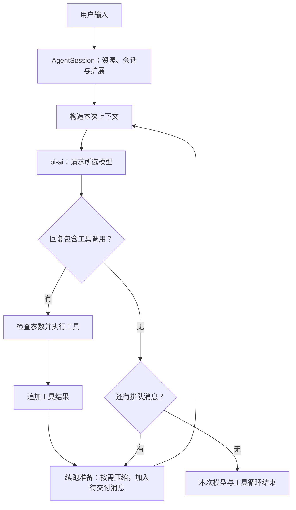

# pi Coding Agent 源码解析：极简工具、可编程上下文与会话树

pi 最容易让人记住的特点，是默认只给模型四个工具：`read`、`write`、`edit` 和 `bash`。但工具数量还不足以解释它为什么特别。真正值得关注的是，pi 把模型调用前后的许多决定开放给使用者：哪些信息进入上下文，什么时候接收人的纠正，如何保存一次失败的探索，以及怎样把自己的工作流程装进 Agent。

这也是理解 pi 的合适入口：**它是一个可以直接使用、也可以继续改造的 coding agent harness。** Harness 指围绕模型运行的那层软件，负责消息、工具、循环、状态与交互。pi 的核心工作发生在这一层；它本身不提供新的模型权重或训练算法。[项目介绍](https://github.com/earendil-works/pi/blob/d12cd92e45e308d4af000554292165ef1984253b/README.md)

创作者 Mario Zechner 在最初的介绍中，反复提到对行为可预测性、上下文可检查性和自定义界面的需求。这些需求比“尽量少写代码”更能解释 pi 后来的方向：默认工作流保持克制，扩展接口却深入到了运行过程。[作者的设计回顾](https://mariozechner.at/posts/2025-11-30-pi-coding-agent/)

> 本文调研于 **2026-09-11**，对象是原 `badlogic/pi-mono`、现位于 `earendil-works/pi` 的项目。源码固定为 [`d12cd92e45e308d4af000554292165ef1984253b`](https://github.com/earendil-works/pi/commit/d12cd92e45e308d4af000554292165ef1984253b)，提交时间为北京时间 2026-09-11 07:13:57。此时 coding-agent 包的版本字段为 `0.85.1`，但快照包含尚未发布的改动，不能等同于 `v0.85.1` 发布标签。正文沿默认 CLI 的 `AgentSession → Agent` 路径分析；仓库另有新的 `AgentHarness` API，不与这条路径混用。本次进行了文档和源码核验，没有执行在线模型任务评测。

## 四个工具，留下多大的能力空间

pi 的默认工具集很小，但 `bash` 连接的是整个开发环境。搜索代码可以调用 `rg`，查看修改可以调用 Git，验证代码可以运行项目已有的测试命令。只要环境里有相应程序，很多能力就不需要再包装成专用的模型工具。与此同时，`read`、`edit` 和 `write` 为频繁发生的文件操作提供了更直接的接口。[默认工具集合](https://github.com/earendil-works/pi/blob/d12cd92e45e308d4af000554292165ef1984253b/packages/coding-agent/src/core/tools/index.ts#L195-L210)

| 默认工具 | 给模型的能力         | 实现中值得关注的细节                                               |
| -------- | -------------------- | ------------------------------------------------------------------ |
| `read`   | 读取文本与图片       | 大文件可按行分页；文本返回受行数、字节数限制                       |
| `write`  | 创建或覆盖文件       | 适合新文件和完整重写                                               |
| `edit`   | 对已有文件做局部替换 | 当前接口支持一次提交多处互不重叠的替换                             |
| `bash`   | 执行命令，获得输出   | 连接搜索、构建、测试及其他 CLI；超长输出保留尾部并提供完整日志路径 |

工具少也不意味着实现随意。以 `edit` 为例，模型要给出文件路径，以及由 `oldText`、`newText` 组成的 `edits[]`。所有替换都针对同一份原始文件匹配；旧文本不唯一、区域相互重叠，都会报错，让模型补充上下文或合并修改。实现先尝试精确匹配，再处理部分空白和 Unicode 差异。这些约束把“改错位置”转化成更容易发现和修正的工具错误。[编辑工具](https://github.com/earendil-works/pi/blob/d12cd92e45e308d4af000554292165ef1984253b/packages/coding-agent/src/core/tools/edit.ts)、[匹配与冲突检查](https://github.com/earendil-works/pi/blob/d12cd92e45e308d4af000554292165ef1984253b/packages/coding-agent/src/core/tools/edit-diff.ts#L290-L365)

输出也经过了针对用途的处理。默认文本上限是 2,000 行或 50 KiB，先达到哪个就按哪个截断。`read` 保留所读区间的开头，并告诉模型如何继续翻页；`bash` 保留末尾，方便看到测试结论和最终错误，超限时将完整输出保存在临时文件中。小工具集背后仍然需要认真设计反馈，否则一段巨大的构建日志就能占满上下文。[截断规则](https://github.com/earendil-works/pi/blob/d12cd92e45e308d4af000554292165ef1984253b/packages/coding-agent/src/core/tools/truncate.ts#L1-L14)、[Bash 输出处理](https://github.com/earendil-works/pi/blob/d12cd92e45e308d4af000554292165ef1984253b/packages/coding-agent/src/core/tools/bash.ts#L234-L340)

pi 也提供 `grep`、`find`、`ls` 等其他内置工具，扩展还能注册更多工具。因此，准确的说法是“默认启用四个”，而非“整个系统只有四个”。

从设计上看，这种选择减少了必须常驻的专用接口，将能力组合交给模型与已有开发工具。代价是，CLI 的安装、认证、输出格式和可发现性仍然要有人处理。它省掉了一部分 Agent 内部的产品逻辑，也把一部分集成工作留在了环境中。

## Agent loop 很常规，人的介入时机很具体

默认 CLI 的主要职责可以分成几层：`pi-ai` 适配模型服务，`pi-agent-core` 驱动模型与工具循环，`pi-coding-agent` 管理项目资源、会话和扩展，`pi-tui` 提供终端界面。交互式 CLI、print/JSON 和 RPC 共用 `AgentSession`；SDK 也可以直接创建这类会话。[SDK 的实际接线](https://github.com/earendil-works/pi/blob/d12cd92e45e308d4af000554292165ef1984253b/packages/coding-agent/src/core/sdk.ts#L304-L404)



这个基本循环没有神秘的推理步骤：模型提出动作，工具返回观察，再把观察交给模型。本文沿用代码的术语，把一次 assistant 回复及其工具执行称为一个 turn；用户的一次任务可以经过多个 turn。[循环实现](https://github.com/earendil-works/pi/blob/d12cd92e45e308d4af000554292165ef1984253b/packages/agent/src/agent-loop.ts#L156-L272)

图中的压缩检查由 `AgentSession` 接入续跑准备阶段：无论上一轮是否调用工具，只要循环继续，就会在下一次模型回复前检查是否需要压缩。模型与工具循环结束后，`AgentSession` 还会再检查一次压缩。[续跑前的压缩检查](https://github.com/earendil-works/pi/blob/d12cd92e45e308d4af000554292165ef1984253b/packages/coding-agent/src/core/agent-session.ts#L538-L564)、[循环结束后的处理](https://github.com/earendil-works/pi/blob/d12cd92e45e308d4af000554292165ef1984253b/packages/coding-agent/src/core/agent-session.ts#L1101-L1138)

pi 对“Agent 工作时人又输入了一句话”做了明确区分：

| 输入方式               | 语义                                   | 典型用途                         |
| ---------------------- | -------------------------------------- | -------------------------------- |
| `Enter`：steering      | 在下一次模型回复前加入纠正信息         | “保持公开接口不变，先检查调用方” |
| `Alt+Enter`：follow-up | 等当前工作本来要结束时，再交付后续任务 | “完成后再补使用文档”             |
| `Escape`：abort        | 请求中止正在进行的工作                 | 当前方向需要立即停止             |

这里有一个版本细节：**当前 steering 要等本条 assistant 消息的整批工具调用结束，并不会仅因消息排队就跳过剩余工具。** 官网的一段演示文案仍描述“当前工具结束后打断剩余工具”，但固定快照的 README 和实际循环已经采用整批完成后的语义。这也是为什么研究 Agent 不能只读介绍页。[当前消息队列说明](https://github.com/earendil-works/pi/blob/d12cd92e45e308d4af000554292165ef1984253b/packages/coding-agent/README.md#message-queue)、[实际交付位置](https://github.com/earendil-works/pi/blob/d12cd92e45e308d4af000554292165ef1984253b/packages/agent/src/agent-loop.ts#L243-L265)

工具执行默认允许同一批并发；若某个工具要求 `sequential`，整批会改为顺序执行。并发完成事件可以先后到达，但加入会话的工具结果仍按模型原始调用顺序组织。这说明 pi 的“简单循环”已经包含交互和协议层面的工程处理，不能理解成随便拼一个 `while` 就能获得同样的使用体验。[并发默认值](https://github.com/earendil-works/pi/blob/d12cd92e45e308d4af000554292165ef1984253b/packages/agent/src/agent.ts#L231-L237)、[工具批次执行](https://github.com/earendil-works/pi/blob/d12cd92e45e308d4af000554292165ef1984253b/packages/agent/src/agent-loop.ts#L409-L560)

## 最重要的分离：完整历史与模型上下文

一次 Agent 工作会产生很多东西：用户消息、模型回复、工具输出、界面状态、扩展自己的数据、压缩摘要。这些信息都有保存价值，却未必都该送给模型。

pi 明确区分了内部的 `AgentMessage` 与模型接口接受的消息。每次调用前，先运行 `transformContext`，允许调整消息列表，再运行 `convertToLlm`，转成模型能够接受的角色和内容。这使“保存什么”和“本次推理看见什么”成为两个可以分别处理的问题。[转换顺序](https://github.com/earendil-works/pi/blob/d12cd92e45e308d4af000554292165ef1984253b/packages/agent/src/agent-loop.ts#L275-L310)

```text
完整会话文件
  → 选择当前分支，并应用压缩记录
  → 得到 AgentMessage[]
  → context 扩展筛选、补充本次需要的信息
  → convertToLlm 转换消息类型
  → 模型服务适配
```

几个具体行为能说明这层分离的用途。用户通过 `!` 执行命令，输出可以进入模型上下文；通过 `!!` 执行的命令则被标记为排除。扩展通过 `appendEntry` 保存的普通自定义状态不会自动发给模型，而自定义消息可以进入对话。压缩摘要和分支摘要也会转换成模型可读的消息。[消息转换源码](https://github.com/earendil-works/pi/blob/d12cd92e45e308d4af000554292165ef1984253b/packages/coding-agent/src/core/messages.ts#L148-L195)、[自定义状态与消息的区别](https://github.com/earendil-works/pi/blob/d12cd92e45e308d4af000554292165ef1984253b/packages/coding-agent/src/core/session-manager.ts#L94-L140)

这对做工具集成尤其有用。例如，一个测试工具可以给模型返回失败用例和关键错误，同时在 `details` 中保存供 UI 展示的结构化数据。模型不必接收整套界面状态，UI 也不必从一大段自然语言里重新解析所有字段。当前 `edit` 工具就把成功说明放进 `content`，把 diff、patch 和首个修改行放进 `details`。[编辑结果的分层](https://github.com/earendil-works/pi/blob/d12cd92e45e308d4af000554292165ef1984253b/packages/coding-agent/src/core/tools/edit.ts#L203-L213)

系统提示也遵循类似思路：根据启用的工具构造说明，再加入项目指令和 skill 目录。当前源码还会加入工具贡献的使用规则，所以早期文章中“总共不到一千 tokens”的描述不能当作今天所有配置的固定大小。[系统提示构造](https://github.com/earendil-works/pi/blob/d12cd92e45e308d4af000554292165ef1984253b/packages/coding-agent/src/core/system-prompt.ts)

Skills 则采用渐进披露：先把名称、描述和文件位置放进提示，模型需要时通过 `read` 或 `bash` 读取完整内容；用户也可以用 `/skill:name` 显式展开。这样能减少大量操作指南的常驻开销。不过，自动选择哪份 skill 仍依赖模型判断，不能把 skill 目录理解成一个保证正确派发任务的执行引擎。[Skill 目录构造](https://github.com/earendil-works/pi/blob/d12cd92e45e308d4af000554292165ef1984253b/packages/coding-agent/src/core/skills.ts#L352-L382)、[显式展开](https://github.com/earendil-works/pi/blob/d12cd92e45e308d4af000554292165ef1984253b/packages/coding-agent/src/core/agent-session.ts#L1362-L1376)

## 会话树：保留探索，也允许换一条路继续

上下文与历史分离之后，会话就不必是一条只能向后增长的聊天记录。

默认 CLI 将会话保存为 v3 JSONL。记录带有 `id` 和 `parentId`，当前 leaf 表示正在继续的位置。构造对话时，沿 leaf 的父节点一路回溯，就能得到当前分支。通过 `/tree` 回到先前的位置继续，原来的探索仍留在同一文件里，新请求则使用新分支的历史。[记录格式](https://github.com/earendil-works/pi/blob/d12cd92e45e308d4af000554292165ef1984253b/packages/coding-agent/src/core/session-manager.ts#L30-L79)、[路径重建](https://github.com/earendil-works/pi/blob/d12cd92e45e308d4af000554292165ef1984253b/packages/coding-agent/src/core/session-manager.ts#L334-L359)

假设正在设计缓存：先尝试方案 A，做了几轮实验，发现一致性维护太复杂。可以回到讨论设计的位置，转而探索方案 B。

```text
讨论缓存需求
├── 方案 A → 实验 → 发现一致性问题
└── 可选的 A 分支摘要 → 探索方案 B → 继续实现
```

分支摘要让这种切换更有价值。pi 可以找到两条路径的共同祖先，收集离开分支上的探索，将总结挂在目标位置。新方向便能携带“A 为什么失败”的结论，而不必把所有试错过程一起带过去。[分支摘要收集](https://github.com/earendil-works/pi/blob/d12cd92e45e308d4af000554292165ef1984253b/packages/coding-agent/src/core/compaction/branch-summarization.ts#L96-L145)

这里保存的是**对话分支**。`/tree` 会重建模型消息，不会自动回滚工作目录。假如方案 A 已经改了文件，转向 B 时仍然面对改过的代码；代码状态需要另外使用 Git 或相应扩展管理。[树导航后的状态更新](https://github.com/earendil-works/pi/blob/d12cd92e45e308d4af000554292165ef1984253b/packages/coding-agent/src/core/agent-session.ts#L3264-L3314)

### 压缩如何接在会话树上

长时间工作还会遇到另一种问题：方向没变，但上下文已经太长。pi 会把更早的消息总结成摘要，保留近期消息，并追加一条压缩记录。默认 CLI 用 `firstKeptEntryId` 指向保留片段的起点，之后构造的上下文大致是：

```text
系统提示 + 最新压缩摘要 + 保留的近期消息 + 压缩后的新消息
```

完整旧历史仍留在 JSONL 中。压缩改变的是后续请求使用的内容，不会用摘要覆盖原始记录。[压缩后的上下文构造](https://github.com/earendil-works/pi/blob/d12cd92e45e308d4af000554292165ef1984253b/packages/coding-agent/src/core/session-manager.ts#L410-L469)

默认配置预留 16,384 tokens，并尝试保留约 20,000 tokens 的近期内容；接近 `contextWindow - reserveTokens` 时触发压缩，也有上下文溢出后的恢复路径。计数会利用模型返回的 usage 和新增消息估算，并非每次都精确重新 tokenize 整段历史。切点选择还要照顾消息结构，避免留下工具结果却丢掉对应调用。[压缩阈值与估算](https://github.com/earendil-works/pi/blob/d12cd92e45e308d4af000554292165ef1984253b/packages/coding-agent/src/core/compaction/compaction.ts#L126-L237)、[切点选择](https://github.com/earendil-works/pi/blob/d12cd92e45e308d4af000554292165ef1984253b/packages/coding-agent/src/core/compaction/compaction.ts#L345-L460)

这种机制适合保留工作连续性，但摘要仍然有损。当前普通压缩在序列化时会截短单条工具结果，分支摘要准备阶段还会跳过 `toolResult`。因此，保留完整日志并不代表模型下一次请求仍能精确回忆其中每个细节。关键约束、接口决定和验证结果，仍值得落到项目文件中。[压缩输入处理](https://github.com/earendil-works/pi/blob/d12cd92e45e308d4af000554292165ef1984253b/packages/coding-agent/src/core/compaction/utils.ts#L88-L149)、[分支摘要的消息选择](https://github.com/earendil-works/pi/blob/d12cd92e45e308d4af000554292165ef1984253b/packages/coding-agent/src/core/compaction/branch-summarization.ts#L156-L170)

## 扩展为什么能改变工作流

如果扩展只能多注册一个 API，“可定制”的程度仍然有限。pi 的 TypeScript extensions 可以进入输入、上下文、工具执行、压缩和界面等多个位置。

| 介入位置             | 扩展可以做什么                   |
| -------------------- | -------------------------------- |
| `input`              | 改写输入，或直接处理自定义输入   |
| `before_agent_start` | 注入消息，调整本次运行的系统提示 |
| `context`            | 在每次模型调用前筛选或补充消息   |
| `tool_call`          | 检查、修改工具参数，或阻止调用   |
| `tool_result`        | 改写返回给模型的内容和结构化结果 |
| 压缩与树导航事件     | 接管摘要策略、干预分支切换       |

这些能力有具体的执行语义。例如，`context` 事件收到的是消息的深拷贝，修改它可以改变本次模型输入，而不会直接改掉原始消息数组；多个 `tool_result` 处理器则依次运行，后面的处理器能看到前面的修改。因此，扩展既能增加功能，也会影响一次请求的实际行为。[上下文事件](https://github.com/earendil-works/pi/blob/d12cd92e45e308d4af000554292165ef1984253b/packages/coding-agent/src/core/extensions/runner.ts#L1034-L1063)、[工具结果事件](https://github.com/earendil-works/pi/blob/d12cd92e45e308d4af000554292165ef1984253b/packages/coding-agent/src/core/extensions/runner.ts#L927-L979)

官方的 plan-mode 扩展示例很能说明这种组合能力。它切换可用工具，拦截不符合规则的 Bash 调用，注入当前计划阶段的提示，保存模式状态，并在退出时从后续上下文中清理过时的计划说明。工具集合、执行规则和消息内容配合起来，就形成了一个新的工作流。[计划模式扩展示例](https://github.com/earendil-works/pi/blob/d12cd92e45e308d4af000554292165ef1984253b/packages/coding-agent/examples/extensions/plan-mode/index.ts#L104-L218)

因此，“pi 不内置 plan mode”与“pi 可以有 plan mode”并不矛盾。前者意味着核心没有强制规定所有用户都采用同一套计划流程，后者来自足够深入的扩展接口。同样的选择也体现在 sub-agent、MCP、to-do 和后台 Bash 管理上：官方建议按需要使用扩展、包或外部 CLI 实现。[默认功能取舍](https://github.com/earendil-works/pi/blob/d12cd92e45e308d4af000554292165ef1984253b/packages/coding-agent/README.md#philosophy)

从这套接口看，pi 比较独特的地方是：用户可以把“我习惯怎样工作”写成程序，而不必维护一个修改过的 pi 分支。扩展、skills、提示模板和主题还能打包，通过 npm 或 Git 分发。[Pi packages](https://github.com/earendil-works/pi/blob/d12cd92e45e308d4af000554292165ef1984253b/packages/coding-agent/docs/packages.md)

官网所说的“让 pi 修改自己”，也应在这个层面理解：让 Agent 编写扩展或资源文件，通过 `/reload` 加载，然后继续工作。这是运行软件的可扩展性，不是模型在对话中更新权重。真正困难的部分依然是定义正确的行为、检查生成的扩展，以及处理多个扩展之间的相互影响。[官方扩展示意](https://pi.dev/)

## 跨模型继续工作，依靠的是消息兼容层

pi 可以在同一会话中切换模型，甚至切换 provider。这个功能的实用之处，是已经读过的代码、用户约束和工具观察可以继续利用，无需从空白对话重新开始。[模型切换实现](https://github.com/earendil-works/pi/blob/d12cd92e45e308d4af000554292165ef1984253b/packages/coding-agent/src/core/agent-session.ts#L1673-L1698)

困难在于，不同模型接口对历史的要求并不一致。工具调用 ID、推理签名、图片支持和错误消息都有兼容问题。`pi-ai` 会对历史做转换：移除不适用的签名，按目标接口要求调整工具调用 ID 及结果引用；跨模型时将可见 thinking 转成普通文本，舍弃无法使用的不透明推理内容；必要时为缺少结果的工具调用补错误结果，保持消息序列合法。[跨模型消息转换](https://github.com/earendil-works/pi/blob/d12cd92e45e308d4af000554292165ef1984253b/packages/ai/src/api/transform-messages.ts#L35-L220)

所以，“继续同一会话”是一种经过兼容处理的接续。它不保证原模型的推理状态、隐藏内容或所有模态信息原样保留。模型切换因此适合尝试不同模型处理同一个任务，但不能被当成几个模型天然共享同一内部状态。

## 自由度的代价：工作流和执行边界需要自己组织

pi 的取舍可以放在几个具体问题上看，而不必做一张未经实测的产品排名表。

| 你关心的问题       | pi 给出的机制                        | 使用者需要承担的部分           |
| ------------------ | ------------------------------------ | ------------------------------ |
| 怎样规划和委派任务 | 文件、扩展、SDK、独立实例            | 选择适合自己的流程与状态管理   |
| 怎样控制上下文     | 消息转换、context hook、压缩、会话树 | 决定保留什么，并检查摘要损失   |
| 怎样连接已有工具   | Bash、skills、自定义工具和 provider  | 配置环境、认证、参数与结果处理 |
| 怎样嵌入其他应用   | print/JSON、stdio RPC、SDK           | 实现宿主界面和应用生命周期     |
| 怎样限制执行权限   | 可接外部容器或沙箱                   | 配置真正的文件、进程、网络边界 |

最后一项值得说准确。当前 pi 有 **Project Trust**：加载 `.pi/settings.json`、`.pi` 下的扩展等资源，以及项目 `.agents/skills` 前，会处理项目是否可信的决定。交互模式默认可以询问用户，非交互模式在没有适用信任决定时默认忽略这些受保护的项目资源。不过，`AGENTS.override.md`、`AGENTS.md` 和 `CLAUDE.md` 等上下文文件不受这项信任决定控制；除非另行禁用上下文加载，即使拒绝信任项目，它们仍会加载。Project Trust 因此是一道针对特定设置与资源的加载检查。[Project Trust](https://github.com/earendil-works/pi/blob/d12cd92e45e308d4af000554292165ef1984253b/packages/coding-agent/docs/security.md#project-trust)

而常规工具执行没有内置逐次批准流程，也没有内置操作系统沙箱；工具和扩展拥有启动 pi 的进程权限。扩展中的命令检查可以实现工作流规则，但隔离仍需容器、虚拟机等外部边界。如果只是把内置工具转发进隔离环境，其他扩展代码仍可能运行在宿主上。Project Trust、工具调用规则与进程隔离解决的是不同层面的问题。[执行权限说明](https://github.com/earendil-works/pi/blob/d12cd92e45e308d4af000554292165ef1984253b/packages/coding-agent/docs/security.md#no-built-in-sandbox)、[隔离部署方式](https://github.com/earendil-works/pi/blob/d12cd92e45e308d4af000554292165ef1984253b/packages/coding-agent/docs/containerization.md)

这些选择使 pi 很适合想研究或定制 harness 的开发者。若期待规划、委派、权限策略和团队集成都以完整产品流程直接提供，pi 会需要更多组装工作。这是架构带来的取舍，不需要用“功能越少越先进”来解释。

## 极简是否让它更强，公开证据能回答多少

作者在 2025 年底公布过 pi 使用 Claude Opus 4.5 运行 Terminal-Bench 2.0 的结果。这些历史结果能说明：少量通用工具配合当时的模型，已经能够完成一部分复杂终端任务。但它们不能直接证明删去某个功能就会提高成功率，也不能代表本文固定版本的效果。[作者的 benchmark 介绍](https://mariozechner.at/posts/2025-11-30-pi-coding-agent/#benchmarks)

连分数口径也需要留意。公开原始结果列出 445 次 total trials，`mean` 约为 47.87%；作者的展示脚本使用 `passed / (passed + failed)`，得到的约 49.8% 并非同一个分母。公开运行脚本还没有锁定 pi 的精确包版本。拿这样的历史数据直接排出今天几个 Agent 的优劣，会遗漏模型、版本、任务集和统计方法等变量。[原始结果](https://gist.github.com/badlogic/f45e8f6e481e5ab7d3a50659da84edaa)、[统计脚本](https://github.com/badlogic/pi-terminal-bench/blob/main/show-results.js)、[运行配置](https://github.com/badlogic/pi-terminal-bench/blob/main/run.sh)

对研究者，更有用的用法是把 pi 当作可修改的实验载体：固定模型、任务环境和预算，分别替换工具集、skill 加载方式、压缩策略或分支摘要，再比较成功率、成本和失败轨迹。它的接口让这些实验比较容易落地，但实验结论仍然需要实际运行得出。

## pi 最值得借鉴的是什么

读完这条实现路径，pi 最有价值的设计是：**完整历史可以保留，模型上下文可以选择，工作流可以通过代码修改。** 四个默认工具为它提供了一个容易理解的起点；会话树、消息转换和扩展事件，让这个起点能够长成不同的工作方式。

这几个机制并非每一个都由 pi 独创。它的辨识度来自组合与默认取舍：可以直接进入终端让它工作，也可以接管模型调用前后的关键环节。对于想把自己的开发习惯、领域工具或上下文策略装进 Agent 的人，这种可塑性比内置功能清单更值得关注。

当前官方安装入口如下。进入项目后可用 `/login` 配置认证；想观察这些机制，可以从 `/tree`、`/compact`、`/model` 和官方扩展示例开始。[安装与使用文档](https://github.com/earendil-works/pi/blob/d12cd92e45e308d4af000554292165ef1984253b/packages/coding-agent/README.md#quick-start)

```bash
npm install -g --ignore-scripts @earendil-works/pi-coding-agent
pi
```

继续读源码时，建议先看 `coding-agent/src/core/sdk.ts` 的接线，再看 `agent/src/agent-loop.ts`，最后沿 `session-manager.ts` 和 `extensions/runner.ts` 理解状态与扩展。当前仓库另有已导出的新 `AgentHarness` 和 v4 会话格式；它与本文默认 CLI 的 v3 实现是两套路径，阅读时要先确认自己的入口。[默认 CLI 入口](https://github.com/earendil-works/pi/blob/d12cd92e45e308d4af000554292165ef1984253b/packages/coding-agent/src/core/sdk.ts)、[新 harness 导出](https://github.com/earendil-works/pi/blob/d12cd92e45e308d4af000554292165ef1984253b/packages/agent/src/index.ts#L41-L44)、[v4 格式](https://github.com/earendil-works/pi/blob/d12cd92e45e308d4af000554292165ef1984253b/packages/agent/src/harness/session/jsonl/types.ts#L4-L17)
