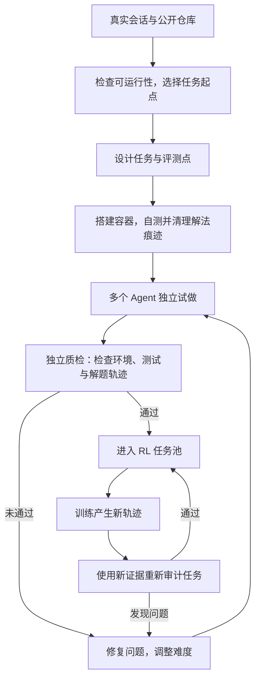

# DeepSeek-V4.1 后训练解读：任务合成、异步 RL 与推理预算

设想一个编程 Agent 在容器里运行了几十轮，修改代码、安装依赖、反复测试，最后拿到了高分。训练系统仍然需要回答几个问题：任务本身是否成立？测试能否检验用户的要求？Agent 有没有从环境里找到答案？这条很长的轨迹，又会在模型更新了多少次之后进入训练？

这些问题贯穿了 DeepSeek-V4.1-Flash 的后训练章节。报告沿用 SFT、强化学习和 on-policy distillation（OPD，在线策略蒸馏）的成熟流程，将主要投入放在任务合成、环境建设和训练规模上。作者在 §5.1 中把观察到的收益几乎全部归因于数据与环境的系统改进。这是他们对本轮开发的经验判断；报告没有提供足以把数据、系统和算法贡献逐一拆开的完整消融。[报告 §5.1，第 25 页][pipeline]

我更关注这份报告怎样把这些环节连起来：模型参与构造训练任务，执行轨迹反过来帮助审计任务；异步系统接住耗时悬殊的探索过程；奖励再决定模型该花多少推理预算，以及如何与其他 Agent 协作。最终能力来自这条流程里持续产生的有效经验。

本文基于 DeepSeek-AI 的《DeepSeek-V4.1-Flash: Pushing the Limits of KV Cache Compression》，重点阅读第 5 章、附录 B/C，并结合第 6 章讨论局限。报告没有展开 SFT 的具体配方，本文也将重点放在披露更充分的任务生产、RL 与 OPD 上。数值来自报告，未复现模型训练。可查看[官方报告文件][report]；下文页码均指 PDF 页码。

## 1. 训练数据的单位，是一套能执行、能验收的任务

对于单轮问答，训练样本可以近似理解成问题与答案。Agent 要与工具和环境持续交互，数据的基本单位随之扩大。报告把一个任务定义为三元组：

$$
T=(\text{problem},\ \text{environment},\ \text{verification system}).
$$

问题说明要做什么，环境提供可操作的状态，验证系统判断最终做得怎样。三者必须相互一致。题目要求修复导出功能，环境却缺少必要依赖；或者测试通过了，但根本没有覆盖导出结果，这样的样本都会误导训练。

DeepSeek 用两个维度评价任务质量：难度要求任务有学习价值，正确性要求三个组成部分没有关键缺陷。它们还被用作奖励，迭代训练模型的任务构造能力。任务进入训练池后仍会接受审计：每次用于新的 RL run，产生的解题轨迹都成为重新检查质量的证据。[报告 §5.1.1，第 25–26 页][tasks]

这让任务生产具备了反馈过程。最初看起来严密的测试，可能被后来的策略找到漏洞；最初有挑战的任务，也可能随着模型进步而变得太容易。任务是否适合继续训练，需要结合实际执行判断。

### 通用 Agent：从真实工作流和失败中重建环境

通用 Agent 的素材来自员工及外部合作伙伴自愿回传的交互与反馈。团队据此构造模拟工具，复现真实系统的输入输出格式、API schema 和行为约束，覆盖 SaaS、企业应用及业务后台；再把负面反馈与失败案例转成单轮、多轮环境。

这里值得借鉴的是失败的组织方式。失败案例除了可以成为一条纠错回答，还可以被还原成可重复运行的场景：当时能调用哪些工具、用户提出了哪些限制、哪些状态让模型判断失误。RL 随后可以围绕同一类薄弱环节反复采样。模拟环境能否忠实保留真实系统的关键行为，则决定了这种训练能迁移多远。

### 编程 Agent：构造、试做、检查和修复分开进行

编程任务来自复杂或效果不佳的 coding-agent 会话，以及达到一定 star 门槛的公开 GitHub 仓库。报告描述了一条由多个专职 Agent 配合的生产流程：先检查项目能否在容器内构建、运行和自动验证，再选定某轮会话或某个提交作为起点，设计实施方向与评测点；另一个 Agent 搭建依赖、初始目录、测试和任务说明，完成自测并清理可能泄漏解法的痕迹。

之后，多个 Agent 实际解题，独立质检 Agent 联合检查环境和解题轨迹。它要找出环境故障、事实错误、题意与测试不一致、可投机取巧的漏洞等问题。检查失败的任务进入修复环节，再次验证。[报告 §5.1.1，第 26 页][tasks]

图按报告的数据依赖整理，省略具体实现。评测点同时包含 fail-to-pass 和 pass-to-pass：前者检查原先不满足的目标是否完成，后者检查原本正常的行为是否保留。

例如，假设任务要求让配置解析器支持一种新格式。验证既要检查新格式能否正确读取，也要检查旧格式的行为有没有退化。只覆盖前者，模型就可能通过重写甚至破坏原有实现来拿分。这个例子是对两类评测点的说明，并非报告披露的具体训练样本。

## 2. 扩大 RL，也要扩大模型经历的运行方式

任务确定后，还要选择 Agent 怎样与环境交互。报告中的 scaffold 或 harness，指围绕模型的运行框架，包括系统提示词、工具定义、上下文管理和多轮交互协议。相同模型换一套工具接口，就可能表现不同。

DeepSeek 同时扩大训练计算和 scaffold 的覆盖范围：在单个框架内继续训练，在同一框架的不同版本间联合训练，也在 OpenCode、Pi、DeepSeek Harness 等异构框架间训练。图 7、图 8 展示了这些设置下，随着累计 RL 步数增加，评测表现总体继续改善。[报告 §5.1.2，图 7–8，第 26–28 页][scaling]

为支持这些差异，执行被拆成两部分：agent sandbox 运行框架及工具，worker container 提供统一控制层，组织 rollout、把不同形式的交互转换成共同的轨迹格式，并与训练器通信。两者都运行在 DSec 平台上，与可被抢占的 GPU 训练资源分离。这里分离的是长时间存活的 Agent 执行状态与 GPU 调度；模型生成和参数训练如何共享 GPU，则由后面的异步系统处理。

报告还使用模型合并来初始化后续 RL run，将不同 scaffold 或配置下训练得到的 checkpoint 合并，继续优化。因此，图 7、图 8 中断开的曲线段对应重新初始化后的不同训练运行；图 7 还包含上下文上限的扩展。阅读这些图时，应把它们看成训练规模扩展的经验轨迹。横轴是累计 RL 步数，并没有控制每一步的 token 数、上下文长度和 FLOPs，也没有单独分离模型合并的贡献。

## 3. 异步训练怎样接住长轨迹

一次简单工具调用可能很快结束，一次代码任务却可能经历编译、测试和多轮返工。如果所有轨迹一起开始、等最慢的结束后才更新，系统就会反复等待少数长任务。DeepSeek 将异步生成用于几乎全部 RL 和 OPD 任务，让大量进行中的样本缓解这种长尾等待。[报告 §5.2，第 30 页][async]

### 按完成样本数补回并发容量

报告的设计是生成与训练共用物理设备、分时执行。生成阶段保持一定数量的在途样本；积累足够训练样本后，训练抢占进行中的 rollout，更新完再恢复生成。

调度粒度经历过三次选择。按整批补任务太粗，训练指标出现明显振荡；等一个 prompt 的整组 GRPO 样本完成后再补下一题，又容易被组内的慢样本拖住。最终采用 sample-level dispatch：只要新完成的样本数达到下一题所需的 GRPO group size，就派发下一题，不要求这些完成事件来自同一个组。[报告 §5.2.1，第 30–31 页][async]

用一个假设例子说明：下一题要采样 4 次，当前三个旧题分别完成了 1、1、2 个样本，调度器便可以补发新题。这里累计的是释放出来的样本容量，GRPO 的同题分组仍然保留。跨题混合完成计数，不等于跨题混算优势。

生成暂停可以发生在任意 token 边界。系统保存 KV cache、专家路由等状态，切换 checkpoint 后直接复用，以减少重新 prefill 的开销；样本结束后立即回收其状态。跨越多个 checkpoint 的轨迹，在训练时拼接各段生成过程中实际记录的专家路由，执行 routing replay。[报告 §5.2.1、§5.2.3，第 31 页][async-detail]

这种恢复保留了执行进度，也保留了不同参数版本产生的历史。复用旧 KV 并不等价于用新权重从头重算全部上下文；路由重放也只处理了其中一类一致性问题。训练仍需明确处理旧策略产生的数据。

### 短样本先回来与样本过旧，是两类问题

异步执行会改变数据进入更新的顺序。早期 batch 容易被先完成的短样本占据，形成长度分布偏差；长样本又可能跨过多次更新，部分甚至全部 token 都来自旧 checkpoint，形成 off-policy 数据。报告分别处理这两件事：

| 问题                 | 报告中的机制                                                             | 作用位置                     |
| -------------------- | ------------------------------------------------------------------------ | ---------------------------- |
| 短样本过早占据 batch | 按数据集限制并发；支持丢弃早期返回的短样本                               | 调整样本来源与进入训练的顺序 |
| 旧策略样本影响更新   | 调节派发和等待条件，约束最大 off-policy 比例；屏蔽过度陈旧 token 的 loss | 约束数据新鲜度及其梯度贡献   |

来源：[报告 §5.2.2，第 31 页][async-detail]。报告没有给出陈旧度的精确定义、mask 阈值或完整损失公式，不能把这些描述直接还原成一套可复制的训练配置。

这部分让我更在意调度器对学习的影响。它决定哪些经历先被看见，哪些长轨迹还能参与更新，以及各数据集在 batch 中实际占多少。调度吞吐提高之后，数据分布和策略新鲜度仍需要一起观察。

### DSec 负责让大量环境持续运行

以上流程还依赖能承载大规模沙箱的平台。DSec 通过分片和多个独立调度副本扩大容量，调度副本根据近期资源观测做放置决策，由计算节点执行最终准入检查，防止本地资源超限。在节点内，它将 worker VM 绑定到 NUMA 域，让其中容器的 CPU 和内存访问尽量局部化。报告称，在可比负载配置下，单物理节点可承载的同时存活容器数从约 1,000 提高到超过 2,500；这是容器密度结果，不能直接换算成同倍数的 RL 吞吐提升。[报告 §5.1.3，第 27–29 页][dsec]

高密度还可能干扰有时限的评测，因此平台设置延迟敏感执行类别。对于奖励投机和环境破坏，DSec 使用沙箱隔离与网络策略；Agent 把自己的环境弄崩时，这次执行被视为失败，并向 RL 框架报告相应信号。

当模型学会操作更复杂的环境，环境自身就进入了验证范围。验收结果是否可信、不同任务之间是否干扰，会直接影响奖励的含义。

## 4. Reasoning effort：把计算开销放进奖励

长轨迹给模型更多探索机会，也消耗更多 token。DeepSeek 把 effort 标量 $b\in\{1,\ldots,100\}$ 放入系统提示词，并在 RL 中让不同 effort 对应不同的长度惩罚。这套机制用于单轮推理和多轮 Agent 任务。[报告 §5.1.4，第 29–30 页][effort]

训练时，同一个问题 $x$ 会在有限的若干 effort 值下采样。只有问题与 effort 都相同的回答，才归入同一子组，组内奖励减去均值后用于计算相对优势。低 effort 和高 effort 的回答不会直接放在一起比较。

对第 $j$ 条回答，报告加入的长度奖励项为：

$$
r^{\mathrm{len}}_{b,j}
=-\min\left\{C_{\max},\ k(b)\frac{\ell_{b,j}}{L_{\mathrm{norm}}}\right\},
\qquad
k(b)=k_0\exp\left(-\frac{b-b_{\min}}{\tau}\right).
$$

这里，$\ell_{b,j}$ 是 reasoning token 数，$L_{\mathrm{norm}}$ 是参考长度，$C_{\max}$ 限制一条轨迹最多被扣多少分；$b_{\min}$ 是训练 effort 集合中的最小值。$k_0$ 控制整体压缩长度的压力，$\tau$ 控制惩罚随 effort 衰减的速度。原文还将 $\tau$ 写成 $\lambda\overline{\Delta b}$，其中 $\overline{\Delta b}$ 是训练档位的平均间隔。[报告式 (8)–(10)，第 29 页][effort]

这相当于让同一个模型学习多种计算开销偏好。低 effort 下，每增加一些推理 token，要付出较大的奖励代价；高 effort 下，这个代价较小，模型可以花更多篇幅探索和验证。$b$ 增加 $\tau$ 时，惩罚系数降为原来的 $e^{-1}$，约 36.8%。

因此，effort 是训练得到的行为控制信号，不是硬性的 token 上限。长度惩罚一旦达到 $C_{\max}$，继续增加长度也不会因这一项继续扣分。仅凭这条公式，无法保证一次请求一定在指定长度内结束。

### 为什么选择指数衰减

附录 C 给出一个局部解释。设 $p_x(\ell)$ 是问题 $x$ 在推理长度 $\ell$ 下的解决概率，在惩罚尚未封顶时考虑：

$$
\max_{\ell\ge0}\left[p_x(\ell)-k(b)\frac{\ell}{L_{\mathrm{norm}}}\right].
$$

对于内部最优点，继续增加推理的边际收益，应等于新增 token 的边际代价：

$$
p'_x(\ell^*)=\frac{k(b)}{L_{\mathrm{norm}}}.
$$

若进一步假设边际收益近似按 $p'_x(\ell)\approx a_x e^{-\ell/s_x}$ 衰减，其中 $a_x,s_x>0$ 是与问题有关的参数，将指数形式的 $k(b)$ 代入，就得到偏好长度 $\ell^*$ 与 effort $b$ 近似呈线性关系。

这个推导解释了参数化的动机。它依赖边际收益形状、内部最优点和惩罚未封顶等假设；真实采样策略、多轮交互和奖励归一化都会影响结果。报告也明确指出，它不保证实际平均长度线性变化或逐点单调。[附录 C，第 49–51 页][effort-theory]

### 图表支持总体权衡，具体档位仍有波动

报告给出的 effort 25→100 端点结果如下：

| 评测                            | effort 25 | effort 100 |
| ------------------------------- | --------: | ---------: |
| 八项推理基准平均 Pass@1         |     67.1% |      76.3% |
| DeepSWE v1.1，mini-SWE          |     66.0% |      74.2% |
| Terminal-Bench 2.1，DSH Minimal |     82.4% |      90.6% |

来源：[报告 §5.3.2、图 9，第 34–35 页][effort-results]。这些提高伴随明显的输出 token 增长，但不同任务与框架的增长幅度不同。

原文关于“准确率单调提升”的概括比图表支持的结论更强：图 9 中，DeepSWE 从 effort 40 到 60 有回落，Terminal-Bench 2.1 从 90 到 100 也有回落；附录 B.2 明确承认多数设置存在平台期和中间档下降。更稳妥的理解是，effort 对推理开销有清楚的总体控制作用，增加预算通常能换取更高表现，但具体档位的长度和准确率都会波动。图中没有误差条，也不能将一次局部峰值当成稳定最优档。[图 9、附录 B.2、图 11，第 35、48–49 页][scaffold-appendix]

报告给出的公共 API 档位映射是 low/high/max 对应 50/75/100。这是报告中的接口约定；它并不意味着换一个推理框架，相同字符串就一定使用相同的数字或预算。[报告表 2，第 30 页][async]

## 5. 最后的 OPD，把不同阶段的能力整合进学生

后训练最后一个阶段是覆盖所有领域的 full-vocabulary OPD，使用超过 40 个教师模型。各领域最好的教师可以来自不同开发阶段，教师之间、教师与学生之间也可以使用不同架构。[报告 §5.2.4，第 31–32 页][opd]

从机制上理解，OPD 让学生在自己生成的轨迹上接受教师监督，full-vocabulary 表明监督涉及整个词表的预测分布，比只保留一条教师答案提供了更细的信号。这里的 on-policy 描述学生采样的蒸馏方式；该阶段也采用异步生成，因此系统仍要处理跨 checkpoint 的在途样本，不能据名称就假定全部 token 都由当前参数产生。

这套设计允许保留不同训练路径擅长的能力，再汇入最终模型。“超过 40 个教师”描述的是训练使用的教师集合，并不表示每个 token 必须同时运行全部教师。报告还允许动态调整数据混合、各数据集并发上限和启用的教师，要求异步系统处理旧配置与新配置样本同时在途时的切换。

这一阶段的重要性也限定了前面曲线的解读：某次 RL run 的收益，与最终经过多教师 OPD 整合后的模型表现，是不同层次的结果。

## 6. 多 Agent 训练，把协作效率写进目标

报告另外给出 Agent Team 模式的初步实验。主 Agent 可以创建持续存在的队友，分派任务；所有 Agent 共享一个仓库工作目录，通过消息、状态查询和共享任务板协调，最后由主 Agent 检查和测试合并后的成果。[报告 §5.3.5，第 35–36 页][multi-agent]

训练奖励包含任务表现、鼓励分工与沟通的协作奖励，以及 derived-latency 惩罚。最后这一项衡量的是根据执行过程推算的延迟：把执行事件及其协作依赖组织成有向无环图，按固定 prefill/decode 速率将 token 数换算成成本，加上实测工具时间，再取依赖图的关键路径长度。

用一个简化例子理解，两项独立工作各需 10 分钟，后续整合需 2 分钟。串行执行为 22 分钟；理想并行后，关键路径为 $\max(10,10)+2=12$ 分钟。如果两项工作本来互相依赖，或者沟通引入额外串行步骤，增加队友就未必缩短关键路径。这个例子只说明延迟目标，不是论文中的实测任务。

按固定速率估算模型执行成本，可以减轻服务端排队和 batching 对奖励的干扰。它鼓励能缩短依赖链的协作，同时惩罚不必要的串行工作和同步；报告没有披露各奖励项的权重，也没有给出它们的独立消融。

实验中，ProgramBench 先经过筛选，只保留参考解在隐藏测试上通过率至少 95% 的 172 道任务。在每次 rollout 的 8 小时截止时间下，多 Agent 的 Almost@1 为 30.04%，单 Agent 为 20.39%。这里 Almost@1 指单次 rollout 得分达到 0.95 的比例。在 FrontierSWE v2 的 no-GPU 子集上，20 小时截止时间下的 Mean@5 分别为 32.90% 和 28.20%。两者的指标与任务范围不同，不能混写成同一种成功率。[报告图 10、§5.3.5，第 36 页][multi-agent-results]

作者明确把这些结果称为初步实验，比较的是观察到的最强多 Agent 配置与可用的最强单 Agent 基线。它说明协作在给定时间窗口内有潜力完成更多工作，但没有证明在相同总 token 或 FLOPs 下更省钱，也不能把筛选后的 ProgramBench 成绩与主表直接混用。

## 7. 收益很明显，归因需要分清层次

先看最终模型相对上一代 V4-Flash 的结果。下表取自报告表 3，均为 Max 档位；差值按表中数值相减。

| 基准与指标                 | V4-Flash | V4.1-Flash |          提升 |
| -------------------------- | -------: | ---------: | ------------: |
| GPQA Diamond，Pass@1       |    89.9% |      90.9% |  1.0 个百分点 |
| DeepSWE v1.1，Resolved     |    54.4% |      74.2% | 19.8 个百分点 |
| Terminal-Bench 2.1，Pass@1 |    82.7% |      90.6% |  7.9 个百分点 |
| Terminal-Bench 4.0，Pass@1 |     7.0% |      31.2% | 24.2 个百分点 |
| AutomationBench，Pass@1    |    37.7% |      54.8% | 17.1 个百分点 |

来源：[报告表 3，第 33 页][main-results]。V4.1-Flash 的代码 Agent 评测通常使用 DSH Minimal、1M 上下文、temperature 1.0、top-p 0.95；DeepSWE 使用 mini-SWE，AutomationBench 使用官方框架。其 GPQA 等核心推理评测的 temperature 与 top-p 均为 1.0。这些是报告对 V4.1-Flash 的配置说明，未据此假定所有基线都采用完全相同的框架。[报告 §5.3.1，第 32 页][eval-setup]

这些结果显示 Agent 任务上的明显进步，但比较的是两个完整模型版本。架构、预训练和后训练都发生了变化，无法把差值全部记到任务合成或异步 RL 名下。高难任务也仍有差距：同表中 Terminal-Bench 4.0 的 Opus-5 为 51.8%，高于 V4.1-Flash 的 31.2%。因此，部分基准上达到很高分，并不代表困难任务已经解决。

另一个更直接的对照来自同一 checkpoint 的跨框架评测。保持解码配置和任务集一致，仅更换框架及其原生提示词、工具和交互方式，报告得到：

| Agent 框架   | DeepSWE v1.1，Resolved | Terminal-Bench 2.1，Pass@1 |
| ------------ | ---------------------: | -------------------------: |
| Claude Code  |                  69.8% |                      88.0% |
| Codex        |                  65.6% |                      84.1% |
| OpenCode     |                  65.5% |                      85.0% |
| Pi           |                  66.2% |                      86.1% |
| mini-SWE     |                  74.2% |                      90.3% |
| DSH Minimal  |                  72.6% |                      90.6% |
| DSH Standard |                  70.5% |                      85.8% |
| DSH PTC      |                  67.6% |                      85.8% |

来源：[报告表 4，第 35 页][scaffolds]。所有设置均为 effort 100、Linux 容器、1M 上下文、temperature 1.0、top-p 0.95，最多 500 轮模型生成。DeepSWE 每题采样 8 次，Terminal-Bench 每题采样 3 次，后者禁用网络。这里的重复采样次数用于评测，不能据此把表头改成 Pass@8 或 Pass@3。Claude Code 一列对应 v2.1.251，更多版本和框架配置见[附录 B.1，第 47–48 页][scaffold-configs]。

模型能在多种框架下工作，支持跨接口迁移的判断；同时，DeepSWE 的最高与最低结果相差 8.7 个百分点，Terminal-Bench 相差 6.5 个百分点。框架选择仍是模型表现的重要组成部分。这也解释了为什么训练中要覆盖不同交互协议，以及为什么部署时需要把模型、框架和 effort 放在一起测量。

## 8. 可以借鉴什么，还缺哪些证据

这份报告最有用的地方，是给出了大规模 Agent 后训练中具体的工作对象：可执行的任务、可靠的验证器、真实的失败场景、长轨迹状态、在途样本版本，以及可调的推理开销。对于已经能稳定训练的团队，这些环节提供了比“再增加一批 prompt”更明确的改进方向。

MiMo-V2.6 提供了一个适合并读的参照。DeepSeek-V4.1 把重点放在任务合成、异步执行、推理预算和多教师 OPD；MiMo 则把 Agentic RL 的扩展明确拆成训练计算、环境与 Harness、grader 计算三个轴，并进一步报告了 25K 轨迹 batch、Sample Mixer 和 grader 侧的 groupwise 重分配。[MiMo-V2.6 技术报告，第 8、16–20、29–32 页](https://huggingface.co/XiaomiMiMo/MiMo-V2.6-Pro-RL/resolve/main/MiMo_V2_6_technical_report.pdf) 这不是两套可以直接比较的完整 ablation，而是两个报告对“规模化瓶颈”不同的切分方式：前者更适合讨论训练 recipe，后者更适合追踪系统边界和容量账本。

要复现或进一步验证，报告仍留下几处关键空白：

- 任务合成披露了流程，但没有给出完整数据规模、难度分布、生成器奖励配方与成本。验证器的覆盖率、误判率，以及与评测任务的重叠情况，也需要更细的审计材料。
- 异步系统说明了主要机制，但缺少并发量、陈旧度阈值、mask 规则与等预算消融。吞吐改善、丢弃样本的代价和最终质量，尚不能从报告中完整对账。
- 多教师 OPD、模型合并、任务扩展和多框架训练共同存在，缺少足够对照来隔离各自收益。effort 和多 Agent 结果也还需要真实工作负载下的成本与稳定性评估。

这些缺口对应着具体的后续实验：固定模型起点与计算预算，逐步加入任务再审计和多框架数据；在相同任务上记录异步程度、样本陈旧度与最终质量；对 effort 和 Agent 数量同时测量准确率、总 token 和完成时间。这样的结果，才能帮助其他团队决定哪一步最值得投入。

报告在结论中也承认，常用基准正在接近饱和，最困难的推理和边界任务仍存在能力差距，并提出继续探索数据、模型容量与 RL 的共同扩展，以及模型与 harness 的联合优化。[报告 §6，第 37 页][conclusion]

读完后，我更愿意把 Agent 后训练看成一项持续管理训练经验的工作：让任务有意义，让反馈可信，让昂贵的探索能够进入更新，再让模型学会按需要分配计算。DeepSeek-V4.1 的后训练章节把这些环节放到了同一条流程里，也提醒我们，最终要检验的是模型在具体环境中完成了什么，以及为此付出了多少成本。

[report]: https://huggingface.co/deepseek-ai/DeepSeek-V4.1-Flash/blob/main/DeepSeek_V41_Tech_Report.pdf
[pipeline]: https://huggingface.co/deepseek-ai/DeepSeek-V4.1-Flash/resolve/main/DeepSeek_V41_Tech_Report.pdf#page=25
[tasks]: https://huggingface.co/deepseek-ai/DeepSeek-V4.1-Flash/resolve/main/DeepSeek_V41_Tech_Report.pdf#page=26
[scaling]: https://huggingface.co/deepseek-ai/DeepSeek-V4.1-Flash/resolve/main/DeepSeek_V41_Tech_Report.pdf#page=27
[dsec]: https://huggingface.co/deepseek-ai/DeepSeek-V4.1-Flash/resolve/main/DeepSeek_V41_Tech_Report.pdf#page=28
[effort]: https://huggingface.co/deepseek-ai/DeepSeek-V4.1-Flash/resolve/main/DeepSeek_V41_Tech_Report.pdf#page=29
[async]: https://huggingface.co/deepseek-ai/DeepSeek-V4.1-Flash/resolve/main/DeepSeek_V41_Tech_Report.pdf#page=30
[async-detail]: https://huggingface.co/deepseek-ai/DeepSeek-V4.1-Flash/resolve/main/DeepSeek_V41_Tech_Report.pdf#page=31
[opd]: https://huggingface.co/deepseek-ai/DeepSeek-V4.1-Flash/resolve/main/DeepSeek_V41_Tech_Report.pdf#page=32
[eval-setup]: https://huggingface.co/deepseek-ai/DeepSeek-V4.1-Flash/resolve/main/DeepSeek_V41_Tech_Report.pdf#page=32
[main-results]: https://huggingface.co/deepseek-ai/DeepSeek-V4.1-Flash/resolve/main/DeepSeek_V41_Tech_Report.pdf#page=33
[effort-results]: https://huggingface.co/deepseek-ai/DeepSeek-V4.1-Flash/resolve/main/DeepSeek_V41_Tech_Report.pdf#page=35
[scaffolds]: https://huggingface.co/deepseek-ai/DeepSeek-V4.1-Flash/resolve/main/DeepSeek_V41_Tech_Report.pdf#page=35
[multi-agent]: https://huggingface.co/deepseek-ai/DeepSeek-V4.1-Flash/resolve/main/DeepSeek_V41_Tech_Report.pdf#page=35
[multi-agent-results]: https://huggingface.co/deepseek-ai/DeepSeek-V4.1-Flash/resolve/main/DeepSeek_V41_Tech_Report.pdf#page=36
[conclusion]: https://huggingface.co/deepseek-ai/DeepSeek-V4.1-Flash/resolve/main/DeepSeek_V41_Tech_Report.pdf#page=37
[scaffold-configs]: https://huggingface.co/deepseek-ai/DeepSeek-V4.1-Flash/resolve/main/DeepSeek_V41_Tech_Report.pdf#page=47
[scaffold-appendix]: https://huggingface.co/deepseek-ai/DeepSeek-V4.1-Flash/resolve/main/DeepSeek_V41_Tech_Report.pdf#page=48
[effort-theory]: https://huggingface.co/deepseek-ai/DeepSeek-V4.1-Flash/resolve/main/DeepSeek_V41_Tech_Report.pdf#page=49
