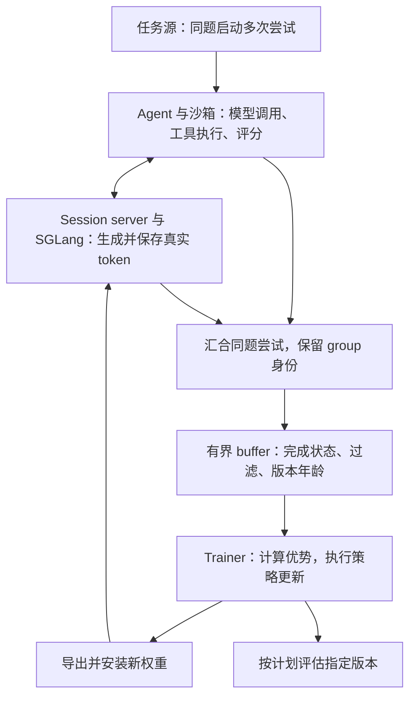
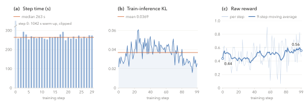

# Miles v0.1 论文分析：长程 Agentic RL 的系统设计与训练 Recipe

一个模型在沙箱里运行命令、查看输出、修改文件，几十轮之后得到测试分数。训练系统要把这段执行变成一次有效的策略更新，至少得回答几个问题：训练时看到的 token 是否就是当时生成的 token？同一道题的多次尝试有没有被放在一起比较？轨迹生成到一半时权重更新了，该怎样计算概率比？模型、优化器和长上下文又能否同时放进显存？

这些问题决定了 agentic RL 能不能稳定地跑起来。[《Miles v0.1: Production-Level Post-Training》](https://arxiv.org/html/2609.08368v1)介绍了一套基于 Slime 构建的系统：SGLang 生成轨迹，Megatron 或 FSDP 更新策略，再由权重同步模块把新模型交回生成端。报告的主要贡献是整合异步调度、轨迹记录、训练与同步机制，并验证它们能共同工作。理解这些接口如何配合，也就能看清哪些系统选择会改变训练对象。

本文以 RadixArk 的 **arXiv v1** 为分析对象，重点讨论终端 agent 的完整训练链路。源码补充固定在 2026-09-14 查阅的官方提交 [`87605158`](https://github.com/radixark/miles/tree/8760515851ec4f76815171d812c836bf8caa0aca)（提交日期 2026-09-12），不能视为论文实验的冻结快照；下文的系统时间与训练结果均来自作者报告，未独立复现 GPU 训练。

## 1. 先看这份 Recipe 实际训练了什么

论文最后给出一组贯穿全文的案例：用 64 张 GB300 对 GLM-5.2 744B-A40B 做全参数 agentic RL。模型在 Terminal-bench-2 的任务环境里操作终端，由任务测试脚本评分。64 张卡一半负责生成，一半负责训练。

这里的 744B 是总参数量，A40B 是每次激活的参数规模。稀疏激活降低了每个 token 的计算量，系统仍然需要保存和管理完整模型的权重与训练状态。

| 项目         | 论文中的配置                                            | 对训练的含义                       |
| ------------ | ------------------------------------------------------- | ---------------------------------- |
| 模型         | GLM-5.2，744B 总参数、约 40B 激活参数                   | 大规模 MoE 的全参数更新            |
| 硬件         | 16 节点，每节点 4 张 GB300                              | 共 64 卡；训练与生成各 8 节点      |
| 训练并行     | TP 2 / PP 4 / CP 4 / EP 8                               | 同时拆分张量、网络层、上下文和专家 |
| 生成配置     | 8 个四卡引擎，DP attention 的 DP 为 4，启用 MTP         | 并发生成并使用多 token 预测        |
| 精度         | 训练权重 BF16；rollout 权重和 KV cache 为 FP8           | 两侧数值路径存在差异               |
| 任务环境     | OpenEnv 接口，每个 episode 一个 Daytona 沙箱            | 从任务官方镜像启动，结束后删除     |
| 每批训练数据 | 8 道题，每题 8 次尝试，共 64 条轨迹                     | GRPO 的比较单位是同题尝试          |
| 生成并发上限 | 128 条在途轨迹                                          | 独立于训练 batch size              |
| 长度限制     | 每次回复最多 8,192 token；session 序列预算 65,536 token | 单轮预算与完整轨迹预算分开         |
| 终止条件     | 最多 30 轮或 1 小时                                     | 工具执行时间也计入 episode 时限    |
| 调度与评估   | Fully asynchronous；每 10 步用共享引擎评估              | 平时训推重叠，评估仍占用生成资源   |

来源：[论文 §9.1、表 9](https://arxiv.org/html/2609.08368v1#S9.SS1)。TP、PP、CP、EP 并不是可以全部独立相乘的 GPU 维度，尤其 MoE 的专家并行与其他进程组存在组合关系，不能据上表乘出 256 张卡。

论文把 65,536 token 描述为完整 session 的序列上限。固定版本的[启动器注释](https://github.com/radixark/miles/blob/8760515851ec4f76815171d812c836bf8caa0aca/examples/experimental/openenv/glm52_tbench2/run_glm5_2_744b_a40b_daytona.py#L59)仍提示，agent loop 尚未感知此处截断，可能继续生成。因此复现时要分别验证序列预算与环境循环的终止行为，不能只凭这一配置认定 agent 会在 65,536 token 处停止。

这份 recipe 在容量与吞吐约束下采用训推分离、两侧不同精度，并用 TIS 校正残余训推差异。固定版本的[官方启动器](https://github.com/radixark/miles/blob/8760515851ec4f76815171d812c836bf8caa0aca/examples/experimental/openenv/glm52_tbench2/run_glm5_2_744b_a40b_daytona.py)还选择了 broadcast 权重传输和 `in_place` 暂停模式。后文会逐项解释这些选择；Miles 提供的其他功能，需要与实际启用的配置分开看。

## 2. 异步循环如何保留 GRPO 的分组语义

### 2.1 单条任务完成、同题分组完成、训练步完成，是三件事

Miles 中有四种相关对象：prompt 是一道任务，episode 是一次执行，session 是服务端看到的这次执行的请求历史，group 是同一道任务的多次尝试。简单情况下，一个 session 导出一条训练轨迹；允许分支或上下文重组时，一个 session 也可能产生多条轨迹。

下面用概念流程表示数据和权重的流向。实线上的数据以完整 prompt group 进入 buffer，权重则沿反馈路径返回生成端。



假设同一道题采样 $G$ 次，每次获得奖励 $R_i$。为了说明分组为什么重要，可以用标准 GRPO 的组内归一化形式：

$$
A_i=\frac{R_i-\bar R}{\sigma_R+\varepsilon},
\qquad
\bar R=\frac{1}{G}\sum_{j=1}^{G}R_j.
$$

$\sigma_R$ 是组内奖励的标准差，$\varepsilon$ 避免除零；具体 recipe 可以调整归一化方式。无论采用哪种形式，比较对象都应当是同题的其他尝试。先完成的简单任务和晚完成的困难任务不能仅因到达时间接近就凑成一个组。

Miles 的异步调度保留了这一约束：提交任务时仍提交整组，训练时仍消费已完成的组。它改变的是并发容量何时释放。默认的 sample granularity 允许一条轨迹完成就释放一个槽位；累计释放的槽位足以容纳新组时，就启动下一组，无需等原来某组最慢的那条结束。[论文 §2.2.1](https://arxiv.org/html/2609.08368v1#S2.SS2.SSS1)、[官方异步调度文档](https://miles.radixark.com/docs/user-guide/fully-async)。

例如每组 8 条，某组已经结束 7 条、剩下一条还在编译代码。按 group 释放容量时，这 7 个位置暂时不能被替补任务使用；按 sample 释放时，它们可以与其他组释放的槽位合并，为新组腾出空间。原组仍要完整结束，才能交给 GRPO。这个区别同时照顾了硬件调度和统计分组。

### 2.2 异步减少等待，也允许一条轨迹跨越多个权重版本

在训推分离的同步系统中，生成和训练轮流工作。用 $T_R$ 表示产出一批可用轨迹的时间、$T_T$ 表示训练这批轨迹的时间，忽略其他开销时，可以近似写成：

$$
T_{\mathrm{sync}}\approx T_R+T_T,
\qquad
T_{\mathrm{async}}\gtrsim\max(T_R,T_T).
$$

这是理解流水重叠的示意关系，不是论文测得的加速公式。实际异步周期还包括权重安装、数据过滤、队列饥饿和评估带来的暂停。两侧都需要常驻计算资源，因此 Miles 的 fully asynchronous 模式要求独立 GPU 池，拒绝与 `colocate` 组合。[论文 §2.2](https://arxiv.org/html/2609.08368v1#S2.SS2)。

更微妙的变化发生在数据上：一个 agent 等待工具时，训练器可以完成更新；该 agent 下一轮请求就可能使用新权重。因此一条 episode 不一定由同一个策略版本生成，buffer 也不能只记录它完成时的版本。

论文用组内出现过的最老版本定义 staleness。记训练当前版本为 $w$，组 $g$ 内各采样位置的版本为 $v_t$，则概念上：

$$
s(g)=w-\min_{t\in g}v_t.
$$

例如某组的 token 来自版本 17、18、19，训练器已到版本 21，它的年龄应记为 4，而不是用最后一轮得到 2。等它在队列里再待两步，这个数还会增加，所以陈旧度必须在训练器取出数据时检查。[论文 §2.2.2](https://arxiv.org/html/2609.08368v1#S2.SS2.SSS2)。

这里也有版本口径需要保留：论文写的是当前 trainer 版本，查阅日官方文档将阈值描述为相对当前 engine 版本。默认每步同步时两者通常一致；若调大同步间隔，复现时需要核实代码所比较的版本计数，不能直接把“落后几次广播”当成“落后几个优化器步”。

### 2.3 Buffer 实际上决定了训练分布

入队时，系统可以剔除生成失败或被自定义规则拒绝的组；出队时，再剔除超过陈旧度阈值的组。全组奖励相同、没有组内优势信号，是一种可配置过滤规则的例子，不是所有任务都必须采用的通用规定。

队列有容量上限，满了就对生产端施加背压。长期为空意味着生成速度跟不上训练；长期满载意味着训练消耗不完生成结果。此时继续增加 rollout 并发，可能只是让更多昂贵轨迹在等待中变旧。除了 `queue_size`，还要一起看已取出组与队列内组的 staleness，以及 `stale_groups_filtered` 等丢弃计数。[论文表 1、表 2](https://arxiv.org/html/2609.08368v1#S2.T1)。

由这些机制可以推出一个需要实验验证的风险：如果复杂任务通常耗时更久，那么按完成顺序消费、设置超时并丢弃旧组，可能使训练数据偏向更快结束的任务。保留同题 group 解决了组内比较的正确性，却没有自动保持不同任务进入训练的比例。论文没有提供按任务难度、episode 时长分析的过滤偏差实验。

另外，支持 staleness filtering 不代表已经启用。查阅日[官方文档](https://miles.radixark.com/docs/user-guide/fully-async)列出的 `--max-weight-staleness` 默认未设置，即关闭这项过滤；有界队列也只能限制积压容量，无法独自约束一条长 episode 跨过多少次更新。

### 2.4 缓存亲和性与评估也在这条循环里

多轮任务的下一次请求会复用很长的历史，适合回到上次服务它的引擎。Miles 用稳定 session key 保持这种亲和性；开启 DP attention 时，进一步绑定到持有缓存的 DP rank。新 session 则先选择活跃请求较少的引擎，之后保持绑定。这样能兼顾首次分配的负载与后续请求的 KV cache 复用。[论文 §2.1](https://arxiv.org/html/2609.08368v1#S2.SS1)。

亲和性并不保证旧 KV 永远可用，权重安装时怎样处理正在生成的请求仍然重要。当前异步文档区分 `retract` 的重排队与 KV 重算，以及 `in_place` 的暂停后沿用现有缓存。主案例启动器选择后者，因此更不能将其理解为严格的同权重、同计算路径重放；论文没有对这一选择单独做消融。

异步评估也有明确的资源成本。共享 rollout 引擎会暂停训练数据生产；独立评估池或外部评估可以并行运行，但导出新 checkpoint 仍可能阻塞 trainer。评估结果还必须绑定实际测量的权重版本，晚返回的分数应挂回该版本对应的训练步。否则曲线上的横轴会误导模型选择。[论文 §2.2.4、表 3](https://arxiv.org/html/2609.08368v1#S2.SS2.SSS4)。

## 3. TITO 怎样让训练数据对应真实执行

TITO 是 Token-In-Token-Out 的缩写，要求训练使用生成端实际处理和产生的 token。对多轮 agent 来说，还要保留每次生成所依赖的真实 token 前缀。

### 3.1 保存消息文本还不够

Harness 是组织模型调用、工具执行与环境交互的执行框架。模型生成工具调用后，它往往先解析 JSON，执行工具，再把消息历史发回来。解析和重新序列化可能改变空格、字段表示或 reasoning 字段；chat template 也可能随着新消息加入，重新决定旧消息的边界 token。最终文本仍然可读，但训练器重建出的序列可能已经不同。

假设模型实际生成一段工具调用 $Y_1$，随后看到工具结果 $O_1$，再生成回答 $Y_2$。训练器需要保留以下条件关系：

```text
真实序列：P0 | Y1 | O1 | Y2
loss mask：0 |  1 |  0 |  1
```

这里是 segment 级示意：$P_0$ 包含初始 prompt，$Y_1$ 和 $Y_2$ 是模型采样的 token，$O_1$ 包含工具返回及系统补入的消息边界。工具结果不直接承担策略梯度，但它仍然是生成 $Y_2$ 时的条件上下文，不能从训练输入中删除。

如果把 $Y_1$ 重写为“语义相同”的 $Y'_1$，训练器计算的就会是 $\pi(Y_2\mid P_0,Y'_1,O_1)$，而采样发生在 $\pi(Y_2\mid P_0,Y_1,O_1)$ 下。两侧概率不再对应同一个状态。重要性采样可以处理概率差异，但前提是分子和分母在评价同一个状态、同一个动作；它不能修复这种轨迹重建错误。

### 3.2 Session server 接管 token 历史

Miles 的 TITO session server 在第一轮应用模板得到 token IDs，每次成功生成后保存真实 prompt IDs、output IDs、log-probabilities，以及启用路由记录时的专家信息。下一轮从最深的适用 checkpoint 继续，只编码新追加的后缀，客户端自己提供的 token 字段会被覆盖。拼出的训练序列以服务器保存的 token 为准。[论文 §2.4](https://arxiv.org/html/2609.08368v1#S2.SS4)。

对于可以线性延续的一段历史，记第 $n$ 轮的输入为 $P_n$，输出为 $Y_n$，下一轮新上下文为 $O_n$，期望保持的关系是：

$$
P_{n+1}=P_n\Vert Y_n\Vert O_n,
$$

其中 $\Vert$ 表示 token 拼接，模板边界属于相应 segment。这个关系说明了为什么“只 tokenize 后缀”有用，也说明了适用范围：真正的历史改写、压缩和分支，需要单独记录其实际上下文，不能强行装进一条线性序列。

Miles 因此提供两种 session 规则。Linear 只允许延续末尾，并允许回滚最近一个 assistant checkpoint 重试；更早的分歧会被拒绝。Branching 将历史保存为追加式树，新请求接到匹配的前缀，未匹配部分开新分支，由选中的叶子导出轨迹。分支末次生成若因长度上限终止，不能继续延伸。[论文 §2.4.1](https://arxiv.org/html/2609.08368v1#S2.SS4.SSS1)。

这一层还没有替 recipe 解决全部统计问题。如果一个 episode 导出了多条分支轨迹，仍需核实它们如何继承 reward、如何去重共享 token、如何参与 group 优势与 loss 归约。论文在这里主要定义 token 历史规则，没有完整展开这些分支统计语义。可以结合仓库中的 [[slime-coding-agent-rl|Slime Coding-Agent RL Recipe 分析]] 理解为什么分支数和原始尝试数需要区分，但不能将那篇文章固定版本中的实现细节直接套到 Miles。

### 3.3 匹配规则过于宽松，也会保留错误历史

TITO 的一个前提是：服务器必须正确判断客户端重放的消息，是否就是已存储的那条消息。严格规则比较模板真正读取的 role、content、reasoning 和 tool calls；稍宽松的规则允许语义相同的 JSON 参数采用不同序列化形式，同时仍核对调用 ID、函数名与顺序。

最宽松的内置规则只比较 role 和可见文本，忽略工具调用。假设两条 assistant 消息的正文都为空，一条调用读取文件，另一条调用删除文件，它们可能被认成同一消息。服务器随后继续使用旧 token 快照，实际工具执行却可能已经不同。论文明确承认，这种合并会留下静默错误。[论文 §2.4.2](https://arxiv.org/html/2609.08368v1#S2.SS4.SSS2)。

因此，新模型需要同时验证模板和 parser：CPU 测试检查增量编码是否保持前缀，GPU 测试检查真实 stop token 与工具调用解析是否仍满足约束。论文中的 session server 尚不支持图像、视频输入，视觉模型需要使用更底层的 rollout 接口；连接上一个 VLM，并不等于获得这里的完整多轮 TITO 保证。[论文 §2.4.3](https://arxiv.org/html/2609.08368v1#S2.SS4.SSS3)。

## 4. 区分策略更新、权重陈旧与行为计算路径

TITO 建立了可比较的轨迹，接下来才轮到概率本身。Miles 同时讨论 R3、TIS、低精度和 true-on-policy，容易让人以为它们都在解决同一种误差。将概率比拆开，会更清楚地看到每个机制的作用。

### 4.1 一个解释用的概率比分解

固定实际 token 前缀 $h_t$ 和采样 token $x_t$，将 rollout 当时的 KV cache 等内部执行状态记为 $z_t$。定义：

- $\mu_t^R(x_t\mid h_t,z_t)$：rollout 在位置 $t$ 的实际行为概率；当时使用的权重版本记为 $v$。多轮异步轨迹中的 $v$ 可以随位置变化，缓存也可能来自更早的版本。
- $\pi_v^T(x_t\mid h_t)$：训练侧用版本 $v$ 对完整 token 前缀重新计算的概率。
- $\pi_w^T$：本轮训练开始前、版本 $w$ 的训练侧分布。
- $\pi_\theta^T$：本轮优化过程中正在变化的策略。

以下省略 token 与条件参数。训练侧不使用 rollout 的旧缓存，可以把它理解为在同一扩展状态 $(h_t,z_t)$ 下忽略 $z_t$、重新计算前缀的策略。于是有：

$$
\frac{\pi_\theta^T}{\mu_t^R}
=
\underbrace{\frac{\pi_\theta^T}{\pi_w^T}}_{\text{本轮策略更新}}
\cdot
\underbrace{\frac{\pi_w^T}{\pi_v^T}}_{\text{权重版本陈旧}}
\cdot
\underbrace{\frac{\pi_v^T}{\mu_t^R}}_{\text{行为计算路径差异}}.
$$

这是解释机制关系的代数恒等式，Miles 不一定显式计算中间的 $\pi_v^T$。它要求各概率评价同一采样 token 及其真实前缀，且使用可比较的采样与评分口径；temperature、top-p 等设置也需要纳入这种口径。

如果 rollout 的 KV cache 也完全由版本 $v$ 计算，第三项主要反映同权重下的路由、量化、内核等实现差异。主案例采用的 `in_place` 路径会在更新后沿用现有缓存，因此第三项还可能包含缓存构建历史的影响。只知道当前权重版本与 token 前缀，未必足以还原实际行为概率。

PPO clipping 在损失中限制第一项的作用；buffer 的过滤限制版本年龄，但不直接保证第二项的概率比接近 1；R3 与数值对齐则处理第三项中的相应误差来源。TITO 为这些比较保留真实 token 前缀，缓存历史仍需单独考虑。

### 4.2 TIS 和 PPO clipping 不应混成一个 clip

在先用训练侧旧策略评分、再优化的常见路径中，可以定义两个比值：

$$
\rho_t=\frac{\pi_\theta^T(x_t\mid h_t)}{\pi_w^T(x_t\mid h_t)},
\qquad
c_t=\frac{\pi_w^T(x_t\mid h_t)}{\mu_t^R(x_t\mid h_t,z_t)}.
$$

$\rho_t$ 表示本轮更新幅度；$c_t$ 校正训练侧旧评分与 rollout 评分的差异，在异步情况下也会混入旧版本因素。查阅日 Miles 的 `corrections.py` 用固定的 trainer-scored log-probabilities 与 rollout log-probabilities 计算后者。

论文介绍的 TIS 默认把 $c_t$ 截到 $[0,2]$：

$$
\bar c_t^{\mathrm{TIS}}=\operatorname{clip}(c_t,0,2).
$$

同一区间下，clip-or-pop 则保留区间内的原比值，将区间外 token 的权重置零：

$$
\bar c_t^{\mathrm{pop}}=c_t\,\mathbf 1[0\le c_t\le2].
$$

例如 $c_t=3$，TIS 仍以权重 2 使用该 token，clip-or-pop 则丢掉它；$c_t=0.1$ 时，两者都保留 0.1。由于概率比非负，默认区间的下界 0 不会把低比值向上拉，也不是严格正阈值的双侧过滤。[论文 §3.4](https://arxiv.org/html/2609.08368v1#S3.SS4)。

在前述基础 GRPO 示例中，一次尝试的组内优势 $A_i$ 会用于该轨迹的各个有效 action token，这里将对应位置的优势记为 $A_t$。省略 KL、entropy、mask 和分布式归约后，带 TIS 的策略损失可示意为：

$$
L_{\mathrm{PG}}
=-\mathbb E_t\left[
\operatorname{sg}(\bar c_t)
\min\left(
\rho_t A_t,
\operatorname{clip}(\rho_t,1-\epsilon_l,1+\epsilon_h)A_t
\right)
\right].
$$

$\operatorname{sg}$ 表示停止梯度，$\epsilon_l$ 与 $\epsilon_h$ 设置 PPO surrogate 中的截断区间；实际概率比仍可能越界。未经截断时，$\rho_t c_t$ 可以合并成 current/rollout；分别 clipping 以后，两种写法不再等价。将 current/rollout 再当作 TIS 权重乘到 current/old 上，还会重复计入本轮策略更新。

这只是对应上述评分路径的说明。`--use-rollout-logprobs` 或跳过独立 actor forward 会改变旧评分来源，实际 recipe 需要沿代码核对。可参见[策略损失实现](https://github.com/radixark/miles/blob/8760515851ec4f76815171d812c836bf8caa0aca/miles/backends/training_utils/loss_hub/losses.py#L126)和[修正权重实现](https://github.com/radixark/miles/blob/8760515851ec4f76815171d812c836bf8caa0aca/miles/backends/training_utils/loss_hub/corrections.py#L20)，以及 [[TIS：用截断重要性采样缓解LLM RL训推不一致]]。

截断以偏差换取较温和的更新，版本阈值以丢弃数据换取新鲜度。二者都没有给任意陈旧轨迹提供无偏或稳定收敛保证。这里使用的是逐 token 校正，也不能据此认定异步调度改变的状态访问或任务进入分布已被完整修正。

### 4.3 R3 对齐专家选择，仍然有数据成本

MoE 的 top-k 路由会把微小数值差异变成离散专家选择变化。比如 rollout 选中专家集合 $\{2,7\}$，训练时变成 $\{2,8\}$，梯度将走向一个没有参与原始采样的专家。R3 将每个位置、每层的专家编号作为 rollout 数据保存，训练 forward 直接重放这些选择。[论文 §2.5](https://arxiv.org/html/2609.08368v1#S2.SS5)。

R3 在本文中的角色是既有方法的系统集成。它需要 TITO 提供准确位置，也需要 session 跨多轮保存路由。专家集合一致，并不自动使专家内部 GEMM、门控数值和最后的 log-prob 完全一致；它也不能把旧版本数据变成当前版本数据。更完整的背景见 [[R3：用Rollout Routing Replay解决MoE Agentic RL的训推不一致]]。

路由记录还会增大轨迹体积。若长度为 $L$、记录 $N$ 层、每层选择 $k$ 个专家，使用 32-bit 整数的载荷约为：

$$
M_{\mathrm{route}}=4(L-1)Nk\quad\text{bytes}.
$$

取 $L=32768$、$N=60$、$k=8$，按该式计算约为 62.9 MB，即约 60 MiB。长轨迹、大并发和深 buffer 会一起放大内存与传输开销。主案例未启用 R3，所以论文的 GLM-5.2 曲线不能用于证明 R3 在该配置上的收益。

### 4.4 True-on-policy 的“零差异”覆盖什么

在限定模型上，Miles 进一步约束 attention、GEMM、融合算子、并行规约和确定性执行，使两端计算对齐。Batch invariance 尤其关键：rollout 和 trainer 的 batch 很难相同，因此即使算法、权重和 dtype 一样，也要避免 batch 形状改变数值结果。

这条路径还让 rollout 端对完成序列重新做 prefill 评分，使比较的计算形式对齐。论文报告，支持配置下的已采样 token log-probability 差值为零，代价是 rollout 更慢；其 Qwen3-4B-Base 实验的 reward 曲线与基线相近。[论文 §5.3](https://arxiv.org/html/2609.08368v1#S5.SS3)。

v1 所述 profile 仅覆盖 dense Qwen3 的 0.6B 和 4B 变体，保证对象是已采样 token 的评分，不是全词表分布的每一项。即使这一差异为零，前面分解中的权重陈旧项仍可不为 1。因而“数值对齐”和“数据是否由当前策略生成”需要分别检查。

我更看重这项功能作为诊断参照的作用：在支持模型上先消除实现误差，再观察 reward、advantage 和调度本身的问题，会更容易定位异常。这是从其机制得到的使用判断，并非论文证明它在所有训练中都值得付出吞吐成本。

## 5. 低精度和磁盘卸载怎样决定模型能否训练

### 5.1 同样标成 FP8，不等于两侧量化一致

量化格式只是契约的一部分。分块方式、scale 类型、哪些张量保留 BF16、融合层是否共享 scale，以及每次更新时怎样导出权重，都可能改变模型实际计算。

Miles 将 checkpoint 转换、训练 forward、SGLang rollout、在线权重导出一起纳入检查。只在启动时完成一次正确量化还不够，之后每次更新都必须保持约定。论文表 5 给出以下覆盖范围：

| 格式          | 分块与 scale                                   | v1 表中已测模型                      | 成熟度              |
| ------------- | ---------------------------------------------- | ------------------------------------ | ------------------- |
| FP8 blockwise | $128\times128$，FP32 scale                     | Qwen3-4B、Qwen3-30B-A3B、DeepSeek-V4 | Generally available |
| MXFP8         | $1\times32$，UE8M0 scale                       | Qwen3-30B-A3B、DeepSeek-V3.2         | Beta                |
| NVFP4         | $1\times16$，块级 E4M3 与 tensor 级 FP32 scale | Qwen3-30B-A3B                        | Beta                |

来源：[论文 §3.1、表 5](https://arxiv.org/html/2609.08368v1#S3.SS1)。其中 MXFP8 与 NVFP4 的 recipe 需要 Blackwell；不能根据模型支持列表任意组合精度和硬件。

NVFP4 的两个细节很能说明系统接口如何影响数值：activation 按 token 缩放，以降低 batch 组成对量化的影响；gate 与 up projection 联合量化，使融合 GEMM 使用相同外层 scale。未覆盖张量仍保持 BF16，该 recipe 的 rollout KV cache 也保留 BF16。它与主案例的 FP8 KV cache 是两份不同配置。

论文同时支持 BF16 训练加 FP8 rollout 这种实用组合，但不允许用 BF16 trainer 搭配 NVFP4 rollout。前一种组合通过校正承受残余差异，不能获得“两侧采用相同量化值”的强保证。统一量化也不自动等价于上一节的所有算子 bit-exact。

§3.1 对已测低精度 recipe 的结果主要给出定性概括：reward 接近 BF16、rollout 时间降低。该节没有统一加速率和跨模型置信区间，所以不能从格式位宽推导整条 RL 循环加速了几倍。

### 5.2 暂停时搬走 actor，与训练中流式读取优化器，是两种机制

第一种是 paused actor offload。Trainer 暂停后，将权重、梯度 buffer、优化器状态移出 GPU，为共卡运行的 rollout 或 critic 腾空间；恢复训练时再搬回来。Megatron 路径可以通过分配器管理这块内存，目标既可以是 pinned host memory，也可以经固定 staging buffer 写到节点本地磁盘。Miles 当前 FSDP backend 仅提供 host memory 路径。[论文 §3.2.1](https://arxiv.org/html/2609.08368v1#S3.SS2.SSS1)。

第二种是 optimizer state streaming。Forward 和 backward 不读取 Adam 的 master weights 与 moments，因此可以让这些状态在计算梯度时留在磁盘。执行 optimizer step 时，再按参数 bucket 读取、更新并释放对应状态。它降低的是训练期间的显存峰值。[论文 §3.2.2](https://arxiv.org/html/2609.08368v1#S3.SS2.SSS2)。

若 FP32 master weight 和两个 Adam moments 都用 FP32，每个参数仅这三项就需要 $3\times4=12$ bytes。按总参数量均摊做一个量级估算：

$$
\frac{744\times10^9\times12}{32}
\approx279\times10^9\ \text{bytes}.
$$

这个简化估算解释了论文所报每 rank 约 279 GB 的容量压力；它不是对各类张量真实分片的逐项复算，还未包含模型权重、梯度和激活。主案例里，optimizer streaming 是让训练状态装得下的必要选择。

TP 2、CP 4 和 PP 4 也由容量与模型结构约束推动：论文称 TP 1 在加载非专家权重时就会溢出；CP 4 分摊长序列激活；78 层按 18/20/20/20 划分流水阶段，以满足稀疏 attention 索引复用的层边界要求。这比只列出一串并行度更有复用价值。[论文 §9.1](https://arxiv.org/html/2609.08368v1#S9.SS1)。

原文有一处需要核实：§3.2.2 称该案例即使 DP=4 仍需 streaming，§9.1 则描述为 single data-parallel replica，当前 recipe README 也写 DP1。由于 CP、专家层和其他层可能使用不同通信组，本文保留表 9 的明确配置，不替作者消解这处口径差异。

### 5.3 省下的显存会在 I/O 和恢复约束上付费

两种 offload 可以组合：优化器状态若已在磁盘，暂停 actor 时就不必再搬它。论文在 Qwen3-30B-A3B 上报告，actor offload 从 24 秒降到 5.2 秒，reload 从 8.9 秒降到 1.3 秒。这是 actor 搬运时间，不是总训练步加速；报告也未给出该组测量的完整磁盘配置。

Streaming 的代价包括 optimizer 更新时的 I/O，以及保存 checkpoint 时同步复制磁盘状态的阻塞。恢复还要求相同并行布局，并且不能直接把非 streaming checkpoint 当成具有完整流式优化器状态的检查点。普通 Megatron 模型 checkpoint 可以重分片，不意味着这些按 rank 布局保存的优化器文件也具备同样自由度。[论文 §3.2.2、§3.3](https://arxiv.org/html/2609.08368v1#S3.SS2.SSS2)。

因此，32 卡能容纳 trainer 是容量可行性的结果。判断训练是否经济，还需要磁盘吞吐、optimizer 时间、checkpoint 停顿和有效训练数据产出等指标。

## 6. 权重同步如何适应不同集群拓扑

### 6.1 先把权重变成接收端需要的形状

Megatron 中的张量被 TP、PP、EP 等并行方式拆开，SGLang 需要的名称、布局和分片方式可能不同。Miles 的 broadcast 与 P2P 共用准备管线：聚合训练分片，转换成推理端布局，再按 bucket 交给传输层。普通权重和 routed experts 分两遍处理，expert bucket 还要考虑 flush 时跨 EP 聚合造成的体积放大。[论文 §4.1](https://arxiv.org/html/2609.08368v1#S4.SS1)。

分桶可以减少调用开销，也让准备与传输有机会重叠，但不能据此假设所有阶段完全并行。论文指出，broadcast 的共享锁和阶段间 barrier 仍会把某些路径串行化。

| 传输方式       | 适合的连接条件                             | 主要取舍                                                           |
| -------------- | ------------------------------------------ | ------------------------------------------------------------------ |
| NCCL broadcast | 两侧 rank 可进入同一通信网络               | 默认路径较简单；可能把目标不需要的分片也送过去                     |
| P2P RDMA       | Trainer 可直接写入 rollout rank 的接收内存 | 利用多个发送者，按目标分片发送；增加 host 重分片与 staging 成本    |
| Disk-delta     | 两侧可访问共享存储                         | 不依赖同一 NCCL/RDMA fabric；需要维护基底版本并重新加载 checkpoint |

来源：[论文表 7](https://arxiv.org/html/2609.08368v1#S4.T7)。这些是按部署条件选择的路径；Miles 当前 FSDP 的分离式 updater 只走 broadcast，LoRA adapter 也不使用 P2P 或 disk-delta。

### 6.2 P2P 的收益与集群宽度有关

P2P 让多个训练 rank 同时发送，每个目标只接收它所需的 shard。一个实用设计是，在 CPU 上构造与目标布局一致的 SGLang model replica，复用 SGLang 自己的 weight-loading 逻辑完成重分片，而不用另写一套容易漂移的规则。

论文的独立 H100 基准使用 1 GB bucket、两侧同样数量的节点，取 steady-state 更新的均值。计时从完成 generation pause 后开始，到 update 调用返回：

| 模型            | 每侧节点数 | Broadcast |    P2P | 同步时间减少 |
| --------------- | ---------: | --------: | -----: | -----------: |
| Qwen3-30B-A3B   |          2 |    2.67 s | 2.16 s |        19.1% |
| GLM-5 744B-A40B |         16 |   58.30 s | 8.48 s |        85.5% |
| Kimi K2 1T-A32B |         32 |   53.28 s | 7.23 s |        86.4% |

来源：[论文表 8](https://arxiv.org/html/2609.08368v1#S4.T8)。Kimi K2 数值包含约 884 ms 的 GPU 重新量化。

单节点时缺少额外的发送带宽，CPU 重分片和 pinned-memory staging 成本却仍然存在，论文报告 P2P 最多比 broadcast 慢约 70%。表中模型和节点数同时变化，也不足以将收益单独归因于参数规模。[论文 §4.2](https://arxiv.org/html/2609.08368v1#S4.SS2)。

这组 GLM-5/H100 数据与 GLM-5.2/GB300 主案例不同，不能把 85.5% 写成主案例的训练加速。即使传输快很多，端到端收益还取决于原来权重同步占整个周期的比例。

### 6.3 Disk-delta 的关键是基底与版本协议

Disk-delta 将导出权重看成字节序列，比较新旧 snapshot，再发布压缩后的变化。接收端从共同 base checkpoint 出发，应用指定版本的 delta，最后暂停生成并 reload 更新后的本地 checkpoint。准备、发布、拉取与 patch 可以和旧权重下的生成重叠，最终安装仍会造成停顿。[论文 §4.3](https://arxiv.org/html/2609.08368v1#S4.SS3)。

XOR 编码满足：

$$
\Delta_v=B_v\oplus B_{b(v)},\qquad
B_v=B_{b(v)}\oplus\Delta_v.
$$

$B_v$ 是版本 $v$ 的导出字节，$b(v)$ 是该增量声明的基底版本。它要求接收端基底正确，而且同一 delta 只能应用一次；重复 XOR 会恢复旧数据。Overwrite 编码记录变化位置与新值，载荷通常更大，但重复应用具有幂等性。

Miles 因此在元数据中记录版本与基底，先原子写数据文件、最后发布 index，并校验应用后的 tensor。减少传输字节与保证最终模型正确，是同一次同步中两个独立的目标。

这里要区分参数更新与字节变化：全参数优化可以修改所有参数，而有限精度表示下并非每个字节都会变化。Delta 利用的是后者。论文没有提供 changed-byte ratio、压缩比或 disk-delta 对 broadcast/P2P 的延迟对照，因此还无法从报告判断它在什么带宽和更新幅度下最划算。

### 6.4 传输成功不等于模型已经正确安装

论文提供了一个有启发性的启动检查：先把 rollout tensor 填成随机值，再执行第一次权重更新，随后逐 tensor 比较。遗漏的权重会保留随机值，避免“两边本来加载了同一个 checkpoint”掩盖传输缺项。

这项检查默认要求 bit-exact，量化路径可使用由格式推导的容差，主要用于调试、验证和 CI；不是生产训练每一步都执行的完整验证。普通权重、量化辅助状态以及 MTP draft model 也需要按所用 recipe 明确检查范围。[论文 §4.4](https://arxiv.org/html/2609.08368v1#S4.SS4)。

## 7. 其他训练方式怎样复用这套系统

### 7.1 OPD 改变学习信号的来源

On-policy distillation 让 student 自己生成轨迹，teacher 对这些真实采样 token 评分。记两者对同一 token 的评分差为：

$$
d_t=\log p_S(x_t\mid h_t)-\log p_T(x_t\mid h_t),
\qquad
\widetilde A_t=A_t-\lambda d_t.
$$

$\lambda$ 控制蒸馏强度。Teacher 比 student 更认可某个 token 时，$d_t$ 为负，修改后的优势变大。Miles 将这项信号加入已有 advantage，再沿原来的 policy loss 更新；student 旧评分和 teacher 评分都是固定输入，不沿它们反向传播。[论文 §5.2](https://arxiv.org/html/2609.08368v1#S5.SS2)、[OPD 实现](https://github.com/radixark/miles/blob/8760515851ec4f76815171d812c836bf8caa0aca/miles/backends/training_utils/loss_hub/opd.py#L70)。

在固定 $h_t$ 且 $x_t\sim p_S$ 时，$\mathbb E[d_t\mid h_t]=D_{\mathrm{KL}}(p_S\|p_T)$。单个 $d_t$ 可以为负；它是逐 token 的样本信号。若采样与评分分布因版本、截断采样等发生变化，就不能无条件称其为当前 student KL 的严格无偏估计。Top-K 候选评分也需要检查集合与权重，不能自动等同全词表 KL。

外部 served teacher 可以采用不同架构，但需共享 student tokenizer；进程内 teacher 则要求相同架构，并增加一次 teacher forward。任务 reward 可以保留，也可以设为零，让蒸馏信号单独驱动训练。它用额外 teacher 推理开销换取更密集的反馈。

论文引用的一组 Qwen3.5-35B-A3B 实验中，teacher 是先经过 5 步 RL 的同款模型，student 从 base 开始做 5 步纯蒸馏。在 held-out DAPO prompts 上，回复长度从 14,070 降到 6,132 token，约减少 56%；准确率从 84.0% 到 85.2%，这 1.2 个百分点仍在约 1.6 个百分点的标准误量级内。因此这组结果主要支持输出缩短，尚不能确认准确率提高。[论文 §5.2](https://arxiv.org/html/2609.08368v1#S5.SS2)。

### 7.2 LoRA 缩小更新对象，Diffusion 改变轨迹形态

LoRA 冻结基座，只更新 adapter。优化器状态和同步载荷随可训练参数减少，但 rollout 仍需运行基座模型，不能把 adapter 参数占比直接当成生成加速率。Miles 的支持要求 trainer 包装、权重导出映射和 SGLang adapter 应用三端一致；截至 v1 所述版本，LoRA 在 Megatron backend 上运行，多 adapter 共基座仍属实验路径。[论文 §5.1](https://arxiv.org/html/2609.08368v1#S5.SS1)。

Miles-Diffusion 则将文本 token 序列替换为带中间状态和 log-probability 的去噪轨迹。SGLang-Diffusion 生成，FSDP2 trainer 选取部分去噪步重新评分并优化；Flow-GRPO、DiffusionNFT 和 SFT 通过不同组件接入。

视频轨迹可能是 GB 级 tensor，反序列化和评分会成为瓶颈。作者在 LTX-2.3 recipe 中采用 raw-byte 传输、多进程解包，并按 microgroup 重叠生成与评分，将 rollout 从 157.4 秒降到 87.6 秒，总 step 从 321.9 秒降到 252.1 秒。按这些数字计算，分别减少约 44.3% 和 21.7%；局部收益不能直接当成总步收益。[论文 §6](https://arxiv.org/html/2609.08368v1#S6)。

Diffusion 路径的 deterministic 测试关注同硬件运行的可重复性，不应与语言模型 true-on-policy 的两端 sampled-token log-prob 对齐混为一谈。相同训练闭环可以复用，轨迹表示、数值风险和验证标准仍需要按任务制定。

## 8. 主实验支持多强的结论

论文主案例运行 100 步，图 5 同时展示步耗时、训推 divergence 和原始任务奖励。三张图的统计口径不同。



图源：[RadixArk，论文图 5](https://arxiv.org/html/2609.08368v1#S9.F5)，保留原始曲线与标注。图中 endpoint 标记经过两位小数显示，正文给出更精确的奖励数值。

| 观察       | 作者报告的结果                                                    | 能支持的判断与边界                                           |
| ---------- | ----------------------------------------------------------------- | ------------------------------------------------------------ |
| 容量可行性 | 32 卡容纳 trainer，另外 32 卡用于 rollout                         | 这组并行、精度与卸载配置可以运行；不是任意 32 卡都能训练     |
| 步耗时     | 前 30 个测量步骤中位数 263 s；step 0 为 1,042 s，图中裁去超出部分 | 有具体配置下的时间量级；不能推算 100 步平均耗时或总 GPU 成本 |
| 生成并发   | 大约 90–100 个请求正在生成，上限为 128 条在途轨迹                 | 部分轨迹在等工具；请求数不是 GPU 利用率百分比                |
| 缓存复用   | Prefix-cache hit rate 为 96%                                      | 该运行具有较高复用率；没有单独隔离 routing 的因果收益        |
| 数值偏差   | 100 步 divergence 均值 0.0369，结束时接近起点                     | 该监测量未持续漂移；不代表两侧完全相同                       |
| 原始奖励   | 九步滑动平均从 0.438 到 0.556                                     | 单次运行中的训练奖励观察；不等于 held-out 成功率提升         |

来源：[论文 §9.2、图 5](https://arxiv.org/html/2609.08368v1#S9.SS2)。图 5(b) 标为 Train–inference KL，但正文只描述了 sampled-token 评分的 divergence，没有给出该监测量的完整估计公式，因此不将 0.0369 当作经过精确定义的全分布 KL。

奖励曲线上升 0.118，并不能单独回答模型是否学到了更可泛化的能力。训练过程中任务、采样结果和被过滤的数据都在变化；图 5(c) 展示的又是 raw training reward。虽然系统每 10 步执行 held-out 评估，主图并没有报告那条评估曲线或跨随机种子的统计检验。

同样，263 秒描述的是一个系统运行点，报告没有给出同模型、同硬件、同任务预算下与其他框架的端到端对照，也没有分别关闭 affinity、异步调度、streaming、MTP、TIS 的完整消融。因此它证明了若干组件在这组大模型配置中可以共同工作，尚不能将最终结果归因于其中某一个组件，更不能推出 Miles 在所有场景下更快。

“Production-level”也需要落实到证据层次。论文 §7 指出，有些模型完成了全尺度运行，有些只有缩层端到端测试，还有些仅有单元测试。Diffusion 的 recipe 更明确区分了完整曲线加原配置 nightly gate、完整曲线加缩小 proxy gate、只有完整曲线，以及没有完整曲线四类。仓库里出现一个启动脚本，只能说明存在那条配置路径。[论文 §6、§7](https://arxiv.org/html/2609.08368v1#S7)。

## 9. 从 Miles 中可以借鉴什么

这篇报告让一件事变得更清楚：RL recipe 的范围远大于学习率、batch size 和优势估计器。进入 loss 的 token、原始任务分组、旧策略评分来源、可接受的版本年龄，以及每次更新怎样变成推理权重，都会改变模型实际接收的训练信号。

对一个新的 agentic RL 任务，我会按以下顺序建立可解释的运行。这是基于全文机制得到的实践建议，并非论文额外验证过的最优流程。

1. **先验证任务和轨迹。** 用已知结果检查评分，保存每轮真实 token 与 mask，确认多分支仍能追溯到原 episode 和 prompt group。连接器越往外层替换，自己承担的责任越多：agent function 只接管环境循环，generate function 还接管轨迹记录，rollout function 则进一步接管任务源和批次编排。[论文 §2.3、表 4](https://arxiv.org/html/2609.08368v1#S2.SS3)。
2. **再建立数值参照。** 固定权重与真实轨迹，比较两端 log-prob，明确差异来自 tokenizer、MoE routing、量化、算子还是评分口径，再决定采用 R3、TIS 或特定对齐 profile。
3. **根据容量选择并行与状态管理。** 分别估算权重、梯度、激活、优化器和轨迹元数据。用 optimizer streaming 换显存时，同时测 I/O 与 checkpoint 开销。
4. **最后扩大异步吞吐。** 观察队列年龄、有效 group 产出和丢弃比例，再调生成并发与两侧 GPU 分配。评估、权重更新、工具等待都应计入预算。

后续实验最值得补足的部分，是吞吐改善是否转化成了可靠的学习收益。可以固定总 GPU 时长，对照同步与异步，并同时报告 held-out 表现、有效 action token、实际消费 group 数和被丢弃的生成成本。这样才能区分“生成更多”与“同样预算下学得更好”。

异步过滤也值得单独研究：按 episode 时长和任务难度统计组的入队、消费、超时及陈旧丢弃率，再比较 retry 与 drop。它能回答长程任务是否被系统性地减少训练机会。数值方面则可以固定其他条件，消融 R3、TIS 和精度，观察 sampled-token 误差分布、异常比值尾部、被 mask 的比例与最终评估，而不只看一个平均 divergence。

对于权重同步，除了传输秒数，还应测完整的暂停—安装—恢复过程，以及延长同步间隔后增加的样本年龄。对于 disk-delta，需要补充实际字节变化率和重载开销；对于大模型长跑，则需要更长训练、多次重复和故障恢复证据。它们分别对应报告中尚未闭合的性能、统计和可靠性问题。

Miles 最值得参考的是它把这些约束放进同一条可追踪的循环：一次真实执行如何变成训练数据，一次梯度更新如何变成新的行为策略。其 GLM-5.2 案例提供了一个具体可行的运行点；要将这份 recipe 迁移到另一种模型、硬件或任务上，仍需重新验证对应的数值路径、数据分布和资源瓶颈。

## 参考资料

- RadixArk，[Miles v0.1: Production-Level Post-Training，arXiv:2609.08368v1](https://arxiv.org/html/2609.08368v1)。本文主来源，版本固定为 v1。
- Miles 官方，[GLM-5.2 Terminal-bench-2 recipe](https://github.com/radixark/miles/tree/8760515851ec4f76815171d812c836bf8caa0aca/examples/experimental/openenv/glm52_tbench2) 与[启动器](https://github.com/radixark/miles/blob/8760515851ec4f76815171d812c836bf8caa0aca/examples/experimental/openenv/glm52_tbench2/run_glm5_2_744b_a40b_daytona.py)。用于补充具体开关，查阅日期 2026-09-14。
- Miles 官方，[Fully Async RL](https://miles.radixark.com/docs/user-guide/fully-async)。用于核对调度、buffer、默认阈值与评估行为，查阅日期 2026-09-14。
- Miles 官方源码，[Policy losses](https://github.com/radixark/miles/blob/8760515851ec4f76815171d812c836bf8caa0aca/miles/backends/training_utils/loss_hub/losses.py#L126)、[Corrections](https://github.com/radixark/miles/blob/8760515851ec4f76815171d812c836bf8caa0aca/miles/backends/training_utils/loss_hub/corrections.py#L20)、[OPD](https://github.com/radixark/miles/blob/8760515851ec4f76815171d812c836bf8caa0aca/miles/backends/training_utils/loss_hub/opd.py#L70)。用于核对评分来源、固定校正权重与蒸馏信号，查阅日期 2026-09-14。

相关笔记：[[slime-coding-agent-rl]]、[[什么是TITO]]、[[R3：用Rollout Routing Replay解决MoE Agentic RL的训推不一致]]、[[TIS：用截断重要性采样缓解LLM RL训推不一致]]、[[slime增量权重同步机制]]。
