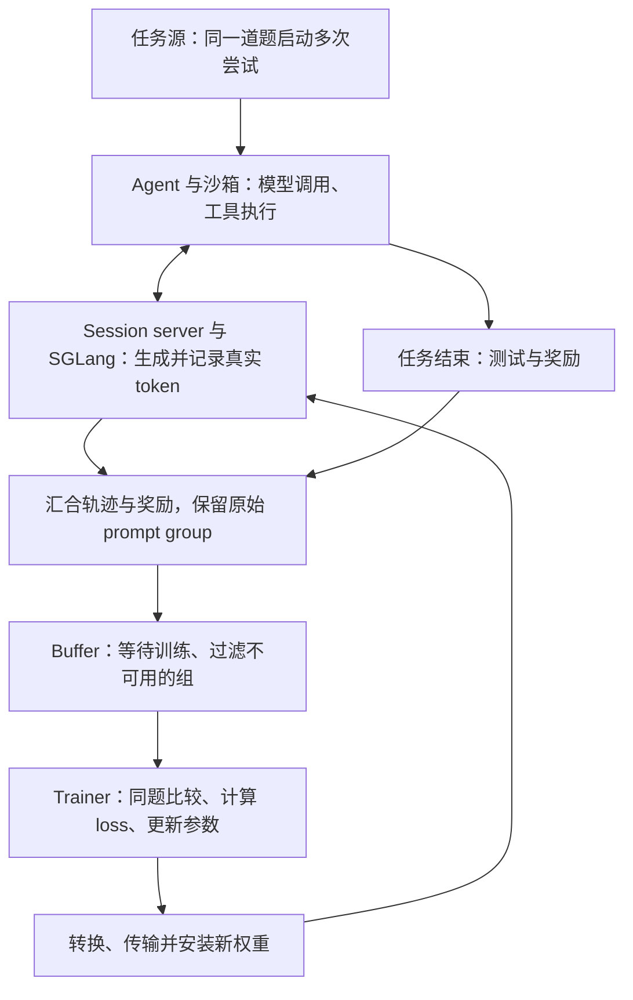

# 从 Miles 看长程 Agentic RL：轨迹、异步与训练闭环

一个终端 agent 接到任务后，先查看文件，再修改代码、运行测试，可能几十轮之后才得到最终分数。对用户来说，这是一次任务执行；对训练系统来说，它必须变成一组带有准确上下文、动作概率和奖励的数据，然后才能进入策略更新。

这中间有两类问题。一类关乎训练是否算对：训练器看到的 token 是否就是模型当时生成的 token，同一道题的多次尝试是否还在一起比较，记录的概率是否对应那次真实执行。另一类关乎训练能否持续运转：agent 等工具时 GPU 在做什么，旧轨迹还能不能用，优化器状态放在哪里，新权重多久才能回到生成端。两类问题会互相影响。提高并发可能让更多数据在队列里过期；更低的生成精度可以省显存，却也会改变概率校正的负担。

[Miles](https://arxiv.org/html/2609.08368v1) 提供了一个具体例子。它基于 Slime，用 SGLang 生成轨迹，以 Megatron 或 FSDP 更新模型，并把任务调度、轨迹记录和权重同步接到同一条循环中。其 GLM-5.2 案例用 64 张 GB300 对 744B-A40B 模型做全参数终端 agent RL：32 张卡训练，32 张卡生成。理解这组配置，要先看清一条执行记录怎样成为训练数据，以及一次更新怎样影响后续执行。

本文结合报告、官方文档和代码解释这条链路。实验数字来自 **arXiv v1**，源码补充固定在提交 [`87605158`](https://github.com/radixark/miles/tree/8760515851ec4f76815171d812c836bf8caa0aca)，查阅日期为 2026-09-14；该提交不等同于论文实验的冻结快照。下文的流程示例用于解释机制，未独立复现 GPU 训练。

## 一次任务，要经过哪些环节才能训练

先把终端任务放回 RL 的语言里。模型可见的状态，是本轮请求中的消息历史、工具定义和工具返回；动作是模型生成的文本和工具调用 token；环境执行这些工具，改变文件、进程以及下一轮的输入。最终测试给出 reward，训练器再提高或降低这些动作在相应上下文中的概率。

组织模型调用和工具执行的框架通常叫 **agent harness**。它决定何时运行命令、何时重试、保留多少历史，因而也决定模型经历什么状态。接入一个新 harness，意味着训练数据的生成过程发生了变化。

以 GRPO 为例，一道任务通常要独立尝试多次。这些尝试合称一个 **prompt group**；其中每次完整执行是一个 **episode**，一次 episode 内又有多轮模型请求。Miles 的 GLM-5.2 recipe 每道题尝试 8 次，一批训练消费 8 道题，共 64 次尝试。把这些对象分清，后面的异步调度才容易理解。



这是一张概念流程图。一次请求结束、一次任务结束、一个 group 完成、一个训练步完成，发生在不同时间。异步系统允许它们交错推进，但仍需保留彼此的对应关系。

GRPO 的比较单位尤其不能丢。记同题的 $G$ 次尝试得到奖励 $R_i$，常见的组内优势写法是：

$$
A_i=\frac{R_i-\bar R}{\sigma_R+\varepsilon},
\qquad
\bar R=\frac{1}{G}\sum_{j=1}^{G}R_j.
$$

$\sigma_R$ 是组内奖励标准差，$\varepsilon$ 用于避免除零；具体 recipe 可以调整归一化方式。这里真正需要保留的是“同一道题”的范围。比如一道题有的尝试成功、有的失败，组内比较就能区分它们；把恰好同时结束的不同题目混成一组，优势的含义便变了。

到这里，训练循环已经有了形状。但图中的“轨迹”还不能只是一份聊天日志。

## 训练器必须看到那次真实执行

模型生成工具调用后，harness 往往会解析 JSON、执行工具，再把消息历史发回模型。这个过程可能改变空格、重新序列化参数、丢掉 reasoning 字段，或者让 chat template 重新渲染旧消息的边界。人看起来内容没有变，token 序列却可能已经不同。

假设模型先生成工具调用 $Y_1$，看到工具结果 $O_1$，然后继续生成 $Y_2$。用于训练的序列应该保留下面的关系：

```text
真实序列：P0 | Y1 | O1 | Y2
loss mask：0 |  1 |  0 |  1
```

$P_0$ 是初始输入，$Y_1$ 和 $Y_2$ 是模型采样的 token，$O_1$ 包含工具返回以及系统补入的边界。工具结果不直接承担策略梯度，却必须留在输入中，因为它是生成 $Y_2$ 的条件。

如果训练前把 $Y_1$ 改写成语义相同的 $Y'_1$，训练器算出的将是 $\pi(Y_2\mid P_0,Y'_1,O_1)$，而真实采样发生在 $\pi(Y_2\mid P_0,Y_1,O_1)$ 下。此时概率比的两端已经不在评价同一个状态。**重要性采样可以校正分布差异，不能修复一条被重新编写的执行历史。**

Miles 用 **TITO（Token-In-Token-Out）** 处理这个问题。服务器用一个 session 保存一次执行的多轮请求历史：首轮把消息编码成 token，每轮生成后保存真实的 prompt IDs、output IDs 和 rollout log-probabilities。下一轮请求到来时，复用已保存的适用前缀，只编码新追加的部分。Harness 仍可使用消息接口，训练数据则以 session server 保存的 token 为准。[报告 §2.4](https://arxiv.org/html/2609.08368v1#S2.SS4)。

对于线性延续的对话，第 $n$ 轮输入 $P_n$、模型输出 $Y_n$ 和新增上下文 $O_n$ 应满足：

$$
P_{n+1}=P_n\Vert Y_n\Vert O_n,
$$

其中 $\Vert$ 表示 token 拼接。这样做保留了“当时看到了什么、随后生成了什么”，也给后面的概率重算提供了基础。

如果 harness 会压缩上下文或创建分支，就不能再把所有调用硬拼成一条线性历史。Miles 支持 branching session，将不同上下文路径保存成树，再从选中的叶子导出训练轨迹。此时一个 episode 可能产生多条轨迹，recipe 还需规定它们怎样继承奖励、处理共享前缀，以及参与原始 prompt group 的优势计算。Token 历史保存正确，只完成了其中一部分工作。[报告 §2.4.1](https://arxiv.org/html/2609.08368v1#S2.SS4.SSS1)。

前缀复用还依赖消息匹配规则。若规则只比较可见正文、忽略工具调用，两条正文都为空但调用不同工具的消息就可能被合并。接入新 harness 时，需要检查模板、parser 和历史重放是否一致。关于这些细节，可以继续看 [[什么是TITO]]；它们首先影响训练对象是否正确，之后才轮到缓存和吞吐。

## 异步调度怎样减少等待，又改变了哪些数据

终端任务的执行时间差异很大。有的很快结束，有的需要编译、安装依赖或等待长测试。同步循环要等一批生成完成，才能开始训练；训练期间，分离部署的生成 GPU 又可能闲着。

用 $T_R$ 表示得到一批可用轨迹的时间，$T_T$ 表示训练时间，忽略其他开销时，同步循环约需 $T_R+T_T$；如果两者能够持续重叠，理想稳态周期可以接近 $\max(T_R,T_T)$。这个关系只解释重叠的潜力，实际还要加上权重安装、评估、数据过滤与队列不足带来的停顿。

Miles 的 fully asynchronous 模式让后台持续生成，trainer 从 buffer 取已完成的 group。两侧使用独立 GPU 池；该模式不能与训推共卡的 `colocate` 组合。[报告 §2.2](https://arxiv.org/html/2609.08368v1#S2.SS2)。

### 并发槽位可以逐条释放，训练仍按同题分组

假设某组 8 次尝试已经完成 7 次，最后一次还在编译。如果必须等整组结束才能释放容量，这 7 个位置会一直空着。

Miles 默认采用 sample granularity：每条轨迹完成就释放自己的槽位，来自不同组的空闲槽位累计够一个新组后，便提交下一组任务。原来的组继续等待最后那次尝试，完整结束后才进入训练。**调度单位可以是单条轨迹，统计单位仍然是同题 group。** [报告 §2.2.1](https://arxiv.org/html/2609.08368v1#S2.SS2.SSS1)。

这也解释了为什么“128 条在途轨迹”和“一批训练 64 条轨迹”可以同时存在。前者控制生成侧有多少任务正在进行，包括等待工具的任务；后者控制 trainer 每次消费多少数据。把两个数绑在一起，会限制两侧各自调优的空间。

### 一条长轨迹可能跨过多个模型版本

异步运行时，agent 等工具的几分钟里，trainer 可能已经完成更新。它下一轮请求用到的权重，未必与上一轮相同。因此，不能只给整条轨迹标上“结束时的模型版本”。

报告按组内出现过的最老版本计算陈旧度（staleness）。例如某组的生成使用过版本 17、18、19，trainer 已到版本 21，那么按报告口径，这组数据的年龄是 4。它在队列里再等待两步，年龄还会增加，所以陈旧度检查应发生在取出数据时。[报告 §2.2.2](https://arxiv.org/html/2609.08368v1#S2.SS2.SSS2)。

有界 buffer 可以限制积压，陈旧度阈值可以拒绝过旧的组，但这两种约束不同：队列很短，也可能刚收到一条生成了很久的轨迹。查阅日的官方文档中，`--max-weight-staleness` 默认未设置，即未启用这项过滤。文档把年龄写成相对 engine 版本，报告则写 trainer 版本；每步同步时通常一致，调整同步间隔后需要核实计数口径。[官方异步文档](https://miles.radixark.com/docs/user-guide/fully-async)。

### 队列也是训练数据的选择器

Buffer 长期为空，说明 trainer 在等生成；长期满载，说明 trainer 消耗不完生成结果。后一种情况下，继续增加并发可能只会生产更多最终因过旧而被丢弃的数据。

因此，调异步系统需要同时看队列长度、实际消费组的年龄、仍在排队组的年龄，以及超时和陈旧丢弃数量。仅看每秒生成多少 token，很难判断这些算力最终有没有进入一次更新。

这里还有一个统计问题：如果复杂任务通常更慢，那么按完成顺序消费、设置超时并过滤旧组，可能减少这类任务进入训练的机会。保留 prompt group 维护了组内比较，却没有自动保持不同任务的采样比例。这是从调度机制推导出的风险，报告没有给出按任务难度或耗时分析的过滤偏差实验。要检验它，应追踪各类任务从提交、完成到实际被训练的比例。

## 真实 token 相同，概率为什么还会不同

TITO 让 trainer 重算的是那次执行中的 token，异步队列决定哪些执行会被用到。接下来才是 loss：trainer 怎样利用记录下来的动作概率，更新当前策略。

即使 token 完全相同，两端的概率也可能不同。异步数据使用了较旧的权重；同一份权重在生成端和训练端又可能经过不同的量化、MoE 路由和算子路径；一次训练内部，参数还会继续变化。这些差异需要分别处理。

### TIS 与 PPO clipping 作用于不同的比值

先看一种常见路径：trainer 在本轮更新前，对收到的轨迹做一次固定评分，再开始优化。对同一个有效 action token，记：

- $\mu_t$：生成端记录的行为概率，包含当时权重与实际执行路径的影响。
- $\pi_{\mathrm{old}}$：trainer 在本轮更新前固定下来的评分。
- $\pi_\theta$：正在优化的模型对该 token 的概率。

这里省略了真实 token 前缀。所有比较都要求动作、上下文和采样评分口径可对应；temperature、top-p 等设置也要纳入检查。可以把总概率比分成两部分：

$$
\frac{\pi_\theta}{\mu_t}
=\underbrace{\frac{\pi_\theta}{\pi_{\mathrm{old}}}}_{\rho_t\text{：本轮策略更新}}
\cdot
\underbrace{\frac{\pi_{\mathrm{old}}}{\mu_t}}_{c_t\text{：训练前评分与行为评分的差异}}.
$$

PPO clipping 作用于 $\rho_t$，在目标函数中抑制过大的更新收益。TIS（Truncated Importance Sampling）则截断 $c_t$，避免训练前评分与行为评分差异过大的 token 获得极端权重。在异步场景中，$c_t$ 会同时包含权重陈旧与两端计算差异，并不只代表量化误差。

报告中 TIS 的默认区间为 $[0,2]$：$c_t=3$ 时使用权重 2，$c_t=0.1$ 时仍使用 0.1。另一种 clip-or-pop 规则会将区间外 token 的权重置零，因此前一个例子会被丢弃。下界 0 不会把低比值抬高。[报告 §3.4](https://arxiv.org/html/2609.08368v1#S3.SS4)。

省略其他损失项和归约细节，带 TIS 的策略目标可写成：

$$
L_{\mathrm{PG}}=-\mathbb E_t\left[
\operatorname{sg}\!\left(\operatorname{clip}(c_t,0,2)\right)
\min\!\left(\rho_t A_t,
\operatorname{clip}(\rho_t,1-\epsilon_l,1+\epsilon_h)A_t\right)
\right].
$$

$A_t$ 是该 action token 对应的优势；基础 GRPO 中，它来自所在尝试的组内比较。$\operatorname{sg}$ 表示停止梯度，$\epsilon_l$ 和 $\epsilon_h$ 决定 PPO surrogate 的截断范围，实际概率比仍可能越界。外侧校正权重在本轮固定，梯度通过内侧的当前策略传播。

未经截断时，两个比值可以代数合并；分别截断之后，就不能随意换成对 current/rollout 做一次 clip。上式是针对所述评分路径的解释，`--use-rollout-logprobs` 或跳过独立 actor forward 会改变旧评分的来源，具体配置应沿 [loss 实现](https://github.com/radixark/miles/blob/8760515851ec4f76815171d812c836bf8caa0aca/miles/backends/training_utils/loss_hub/losses.py#L126)和 [corrections 实现](https://github.com/radixark/miles/blob/8760515851ec4f76815171d812c836bf8caa0aca/miles/backends/training_utils/loss_hub/corrections.py#L20)核对。更详细的推导见 [[TIS：用截断重要性采样缓解LLM RL训推不一致]]。

截断会引入偏差，换取较温和的更新；陈旧度过滤则丢弃部分数据，换取更近的行为策略。二者都没有让任意旧轨迹获得无偏或稳定收敛保证。逐 token 校正也没有完整修复前面提到的任务选择与状态访问分布变化。

### R3 和数值对齐是在减少差异的来源

TIS 处理已经出现的评分差异，R3（Rollout Routing Replay）则试图减少 MoE 中的一种差异来源。MoE 的 top-k 路由会把小数值误差变成离散选择变化：生成时用了专家 $\{2,7\}$，训练时可能变成 $\{2,8\}$。R3 保存生成时各位置、各层的专家编号，让训练 forward 重放这些选择。它依赖准确的 token 位置，也增加轨迹存储和传输成本。[报告 §2.5](https://arxiv.org/html/2609.08368v1#S2.SS5)。

重放专家选择后，专家内部计算、门控数值与量化误差仍可能不同。标成同一种 dtype 也不够：量化分块、scale、保留 BF16 的张量范围以及在线权重转换，都可能影响结果。两端权重相同、token 相同、专家相同，仍不能直接推出 log-prob 完全相同。

Miles 的 true-on-policy profile 进一步约束 attention、GEMM、融合算子、并行规约和确定性执行，并在生成侧对完成序列重新做 prefill 评分。v1 报告的覆盖范围是 dense Qwen3 的 0.6B 和 4B 变体：支持配置下，已采样 token 的两端评分差值为零，代价是生成变慢；Qwen3-4B-Base 的 reward 曲线与基线相近。这个结果针对已采样 token，不能扩展成任意模型、全词表或异步旧数据的保证。[报告 §5.3](https://arxiv.org/html/2609.08368v1#S5.SS3)。

这些机制的关系可以这样理解：先保住真实上下文，再尽量减少计算差异，最后按所选目标处理残余偏差。数值对齐可以作为排查训练异常的参照，但生产配置是否值得为它牺牲吞吐，需要结合模型和任务判断。

## 模型装得下之后，还要让更新回到生成端

到这一步，数据和 loss 的关系已经清楚。大模型训练还有一个直接约束：这些计算及其状态能否放进硬件，更新后的模型又能否及时送回 agent。

### 744B 的状态容量不能按 40B 估算

GLM-5.2 744B-A40B 的 40B 是每次激活的参数规模，它降低每 token 的计算量。全参数训练仍需管理完整 744B 模型的权重与优化器状态。

假设 FP32 master weight 和 Adam 的两个 moments 都使用 FP32，仅这三项就需要每参数 12 bytes。将它们理想均摊到 32 张训练卡，量级为：

$$
\frac{744\times10^9\times12}{32}
\approx279\times10^9\ \text{bytes}.
$$

也就是每 rank 约 279 GB，还未算模型权重、梯度和激活。这是帮助理解容量压力的均摊估算，实际还取决于不同参数的分片方式。

Miles 的 **optimizer state streaming** 利用了这些状态的访问时机：forward 和 backward 不读取 Adam moments 与 master weights，因此计算梯度时可以把它们留在磁盘；到 optimizer step，再按参数 bucket 读入、更新和释放。它降低训练期间的显存峰值，是主案例能用 32 张卡容纳 trainer 的必要选择。[报告 §3.2.2、§9.1](https://arxiv.org/html/2609.08368v1#S3.SS2.SSS2)。

这与“暂停训练后，把整个 actor 搬走给共卡 rollout 腾地方”不同。后者利用训推轮流占卡的时间，streaming 则让训练本身能够进行。代价落在磁盘 I/O、optimizer 更新和 checkpoint 保存上；流式优化器状态的恢复还要求相同并行布局，不能因为模型 checkpoint 可重分片，就假定这些状态也能自由改变布局。

主案例还用 TP 2 分摊权重、CP 4 分摊长序列激活，以 PP 4 划分模型层。论文称 TP 1 在加载非专家权重时就会溢出；78 层按 18/20/20/20 分成四段，也受到稀疏 attention 索引复用的层边界约束。这些具体约束比一串可以照抄的并行度更有解释力。[报告 §9.1](https://arxiv.org/html/2609.08368v1#S9.SS1)。

### 权重同步包含转换、传输和安装

训练器做完 optimizer step，SGLang 还不能直接拿来生成。训练侧按 TP、PP、EP 等方式拆分的张量，要先聚合、改成接收端需要的名称与布局，再传输并安装。两侧精度不同时，还涉及相应的量化与辅助状态。

Miles 提供几条传输路径，它们主要适应不同的部署条件：

| 路径           | 如何送权重                                     | 主要取舍                                                   |
| -------------- | ---------------------------------------------- | ---------------------------------------------------------- |
| NCCL broadcast | 将准备好的权重 bucket 广播给生成端             | 默认路径较直接，可能传输目标并不需要的分片                 |
| P2P RDMA       | 多个训练 rank 并行发送，每个目标接收所需 shard | 利用集群总带宽，增加重分片与 staging 成本                  |
| Disk-delta     | 通过共享存储发布相对基底 checkpoint 的字节变化 | 无需同一 NCCL/RDMA 网络，但要管理基底版本并重载 checkpoint |

来源：[报告 §4、表 7](https://arxiv.org/html/2609.08368v1#S4)。这里的 delta 利用有限精度权重的字节变化，并不意味着只训练了部分参数。

P2P 的收益体现了拓扑的重要性。在独立 H100 基准中，GLM-5 的训练侧和生成侧各用 16 个节点，同步时间从 broadcast 的 58.30 秒降到 P2P 的 8.48 秒，约减少 85.5%。单节点场景缺少额外发送带宽，却仍要承担 CPU 重分片和 staging，报告中 P2P 最多慢约 70%。这些计时从 generation pause 完成后开始，不包含完整暂停过程；它们也不是 GLM-5.2/GB300 主案例的端到端训练加速。[报告 §4.2、表 8](https://arxiv.org/html/2609.08368v1#S4.SS2)。

安装阶段还会影响正在执行的 agent。Miles 可把请求退回队列并重算 KV cache（`retract`），也可以暂停后沿用已有缓存继续运行（`in_place`）。后一种方式使行为概率还可能受旧缓存构建历史影响，不能只靠当前权重版本还原。GLM-5.2 启动器选择的是 `in_place`。[官方异步文档](https://miles.radixark.com/docs/user-guide/fully-async)、[固定版本启动器](https://github.com/radixark/miles/blob/8760515851ec4f76815171d812c836bf8caa0aca/examples/experimental/openenv/glm52_tbench2/run_glm5_2_744b_a40b_daytona.py)。

多轮任务平时也需要缓存复用。Miles 让同一 session 尽量回到同一个引擎，开启 DP attention 时进一步绑定到持有缓存的 DP rank；新 session 再按活跃请求负载分配。这样可以减少长历史的重复计算，但缓存的生命周期必须与权重安装一起考虑。[报告 §2.1](https://arxiv.org/html/2609.08368v1#S2.SS1)。

因此，同步性能应从“暂停—转换与传输—安装—恢复”整体衡量。延长同步间隔虽然减少传输次数，却也让新轨迹使用更旧的权重。权重同步的开销，最终又回到了前面的样本年龄问题。

## GLM-5.2 的 64 卡案例，把哪些选择组合在了一起

现在再看配置表，每一项都能对应到一个具体约束。这份 recipe 通过 OpenEnv 接入 Terminal-bench-2 任务，每次 episode 创建一个 Daytona 沙箱，从任务镜像启动，完成后删除；模型操作终端，任务测试脚本给出奖励。

| 环节       | 实际配置                                                                     | 为什么与训练有关                               |
| ---------- | ---------------------------------------------------------------------------- | ---------------------------------------------- |
| 模型与资源 | GLM-5.2 744B-A40B；16 节点，每节点 4 张 GB300；训推各 32 卡                  | 全参数训练，大规模状态与持续生成都需要资源     |
| Trainer    | Megatron；TP 2 / PP 4 / CP 4 / EP 8；optimizer streaming                     | 分摊权重、层、上下文与专家，并降低状态显存峰值 |
| Rollout    | 8 个四卡引擎；DP attention 的 DP 为 4；启用 MTP                              | 保持并发、缓存复用并使用多 token 预测          |
| 精度与校正 | 训练权重 BF16；rollout 权重与 KV cache 为 FP8；使用 TIS                      | 在容量和吞吐约束下承受并校正残余评分差异       |
| 训练批次   | 8 道题，每题 8 次尝试                                                        | 每步消费 8 个完整 prompt group                 |
| 调度       | Fully asynchronous；最多 128 条在途轨迹                                      | 将生成并发与训练 batch 分开控制                |
| 执行预算   | 单次回复最多 8,192 token；session 序列预算 65,536 token；最多 30 轮或 1 小时 | 同时约束单轮生成、完整历史和工具执行时间       |
| 权重与评估 | Broadcast；`in_place`；每 10 步使用共享引擎评估                              | 更新与评估都占用生成侧时间                     |

配置来源：[报告 §9.1、表 9](https://arxiv.org/html/2609.08368v1#S9.SS1)，broadcast 与 `in_place` 补充自[固定版本启动器](https://github.com/radixark/miles/blob/8760515851ec4f76815171d812c836bf8caa0aca/examples/experimental/openenv/glm52_tbench2/run_glm5_2_744b_a40b_daytona.py)。TP、PP、CP、EP 涉及不同进程组，不能将四个数全部独立相乘来计算 GPU 数。

这张表也划清了框架能力与实际组合：本次运行没有启用 R3，使用的是 broadcast，并没有把前述 P2P 或 true-on-policy 的结果同时用进来。共享评估引擎还会暂停训练数据生产；若改用独立评估池，可以减少这部分竞争，但需要额外资源，导出 checkpoint 也可能阻塞 trainer。[报告 §2.2.4](https://arxiv.org/html/2609.08368v1#S2.SS2.SSS4)。

> [!note]- 复现时需要单独核实的两处口径
> 报告把 65,536 token 写作完整 session 的序列上限；固定版本启动器的注释提示 agent loop 尚未感知此处截断，可能继续生成。应分别验证训练序列截断与环境循环何时终止。
>
> 报告 §3.2.2 称该 GLM-5.2 案例即使采用 DP=4 仍需 streaming，§9.1 则描述为 single data-parallel replica，recipe README 也写 DP1。不同类型参数的通信与分片组可能不同，这里保留明确列出的并行配置，不替作者消解该口径差异。

作者运行了 100 个训练步骤，报告图 5 如下：


图源：[RadixArk，报告图 5](https://arxiv.org/html/2609.08368v1#S9.F5)，保留原始曲线与标注。端点标签显示到两位小数，下表使用正文给出的奖励数值。

| 观察         | 作者报告的结果                                                             | 可以怎样理解                                                          |
| ------------ | -------------------------------------------------------------------------- | --------------------------------------------------------------------- |
| 运行时间     | 前 30 个测量步骤的中位数为 263 秒；step 0 为 1,042 秒，超出图中纵轴范围    | 给出了这组配置的时间量级，未给出 100 步平均时间或总 GPU 成本          |
| 生成与缓存   | 约 90–100 个请求正在生成，在途轨迹上限为 128；prefix-cache hit rate 为 96% | 系统保持了较多生成请求并复用历史；请求数不等于 GPU 利用率             |
| 训推评分差异 | 100 步 divergence 均值为 0.0369，结束时接近起点                            | 该监测量未持续漂移，报告未给完整估计公式，不能当作精确定义的全分布 KL |
| 原始任务奖励 | 九步滑动平均从 0.438 升到 0.556                                            | 这是单次运行的训练奖励变化，不能直接解释为 held-out 成功率提升        |

来源：[报告 §9.2](https://arxiv.org/html/2609.08368v1#S9.SS2)。

这组结果最直接地说明了容量和运行可行性：一个 744B MoE 的全参数 agentic RL 任务，可以在这套并行、精度、卸载和调度组合下持续更新。奖励曲线也给出了训练过程中的正向观察，但是否提升了可泛化能力，还需要 held-out 评估。虽然 recipe 每 10 步执行评估，主图没有展示那条曲线或跨随机种子的统计检验。

系统性能的证据同样有边界。报告没有提供同模型、同硬件、同任务预算下与其他框架的完整对照，也没有分别关闭异步、缓存亲和性、streaming、MTP、TIS 的完整消融。因此，263 秒是一个可参考的运行点，不能据此分配各组件的贡献，或判断 Miles 在任意部署上都更快。不同模型与 recipe 的验证深度也不同，仓库里有启动脚本并不等于已完成同规模长跑。[报告 §7](https://arxiv.org/html/2609.08368v1#S7)。

## 迁移这套思路，比复制配置更有用

Miles 让 RL recipe 的范围变得具体：进入 loss 的真实上下文、同题尝试的分组、旧评分的来源、可接受的样本年龄、训练状态的存放方式，以及权重安装如何影响下一次生成，都是训练方案的一部分。单独把其中某个模块换快，未必改善整条循环。

对于新的 agentic RL 任务，可以按下面的顺序建立一个容易解释的运行。这是基于上述机制的实践判断，而非报告验证过的最优流程。

1. **先把小规模任务执行和评分跑对。** 用已知结果检查 reward，保存真实 token、mask 与 prompt group 身份；如果 harness 会分支或压缩历史，先明确导出的多条轨迹如何参与训练。外部框架接管的范围越大，需要自己验证的记录与分组逻辑也越多。
2. **在固定权重、固定轨迹上建立数值参照。** 对比两端 log-prob，先排查上下文、采样口径和计算路径，再判断是否需要路由重放、量化调整或 TIS。否则，一个 token 重建错误也可能被当成“RL 不稳定”。
3. **根据真实容量与时间分配资源。** 分开估算权重、梯度、激活、优化器和轨迹元数据，测量生成、optimizer I/O、权重安装与 checkpoint 开销，再选择并行度和训推卡数。
4. **最后扩大异步并发。** 同时观察每单位时间实际消费的 group、有效 action token、样本年龄和丢弃成本，用固定预算下的 held-out 表现判断调整是否值得。

评估尤其要绑定实际测量的模型版本。异步分数晚回来几步，就应记回被测权重对应的训练步，不能挂在收到结果的时刻；否则模型选择与性能比较都会被时间轴误导。[报告 §2.2.4](https://arxiv.org/html/2609.08368v1#S2.SS2.SSS4)。

对长程 agent 来说，最终要回答的是：**同样的计算预算下，有多少真实执行被正确用于更新，模型在未见任务上因此改善了多少。** Miles 的案例把前半句涉及的系统环节连接了起来；要判断一份新 recipe 是否成功，还需要把它们与后半句的评估结果放在一起看。

## 参考资料

- RadixArk，[Miles v0.1: Production-Level Post-Training，arXiv:2609.08368v1](https://arxiv.org/html/2609.08368v1)。本文实验与系统机制的主要来源。
- Miles 官方，[GLM-5.2 Terminal-bench-2 recipe](https://github.com/radixark/miles/tree/8760515851ec4f76815171d812c836bf8caa0aca/examples/experimental/openenv/glm52_tbench2) 与[启动器](https://github.com/radixark/miles/blob/8760515851ec4f76815171d812c836bf8caa0aca/examples/experimental/openenv/glm52_tbench2/run_glm5_2_744b_a40b_daytona.py)。固定提交，补充实际开关与复现备注。
- Miles 官方，[Fully Async RL](https://miles.radixark.com/docs/user-guide/fully-async)。核对调度、buffer、默认阈值与评估行为，查阅日期 2026-09-14。
- Miles 官方源码，[Policy losses](https://github.com/radixark/miles/blob/8760515851ec4f76815171d812c836bf8caa0aca/miles/backends/training_utils/loss_hub/losses.py#L126) 与 [Corrections](https://github.com/radixark/miles/blob/8760515851ec4f76815171d812c836bf8caa0aca/miles/backends/training_utils/loss_hub/corrections.py#L20)。核对策略比值与固定校正权重的来源。

相关笔记：[[slime-coding-agent-rl]]、[[什么是TITO]]、[[R3：用Rollout Routing Replay解决MoE Agentic RL的训推不一致]]、[[TIS：用截断重要性采样缓解LLM RL训推不一致]]、[[slime增量权重同步机制]]。
