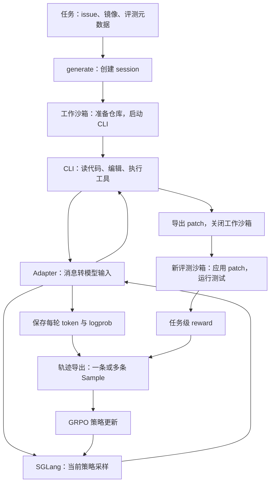

# Slime Coding-Agent RL Recipe 分析：从真实 Agent 执行到 GRPO 更新

> 分析对象：THUDM/slime 的 `examples/coding_agent_rl`，固定在提交 [`4c193f1f37509cca70f0e88807a9305b70f63f4e`](https://github.com/THUDM/slime/tree/4c193f1f37509cca70f0e88807a9305b70f63f4e/examples/coding_agent_rl)。阅读日期：2026-09-06。本文基于源码静态分析，未运行多机训练；配置代表这个示例的默认值，不代表已验证的最佳超参数或训练成绩。

这个示例让 Claude Code 在沙箱里修复代码，再用测试结果训练它背后的模型。CLI 负责搜索、读文件、编辑和运行测试，模型则由 Slime 通过 SGLang 提供。

难点在于，CLI 与模型之间传递的是消息和工具结果，训练器需要的却是 token、mask、log probability 和 reward。一次修复还可能启动子代理或压缩上下文，最终拆成多条训练样本。这些样本怎样对应回原来的任务，直接影响损失和奖励的计算。

Slime 用新沙箱评测 patch，保存每轮实际生成的 token，再把分支轨迹交给 GRPO。我读到训练侧时发现了一个问题：分支展开后，默认奖励归一化可能把不同题目的样本混在一起。后面会用一个小例子说明它是怎样发生的。

## 1. 训练的是哪一部分

默认组合是 `ClaudeCodeHarness + AnthropicAdapter`。CLI 接收任务，在沙箱中调用 `Read/Edit/Grep/Bash/Agent` 等工具；它的模型请求被重定向到 Slime adapter，再由 adapter 调用 SGLang。启动脚本指定的 checkpoint 路径名是 `Qwen3.6-35B-A3B`。

Claude Code 在这里充当 agent harness，提供工具定义、执行循环、消息历史和上下文管理。训练更新的是 SGLang 后面的模型，reward 来自最终 patch 的测试结果。

也可以设置 `SWE_AGENT=codex`，换成 `CodexHarness + OpenAIAdapter`。任务和评分代码可以沿用，不过启动器的 tarball、环境变量和工具配置主要围绕 Claude Code 编写，切换时要一起检查。[来源：agent 组合与入口](https://github.com/THUDM/slime/blob/4c193f1f37509cca70f0e88807a9305b70f63f4e/examples/coding_agent_rl/generate.py#L45-L52)、[Claude Code 请求重定向](https://github.com/THUDM/slime/blob/4c193f1f37509cca70f0e88807a9305b70f63f4e/slime/agent/harness/claude_code.py#L60-L76)。

对应到 RL 中，任务、状态、动作和奖励分别是：

| RL 概念      | 这个 recipe 中的具体对象                           |
| ------------ | -------------------------------------------------- |
| 任务         | issue 描述、固定代码环境、测试与评分规则           |
| 模型可见状态 | CLI 本轮发来的消息历史、工具 schema 和工具返回内容 |
| 动作         | 模型生成的推理、文本和工具调用 token               |
| 状态转移     | CLI 执行工具，更新文件与消息历史                   |
| 终局产物     | 从工作区导出的 patch                               |
| 终局奖励     | 在新沙箱里评测 patch 得到的 0/1 结果               |

工具返回多长、何时压缩历史、是否允许子代理，都会改变模型看到的状态与可用的动作。harness 因而会影响训练分布。复现实验时，CLI 版本与配置需要和模型、数据集一起固定。

## 2. 一次 rollout 从启动到评分

一次任务由 `generate.py` 组织，通过 `--custom-generate-function-path` 接入 Slime。它先检查任务能否评测，为本次执行开启 adapter session，然后启动工作沙箱、运行 CLI、导出 patch。工作沙箱关闭后，再启动新沙箱评分，最后把记录下来的轨迹导出为 `list[Sample]`。[来源：generate 主流程](https://github.com/THUDM/slime/blob/4c193f1f37509cca70f0e88807a9305b70f63f4e/examples/coding_agent_rl/generate.py#L173-L249)。



一次任务内部，模型请求和工具执行交替进行；收集完一批任务后，训练器才更新模型。默认 `train.py` 等待 `generate` 返回，再执行训练，训练完成后调用 `update_weights()` 同步权重。这是同步训练循环，单批内部的多个 agent 请求可以并发。[来源：训练循环](https://github.com/THUDM/slime/blob/4c193f1f37509cca70f0e88807a9305b70f63f4e/train.py)。

示例目录主要保留了 SWE 任务逻辑，CLI、沙箱和轨迹处理放在公共的 `slime/agent/` 下：

| 模块                                   | 核心职责                        | 换任务时通常改什么   |
| -------------------------------------- | ------------------------------- | -------------------- |
| `examples/coding_agent_rl/generate.py` | 编排任务、session、超时与结果   | 生命周期与失败策略   |
| `examples/coding_agent_rl/swe.py`      | 数据解析、工作区、patch、评测   | 任务格式和评分规则   |
| `slime/agent/harness/`                 | 安装 CLI、写配置、启动与等待    | agent CLI 的启动方式 |
| `slime/agent/sandbox.py`               | 沙箱生命周期、命令和文件 I/O    | 环境后端             |
| `slime/agent/adapters/`                | 协议转换、推理请求、采样记录    | 模型 API 与输出协议  |
| `slime/agent/trajectory.py`            | 消息树、token 拼接、Sample 导出 | 轨迹组织规则         |

当前 `generate.py` 和 `swe.py` 仍直接创建 `E2BSandbox`。要迁移到其他沙箱服务，除了实现公共接口，还需要修改这两处实例化入口。

## 3. 一道题需要哪些环境和测试

### 3.1 scaleswe 和 swebench 的数据格式

训练入口读取 Slime JSONL 的 `prompt`、`label`、`metadata`，环境与评分信息放在 `metadata` 中。代码支持两套数据协议，训练和评估分别由 `SWE_TRAIN_PROTOCOL`、`SWE_EVAL_PROTOCOL` 选择，默认均为 `scaleswe`。

| 协议       | 主要字段                                                                                                | 评分路径                                                        |
| ---------- | ------------------------------------------------------------------------------------------------------- | --------------------------------------------------------------- |
| `scaleswe` | `metadata.image` 或 `remote_env_info.image_url`，`workdir`、`problem_statement`、可选 `pre_commands`    | 按优先级选择 `swepro`、`eval_cmd`、`remote_env_info.f2p_script` |
| `swebench` | `remote_env_info.image`、`repo`、`version`、`base_commit`、`test_patch`、`FAIL_TO_PASS`、`PASS_TO_PASS` | 调用 SWE-bench 的 `make_test_spec` 与 `get_eval_report`         |

注意 `image_url` 与 `image` 的位置差异。`label` 在部分路径中可充当 instance ID，但最终 reward 来自 evaluator。仅有题目文字和答案标签，不足以运行这份 recipe。[来源：元数据解析](https://github.com/THUDM/slime/blob/4c193f1f37509cca70f0e88807a9305b70f63f4e/examples/coding_agent_rl/swe.py#L77-L171)。

下面用一条虚构的 `scaleswe` 记录说明结构，镜像和评测命令需要自行准备：

```json
{
  "prompt": "修复解析器在空输入上的异常。",
  "label": "parser-empty-input-001",
  "metadata": {
    "image": "registry.example.com/swe/parser:task-001",
    "workdir": "/workspace/parser",
    "problem_statement": "空输入应返回空结果，目前会抛出异常。",
    "eval_cmd": "bash /opt/task-tests/evaluate.sh"
  }
}
```

任务环境需要准备好对应版本的仓库和依赖。`scaleswe` 会在工作沙箱与评测沙箱中执行相同的 `pre_commands`，让 patch 两边的基线一致。不过这些命令使用 `check=False`，执行失败后任务可能继续运行。准备数据时，要检查命令执行后的实际 commit 和依赖状态。[来源：工作区准备](https://github.com/THUDM/slime/blob/4c193f1f37509cca70f0e88807a9305b70f63f4e/examples/coding_agent_rl/swe.py#L177-L224)。

### 3.2 为什么 prompt 明确要求不要 commit

默认任务提示要求修改源文件、不要改测试、运行相关测试，并且不要 commit。最后一项直接来自 patch 收集方式：

```bash
git add -N .
git diff -- . ':(exclude)PROBLEM_STATEMENT.md' ':(exclude).harness/'
```

`git add -N` 让未跟踪的新文件能够出现在 diff 中；普通 `git diff` 比较的是工作树与 index。因此如果 agent 把改动完整 stage 或 commit，这些修改可能从收集到的 patch 中消失。“不要 commit”在这里会直接影响交付结果，复用其他 agent 的 prompt 时尤其要留意这一句。[来源：任务 prompt 与 patch 收集](https://github.com/THUDM/slime/blob/4c193f1f37509cca70f0e88807a9305b70f63f4e/examples/coding_agent_rl/swe.py#L230-L233)。

### 3.3 把 patch 放到新沙箱里评分

评测从同一任务镜像启动新沙箱，只搬运工作沙箱导出的 diff。这样，agent 在工作环境中留下的后台进程、临时依赖或其他没有进入 patch 的状态，不会自然继承到 verifier。

不同 grader 的成功条件并不完全相同：

| Grader                  | `reward = 1` 的条件                                                                   |
| ----------------------- | ------------------------------------------------------------------------------------- |
| `scaleswe / swepro`     | 解析测试结果，要求非空的 `fail_to_pass ∪ pass_to_pass` 集合全部出现在 `PASSED` 集合中 |
| `scaleswe / eval_cmd`   | 评测命令退出码为 0                                                                    |
| `scaleswe / f2p_script` | 写入并运行的 Python 脚本退出码为 0                                                    |
| `swebench`              | 官方 `get_eval_report` 返回该实例 `resolved=True`                                     |

排查“测试跑完了，为什么 reward 还是 0”时，需要先确认走的是哪条路径。`swepro` 要检查测试名和状态，`swebench` 要检查官方解析报告，只看退出码可能找不到原因。[来源：scaleswe 评分实现](https://github.com/THUDM/slime/blob/4c193f1f37509cca70f0e88807a9305b70f63f4e/examples/coding_agent_rl/swe.py#L253-L352)、[SWE-bench 评分实现](https://github.com/THUDM/slime/blob/4c193f1f37509cca70f0e88807a9305b70f63f4e/examples/coding_agent_rl/swe.py#L440-L492)。

新沙箱隔离了工作环境里的临时状态，但 patch 本身仍可能改动测试。收集 diff 时只排除了题目文件与 `.harness/`，“不要改测试”依靠的是 prompt 约束。如果 agent 修改了 grader 信任的测试或配置，这些改动仍可能被带入评测。另外，禁用 `WebFetch/WebSearch` 只关闭了这两个工具，Bash 能否访问网络还要看沙箱服务的网络策略。

准备任务时，我会先用空 patch 和已知正确 patch 各跑一次评分。如果两者都成功，测试可能没有覆盖问题；如果两者都失败，就要先排查环境和评分脚本。

## 4. 真实 Agent 轨迹如何变成训练 token

### 4.1 每轮重新编码输入，直接保存采样输出

CLI 发来的是消息和字符串；训练需要的是模型当时真正生成的 token。Adapter 每轮执行以下转换：

1. 把协议消息与工具 schema 转换成当前模型的输入格式。
2. 用模型 chat template 得到 `prompt_ids`，以 `input_ids` 调用 SGLang `/generate`。
3. 请求 `return_logprob=True`，从返回的 `output_token_logprobs` 中提取精确的 `output_ids` 与对应 logprob。
4. 解析模型输出，构造 CLI 能消费的响应；响应发送成功后，记录这一轮。

导出时的 `Sample.tokens` 来自这些 token 记录。`Sample.response` 是把 token 解码后得到的可读字段，不是重新 tokenize 的训练数据来源。[来源：adapter 请求与记录流程](https://github.com/THUDM/slime/blob/4c193f1f37509cca70f0e88807a9305b70f63f4e/slime/agent/adapters/common.py#L318-L394)、[SGLang 采样结果提取](https://github.com/THUDM/slime/blob/4c193f1f37509cca70f0e88807a9305b70f63f4e/slime/agent/adapters/common.py#L442-L514)。

保存原始 token 很有必要：CLI 可能重排工具调用 JSON，chat template 可能改变 token 边界，压缩则可能替换整个历史。如果只保存聊天记录，训练前再统一 tokenize，就可能失去与原始采样序列的对应关系。

### 4.2 消息树如何分支，token 如何拼接

`TrajectoryManager` 用 message tree 路由历史。子代理收到不同的系统提示、主代理触发压缩、客户端改写 assistant 消息，都可能形成新的路径。对每条 root-to-leaf 路径，再根据 token 前缀能否对齐，构建一条或多条训练 Sample。

拼接规则可以概括为：

| 情况                                             | 处理方式                           | 训练信号                                    |
| ------------------------------------------------ | ---------------------------------- | ------------------------------------------- |
| 新 prompt 严格延续旧 token 前缀                  | 追加工具或环境上下文，再追加新输出 | 新上下文 mask 为 0，新采样输出为 1          |
| 漂移位于最近一次 response 内，满足短输出合并条件 | 用新 prompt 对齐这一段历史         | 被替换的上一轮 response 区域整体 mask 为 0  |
| 不能安全对齐                                     | 从本轮真实 prompt 开始新 Sample    | 旧片段和新片段分别保留                      |
| 多个叶子共享同一生成节点                         | 后续路径只把共享输出当上下文重放   | 同一共享节点不会因路径数增加而重复计入 loss |

短输出处理的默认阈值是 1024 token，不过两处合并逻辑比较的对象不同：message rewrite 合并检查被改写的旧 leaf 输出长度；token realignment 检查本轮新输出长度，并要求漂移发生在最近一次 response 内。代码并没有拿漂移量与 1024 比较。对无法确认仍然对应原始采样的 token，Slime 可以把它们保留为上下文，同时清零 mask，让它们退出策略损失计算。[来源：token 拼接与对齐](https://github.com/THUDM/slime/blob/4c193f1f37509cca70f0e88807a9305b70f63f4e/slime/agent/trajectory.py#L165-L229)、[message rewrite 合并](https://github.com/THUDM/slime/blob/4c193f1f37509cca70f0e88807a9305b70f63f4e/slime/agent/trajectory.py#L370-L426)、[共享前缀与分段](https://github.com/THUDM/slime/blob/4c193f1f37509cca70f0e88807a9305b70f63f4e/slime/agent/trajectory.py#L456-L502)。

`response_length` 覆盖初始 prompt 之后的整段序列，其中可以夹杂工具观察。统计有效训练 token 数时，要看 `sum(loss_mask)`。树的结构和拼接细节可以结合 [[Slime轨迹管理]] 阅读，版本差异以本文固定的源码为准。

### 4.3 96k 是上下文上限，32k 是每次请求的生成上限

默认 `MAX_CONTEXT_LEN=96000`、`MAX_GEN_LEN=32768`。每轮 adapter 的约束近似为：

$$
\text{max\_new\_tokens}
=\min\bigl(\text{配置生成上限},\ \text{客户端请求上限},\ 96000-|\text{prompt\_ids}|\bigr),
$$

其中客户端未提供的上限不参与取最小值。这些是每次请求的限制，不是一次任务累计只能生成 32768 token。上下文压缩和子代理可以让整个任务的累计生成量超过单次上下文窗口。启动器还配置了 80000 的 CLI 自动压缩窗口，为 96000 的模型侧限制留出空间，但两个组件的计数与触发时机仍需要实测。[来源：请求预算计算](https://github.com/THUDM/slime/blob/4c193f1f37509cca70f0e88807a9305b70f63f4e/slime/agent/adapters/common.py#L416-L468)。

此外，当前 `finish_session` 会把上下文上限传给 `get_trajectory`，`to_sample` 在导出序列超长时会切片截断。README 中“导出不因长度丢弃 token”的描述已经不符合这份实现。导出的 Sample 状态默认设为 `COMPLETED`；metadata 中的 `truncated` 判断的是该消息链最后一个生成轮次的 `finish_reason` 是否为 `length`，并不自动反映导出切片。消费端不能假设这些情况一定会表现为 `Sample.Status.TRUNCATED`。[来源：导出长度处理](https://github.com/THUDM/slime/blob/4c193f1f37509cca70f0e88807a9305b70f63f4e/slime/agent/trajectory.py#L234-L264)、[截断元数据](https://github.com/THUDM/slime/blob/4c193f1f37509cca70f0e88807a9305b70f63f4e/slime/agent/trajectory.py#L479-L502)、[finish_session](https://github.com/THUDM/slime/blob/4c193f1f37509cca70f0e88807a9305b70f63f4e/slime/agent/adapters/common.py#L245-L278)。

## 5. 分支展开后，GRPO 按什么分组

启动器每批取 8 道题，每题运行 8 次 agent，一共 64 次独立执行。经过子代理分支和上下文压缩后，这 64 次执行可能导出更多条 Sample。奖励该按题目分组，loss 该按执行汇总，而真正参与计算的是 Sample 中 mask 为 1 的 token。沿着代码往后追，会发现这些步骤没有完全对齐。

### 5.1 每个片段都拿到完整 reward

README 写的是把 reward 按分支数平分，但当前 `TrajectoryManager.get_trajectory` 明确执行：

```python
for s in samples:
    s.reward = reward
```

同一次执行导出的片段共享 `rollout_id`，保留原来的 `index`、`group_index`。其中 `rollout_id` 标识一次原始执行，用来把拆开的 Sample 在训练侧重新归为一个统计单位，不要与训练主循环中同名的批次计数混淆。[来源：Sample 身份与 reward](https://github.com/THUDM/slime/blob/4c193f1f37509cca70f0e88807a9305b70f63f4e/slime/agent/trajectory.py#L251-L340)。

在损失归约端，Slime 预先计算同一 `rollout_id` 的总有效 token 数，即 `rollout_mask_sums`。若把单个 token 的策略损失记为 $\ell_{r,k,t}$，mask 记为 $m_{r,k,t}$，一次执行 $r$ 的归约形式可以示意为：

$$
L_r=
\frac{\sum_{k=1}^{K_r}\sum_t m_{r,k,t}\ell_{r,k,t}}
{\sum_{k=1}^{K_r}\sum_t m_{r,k,t}}.
$$

这里省略了批次和分布式缩放，并假设有效 token 数非零。它表达的是跨片段的 token 加权平均，而不是每条片段分别平均后等权相加。因此完整复制 reward，不自动意味着分支多的任务在最终 loss 中被重复计为 $K_r$ 个任务。[来源：跨 Sample 的分母计算](https://github.com/THUDM/slime/blob/4c193f1f37509cca70f0e88807a9305b70f63f4e/slime/ray/rollout.py#L318-L371)、[损失归约实现](https://github.com/THUDM/slime/blob/4c193f1f37509cca70f0e88807a9305b70f63f4e/slime/backends/megatron_utils/cp_utils.py#L47-L124)。

这些片段都使用最终任务的 reward。“搜索到了正确文件”或“执行了有用测试”没有单独奖励，investigator 也没有独立的价值函数。模型要从多次执行的成功与失败中学习哪些动作更有帮助。

### 5.2 分支展开如何影响奖励归一化

对于标准的同题组采样，我们期待先对 prompt $q$ 的 $G$ 次独立执行计算：

$$
A_{q,i}=\frac{R_{q,i}-\mu_q}{\sigma_q+\epsilon},
$$

再把同一次执行的优势分配给它的训练 token。奖励相同的整组没有组内区分信号，例如同一道题全部失败时，中心化奖励应为 0。

但固定版本的默认路径先把嵌套 Sample 展平，再进行 reward normalization。`_post_process_rewards` 只检查展平后的样本数：如果恰好等于 `n_samples_per_prompt × rollout_batch_size`，就每 `n_samples_per_prompt` 条一组；否则把全部展平样本当成一组。它没有按保留下来的 `group_index` 与 `rollout_id` 重建原始 prompt 分组。

启动脚本使用的正是这条默认路径：reward normalization 开启，也没有自定义 reward 后处理。[来源：展平与奖励归一化](https://github.com/THUDM/slime/blob/4c193f1f37509cca70f0e88807a9305b70f63f4e/slime/ray/rollout.py#L254-L313)、[默认归一化开关](https://github.com/THUDM/slime/blob/4c193f1f37509cca70f0e88807a9305b70f63f4e/slime/utils/arguments.py#L1017-L1028)。

用一个缩小版例子说明这个差异：假设两道题各采样两次，只有 A 的第一次执行成功，而且它导出三条 Sample。

| 原始执行 | 终局 reward | 导出 Sample 数 |
| -------- | ----------: | -------------: |
| A-1      |           1 |              3 |
| A-2      |           0 |              1 |
| B-1      |           0 |              1 |
| B-2      |           0 |              1 |

原始 prompt 分组下，A 的均值是 0.5，B 的均值是 0，B 的两个失败执行都没有组内优势。展平后奖励却变成 `[1, 1, 1, 0, 0, 0]`：样本数从预期的 4 变成 6，默认实现会对这 6 条统一归一化，B 的两次执行也因此获得负优势。成功执行的三份副本还会共同影响均值和标准差。

问题就出在这里：奖励归一化时，原来的题目分组已经混在了一起。后面即使按 rollout 汇总 loss，也无法修复前面算出的 baseline。

要保留同题 GRPO 的分组，我会先按每道题的原始执行计算组内优势，再把同一次执行的优势分配给它导出的所有片段。验证时还要特意让不同执行产生不同数量的分支，避免只测每次都导出一条 Sample 的情况。

### 5.3 策略比默认使用训练侧 logprob

Adapter 会保存采样时的 logprob，但启动器没有打开 `--use-rollout-logprobs`，该参数默认是 `False`。默认损失计算使用训练侧 actor 重算的旧 logprob 作为策略比的分母；脚本也没有启用 `--use-tis`。

即使训练使用了原始采样 token，训练和推理引擎算出的 logprob 仍可能有数值差异。排查训推不一致时，还需要追踪策略比分母来自哪里，以及是否启用了重要性采样校正。[来源：logprob 与 TIS 参数](https://github.com/THUDM/slime/blob/4c193f1f37509cca70f0e88807a9305b70f63f4e/slime/utils/arguments.py#L1063-L1080)、[策略损失实现](https://github.com/THUDM/slime/blob/4c193f1f37509cca70f0e88807a9305b70f63f4e/slime/backends/megatron_utils/loss.py)。

## 6. 默认启动器配置了什么

启动脚本中的主要参数如下。[来源：完整 launcher](https://github.com/THUDM/slime/blob/4c193f1f37509cca70f0e88807a9305b70f63f4e/examples/coding_agent_rl/run_qwen36_35b_a3b_swe_8nodes.sh)。

| 维度         | 默认配置                                                           | 应如何理解                                               |
| ------------ | ------------------------------------------------------------------ | -------------------------------------------------------- |
| 模型         | checkpoint 路径名为 `Qwen3.6-35B-A3B`；使用 `qwen3_5` spec         | 模型结构由脚本显式设置，替换 checkpoint 时必须核对兼容性 |
| 训练规模     | 8 节点 × 每节点 8 GPU，`--colocate`                                | 训练与 rollout 复用一池 64 GPU                           |
| 训练并行     | TP=2、PP=1、CP=8、EP=8、ETP=1                                      | CP 分摊长上下文，EP 分布专家；这些维度不能简单全部相乘   |
| 推理配置     | 64 GPU，每引擎 8 GPU                                               | 默认 8 个 engine；`sglang-dp-size=8` 是引擎内部配置      |
| 采样规模     | 每批 8 prompt，每题 8 次执行                                       | 名义上 64 次 agent 执行，fan-out 后 Sample 可多于 64     |
| 更新节奏     | 100 轮 rollout，每轮 1 个训练 step，global batch=64                | 计数时要区分原始执行和拆分后的 Sample，并考虑动态组批    |
| 长度         | context=96000，单次生成上限=32768                                  | 不是单任务累计 token 预算                                |
| 算法         | `grpo`，clip 下侧 0.2、上侧 0.28                                   | clip 区间为 `[0.8, 1.28]`；fan-out 的 baseline 另见上节  |
| 正则         | KL reward、KL loss、entropy 系数均为 0                             | 默认没有这些项带来的训练约束                             |
| 优化器       | Adam，学习率 `1e-6`，constant，weight decay=0.1，betas=(0.9, 0.98) | 是示例配置，未提供对应消融结论                           |
| 显存控制     | full recompute、动态 batch、CPU optimizer offload                  | 为长序列训练控制显存开销                                 |
| Logprob 计算 | chunk size=1024                                                    | 分块处理长序列上的 logprob 计算                          |
| 调试产物     | 每轮保存 rollout `.pt` 与 `run.log`                                | 用于排查轨迹与运行问题；模型保存和独立评测需另行配置     |

这里的 colocate 让训练与 rollout 共用 64 GPU。配合默认的 offload 与同步训练循环，系统在生成阶段和训练阶段之间切换资源占用。[来源：资源布局](https://github.com/THUDM/slime/blob/4c193f1f37509cca70f0e88807a9305b70f63f4e/slime/ray/placement_group.py)。

`REF_MODEL_PATH` 的用途容易被变量名误导。默认不启用独立 reference 模型，但脚本没有传 `--load`，参数补全会把 actor 的 `args.load` 回退为 `args.ref_load`。这个路径仍用于初始化训练模型，所以即使 KL 系数为 0，也需要在这里准备与 HF checkpoint 对应的训练侧权重。[来源：模型加载路径回退](https://github.com/THUDM/slime/blob/4c193f1f37509cca70f0e88807a9305b70f63f4e/slime/utils/arguments.py#L1823-L1844)。

默认 agent 配置还注册了只读 `investigator`，允许它使用 `Grep/Read/Glob`，并设置自动压缩。不过，“编辑前必须派发 investigator”只写在可选的 prompt 注释中，默认配置下每次 rollout 是否调用子代理，仍由 agent 决定。

## 7. 训练还要等沙箱、工具和评测

单轮问答的大部分开销通常在模型生成上；SWE agent 还要启动镜像、安装 CLI、操作文件和运行测试。可以粗略地把一道题的耗时拆成：

$$
T_{\text{task}}\approx
T_{\text{boot/install}}+
\sum_j\left(T_{\text{LLM},j}+T_{\text{tool},j}\right)+
T_{\text{diff}}+T_{\text{eval}}.
$$

按每次执行各启动一个工作沙箱和评测沙箱估算，一批 64 次执行约需启动 128 次沙箱，实际数量还取决于重试和提前退出。并发可以缩短整批任务的等待时间，但一批任务何时完成仍会受慢任务影响。

默认 agent 预算是 1800 秒，评测预算参数是 600 秒，外层 guard 未指定时推导为 `agent + eval + 180`，即 2580 秒。但 2580 秒不能当作整次任务的严格耗时上限：准备阶段、不同 grader 的多个子命令和清理各有超时，`finally` 中还会等待 session 关闭并额外休眠。[来源：预算与启动重试](https://github.com/THUDM/slime/blob/4c193f1f37509cca70f0e88807a9305b70f63f4e/examples/coding_agent_rl/generate.py#L55-L129)、[清理逻辑](https://github.com/THUDM/slime/blob/4c193f1f37509cca70f0e88807a9305b70f63f4e/examples/coding_agent_rl/generate.py#L270-L285)。

`SWE_BOOT_CONCURRENCY=16` 限制的是该编排器中的工作沙箱启动和安装阶段，不是最多只能同时存在 16 个完整 rollout，也不是整个集群所有评测沙箱的统一配额。若环境服务已经成为瓶颈，单纯增大 GPU 数量未必能增加有效训练 token。

### 7.1 不同“失败”会产生不同训练数据

| 事件                                                | 当前处理方式                                    | 对训练的含义                             |
| --------------------------------------------------- | ----------------------------------------------- | ---------------------------------------- |
| CLI 正常退出，但 patch 没修好问题                   | reward=0                                        | 可成为正常失败轨迹                       |
| CLI 非零退出或 agent 时间预算用尽，但还能提取 patch | 仍评测 patch 并尝试导出轨迹                     | 非零退出不自动等于丢弃；patch 仍可能成功 |
| patch 应用失败                                      | evaluator 正常返回 reward=0                     | 通常继续作为失败轨迹导出                 |
| 外层 guard 超时或主流程抛出异常                     | `ABORTED`、`remove_sample=True`、loss mask 清零 | 不直接作为有梯度的普通负样本             |
| `scaleswe` 没有任何 grader                          | 评分函数返回 0                                  | 数据配置错误可能表现为普通零奖励         |
| SWE-bench 结果解析异常                              | 评分函数捕获异常并返回 0                        | 部分评测故障仍可能混入负奖励             |

这里还有一个容易漏掉的影响：`remove_sample=True` 在默认数据转换中主要体现为 mask 清零，而奖励归一化先于这一步执行。所以，即使异常占位样本不产生梯度，仍可能改变其他样本的 baseline。[来源：异常占位 Sample](https://github.com/THUDM/slime/blob/4c193f1f37509cca70f0e88807a9305b70f63f4e/examples/coding_agent_rl/generate.py#L316-L333)、[reward 与 mask 的处理顺序](https://github.com/THUDM/slime/blob/4c193f1f37509cca70f0e88807a9305b70f63f4e/slime/ray/rollout.py#L306-L353)。

因此，除了任务解决率，我会分别记录启动失败率、patch 应用率、评测解析失败率和超时率，再观察每次执行的 Sample 数、有效 token 数与各阶段耗时。只看平均 reward，很难分清变化来自模型能力，还是数据分布与运行环境。

## 8. 复现前需要准备和验证什么

要运行这份示例，还需要准备完整训练 JSONL、任务镜像集合和 CLI tarball，这些文件没有随目录一起提供，也没有对应的训练结果报告。默认启动器没有配置 checkpoint 输出路径、定期保存间隔或独立 eval dataset/interval；`rollout_dumps` 只保存调试所需的轨迹数据。

部署还需要 E2B 兼容服务、主机上的 Node 22 与对应 CLI 安装包，以及能被沙箱反向访问的 `ADAPTER_PUBLIC_HOST`。安装包、checkpoint 与数据路径必须在实际运行进程所在节点可读。镜像通过 `SLIME_AGENT_SANDBOX_IMAGE_METADATA_KEY` 指定的 metadata key 传给服务端，因此后端必须支持读取这个字段并启动相应镜像，仅兼容标准沙箱 API 还不够。[来源：E2B 沙箱实现](https://github.com/THUDM/slime/blob/4c193f1f37509cca70f0e88807a9305b70f63f4e/slime/agent/sandbox.py#L160-L205)。

我会按下面的顺序逐步验证：

1. 固定各组件版本：记录 Slime SHA、模型与 tokenizer revision、CLI 版本、任务镜像 digest、grader 版本，检查工作环境和评测环境的基线是否一致。
2. 先验证单题评分：用空 patch、已知正确 patch、错误 patch 检查奖励，确认缺少测试结果不会被判成功，并能区分评分故障和修复失败。
3. 跑一次 agent：检查反向网络连通、工具解析和 session 隔离，核对 token、response 区域 mask 与 rollout logprob 的长度。
4. 再试分支与压缩：核对共享前缀是否只训练一次、token 漂移时是否正确分段、超长片段实际导出了什么，并统计有多少生成 token 最终被 mask 掉。
5. 用小批次检查 GRPO 分组：让不同执行产生不同数量的分支，检查同题优势、每个 rollout 的 loss 权重，以及 aborted 占位是否影响 baseline。
6. 配置模型保存和固定验证集，确认保存的文件足以恢复训练后，再扩大到多节点。

搬到自己的机器上运行时，还要检查两处启动逻辑。脚本会在本机强制清理 Ray/SGLang，在远端 worker 上还执行 `pkill -9 python`，因此它假定训练节点由当前任务独占，共享机器上必须调整清理范围。另外，Ray job 通过显式白名单传递环境变量，`SWE_EVAL_PROTOCOL`、`SWE_ROLLOUT_GUARD_SEC` 和 `SLIME_FORK_MERGE_MAX_RESPONSE_TOKENS` 等开关没有列入其中。使用这些配置时，需要加入传递列表，不能只在 head shell 中 export。[来源：launcher 的进程清理与 runtime env](https://github.com/THUDM/slime/blob/4c193f1f37509cca70f0e88807a9305b70f63f4e/examples/coding_agent_rl/run_qwen36_35b_a3b_swe_8nodes.sh)。

缩小实验规模时，也要同步调整硬编码的 `--rollout-num-gpus 64` 与模型并行参数。仅减少 `ACTOR_NUM_NODES` 不会减少推理资源申请；HOSTFILE 缺失只会让脚本跳过 worker 启动，也不会自动把 64 卡配置降为单机。

## 9. 这份 recipe 最值得借鉴的地方

这份 recipe 很适合用来理解怎样把真实 coding agent 接入 RL 训练：harness 负责工具交互，独立沙箱评测最终 patch，adapter 保存每轮真实采样的 token，训练端再将拆开的片段归回原始执行。这些设计让复杂的 CLI 执行过程可以交给训练器处理，也值得迁移到其他 agent 任务中。

正式跑实验前，我会先修正分支展开后的奖励分组，再检查失败样本如何影响 baseline。第 5 节的问题说明，轨迹能导出、loss 能计算之后，仍要沿着展平、归一化、mask 和归约的顺序检查，确认最终更新符合预期的 GRPO 定义。模型能提升多少，则需要训练和独立评测来验证。

进一步阅读：[[GRPO]]、[[Slime轨迹管理]]、[[什么是TITO]]、[[TIS：用截断重要性采样缓解LLM RL训推不一致]]。
