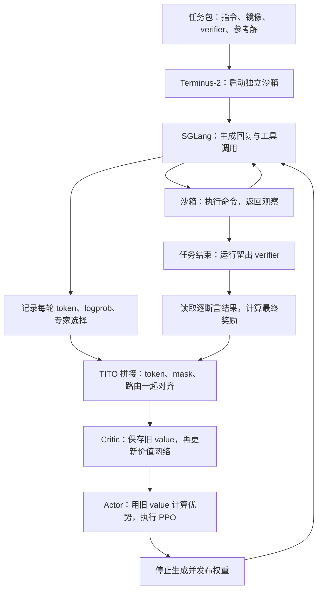
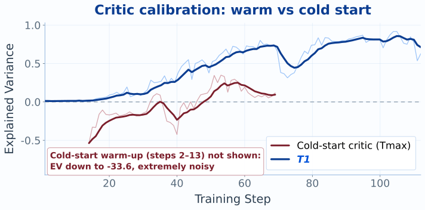
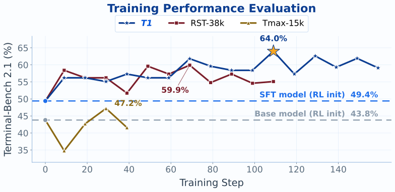

# T1 论文分析：长程终端 Agent 的 PPO 训练 Recipe

设想一个终端 Agent 花了半小时定位问题、修改代码、安装依赖，最终通过 10 项测试中的 7 项。如果训练只看任务是否完全成功，这次执行与一开始就失败的执行都可能得到零分。T1 要解决的核心问题，就是怎样把昂贵的终端执行转成有区分度、能用于策略更新的反馈。

[《T1: Terminal Agent Reinforcement Learning for Long-Horizon Tasks》](https://arxiv.org/html/2609.11042v1)给出了一套相互依赖的设计：任务和 verifier 提供部分完成分数，PPO 的 critic 将终局结果转成各个前缀上的优势，TITO 与路由重放则让更新对应到实际采样的动作和专家路径。系统还必须让这些长轨迹进入训练 batch，并承担完整 actor–critic 的训练成本。

这套组合把 Terminal-Bench 2.1 的解决率从 RST-SFT 起点的 49.4% 提高到峰值 64.0%。这是完整训练方案的结果；各组件的独立贡献，需要结合后面的实验条件判断。[论文 §6.2](https://arxiv.org/html/2609.11042v1#S6.SS2)

本文解读 Junyao Yang 等人的 **arXiv:2609.11042v1，2026 年 9 月 10 日版本**，并补充 RST、R³ 原始工作和作者公开产物。实验数值来自作者报告，本文没有复现 GPU 训练。正文沿训练循环解释设计与证据，具体实现约束、评测配置对照和 v1 中待核对的细节放在附录。

## 1. 一次终端任务如何进入训练

T1 的基座是 Qwen3.5-122B-A10B：约 122B 总参数，每个 token 激活约 10B。最终 RL 从一个经过拒绝采样式监督微调的 RST-SFT checkpoint 开始，另加载预先训练的 critic。因此，最终成绩包含 SFT 和 RL 两个阶段，不能把从 base 到 T1 的全部提升记在 RL 名下。[论文 §1、§6.1–6.2](https://arxiv.org/html/2609.11042v1#S6.SS1)

T1 用 Harbor 承载 Terminus-2 harness，由后者管理工具执行、交互历史与上下文压缩。每道题在独立的 Daytona 云沙箱中运行，模型通过 SGLang 生成命令，读取命令结果后继续行动。理解这条链路，需要先区分三个单位：**trial** 是一道题的一次完整尝试，**turn** 是其中一轮模型交互，**chunk** 是轨迹无法继续拼接时导出的训练片段。

| 训练环节 | T1 的主配置                     | 在训练循环中的作用                    |
| -------- | ------------------------------- | ------------------------------------- |
| 任务     | 质量筛选后的 T1-15k             | 提供指令、环境、参考解与留出 verifier |
| 采样     | 每题每步一次完整尝试            | 将生成预算用于更多不同任务            |
| 奖励     | 最终通过的断言数除以固定常数 20 | 区分不同程度的部分完成                |
| 更新     | PPO，加一份全尺寸独立 critic    | 用前缀价值提供 baseline               |
| 对齐     | TITO 与 R³ 路由重放             | 保留采样动作及其专家选择              |

来源：[论文 §2](https://arxiv.org/html/2609.11042v1#S2)、[§4](https://arxiv.org/html/2609.11042v1#S4)、[§6.2](https://arxiv.org/html/2609.11042v1#S6.SS2)。训练上下文、batch 和优化器参数见附录 A。

下面是一次任务从执行到更新的概念流程。图中按数据依赖排列；生产运行会让不同 batch 的生成与训练重叠。

图依据论文 §2、§4.5 与 §7 的主要流程整理。TITO、R³、PPO 和 RST 都有前作；T1 的贡献集中在长程终端训练中的集成、数据筛选、奖励设计、对齐约束与运行经验。[R³ 原论文](https://arxiv.org/html/2510.11370v2#S4)、[Miles 的 TITO 说明](https://www.lmsys.org/blog/2026-05-13-no-token-left-behind)、[RST 原论文](https://arxiv.org/html/2608.05466v3#S4)

## 2. 任务与奖励：让不完整执行也能产生信号

### 2.1 先保证任务能完成，也能公平验收

终端训练的一道题需要同时满足几项约束：公开指令要说明任务目标，镜像要能启动，参考解要真的完成任务，verifier 要能判断最终状态。这些部分有一处不一致，失败轨迹就可能来自坏题，而非策略能力不足。

RST 采用递归合成：从已通过验证的任务出发，先给参考解增加真正要执行的工作，再修改环境、测试和公开指令，使它们描述同一条新工作流。候选任务在新沙箱中运行参考解；可修复的错误经过有限修复，无法通过验证的任务被丢弃。通过的任务进入下一轮种子池，选择时约束父任务血缘、类别和改写类型，避免少数家族无限繁殖。[T1 §3.2](https://arxiv.org/html/2609.11042v1#S3.SS2)、[RST §4](https://arxiv.org/html/2608.05466v3#S4)

例如，假设原任务只是修复一个解析器。一次有意义的扩展可以要求先在历史提交中找到引入回归的位置，再修复代码、构建指定版本，并检查新旧行为。任务变长来自新增的执行依赖；只给 prompt 加背景描述，并不会产生同样的训练需求。这个例子用于说明合成原则，不是论文中的具体样本。

T1 的审计进一步检查指令与 verifier 是否一致、测试是否公平且覆盖目标、参考解是否正确合理，以及任务是否有训练价值。指令与 verifier 对齐这一项权重最高，为 20%。隐藏要求、测试泄漏、解法投机和过弱的 verifier 都会触发硬拒绝。[论文 §3.2、图 4](https://arxiv.org/html/2609.11042v1#S3.SS2)

隐藏要求尤其值得区分：隐藏测试用例可以合理地检验公开要求；隐藏的验收标准则让 Agent 因为从未被告知的条件而受罚。反过来，一个测试只检查目标文件是否存在，即便稳定执行，也可能几乎不检验文件内容是否正确。可执行性与训练信号质量是两道不同的检查。

### 2.2 三个任务池对应三次训练尝试

| 数据池   | 实际任务数 | 可用验证信号                           | 在论文中的用途                                              |
| -------- | ---------: | -------------------------------------- | ----------------------------------------------------------- |
| TMax-15k |     14,601 | 只有终局二值结果                       | 早期 binary-reward campaign，以及后续使用的 critic 权重来源 |
| RST-38k  |     37,484 | 合成任务带逐断言检查                   | 未经 T1 质量筛选的 dense-reward campaign                    |
| T1-15k   |     15,000 | 筛选后的逐断言检查；抽样预检覆盖率 93% | 最终生产训练                                                |

来源：[论文 §3.1、§6.2](https://arxiv.org/html/2609.11042v1#S3.SS1)。名称里的 15k、38k 是近似规模；93% 是预检抽样中能取得逐断言记录的比例，不能据此认定所有训练样本都采用同一种奖励路径。

作者声明训练任务与三个评测集隔离，种子及合成任务不来自 Terminal-Bench 2.1。这一隔离为后面的跨任务评测提供了基础。更强的“完全分布外”表述仍需克制：训练与评测共享终端工程领域和 harness，任务不重叠并不意味着技能、环境结构或所有上游训练数据都不重叠。[论文 §1、§3.1](https://arxiv.org/html/2609.11042v1#S3.SS1)

### 2.3 按通过的断言数计分，保留跨任务差异

设最终 verifier 中通过的断言数为 $P$，固定缩放常数为 $S$。主配置使用：

$$
R=\frac{P}{S},\qquad S=20.
$$

这里的分母不是这道题的测试总数。多通过一个断言，奖励就增加 $0.05$。$S=20$ 根据 T1-15k 的断言数分布选定，接近其第 90 百分位；论文报告中位数为 4，最大值约为 35。训练全过程保持这个尺度，算法明确允许 $R>1$。[论文 §5.2、式 20、算法 2](https://arxiv.org/html/2609.11042v1#S5.SS2)

用论文中的比较，再加两个按公式计算的例子，可以看到不同奖励的偏好：

| 最终通过数 / 总数 | 完整成功奖励 | 通过比例 | T1 的断言计数奖励 |
| ----------------- | -----------: | -------: | ----------------: |
| 2 / 4             |            0 |     0.50 |              0.10 |
| 10 / 20           |            0 |     0.50 |              0.50 |
| 4 / 4             |            1 |     1.00 |              0.20 |
| 25 / 30           |            0 |     0.83 |              1.25 |

这套设计给“做完更多可验证工作”更高的分数，哪怕任务尚未全部完成。其成立条件来自任务构造：较难的题配有更多检查，而且每项检查大致代表可比较的工作增量。作者将其称为近似设计原则，没有证明断言数量与工作量严格成正比。

因此，移植 recipe 时不能只复制 `passed_tests / 20`。如果一题用十个重复断言检查同一个文件，另一题用一个断言检查整条构建流程，奖励会隐含地偏向前者。奖励定义把一部分任务权重交给了 verifier 的作者，检查粒度本身就成为训练设计。

固定 $S$ 的另一个作用是让 critic 的回归尺度稳定。若用当前 batch 的最大通过数作分母，同一条轨迹会因为同批其他任务变化而得到不同分数；固定常数消除了这种批间尺度漂移。它保留了跨任务工作量差异，也保留了这些差异可能不准确的风险。

### 2.4 分数更细，但奖励仍在任务结束时给出

论文将它称为 dense reward，指评分能区分部分完成程度。T1 在一次 trial 结束后执行 verifier，读取最终逐断言报告，再生成一个标量奖励。这个奖励放在每个 trajectory chunk 的最后一个 response token 上，其他位置不额外加入每轮奖励或 potential-based shaping。[论文 §2.2、§5.3](https://arxiv.org/html/2609.11042v1#S5.SS3)

所以，Agent 在第 8 轮修好一个函数，并不会立即从留出 verifier 收到一次单独的加分。它在第 20 轮又把这个函数改坏，最终相关断言就可能失败。这里奖励的是结束时还成立的要求，时间上的信用分配交给价值函数。

轨迹因为上下文或拼接问题被拆成多个 chunk 时，算法 2 把同一个 trial 奖励广播给每个 chunk。这个机制没有为每个片段建立独立的“完成了多少子目标”标签。它保留任务级监督，但片段间怎样归约损失、截断末端怎样处理，仍是实现时需要确认的细节，不能从广播奖励直接推导出严格的分段信用分配。

若报告缺失或无法解析，则回退到二值终局结果 $b\in\{0,1\}$。由此还产生一个需要监控的尺度差异：按公式，一个正常上报且通过 4/4 项的任务得 0.2；若报告解析失败而终局成功，回退分数为 1。论文记录解析失败原因，但没有充分量化这种混合奖励路径的影响。这里指出的是公式的后果，并非观察到模型利用了解析错误。[论文 §5.2、算法 2](https://arxiv.org/html/2609.11042v1#S5.SS2)

任务审计之外还存在运行时边界：论文 §10 明确说，verifier 在 Agent 可控制的沙箱中执行，没有运行时防篡改检测。当前防线主要来自任务筛选。测试数更多只提高评分分辨率，不自动提高测试可信度。[论文 §10](https://arxiv.org/html/2609.11042v1#S10)

## 3. PPO 与 critic：把终局分数转成策略更新

### 3.1 每题只采样一次，把 baseline 交给 critic

GRPO 用同题多次尝试的奖励构造 baseline。用常见形式表示，组内第 $i$ 条轨迹的优势为：

$$
A_i=\frac{R_i-\bar R}{\operatorname{std}(R)+\epsilon}.
$$

如果全组奖励相同，减去均值后就没有差异信号。这里的准确条件是“奖励相同”：在 T1 的部分完成奖励下，多次尝试即使都未完全成功，只要通过的断言数不同，GRPO 仍有信号。“全失败就没有梯度”只对这些失败同分的情况成立。

长任务又使重复采样变贵。假设有 512 次完整尝试的预算，每题采样 8 次就只能覆盖 64 道不同任务；每题采样一次可以覆盖 512 道。这个例子只是预算计算，不是论文披露的 GRPO 分组配置。同题分组还要等待组内慢轨迹，终端任务的编译、下载和反复诊断会放大等待时间。[论文 §9.4](https://arxiv.org/html/2609.11042v1#S9.SS4)

T1 选择用独立 critic 预测当前前缀最终能得到多少分，代替昂贵的同题重复执行。它把资源从生成侧搬了一部分到训练侧：省下重复沙箱尝试，增加价值网络的显存、前反向和调参成本。长程环境越贵，这个交换越可能有意义。

作者确实在相同 harness、奖励和设备预算下试过 GRPO：已评估的 step 10、20 都是 51.7%，训练奖励未呈现持续上升。但只报告两个早期评测点，也没有完整展现各算法的超参数搜索和长期成本对齐，因此它支持当前配置选择 PPO，尚不足以推出长程 Agent 普遍应放弃 GRPO。[论文 §9.4、图 16](https://arxiv.org/html/2609.11042v1#S9.SS4)

critic 是同架构的另一份 122B 模型，将最后 pipeline stage 的语言模型输出头换成标量 value head。它与 actor 通过 offload 分时复用训练设备。多加一个 critic 没有新增独立设备池，但增加了网络切换和回归训练成本。

### 3.2 优势来自结果与前缀预期之差

T1 用广义优势估计（GAE）计算更新信号。记第 $j$ 个决策位置的状态为 $s_j$，奖励为 $r_j$，旧 critic 为 $V_{\mathrm{old}}$；$\gamma$ 是回报折扣因子，$\lambda$ 控制后续时序差分误差的衰减。主配置将二者都设为 1：

$$
\delta_j=r_j+\gamma V_{\mathrm{old}}(s_{j+1})-V_{\mathrm{old}}(s_j),
\qquad
\hat A_j=\sum_{n\ge0}(\gamma\lambda)^n\delta_{j+n},
\qquad \gamma=\lambda=1.
$$

对一段完整终止、末端 value 取零、只有最后一个决策位置拿到 $R$ 的序列，求和中的中间 value 会相消，得到：

$$
\hat A_j=R-V_{\mathrm{old}}(s_j).
$$

这是依据论文式 16 的条件化推导。真实的 token mask、chunk 边界与非终止截断需要实现单独处理；不能把这条简式无条件套给所有导出片段。

假设最终奖励为 0.5，旧 critic 在较早前缀预测 0.1，在较晚前缀预测 0.45，则对应优势为 0.4 与 0.05。不同位置可以拿到不同优势，因为它们的可预期回报不同。但这仍不是对某条命令的独立因果评价：高方差的终局结果能否产生可靠更新，取决于 critic 是否学会区分状态。

T1 不使用组内 baseline，主配置也不做额外的奖励或优势归一化，保留固定的数值尺度。这是作者的配置取舍；统一 batch 标准化仍会保留样本差值的相对比例，不能笼统说所有归一化都会消除跨任务差异。其策略目标仍是 PPO 的 clipped surrogate，actor 与 value clipping 阈值都为 0.2。[论文 §4.5、§5.3](https://arxiv.org/html/2609.11042v1#S4.SS5)

对应到一次更新，论文正文 §4.5、外层训练算法和附录 §12.4 描述的顺序是：先缓存更新前的 $V_{\mathrm{old}}$，训练 critic，再让 actor 使用这份旧 value 构造优势。value clipping 也围绕同一份旧值展开。不能因为 critic 先更新，就把正在变化的新 value 混进本步的 GAE 和 clipping 基准。[论文 §4.5、附录 §12.4](https://arxiv.org/html/2609.11042v1#S12.SS4)

### 3.3 Critic 先要学会预测，才能提供有用的 baseline

最终 dense-reward campaign 从 RST-SFT 初始化 actor，从 TMax-15k 上一个 epoch 的前置训练取得 critic 权重，只加载模型权重，不迁移优化器动量；随后还有 2 个 rollout 的重新校准。这个路径比“把 actor 复制一份当 critic”更接近实际 recipe。

主配置的 actor 学习率为 $1.0\times10^{-6}$，critic 为 $1.5\times10^{-5}$，实际相差 15 倍。预热和较高的 critic 学习率都服务于价值预测：让 baseline 尽早跟上回报分布，降低优势估计的方差。完整超参数见附录 A；预热流程和学习率倍率在 v1 中的表述差异见附录 C。[论文 §4.5、附录表 3](https://arxiv.org/html/2609.11042v1#S11)

论文用 explained variance（EV）观察 critic。记 $\hat R$ 为回报目标、$V$ 为对应位置的价值预测：

$$
\mathrm{EV}=1-
\frac{\operatorname{Var}(\hat R-V)}
{\operatorname{Var}(\hat R)}.
$$

当回报方差非零时，EV 越高，表示减去 value 后剩余的方差越少；EV 为负，则说明当前 baseline 反而增加了残差方差。EV 没有有限下界，也不衡量恒定预测偏移，所以最好与 value loss、预测均值和回报尺度一起看。[论文 §4.5、式 19](https://arxiv.org/html/2609.11042v1#S4.SS5)

原图：Junyao Yang 等，T1 v1 [图 7](https://arxiv.org/html/2609.11042v1#S4.F7)，[SVG 原文件](https://arxiv.org/html/2609.11042v1/critic_ev_warmstart.svg)，CC BY 4.0，未修改。

冷启动 critic 的 EV 最低达到 −33.6，58 个记录步中有 30 步为负；图中省略了部分极端负值阶段。warm-start 曲线没有落到负值，但它从接近零逐渐上升，中途还有回落，后期才主要处于较高区间。因此，论文正文“从第一步就稳定在 0.71–0.86”的概括强于图像实际支持的结论。

这组对比还同时改变了数据池和奖励，不能直接看成只开关 warm-up 的实验。更有启发性的是 27B 探索实验：提高 critic 学习率能让 EV 更早转正，rollout reward 却仍然平坦。critic 学会预测低分，并不会自动产生奖励没有区分出来的有用进展。[论文 §9.1](https://arxiv.org/html/2609.11042v1#S9.SS1)

## 4. TITO 与 R³：让 PPO 更新对应实际采样的轨迹

有了奖励和优势，还需要确认 PPO 比较的是同一个动作在新旧策略下的概率。终端 Agent 的历史经过 harness 重建，MoE 的专家又由离散路由选择；这两处变化都可能让训练器计算出另一条路径上的概率。

用 $b$ 表示生成这批数据的行为版本，$\theta$ 表示正在优化的参数；$j$ 是参与策略损失的 token 位置，$a_j$ 是该位置实际采样的 token，$h_j$ 是生成它时的条件历史，$I_b$ 是生成时记录的专家集合。按论文附录 §12.2，T1 的 PPO ratio 为：

$$
w_j(\theta)=
\frac{\pi^{\mathrm{train}}_{\theta}(a_j\mid h_j,I_b)}
{\pi^{\mathrm{train}}_b(a_j\mid h_j,I_b)}.
$$

分母由训练侧在旧参数和记录路由上重算；采样侧 logprob 主要用于诊断，不直接作为该比率的分母。两次训练前向共用执行栈，能降低相对比率中的系统差异，但原始样本仍来自 rollout 分布，所以这种选择没有自动消除残余的采样偏差。

### 4.1 TITO 保留动作 token，并修复多轮拼接

拼接问题需要改用整轮序列来描述。令第 $i$ 轮实际输入序列为 $p_i$、完整采样输出序列为 $a_i$。严格 TITO 要求：

$$
p_i\Vert a_i\preceq p_{i+1},
$$

其中 $\Vert$ 表示拼接，$\preceq$ 表示逐 token 相同的前缀关系。这个要求使多个 turn 可以合成一条序列，同时保留各个动作当时的条件历史。

真实 harness 往往只保存解析后的消息。工具调用 JSON 被重新序列化，空格可能变化；chat template 可能清除旧 reasoning；非标准 token 切分经过 decode 再 encode，也可能变成另一组 token。此时重建出的可读文本即使等价，训练器计算的也可能是另一个动作或另一个条件分布。[论文 §4.1–4.2](https://arxiv.org/html/2609.11042v1#S4.SS2)

T1 保存 sampler 返回的真实 token ID 和对应 logprob，再把观察与模板连接内容作为 mask 为零的上下文插入。这里 mask 为零表示不直接计算这些位置的策略损失；它们仍通过条件历史影响后续预测。

拼接时，T1 依次尝试精确前缀匹配、有限边界裁剪、文本相等的重分词修复；都失败时就另开 chunk。重分词修复仍保留原始采样输出作为训练动作，四种路径的具体检查见附录 A。[论文 §4.2、式 6–10](https://arxiv.org/html/2609.11042v1#S4.SS2)

论文在 1,402 个样本的审计中报告 **loss 区域 token 漂移率为 0%**；它保证参与动作损失的标识符来自真实采样。§10 同时承认，在 retokenized 情况下，训练用原始采样 token 作为后续历史，而 rollout 下一轮看过的是 harness 重分词后的历史，审计运行中有 2.6% 的 token 涉及这种情况。[论文 §4.2、§10](https://arxiv.org/html/2609.11042v1#S10)

这说明动作 token 保真与条件前缀保真仍是两层保证。T1 保留了原始采样动作；要让后续历史也完全一致，还需要 harness 直接把 token 历史作为事实来源。更一般的轨迹管理问题可结合 [[foundations/RL/系统/轨迹管理/什么是TITO|TITO 问题及解决方案]] 和 [[foundations/RL/recipe分析/slime-coding-agent-rl|Slime Coding-Agent RL Recipe 分析]] 阅读。

### 4.2 R³ 固定专家集合，gate 继续训练

T1 的 MoE 在 48 层中逐层从 256 个专家选择 8 个。推理和训练使用不同算子、归约顺序与 batch 布局，微小数值差异可能交换第 8 与第 9 名专家。Top-k 的离散性把数值扰动变成了计算路径变化。

R³ 在 rollout 中记录每层选中的集合 $I^{r}_{j,\ell}$。训练时保留这个集合，但用当前 router 分数 $s_{j,\ell,e}(\theta)$ 重新计算选中专家的 gate：

$$
g_{j,\ell,e}(\theta)=
\frac{\exp s_{j,\ell,e}(\theta)}
{\sum_{e'\in I^{r}_{j,\ell}}\exp s_{j,\ell,e'}(\theta)},
\qquad e\in I^{r}_{j,\ell}.
$$

该层输出是这些专家输出按 $g$ 加权求和。专家集合取自记录，连续 gate 仍来自当前参数，因此 router 并没有整体冻结。它避免在这次训练前向里重新做一遍可能不同的离散选择。[论文 §4.3、式 12](https://arxiv.org/html/2609.11042v1#S4.SS3)

路由记录还必须与 token、loss mask 和 logprob 共用拼接、padding 与分片偏移；记录正确但位置错开，同样会把梯度送往错误路径。T1 的预测位置对应关系、缓存开销和重计算约束见附录 A。

旧策略与当前策略的概率计算都使用生成版本捕获的专家集合。critic 和 frozen reference 则自由路由，因为它们不负责复现行为策略的采样路径。T1 因此关闭了两个 KL 项及 MoE load-balancing loss；论文解释，前者可能惩罚 reference 与 replay 路径的差异，后者会推动专家重新分配，与当前回放约束发生冲突。这是该配置的取舍，并非所有 MoE RL 都必须关闭这些项。[论文 §4.4–4.5、附录 §12.4](https://arxiv.org/html/2609.11042v1#S4.SS4)

### 4.3 实测改善的是哪一种概率差异

诊断的 logprob 差可以拆成：

$$
\begin{aligned}
\Delta_j
&=\log\pi^{\mathrm{train}}_{\theta}(a_j)-\log\pi^{\mathrm{rollout}}_b(a_j)\\
&=\underbrace{\log\pi^{\mathrm{train}}_{\theta}(a_j)-\log\pi^{\mathrm{train}}_b(a_j)}_{\text{参数更新造成的变化}}
+\underbrace{\log\pi^{\mathrm{train}}_b(a_j)-\log\pi^{\mathrm{rollout}}_b(a_j)}_{\text{同版本执行路径差异}}.
\end{aligned}
$$

公式省略了条件历史与路由；TITO 与 R³ 主要减少第二项中的 token、路由差异，kernel 数值差仍然存在。论文报告 loss-mask 加权的平均 $|\Delta_j|$ 从 0.021 降到 0.013，按这两个数计算约下降 38.1%。这是两种机制一起开关的比较，既不是纯同权重 engine gap，也不是 TITO 和 R³ 各自的独立收益。[论文 §4.4、图 6、附录 §12.2](https://arxiv.org/html/2609.11042v1#S12.SS2)

此外，策略变化增大不必然代表策略进步，平均 gap 下降也不能描述尾部最大误差。更充分的诊断应将同版本误差、版本年龄和极端 token 分开记录。R³ 的一般机制可继续阅读 [[foundations/RL/系统/训练稳定性/精度/训推一致性/R3：用Rollout Routing Replay解决MoE Agentic RL的训推不一致|R³ 技术详解]]。

## 5. 系统执行：哪些轨迹能进入 batch，要花多少成本

### 5.1 最先完成的 512 条，会改变训练分布

T1-15k 按质量排名顺序存储。若顺序读取，同一 batch 会集中在很窄的质量区间，critic 看到的目标分布也会沿 epoch 变化。作者因此采用带种子的逐 epoch permutation，将不同质量和难度的任务打散。这项处理稳定的是启动任务的混合分布，完成时间筛选还会改变最终进入训练的数据。[论文 §5.4](https://arxiv.org/html/2609.11042v1#S5.SS4)

主调度配置启动 560 次 trial，收到最先完成的 512 次便取消剩余任务。环境创建还使用每秒 6 个请求的令牌桶，控制并发和供应商配额；remote、Agent、verifier 分别有 5,400、3,600、900 秒的分层期限。[论文 §7.4](https://arxiv.org/html/2609.11042v1#S7.SS4)

这种 oversampling 可以缩短长尾等待，却把完成速度变成了隐含的筛选条件。以任务 $x$ 和轨迹 $\tau$ 表示，实际优化器见到的分布可以概念化为：

$$
p_{\mathrm{used}}(x,\tau)
\propto p_{\mathrm{launch}}(x)\,
p_{\pi}(\tau\mid x)\,
\Pr(\mathrm{retained}\mid x,\tau,\mathrm{batch}).
$$

这是本文对调度影响的表达，不是论文提出的新采样公式。即使任务启动时充分打乱，保留概率仍依赖任务耗时与策略行为。论文记录过一个提交 561 次、取消 48 次的运行步，并指出长任务会受到更大影响。[论文 §9.3](https://arxiv.org/html/2609.11042v1#S9.SS3)

奖励与调度因而存在张力：断言计数希望保留困难任务的部分进展，调度器却可能在这些任务完成验证前取消它们。缺席的数据没有机会产生部分奖励。未来若采用 partial rollout continuation，需要同时处理恢复后的环境、历史与权重版本，不能只把未完成任务放回队列。

### 5.2 异步运行需要管理发布屏障与策略版本

训练与生成放在不同设备池，理想的流水周期近似为：

$$
T_{\mathrm{step}}\approx\max(T_{\mathrm{rollout}},T_{\mathrm{train}}).
$$

前提是二者能充分重叠，且权重发布、队列等待与恢复开销较小。论文报告过一个固定总硬件的早期配置：推理副本从 1 个变成 3 个，生成耗时从 58.9 分钟降至 19.6 分钟，总步时从约 60 分钟降至约 23 分钟。它说明重新分配训推资源可以减少瓶颈等待。[论文 §7.5、式 22](https://arxiv.org/html/2609.11042v1#S7.SS5)

生产配置另报生成约 16 分钟、训练约 41 分钟、总步时约 57 分钟。这与“完全重叠后取最大值”不能直接对应，文中没有完整拆清重叠和同步时间。因此可以借鉴配平原则，但不宜把理想公式当作生产耗时的已验证解释。

作者将生产循环描述为一步异步，fully asynchronous 路径没有用于这批 122B 实验。每步发布权重前停止生成，以避免单个请求跨版本。多轮 trial 包含多个请求，若要严格确认整条轨迹只使用同一版本，还需查验 trial 级 pinning、排空或取消规则；v1 没有把这部分协议展开到足够明确。[论文 §7.5、§10、附录 §12.1](https://arxiv.org/html/2609.11042v1#S12.SS1)

长步时也改变恢复策略。T1 对控制面使用有界超时，给首次编译更长的宽限期，在发布屏障回收失去响应的推理副本，并每十步保存一次仅含权重的 checkpoint。这样的存档可以重新启动训练，但不等同包含优化器状态的精确续训点。[论文 §7.3](https://arxiv.org/html/2609.11042v1#S7.SS3)

### 5.3 完整 critic 与长上下文都有训练成本

MoE 的稀疏激活节约计算，但完整专家参数及优化器状态仍需保存。T1 中 actor 与 critic 各自必须适配约 95 GiB 的单卡预算。作者在 critic 单独训练正常、第一次 actor–critic 联合循环却 OOM 后，将专家参数、非专家参数、梯度、优化器、激活与输出 logits 分开建模。[论文 §7.1](https://arxiv.org/html/2609.11042v1#S7.SS1)

主运行的训练上下文上限为 84k token。为容纳长序列，作者提高 context parallelism（CP），并为 Qwen3.5 的 recurrent operator 处理跨片段状态传递。这里同时受完整参数与优化器状态、长序列激活、logits 缓冲和 CP 布局约束；仅用“每 token 激活 10B”估算训练资源会漏掉大部分常驻状态。显存公式和 recurrent CP 的正确性结果见附录 A。

设备总数固定时，更多 CP 会挤占数据并行（DP）。例如 batch 512、DP 2、micro-batch 为 1 时，每个副本需要串行累积 256 个 micro-batch。容量、并发和步耗时必须一起考虑；“更高并行度”本身并不保证更快。

### 5.4 上下文压缩失败，会让模型反复做旧工作

论文还记录了一次上下文压缩故障：摘要请求长度与上下文预算不匹配，导致 98.3% 的完整摘要尝试失败；fallback 只保留很短的历史，Agent 反复做已经完成的工作，平均轮数从 22 增到 30。模型实际决策时已经丢失了关键记忆，事后把采样 token 完整送进训练器也补不回来。[论文 §9.2](https://arxiv.org/html/2609.11042v1#S9.SS2)

当工具轮数异常上升时，要检查它发生在哪类状态：是否在解决更多要求，是否在绕着同一个错误重复执行，还是摘要把旧结论丢掉了。直接施加长度惩罚，可能会惩罚有用的尝试，也可能只是掩盖上下文管理故障。T1 的 122B 主配置没有开启长度 shaping。

## 6. 实验证据：收益出现在哪里，边界又在哪里

### 6.1 先看同一模型的训练链路

| 模型或训练 campaign     | Terminal-Bench 2.1 解决率（%） | LHTB 平均奖励（论文报告尺度） | Terminal-Bench Hard 解决率（%） |
| ----------------------- | -----------------------------: | ----------------------------: | ------------------------------: |
| Qwen3.5-122B-A10B base  |                           43.8 |                          18.9 |                            20.0 |
| RST-SFT                 |                           49.4 |                          23.6 |                            28.3 |
| Base + TMax-15k 二值 RL |                           47.2 |                          20.3 |                            未列 |
| RST-SFT + RST-38k RL    |                           59.9 |                          25.4 |                            未列 |
| T1                      |                           64.0 |                          27.9 |                            38.0 |

来源：[论文表 1、图 10–11、§6.2](https://arxiv.org/html/2609.11042v1#S6.SS2)。三个基准分别含 89、46、100 道任务。LHTB 支持连续部分分，27.9 是平均奖励，不能解释成完整解决 27.9% 的任务。Terminal-Bench Hard 也不是 Terminal-Bench 2.1 内部的 Hard 难度分组。

从 RST-SFT 到 T1，TB2.1 增加 14.6 个百分点，LHTB 增加 4.3 个平均奖励点，TBH 增加 9.7 个百分点。对应相对增幅约为 29.6%、18.2%、34.3%，均以 SFT 分数为分母计算。最终成绩包含 SFT 起点与后续 RL 的共同贡献。

三个 campaign 也回答了不同问题。二值 RL 从 base 开始，早期提高到 47.2，但没有超过 SFT 的 49.4；未筛选合成池上的 dense RL 已能达到 59.9；最终组合达到 64.0。由于数据、初始化、critic 和 routing replay 并未全部保持一致，论文自己在 §10 承认，这些结果没有隔离 dense reward 的独立贡献。同样，15k 优于 38k 也不能全部归结为数据清洗。

### 6.2 64.0 是峰值，后续评测仍有波动

原图：Junyao Yang 等，T1 v1 [图 12](https://arxiv.org/html/2609.11042v1#S6.F12)，[SVG 原文件](https://arxiv.org/html/2609.11042v1/eval_dynamics_RL15k_38k_mix_four.svg)，CC BY 4.0，未修改。

T1 第一个评测点在 step 10 达到 56.2，step 70 达到 61.8，step 110 取得峰值 64.0。原图还画出了 step 110 之后的点，直到约 step 160，分数在约 57–63 之间波动。因此，应把 64.0 理解为被选中的最好 checkpoint 成绩，不能写成训练在第 110 步结束或之后稳定维持 64.0。

训练奖励则在前约 50 步从 0.25 上升到约 0.345，此后主要在 0.34–0.36 波动。训练奖励进入平台后，评测仍能提高，这与泛化能力或断言通过模式变化相容，但仅凭两条曲线不能确定其因果原因。不同数据池的原始奖励均值也不能直接当作能力差距。[论文 §5.2、图 8、§6.3](https://arxiv.org/html/2609.11042v1#S6.SS3)

每十步查看同一 held-out benchmark 并据此选择峰值，使它同时承担了模型选择功能。任务未进入训练池仍然很有意义，但最终最好分数还需要独立测试、固定 checkpoint 重复评估和方差报告来衡量稳定性。

### 6.3 交互变长，收益主要落在 Medium 任务

主训练中平均工具轮数由约 10.4 增长到约 21，总序列长度由约 11.5k 增长到约 18k token。前者接近翻倍，后者约增加 55%；图 13 caption 中“两者都近似翻倍”的说法并不精确。两条曲线后期趋平，说明这次运行没有观察到持续失控的长度增长，尚不能证明每个新增动作都有用。[论文 §6.3、图 13](https://arxiv.org/html/2609.11042v1#S6.F13)

论文 §6.4 进一步按难度分析任务表现。这组案例统计的配置与主评测尚未完全对应，但可以比较其中三个 checkpoint 的增益分布：

| 难度分组 | Base 解决率（%） | RST-SFT 解决率（%） | T1 解决率（%） |
| -------- | ---------------: | ------------------: | -------------: |
| Easy     |              100 |                 100 |            100 |
| Medium   |            约 56 |               约 58 |          约 78 |
| Hard     |            约 20 |               约 30 |          约 33 |

RL 相对 SFT 的改善在 Medium 最大，最难组只提高约 3 个百分点。[论文 §6.4、图 15](https://arxiv.org/html/2609.11042v1#S6.SS4)

同一节报告 T1 平均使用 94.4 turns，SFT 为 31.5，base 为 41.1。这个平均值显然不能放进最多 60 turns 的主评测口径中解释；它属于另一组案例统计，表明作者观察到了更长尝试及其成本。六个代表性失败中，T1 花费 164–473 turns 并超时，对比模型用 6–40 turns；但两边的输入输出预算与 reasoning 设置也不同，无法只归因于模型参数中的能力差异。

论文附录的 `build-pov-ray` 案例中，旧下载地址无法取得目标版本。SFT 在最终报告里已经能指出问题，却继续重试失效路径；T1 改用可用镜像，65 turns 后通过三项断言。这个案例提示，知道应该换方法与在执行中及时换方法之间，存在可训练的行为差距。[论文附录 §13、图 17](https://arxiv.org/html/2609.11042v1#S13)

不过，两边 harness 限制不同：SFT 为 56k 输入、8,192 输出、100 turns，T1 为 86k 输入、32,768 输出、500 turns。即使 T1 的实际轮数低于 SFT 的上限，也没有消除上下文预算和执行策略之间的混杂，不能据此把案例当作纯粹的行为因果实验。

按任务类别解释收益时，还需要同时看训练分布和评测样本量。T1-15k 中，脚本与自动化、软件开发、系统管理、环境与包配置、版本控制五类合计占 67.9%。数据科学占 3.7%，调试占 1.3%，性能工作占 1.0%。这些比例能描述训练侧偏好，但单靠分类占比还无法解释某个能力增益的因果来源。[论文 §3.1、图 3](https://arxiv.org/html/2609.11042v1#S3.SS1)

小类别的高分也要按样本数阅读。调试的 100% 来自 5 题，系统管理的 88.9% 来自 9 题。训练集中调试比例很低，却在这一小子集上表现很好，恰好说明“某类数据少，所以该类能力一定弱”并不是数据能支持的规律。

### 6.4 横向排名要连同 harness 和执行预算一起读

论文表 1 的同 harness 区域中，T1 为 64.0，Claude Opus 4.6 为 63.8，Claude Opus 4.7 为 66.1，GPT-5.4 为 54.8，DeepSeek V4 Flash 为 56.9。它说明 T1 在作者报告的终端评测条件下进入了较强的一档，但与 Opus 4.6 的 0.2 点差距没有置信区间支持，不能解释成确定的整体能力超越。

表 1 下半区另外列出其他 harness 的公开结果。例如 Opus 4.6 在 Claude Code 下为 70.1，在 Terminus-2 下为 63.8。harness 改变了执行循环、工具与上下文管理，不能把上下半区简单混排；T1 又专门在 Terminus-2 上接受训练，这本身就是比较条件。[论文表 1 及说明](https://arxiv.org/html/2609.11042v1#S6.SS2)

LHTB 的排序也不同。T1 为 27.9，而表 1 中 Claude Sonnet 4.6 为 37.3；图 10 还列出 GLM-5.2 的 31.6 和 DeepSeek V4 Pro 的 30.7。由此可见，一般终端解决率提高，并不自动建立在所有长程任务上的领先地位。

活跃参数只有约 10B，确实是解释模型计算特征的重要信息；不过论文没有给出所有比较模型同硬件、同延迟、同 token 与工具预算的成本测量。不能只用参数量推出实际成本低一个数量级。

论文 §6.1 声称主评测统一使用最多 60 turns、96k context、temperature 0.1，每题尝试 3 次；但公开轨迹卡列出的轮数、温度、超时和重复次数并不一致。前面的案例统计还出现了超过 60 的平均轮数，因此这些数字应分别保留各自口径。正文与公开轨迹的完整对照见附录 B。

这些公开轨迹可能对应不同评测运行；目前缺少足够的分数—checkpoint—配置映射，无法把它们与主表每一行准确对应。它们并不直接证明主表分数错误，却说明“相同 harness”还不足以证明所有比较严格匹配推理预算。每题尝试次数也不能直接改写成 pass@3，后者与多次尝试取平均是不同指标。

## 7. 可迁移的训练思路与复现边界

T1 最有用的经验，是把“没有学到东西”分成几种可以分别排查的情况。verifier 只给相同零分时，先检查任务难度与部分完成的可观测性；critic 的 EV 很差时，检查初始化、目标尺度和回归训练；概率差异常时，检查 token、条件历史、专家与版本；困难任务根本进不了 batch 时，继续改 loss 也没有数据可以利用。

若要借鉴 T1，我会先把任务做成能启动、能完成、能公平验收的训练包，再设计部分完成分数；让 token 与 MoE 路由记录沿同一条数据管线流动；用不同任务的执行结果训练经过校准的 critic，并检查长任务是否被调度器丢弃。奖励、harness、采样调度和优化器共同定义了模型实际学习的问题。具体的 $S=20$、15 倍学习率、560 取 512、84k 上下文，则需要在新数据分布与设备条件下重新验证。

T1 已在[官方模型仓库](https://huggingface.co/TberiusJunyao/T1-122B-A10B/tree/main)提供实际权重、tokenizer 和 chat template，并在 [HF collection](https://huggingface.co/collections/TberiusJunyao/t1)提供三个评测轨迹集。可以逐任务检查执行行为，而不必只看汇总分数。轨迹集使用名为 `train` 的数据 split，并不改变其作为评测轨迹的内容性质。

但截至查阅日，在项目页、collection 和作者 HF 主页这些官方入口，尚未找到 T1-15k 训练池、RST-SFT 初始化权重、critic checkpoint 或 T1 专用训练插件的完整入口。公开轨迹卡还说明删除了 Harbor 的原始 `result.json`、`config.json`、`lock.json` 等文件，保留抽取后的配置摘要。权重可用与完整训练可复现之间仍有距离。

现有实验支持整套 recipe 在 SFT 起点上改善终端任务表现，但还没有隔离断言计数奖励、任务筛选和 critic 预热各自的收益。更难任务的效率、长尾轨迹的保留率，以及严格匹配预算后的模型排序，仍值得继续验证。附录 C 集中列出能回答这些问题的实验和实现核查项。

## 附录 A：训练配置与实现细节

### A.1 训练参数、统计与软件配置

| 训练设置                 | 论文明确给出的数值                           |
| ------------------------ | -------------------------------------------- |
| Actor learning rate      | $1.0\times10^{-6}$                           |
| Critic learning rate     | $1.5\times10^{-5}$                           |
| 二者实际倍率             | 15 倍                                        |
| Actor / value clip       | 0.2 / 0.2                                    |
| GAE                      | $\gamma=\lambda=1$                           |
| Adam                     | $\beta=(0.9,0.98)$，weight decay 0.1         |
| 学习率调度               | 常数                                         |
| KL 与 MoE load balancing | 均关闭                                       |
| 训练上下文上限           | 84k token                                    |
| 有效 batch               | 512，启动 560 次 trial 后接纳先完成的 512 次 |

来源：[论文 §4.4–4.5 与附录表 3](https://arxiv.org/html/2609.11042v1#S11)、[§7.4](https://arxiv.org/html/2609.11042v1#S7.SS4)。

统计 critic 的 EV 时，应先跨数据并行（DP）与上下文并行（CP）rank 正确汇总方差，不能简单平均各 rank 的 EV。[论文 §4.5、式 19](https://arxiv.org/html/2609.11042v1#S4.SS5)

论文给出的软件基线包括 slime v0.3.0（参考文献标注提交 `bf14dc21`）、Megatron-Core v0.16.0rc0、Transformer Engine v2.10.0、SGLang v0.5.12.post1、Harbor v0.7.0 和 Daytona v0.168.0。它还使用了供应商特定的同步与 KV-cache 补丁；仅安装这些上游版本，未必就能得到论文运行时的行为。[论文 §6.1](https://arxiv.org/html/2609.11042v1#S6.SS1)

### A.2 TITO 的四级拼接规则

| 情况        | 检查与处理                                 | 约束                                               |
| ----------- | ------------------------------------------ | -------------------------------------------------- |
| strict      | 上轮输入加输出已经是下轮 prompt 的精确前缀 | 直接追加新观察和模板后缀                           |
| normalized  | 在有限范围裁去边缘 token 后恢复前缀        | 搜索网格为 $[0,96]\times[0,16]$，选择最小总裁剪量  |
| retokenized | 用 offset 找到历史 span，验证解码文本相等  | 训练仍使用原始采样输出，不把重分词副本当作采样动作 |
| split       | 以上关系都无法成立                         | 同一 trial 下另开 chunk                            |

来源：[论文 §4.2、式 6–10](https://arxiv.org/html/2609.11042v1#S4.SS2)。96 和 16 是这套边界修复的具体范围，不是任意模型都适用的容差。

### A.3 路由记录的空间成本与位置约束

T1 为每个预测位置保存 $48\times8$ 个 32 位整数，约 1,536 bytes，即 1.5 KiB；论文估算 33k token 轨迹约需 48 MiB，报告 rollout 开销低于 3%。无需重新计算路由并不等于没有成本，记录仍要缓存、搬运、拼接和分片。[论文 §4.3、式 13](https://arxiv.org/html/2609.11042v1#S4.SS3)

实现中至少要守住以下关系：

- 一条长度为 $N$ 的序列有 $N-1$ 行预测位置路由记录；第 $j$ 行对应预测下一个 token。
- token、loss mask、logprob、路由记录必须经过同一套拼接偏移与 padding、CP、SP 分片，不能各自处理后再假定位置一致。
- 缺少路由记录时，只有被预测位置的 loss mask 为零才允许邻近记录占位；有效训练位置缺记录必须报错。不能静默剔除后继续训练，掩盖采集故障。
- activation recomputation 会再次执行前向，回放游标必须区分普通前向与反向重计算。

这些约束来自 [§4.3 与附录 §12.3](https://arxiv.org/html/2609.11042v1#S12.SS3)。mask 为零避免直接训练占位位置，但上下文计算仍有影响，不能据此声称这些位置对后续梯度绝对无影响。

### A.4 显存估算与 recurrent CP

正文提到的联合循环 OOM，促使作者分开估算权重、梯度、优化器、激活和输出缓冲。下面两项解释了仅调整专家并行为什么可能无法解决问题。

在论文特定的优化器布局与分片假设下，每设备的专家优化器状态项为：

$$
M_{\mathrm{expert\ optimizer}}=\frac{12P_e}{G},
$$

其中 $P_e$ 为专家参数数目，$G$ 为训练分区设备数。改变专家分片程度会同时改变本地参数量和优化器副本的分片关系，两者抵消，因此这项主要由总设备数决定。降低专家并行可能增加常驻权重与梯度，却没有降低期待中的优化器状态。这一结论依赖论文的放置方案，不能推广到所有 optimizer offload 与分布式实现。

长上下文还放大最后一层的 logits 缓冲。论文使用的估算项是：

$$
M_{\mathrm{logits}}\approx\frac{4|\mathcal V|N}{C},
$$

其中 $|\mathcal V|=248{,}320$、$N$ 是序列 token 数，$C$ 为 context-parallel degree，系数 4 对应该缓冲的每元素字节数。84k token 下，CP 从 2 增到 4 能把这项再减半。这解释了为什么一些看似很小的长序列缓冲，最终会决定整组 actor–critic 能否启动。[论文 §7.1、式 21](https://arxiv.org/html/2609.11042v1#S7.SS1)

Qwen3.5 里的 recurrent operator 需要沿时间传播状态。各 rank 处理连续片段，再把 carried state 传给下一段；而训练框架为平衡负载采用的交错 CP 布局，不能原样作为递推时间顺序。T1 在两种布局之间转换，并在 packed-sequence 描述中保留片段结构。[论文 §7.2](https://arxiv.org/html/2609.11042v1#S7.SS2)

作者用长度 33,792 和 65,536 的序列与单 rank 参考比较，报告前向逐位一致，梯度差异到 $1.2\times10^{-7}$ 的量级。CP 为 2、4、8 时，该递归部分的激活峰值约降至原来的二分之一、四分之一、八分之一。这些是算子正确性和显存结果，不能直接读成训练吞吐提高相同倍数。

## 附录 B：评测协议与验收案例

### B.1 论文配置与公开轨迹配置

论文 §6.1 声称三个基准使用统一配置：最多 60 turns、96k context、temperature 0.1、top-p 0.95、top-k 20、每题 3 次尝试；thinking 关闭、主动压缩开启。其 Agent 与 verifier 期限分别为 3,600 秒和 900 秒，另列 evaluation-total timeout 为 18,000 秒，不能将这个字段与单个 trial 的 Agent 超时混同。

截至 2026 年 9 月 14 日，作者公开轨迹的 dataset card 列出的配置如下：

| 公开轨迹集 | 轮数限制               | 输入 / 单次最大输出 token | Temperature | Agent 超时（每任务） | 公开重复次数    |
| ---------- | ---------------------- | ------------------------- | ----------: | -------------------: | --------------- |
| TB2.1      | 500                    | 86,016 / 32,768           |         0.1 |            18,000 秒 | 2 次，共 178 条 |
| LHTB       | 实际上不受轮数上限约束 | 96,000 / 8,192            |         0.6 |            14,400 秒 | 2 次，共 92 条  |
| TBH        | 实际上不受轮数上限约束 | 96,000 / 8,192            |         0.6 |            14,400 秒 | 1 次，共 100 条 |

来源：[TB2.1 轨迹卡](https://huggingface.co/datasets/TberiusJunyao/T1-Terminal-Bench-2.1-Trajectories#evaluation-config)、[LHTB 轨迹卡](https://huggingface.co/datasets/TberiusJunyao/T1-Long-Horizon-Terminal-Bench-Trajectories#evaluation-config)、[TBH 轨迹卡](https://huggingface.co/datasets/TberiusJunyao/T1-Terminal-Bench-Hard-Trajectories#evaluation-config)。卡片中的输入上限与论文的 context window 也应分别保留原始字段名，不直接认作同一个配置变量。

目前缺少分数、checkpoint 与具体运行配置之间的完整映射。卡片差异可能来自不同评测运行，复核主表时需要作者补齐这一对应关系。

### B.2 验收要求会怎样影响成功案例的解释

论文附录的 `polyglot-c-py` 案例显示，验收标准会直接改变对 Agent 行为的评价。SFT 与 T1 都生成了能在 Python 和 C 中运行的程序，但 verifier 还要求目录只包含指定源文件。SFT 按公开示例编译后留下二进制，T1 将它删除，于是最终得分为 0 与 1。作者将后者解读为更重视交付环境。[论文附录 §13、图 18](https://arxiv.org/html/2609.11042v1#S13)

论文自己把这一要求描述为未明说的条件。按它在训练数据审计中的标准，这同时暴露了指令与 verifier 的对齐问题。清理工作区可以是有益习惯；是否应成为决定整题成败的强制标准，必须由公开任务要求支撑。这个案例因此不只体现策略变化，也说明 benchmark 的奖励不能不经检查就等同于任务完成质量。

## 附录 C：待补实验与 v1 实现疑点

### C.1 哪些实验能进一步拆分收益来源

以下是本文根据已有证据提出的补充建议，均不是论文已经完成的验证。

| 待确认问题                 | 现有材料能说明什么            | 能更直接回答问题的补充                                         |
| -------------------------- | ----------------------------- | -------------------------------------------------------------- |
| Dense reward 的独立收益    | 完整组合优于几个不同 campaign | 同任务池、同初始化、同 R³ 与预算的 binary / ratio / count 对照 |
| 断言计数是否合理衡量工作量 | 合成时有近似设计原则          | 按断言数、任务家族和 fallback 分组报告收益，控制重复检查       |
| PPO 与 GRPO 的成本交换     | 当前 GRPO 早期没有持续提升    | 公开组大小、总生成 token、沙箱小时、训练时间与长期曲线         |
| 峰值是否稳定               | step 110 为 64.0，后期有回落  | 固定 checkpoint 多次复评、置信区间，以及独立模型选择集         |
| 长任务是否被系统性丢弃     | oversampling 按完成时间选择   | 报告各任务家族的保留率，并与保留长尾的方案比较                 |
| Verifier 是否可信          | 数据审计拒绝明显可利用的题    | 运行时只读测试挂载、校验和、独立评分环境及攻击测试             |
| 完整 recipe 是否可重建     | 有组件版本、机制与部分配置    | 训练插件、冻结启动器、版本与日志映射、完整评测协议             |

### C.2 复现前需要核对的描述差异

前置训练是否始终冻结 actor，v1 的描述存在冲突：§4.5 同时写训练 actor 和 critic、又写在任何 policy step 之前；项目页则写只训练 critic。可靠的共同信息是最终 actor 与 critic 的初始化来源，以及只迁移 critic 权重，不能据此补出未核实的完整预热程序。

引言中的“critic 是 actor 学习率的 30 倍”与实数不符；附录说明，critic 是 canonical learning rate $5\times10^{-7}$ 的 30 倍，actor 是其 2 倍。复现时应采用明确数值并核对发布配置。

v1 还留有几处直接影响实现的记账问题：路由算法 1 把 actor 更新列在 critic 前面，与正文及外层算法顺序相反，并未显式列出附录所依赖的 old-policy 无梯度 replay；异步附录对更新前后参数的下标使用不完全一致；引言的“三个 epoch”、曲线延伸至约 160 step 与有效 batch 512 缺少统一的样本消费记账。最终 optimizer placement、权重同步耗时和逐行评测协议也被作者列为 reporting gaps。这些应在代码与冻结配置中解决，不能靠读者自行补全。

## 参考资料

1. Junyao Yang 等，2026-09-10，[T1: Terminal Agent Reinforcement Learning for Long-Horizon Tasks，arXiv v1](https://arxiv.org/html/2609.11042v1)；[PDF](https://arxiv.org/pdf/2609.11042v1)。本文方法、参数与实验主来源；两张原图按 CC BY 4.0 引用。
2. T1 作者，[官方项目页](https://jyyang26.github.io/t1/)、[模型与评测轨迹 collection](https://huggingface.co/collections/TberiusJunyao/t1)、[模型文件](https://huggingface.co/TberiusJunyao/T1-122B-A10B/tree/main)。访问日期 2026-09-14。
3. T1 作者，[TB2.1 评测轨迹](https://huggingface.co/datasets/TberiusJunyao/T1-Terminal-Bench-2.1-Trajectories)、[LHTB 评测轨迹](https://huggingface.co/datasets/TberiusJunyao/T1-Long-Horizon-Terminal-Bench-Trajectories)、[TBH 评测轨迹](https://huggingface.co/datasets/TberiusJunyao/T1-Terminal-Bench-Hard-Trajectories)。用于核对公开运行配置与材料范围，访问日期 2026-09-14。
4. Zhongzhi Li 等，2026，[Recursive Synthesis for Long-Horizon Terminal Tasks，arXiv v3](https://arxiv.org/html/2608.05466v3)。任务递归合成的前作。
5. Wenhan Ma 等，2025，[Stabilizing MoE Reinforcement Learning by Aligning Training and Inference Routers，arXiv v2](https://arxiv.org/html/2510.11370v2)。R³ 的原始工作。
6. Miles Team，[No Token Left Behind: Demystifying Token-In-Token-Out in Miles](https://www.lmsys.org/blog/2026-05-13-no-token-left-behind)。TITO 原则、历史漂移与轨迹构造的补充来源。
