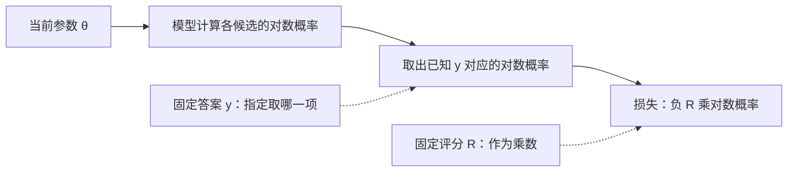
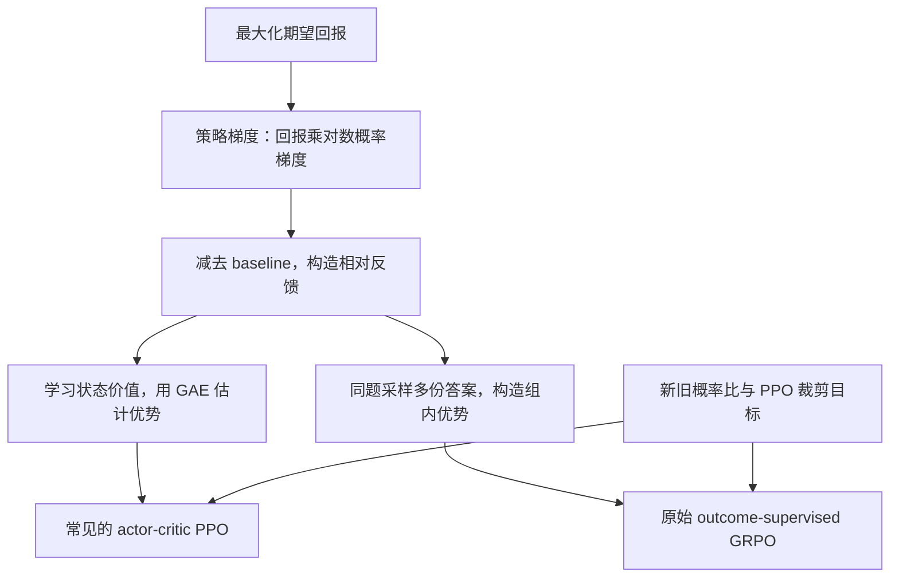

# 强化学习的数学基础：从策略梯度到 PPO 与 GRPO

一个模型生成了四份答案，评分分别是 0、0、1、1。我们希望它以后更容易生成得 1 分的答案。但评分可能来自单元测试、规则或人类判断，无法沿着“答案 → 评分”这条路径求导；答案本身又是离散采样出来的。这样的反馈，怎么变成神经网络可以使用的梯度？

策略梯度解决的就是这个问题。先给一个直观描述：**模型试着回答，拿到评分，再调整参数，让表现好的回答以后更容易被采样到。**“策略”指生成答案的概率规则，“梯度”则告诉我们参数应往哪个方向调整。

这篇文章从第一次接触策略梯度的角度写起，先解释 $\mathbb E$、$\sim$、条件概率这些读公式时会遇到的记号。前 3 节用同一个两答案例子，解释期望、梯度和 baseline；第 4 节介绍如何估计多步任务的反馈，第 5～7 节再走到 PPO、GRPO。第一次读可以先把前 3 节算通，折叠的进阶说明可以跳过。算法流程与实现细节另见 [[PPO]] 和 [[GRPO]]。

## 1. 策略是一个概率分布，目标是提高期望奖励

先假设面对一道题，模型只能生成两种答案：答案 A 得 2 分，答案 B 得 0 分。模型目前有 25% 的概率生成 A，75% 的概率生成 B。

### 1.1 概率分布描述可能性，采样得到一次结果

把所有可能结果及其概率列在一起，就是一个离散的**概率分布**：

| 可能生成的答案 | 生成概率 | 得到的奖励 |
| -------------- | -------- | ---------- |
| A              | $0.25$   | $2$        |
| B              | $0.75$   | $0$        |

概率不能为负，把全部可能结果的概率加起来必须等于 1。这里 $0.25+0.75=1$，表示一次回答一定会落在 A、B 之中。

按照这组概率随机生成一次答案，就叫**采样**。例如，某次得到 B；再生成一次，可能得到 A，也可能仍是 B。25% 也不表示每四次必定有一次 A，它只规定每次生成 A 的概率。

采样前，这一次的奖励可能为 2，也可能为 0。这样随随机结果取不同数值的量叫**随机变量**。这里用 $R$ 表示奖励这个随机变量，采样并评分后才得到它本次的具体值。

### 1.2 大写的 $\mathbb E$：按概率加权的平均值

**期望**的计算方法是：每个可能的数值乘上它出现的概率，再把这些乘积加起来。它用大写的 $\mathbb E$ 表示：

$$
\mathbb E[R]=0.25\times2+0.75\times0=0.5.
$$

可以把 $\mathbb E[R]$ 读成“奖励 $R$ 的期望”。$\mathbb E$ 后面的方括号标出要对什么量求平均，整个式子的结果在这个例子中就是数值 0.5。

这里不能直接算 $(2+0)/2=1$，因为两个结果出现的机会不一样。普通算术平均给每个结果相同权重；这个例子里，0 分更常见，计算时占的权重也更大。

**期望为 0.5 分，不表示某一次会得到 0.5 分。** 每次仍然只有 2 分或 0 分。如果保持这组概率不变，独立重复生成很多次，实际的平均分会趋近 0.5。期望可以理解为这样的长期平均水平，即使这个数值不是任何一次可能的结果。

假如训练后，A 的概率变成 30%，期望奖励就变成 $0.30\times2=0.6$。两个答案各自的评分没有变，变化的是生成它们的概率。这就是策略优化要做的事。

### 1.3 $\pi_\theta(y\mid x)$：给定题目后，生成某个答案的概率

固定题目或 prompt $x$，把模型的一条完整生成序列记为 $y$，评分记为 $R(x,y)$。文中为了方便称它为“答案”或“回答”，但它包含这次回答中全部生成的 token，包括生成的推理文本（如果有）和最终输出，不只指最后的结论；prompt $x$ 本身不计入 $y$。A、B 可以代表两条不同的完整生成序列。

括号表示函数的输入：题目和生成序列确定后，评分函数就能给出分数。例如 $R(x,y_A)=2$。

策略写成 $\pi_\theta(y\mid x)$，表示“给定 $x$，模型生成 $y$ 的概率”。逐个看其中的符号：

| 符号     | 在这里表示什么                                 |
| -------- | ---------------------------------------------- |
| $\pi$    | 策略函数的名字；这里不用它表示圆周率           |
| $\theta$ | 模型参数；下标提醒我们参数改变后，概率也会改变 |
| $y$      | 要计算生成概率的那个答案                       |
| $\mid x$ | “在题目 $x$ 已知的条件下”，竖线是条件符号      |

因此，$\pi_\theta(y_A\mid x)=0.25$ 是一个具体概率。写成 $\pi_\theta(\cdot\mid x)$ 时，圆点是一个占位符，表示“**答案位置暂时留空**”。题目 $x$ 和参数 $\theta$ 已经确定，但还没有代入某个具体答案，所以这个写法指整套答案概率分布。

可以把这套分布想成一张表：

| 留空的位置填入什么 | 查到的概率 |
| ------------------ | ---------- |
| 答案 A             | $0.25$     |
| 答案 B             | $0.75$     |

$\pi_\theta(\cdot\mid x)$ 指这张完整的概率表；$\pi_\theta(y_A\mid x)$ 则是拿答案 A 去查表，得到数值 0.25。圆点本身既不是一个答案，也不是把所有答案合在一起得到的输出。

这里要把 $\pi$ 和 $\theta$ 分开看：**$\pi$ 是函数，$\theta$ 是这套函数使用的参数。** 在神经网络中，$\theta$ 通常统称模型的许多权重和偏置，不是单独一个概率。下标只是记号习惯；也可以把同一含义写成 $\pi(y\mid x;\theta)$，分号后面列出模型参数。

例如，保持题目 $x$ 不变，训练前后可能有：

| 模型参数                   | 生成 A 的概率 | 生成 B 的概率 |
| -------------------------- | ------------- | ------------- |
| $\theta_{\mathrm{before}}$ | $0.25$        | $0.75$        |
| $\theta_{\mathrm{after}}$  | $0.30$        | $0.70$        |

训练修改了参数，所以同一题目下的生成概率也变了。反过来，保持参数不变、换一道题 $x$，模型给出的答案分布通常也会不同；这就是公式需要写出条件 $\mid x$ 的原因。

读到 $\pi_\theta(y\mid x)$ 时，可以依次确认：**使用哪组参数 $\theta$，给定哪个输入 $x$，正在计算哪个输出 $y$ 的概率。** 后面的求导通常固定这次已经采到的 $x$ 和 $y$，研究参数改变时，这个概率怎样变化。

### 1.4 $\mathbb E$ 下标的 $\sim$：说明按哪个分布取平均

波浪线 $\sim$ 读作“**服从……分布**”，也可以理解为“按照……分布采样”。例如：

$$
y\sim\pi_\theta(\cdot\mid x)
$$

读作：“给定题目 $x$，回答 $y$ 按模型 $\pi_\theta$ 给出的概率分布取值。”在这个例子中，就是有 25% 的概率取到 A，有 75% 的概率取到 B。它表达的是概率分布关系；近似相等一般写成另一个符号 $\approx$。

左边的 $y$ 和右边的圆点承担不同角色：**右边给出整套随机选择规则，左边是按这套规则取值的变量。** 如果一次采样得到 A，那么本次 $y=y_A$；下一次也可能得到 B。每次得到一个答案，与分布需要列出所有可能答案及其概率，并不矛盾。

所以这两个式子分别做不同的事：

| 写法                           | 含义                                                 |
| ------------------------------ | ---------------------------------------------------- |
| $y\sim\pi_\theta(\cdot\mid x)$ | 按整套分布随机选择答案；$y$ 以相应概率取到 A 或 B    |
| $\pi_\theta(y\mid x)$          | 对给定的答案 $y$ 求生成概率；若 $y=y_A$，结果为 0.25 |

前者描述“答案怎么随机取值”，后者计算“某个答案有多大概率出现”。例如，从前者采到 A 后，再把 A 代入后者，就得到它的概率 0.25。$y$ 是答案，0.25 是这个答案的概率，两者也要分清。

把它放到期望的下标里：

$$
\mathbb E_{y\sim\pi_\theta(\cdot\mid x)}[R(x,y)]
$$

这行式子可以分成两部分读：**下标告诉我们按哪套概率作为权重，方括号告诉我们要平均哪个量。** 整句读作：“回答按照这个模型的概率生成时，奖励的平均值。”展开后就是：

$$
\mathbb E_{y\sim\pi_\theta(\cdot\mid x)}[R(x,y)]
=0.25R(x,y_A)+0.75R(x,y_B)=0.5.
$$

下标规定的是求期望时使用的分布，不要求一定先进行真实采样。在这个小例子里，我们能列出全部答案及其概率，直接计算期望；可能答案太多时，才需要靠采样估计它。

### 1.5 $\sum$：把“所有情况加起来”写短一点

大写的希腊字母 $\Sigma$ 写成 $\sum$ 时，表示求和。例如：

$$
\sum_{i=1}^{3}a_i=a_1+a_2+a_3.
$$

下标 $i=1$ 和上标 $3$ 指定从第 1 项加到第 3 项，$i$ 是逐项变化的编号。写成 $\sum_y$ 时，则表示遍历所有可能的答案 $y$。

把想提高的期望奖励记为 $J_x(\theta)$：

$$
J_x(\theta)
=\mathbb E_{y\sim\pi_\theta(\cdot\mid x)}[R(x,y)]
=\sum_y\pi_\theta(y\mid x)R(x,y).
$$

右边每一项都是“生成概率 × 奖励”，把所有项加起来，就得到中间的期望。$J_x(\theta)$ 只是给这个目标起了个名字：下标 $x$ 提醒我们题目暂时固定，括号里的 $\theta$ 提醒我们目标值会随着模型参数改变。

实际训练面对很多 prompt，因此还要对题目分布 $\mathcal D$ 求平均：

$$
J(\theta)=\mathbb E_{x\sim\mathcal D}[J_x(\theta)].
$$

后面的推导通常省略这层对 $x$ 的平均，但始终在同一 prompt 的条件下比较回答。

### 1.6 期望与采样平均：知道全部概率，和只看到几次结果

假设用当前模型生成四次，拿到奖励 $0,0,0,2$。这批数据的样本平均是：

$$
\bar R_4=\frac{0+0+0+2}{4}=0.5.
$$

横线 $\bar R$ 表示平均值，下标 4 表示用了四次结果。这一次样本平均恰好等于期望。如果下一批四次都是 0 分，样本平均就是 0，模型分布所决定的期望仍然是 0.5。

推广到 $N$ 次采样，样本平均写成：

$$
\bar R_N=\frac{1}{N}\sum_{i=1}^{N}R_i.
$$

其中 $R_i$ 是第 $i$ 次采样得到的奖励。同一分布下的独立采样越多，样本平均通常越可靠，但增加一次样本不保证立刻更接近期望。后面的策略梯度会用完全相同的办法：把随机的梯度贡献求平均，来估计期望梯度。

### 1.7 梯度告诉我们参数应该往哪里改

把熟悉的导数和函数增量接起来，先看一个简单例子：$f(x)=x^2$，$f'(x)=2x$。当 $x$ 从 3 增加到 3.01 时，输入增量为 $\Delta x=0.01$，函数增量约为：

$$
\Delta f\approx f'(3)\Delta x=6\times0.01=0.06.
$$

精确值是 $3.01^2-3^2=0.0601$。$\Delta$ 表示变化量；导数描述当前位置的变化率，还需要乘上输入变化量，才得到输出变化量的局部估计。这里用 $x$ 表示普通函数的自变量，只为说明求导；下面回到模型参数 $\theta$。

回到 A 得 2 分、B 得 0 分的例子。把生成 A 的概率记为 $p$；因为只有这两种结果，生成 B 的概率就是 $1-p$。按照“概率乘奖励，再求和”的期望计算规则：

$$
\begin{aligned}
J
&=\text{A 的概率}\times\text{A 的奖励}
  +\text{B 的概率}\times\text{B 的奖励}\\
&=p\times2+(1-p)\times0\\
&=2p.
\end{aligned}
$$

这里的 $J$ 是前面期望奖励 $J_x(\theta)$ 的简写，题目 $x$ 仍然固定，暂时先把它看成概率 $p$ 的函数。例如 $p=0.25$ 时，$J=2\times0.25=0.5$，与前面算出的期望一致。

$J=2p$ 来自这个例子中“奖励分别为 2 和 0”的设定。如果 A、B 的奖励分别为 $r_A,r_B$，则应写成 $J=pr_A+(1-p)r_B$。

现在对 $J=2p$ 中的 $p$ 求导，结果就是 2：$p$ 增加一点，期望奖励就按两倍的幅度增加。

但神经网络训练时，优化器修改的是参数 $\theta$，概率 $p$ 是参数经过计算后产生的结果。为了能完整手算，假设这个小模型只有一个参数：

$$
\pi_\theta(y_A\mid x)=p=\frac{1}{1+e^{-\theta}},
\qquad
\pi_\theta(y_B\mid x)=1-p.
$$

这里使用 sigmoid 函数，只为了把任意实数参数变成 0 到 1 之间的概率，其中 $e\approx2.718$ 是自然常数。它的导数为 $\mathrm dp/\mathrm d\theta=p(1-p)$。参数先决定概率，概率再决定期望奖励，即 $\theta\rightarrow p\rightarrow J_x$；沿这两段关系使用链式法则：

$$
\frac{\mathrm dJ_x}{\mathrm d\theta}
=\frac{\mathrm dJ_x}{\mathrm dp}\frac{\mathrm dp}{\mathrm d\theta}
=2p(1-p).
$$

当 $p=0.25$ 时，导数为 $2\times0.25\times0.75=0.375$。它表示在当前位置，$\theta$ 增加一个很小的量 $h$，期望奖励约增加 $0.375h$。

参数很多时，把每个参数对应的偏导数排在一起，就叫梯度，记为 $\nabla_\theta J$。例如，只有两个参数时：

$$
\theta=(\theta_1,\theta_2),
\qquad
\nabla_\theta J=
\left(\frac{\partial J}{\partial\theta_1},
\frac{\partial J}{\partial\theta_2}\right).
$$

$\partial$ 表示偏导数：计算对 $\theta_1$ 的偏导时，暂时把其他参数固定。$\nabla_\theta$ 则表示收集对所有参数的偏导。因此，$\nabla_\theta\log\pi_\theta(y\mid x)$ 读作“这个答案的对数概率，对模型参数的梯度”。想提高目标，可以做一次小幅的梯度上升：

$$
\theta_{\mathrm{new}}=\theta+\alpha\nabla_\theta J(\theta).
$$

$\alpha>0$ 是学习率，决定这一步走多大。所谓策略梯度，就是**期望奖励对策略参数的梯度**。

这个两答案模型能直接枚举全部答案，语言模型却做不到：可能的回答太多，我们也拿不到每种回答的评分。接下来的核心问题是，能否只生成少量答案，就估计出这个梯度。

## 2. 从评分到更新：策略梯度解决什么问题

前面算出了 $J=2p$，因为这个例子只有两种答案，而且我们知道两者的概率和奖励。真实训练中，我们通常只能让模型生成一些回答，再逐个评分。现在需要解决的是：**手里只有采样回答和分数，怎样得到更新模型参数所需的梯度？**

### 2.1 什么叫“可导”：在某一点有确定的局部变化率

对一元函数 $f(z)$，说它在 $z_0$ 处**可导**，意味着输入发生越来越小的变化时，“输出变化量除以输入变化量”会趋近同一个有限的数：

$$
f'(z_0)=\lim_{h\to0}\frac{f(z_0+h)-f(z_0)}{h}.
$$

这里 $h$ 是输入变化量，分子是输出变化量，两者之比是这小段区间的平均变化率。$\lim_{h\to0}$ 表示让非零的 $h$ 越来越接近 0，既从正方向靠近，也从负方向靠近。如果两边都趋近同一个有限值，这个值就是导数。

例如 $f(z)=z^2$，在 $z_0=3$ 处：

$$
\frac{(3+h)^2-3^2}{h}=6+h\longrightarrow6.
$$

所以它在 3 处可导，导数为 6。几何上，这给出了曲线在该点的切线斜率；计算上，它允许我们用一条直线估计附近的函数值：

$$
f(z_0+h)\approx f(z_0)+f'(z_0)h.
$$

可导是针对某一点而言的。同一个函数可能在大多数位置可导，在少数位置不可导。可以对照下面几个例子：

| 函数与位置                                        | 附近怎样变化                          | 是否可导                       |
| ------------------------------------------------- | ------------------------------------- | ------------------------------ |
| $f(z)=z^2$，在 $z=3$                              | 左右两边的变化率都趋近 6              | 可导，导数为 6                 |
| $f(z)=\lvert z\rvert$，在 $z=0$                   | 左侧斜率为 $-1$，右侧为 $1$，形成尖点 | 不可导，没有一致的斜率         |
| 阶跃函数：$z<0$ 时为 0，$z\geq0$ 时为 1，在 $z=0$ | 函数值突然从 0 跳到 1                 | 不可导，不存在有限的局部变化率 |
| $f(z)=2$，在任意位置                              | 输入变化，输出始终不变                | 可导，导数为 0                 |

绝对值函数在 0 处没有跳变，是连续的，却仍然不可导。因此，连续不保证可导。反过来，一元函数在某点可导，就一定在该点连续。**导数为 0 也不等于不可导**：前者是存在一个值为 0 的局部变化率，后者是这个导数不存在。

谈可导还要说明对哪个变量求导。固定代码 $y$ 后，它的测试评分对模型参数 $\theta$ 可以是常数，导数为 0；但若想让梯度穿过“随机选出代码，再运行测试”的过程，就需要检查这整条路径的求导条件。下一节讨论的困难发生在这里。

### 2.2 梯度回传：从最终目标开始，反向使用链式法则

先看一条所有步骤都可导的计算过程：

$$
\theta\longrightarrow z=2\theta
\longrightarrow v=z^2
\longrightarrow L=(v-1)^2.
$$

这些变量及其计算关系组成一张**计算图**。前向计算从参数出发，逐步算出损失 $L$；反向传播则从 $L$ 出发，依次计算它对中间变量、最终对参数的导数。

取 $\theta=1$，前向得到 $z=2$、$v=4$、$L=9$。反向计算如下：

| 回到哪个变量 | 如何使用局部导数                                                     | 最终损失对它的导数 |
| ------------ | -------------------------------------------------------------------- | ------------------ |
| $v$          | $L=(v-1)^2$，所以 $\mathrm dL/\mathrm dv=2(v-1)$                     | $6$                |
| $z$          | 已有 $\mathrm dL/\mathrm dv=6$，再乘 $\mathrm dv/\mathrm dz=2z=4$    | $6\times4=24$      |
| $\theta$     | 已有 $\mathrm dL/\mathrm dz=24$，再乘 $\mathrm dz/\mathrm d\theta=2$ | $24\times2=48$     |

这里回传的数值，始终是**最终损失对当前中间量的导数**。每经过一步运算，就把已经算出的导数乘上这一步的局部导数。如果同一个参数通过多条路径影响损失，还要把各条路径的贡献相加。

自动求导系统会记录前向执行了哪些运算，以及这些运算如何求导，再自动完成这个反向计算。它需要每个经过的运算都提供相应的求导规则。得到 $\mathrm dL/\mathrm d\theta$ 后，优化器才用它更新参数；梯度回传本身不等于已经修改了参数。

### 2.3 沿生成路径逐段检查：哪一步无法继续回传

先只看语言模型选择下一个 token 的过程。模型输出一组未归一化分数 $z$，称为 logits；softmax 把它们转换成概率向量 $p$；采样再从这些概率中选出一个 token。整段生成结束后，评分器返回奖励。


图中的箭头表示前向计算。如果想直接从 $R$ 回传，必须沿相反方向逐段求导：

| 前向步骤                   | 反向时需要什么             | 实际情况                                                         |
| -------------------------- | -------------------------- | ---------------------------------------------------------------- |
| 参数 $\theta$ → logits $z$ | logits 对参数的导数        | 神经网络中支持自动求导的运算可以计算                             |
| logits $z$ → 概率 $p$      | 概率对 logits 的导数       | softmax 可导，可以计算                                           |
| 概率 $p$ → 采样结果        | 采样结果对概率的局部变化率 | 离散选择会保持不变或突然跳变，普通路径求导无法提供所需的学习信号 |
| 答案 $y$ → 奖励 $R$        | 评分对答案的可用导数       | 代码测试、人工评分等通常只提供分数，没有这段可回传的导数         |

所以，从奖励开始向前追溯，外部评分这一步通常就没有可用的反向接口。即使换成能对连续输入求导的神经网络奖励模型，**回传到“概率如何变成离散 token”这一步，仍然会遇到采样的障碍**。

这里有两个不同层次的问题。外部程序没有接入自动求导图，是实现层面的限制：外部程序即使只计算平方，数学上也完全可以是可导的。代码测试则还涉及离散文本和通过、失败等结果，没有自然对应的“把代码增加 $0.001$ 后评分如何变化”。不能把所有外部程序都说成数学上不可导，也不能仅靠把返回的分数包装成一个 tensor，就让它自动拥有到模型参数的求导路径。

### 2.4 固定一次随机抽签，就能看到采样处的断点

仍然只考虑 A、B 两种答案，A 的概率为 $p$。可以用下面的办法实现采样：先在 0 到 1 之间均匀抽一个随机数 $u$；若 $u<p$，选择 A，否则选择 B。因为区间 $[0,p)$ 占总长度的比例为 $p$，所以选择 A 的概率恰好是 $p$。

令 $a=1$ 表示选到 A，$a=0$ 表示选到 B，那么：

$$
a(p,u)=
\begin{cases}
1,&u<p,\\
0,&u\geq p.
\end{cases}
$$

为了看清一条生成路径上的导数，先固定本次抽到的随机数 $u=0.6$，只改变 $p$：

| A 的概率 $p$ | 与 $u=0.6$ 比较 | 采样结果 $a$ | 奖励 $R=2a$ |
| ------------ | --------------- | ------------ | ----------- |
| $0.25$       | $u\geq p$       | $0$，选 B    | $0$         |
| $0.26$       | $u\geq p$       | $0$，选 B    | $0$         |
| $0.59$       | $u\geq p$       | $0$，选 B    | $0$         |
| $0.61$       | $u<p$           | $1$，选 A    | $2$         |

概率从 0.25 变成 0.26，抽到的答案完全没变；跨过 0.6 时，答案才突然从 B 跳到 A。于是，对固定的 $u$，$a$ 关于 $p$ 是一个阶跃函数：除跳点外导数为 0，在跳点处不可导。

这一次把评分特意写成最简单的 $R=2a$。即使允许我们把 $a$ 当成连续数值并对评分求导，$\mathrm dR/\mathrm da=2$ 也完全没有问题；障碍仍然在前一步的离散采样。沿着这条固定随机数的路径求导，远离跳点时只能得到：

$$
\frac{\partial R}{\partial p}
=\frac{\mathrm dR}{\mathrm da}\frac{\partial a}{\partial p}
=2\times0=0.
$$

现在把所有可能的 $u$ 都考虑进去。由于 $u$ 在 0 到 1 之间均匀分布，它落入某段区间的概率，就等于这段区间的长度。$p=0.25$ 时，落入 $[0,0.25)$ 就选 A，所以 A 的概率为 25%；$p=0.26$ 时，选 A 的区间扩大到 $[0,0.26)$，概率也就变成 26%。

把这两种设置放在一起比较：

| 随机数 $u$ 落在哪段区间 | 这段区间的概率 | $p=0.25$ 时 | $p=0.26$ 时 | 奖励变化 |
| ----------------------- | -------------- | ----------- | ----------- | -------- |
| $[0,0.25)$              | $25\%$         | A，得 2 分  | A，得 2 分  | $0$      |
| $[0.25,0.26)$           | $1\%$          | B，得 0 分  | A，得 2 分  | $+2$     |
| $[0.26,1]$              | $74\%$         | B，得 0 分  | B，得 0 分  | $0$      |

区间 $[a,b)$ 表示包含左端点 $a$、不包含右端点 $b$。这张表比较的是同一个可能的 $u$ 在两种概率设置下会选到什么；总体平均时，再按每段区间的概率加权。

只有中间那 1% 的情况改变了奖励，每种这样的情况都多得 2 分，因此期望奖励增加：

$$
\Delta J=0.25\times0+0.01\times2+0.74\times0=0.02.
$$

概率增加 $\Delta p=0.01$，期望奖励增加 $\Delta J=0.02$，两者之比为：

$$
\frac{\Delta J}{\Delta p}=\frac{0.02}{0.01}=2.
$$

更一般地，$p$ 增加一个很小的正数 $h$，就会多出长度为 $h$ 的区间，让抽签结果从 B 变成 A。期望奖励增加 $2h$，所以 $\mathrm dJ/\mathrm dp=2$，与直接对 $J=2p$ 求导一致。

固定 $u=0.6$ 时，$p$ 从 0.25 增加到 0.26 确实不会改变这一次的结果；发生改变的是其他可能的 $u$，例如 $u=0.255$。所谓“A 更容易出现”，指每次按新概率重新抽签时，A 的出现概率提高了，不保证下一次一定抽到 A。

### 2.5 换成 100 张签：60 号签没变，整体平均分也可以变

先暂时放下导数，把同样的区别放进一个能直接数清的例子。袋子里有 100 张等概率的签，编号为 1～100。原来的规则是：1～25 号对应 A，得 2 分；26～100 号对应 B，得 0 分。

现在只改一件事：把 26 号签也改为 A，得 2 分。其余 99 张签保持原样。

| 观察什么              | 修改前                           | 修改后                           |
| --------------------- | -------------------------------- | -------------------------------- |
| 60 号签               | B，得 0 分                       | B，仍得 0 分                     |
| 26 号签               | B，得 0 分                       | A，变成得 2 分                   |
| 能得 2 分的签有多少张 | 25 张                            | 26 张                            |
| 每次抽签的期望奖励    | $(25\times2+75\times0)/100=0.50$ | $(26\times2+74\times0)/100=0.52$ |

假如你只拿着 60 号签，检查规则改变前后它值多少分，会得到“0 分变成 0 分，没有变化”。这个判断对 60 号签完全正确。但袋子里的规则确实变好了：26 号签也能得分了，随机抽一张时拿到 2 分的机会增加了。

因此，下面两句话可以同时成立：

- **这次抽到的那张签，分数没有变化。**
- **从全部签中随机抽一张，平均能拿到的分数提高了。**

这里的 100 张签代表 100 种等概率的可能结果，不是实际抽了 100 次的记录。“概率发生变化”在这个例子里，具体就是 A 的机会从 25% 增加到 26%，B 的机会从 75% 减少到 74%。它不要求每一种可能结果都跟着改变。

这个签的例子用来区分“某一个结果”和“所有结果的平均”。回到前面的连续随机数 $u$，固定 $u=0.6$ 就像始终观察那张没变的签。沿这一次采样路径求导，回答的是“这一次的分数随 $p$ 的微小变化怎样变”；我们真正想优化的，则是“每次重新按这个概率抽签，平均分怎样变”。

这也不只是恰好抽到一张没变的签：在连续模型中，对任何固定的 $u$，结果在门槛两侧分别是常数，在门槛处突然跳变。因此，逐条路径的普通导数都是在非跳点处为 0、在跳点处不存在。把这些局部导数简单平均，不能得到期望奖励的导数。

> [!important] 关键结论
> **在这个例子中，对概率 $p$ 求导时，单次采样路径在非跳点的导数为 0、在跳点不可导，而期望奖励 $J=2p$ 可导，导数为 2。**

强调这个区别，是因为它直接决定一种训练方法是否算对了梯度。一个看起来很自然的办法是：生成一批答案，对每次得到的奖励沿生成路径反向传播，再把这些梯度平均。在当前例子中，忽略恰好踩在跳点上的零概率情况，这样平均出来的结果是 0。可是训练真正需要的是 $J=2p$ 对 $p$ 的导数，也就是 2。

若用前一种结果更新，模型会得到“这条路径没有更新信号”的结果，即使提高 A 的概率确实能增加平均奖励。多采一些样本，再平均这些为 0 的路径导数，也无法补上缺失的信息。所以需要换一种梯度计算方法，使采样估计的期望等于目标的真实梯度。

策略梯度利用另一项会连续变化的信息：**即使这次抽到的答案没变，模型赋给这个答案的概率仍然可以变化。** 后面的推导会对这个概率求导，再用奖励给它加权，从而估计平均奖励的变化方向。

### 2.6 单个答案的分数不变，期望奖励仍然可以变化

回到两答案的例子。我们可以把两种代码分别记作 A、B：A 通过测试得 2 分，B 未通过得 0 分。如果测试规则固定，同一份代码仍然拿同一个分数。

但是，当模型生成 A 的概率从 0.25 提高到 0.30 时，期望奖励就从 $2\times0.25=0.5$ 变成 $2\times0.30=0.6$。**让高分答案更常出现，就能提高平均分，即使每个答案自身的评分完全不变。**

把这件事写回目标函数：

$$
J_x(\theta)=\sum_y\pi_\theta(y\mid x)R(x,y).
$$

固定某个答案 $y$ 后，奖励 $R(x,y)$ 是这个答案的评分；改变参数会改变的，是前面的生成概率 $\pi_\theta(y\mid x)$。因此，在奖励规则不显式依赖 $\theta$ 的设定下：

$$
\nabla_\theta J_x(\theta)
=\sum_y R(x,y)\nabla_\theta\pi_\theta(y\mid x).
$$

右边只需要对模型输出的概率求导，评分程序只需提供 $R(x,y)$ 的数值。这里的两个问题要分开：对固定答案来说，评分相对于参数 $\theta$ 是常数；沿着随机生成过程来说，我们又无法把离散答案当作连续变量来传递导数。策略梯度通过对答案分布求期望，把更新方向写成了上面的概率导数。

### 2.7 无法列出所有答案时，怎样计算梯度

上式已经避开了对评分程序求导，但仍然要求把所有答案的贡献相加。语言模型可能生成的答案太多，无法逐一列出并评分。

一个自然的想法是借用采样：固定同一个问题 $x$，让当前模型按自己的概率分布独立生成 $N$ 次，只处理这 $N$ 次实际出现的回答，再把算出的值求平均。$N$ 可以由我们选择，例如只采 4 次；它不表示所有可能回答的数量，同一个回答也可能重复出现。

这样确实只需要计算有限次回答。不过，样本平均估计的是采样分布下的期望，它能直接代替原式中对所有答案的求和吗？先用 A、B 两种回答检查一下。

把上一小节原式中的一项 $R(x,y)\nabla_\theta\pi_\theta(y\mid x)$ 暂时记成 $h(y)$。如果只有 A、B 两种回答，原式要求的是把它们对应的项相加：

$$
h(A)+h(B).
$$

这里要把 A 对应的项和 B 对应的项各加一次。现在按模型的概率采样，A 的概率为 $1/4$，B 的概率为 $3/4$。假设采 4 次，恰好得到 A、B、B、B。如果把每次采到的 $h$ 直接平均，算出来的是：

$$
\frac{h(A)+h(B)+h(B)+h(B)}{4}
=\frac14h(A)+\frac34h(B).
$$

右边为什么多出了 $1/4$ 和 $3/4$？因为 A 在 4 次里出现了 1 次，B 出现了 3 次；求平均时，这些出现次数就变成了各自的权重。原本要算的是 $h(A)+h(B)$，现在算成了 $\frac14h(A)+\frac34h(B)$，两者通常不同。

这就是“采样频率额外加了一层概率权重”的含义。4 次恰好符合概率比例只是一个演示；采样次数很多时，A、B 的出现比例通常接近 $1/4$、$3/4$，所以直接平均 $h$ 仍然会接近这个带权重的结果，多采一些也不会让它变成原来的和。

**直接平均原式中的项，会因为采样频率而多出概率权重，导致估计的量变了；这种偏差与有限样本带来的随机误差不同，增加采样次数也不能消除它。** 因此，接下来要解决的是：怎样补偿这层概率权重，让采样平均能够估计原来的求和？

### 2.8 用对数，把梯度写成可用采样估计的期望

要抵消上一小节多出的概率权重，可以在每次采到回答后，先把 $h(y)$ 除以这个回答的生成概率。还是 A、B、B、B，这次求平均得到：

$$
\begin{aligned}
\frac14\left(\frac{h(A)}{1/4}+3\frac{h(B)}{3/4}\right)
&=\frac14\bigl(4h(A)+4h(B)\bigr)\\
&=h(A)+h(B).
\end{aligned}
$$

这批样本的出现比例恰好符合生成概率，所以算回了精确值；一般批次仍会有采样误差，但经过这种补偿，平均值的期望就等于原来的和。

对一般的回答 $y$，把补偿后的量记成 $g(y)=h(y)/\pi_\theta(y\mid x)$。利用自然对数的求导关系 $(\log p)'=p'/p$，可以继续写成：

$$
\begin{aligned}
g(y)
&=\frac{h(y)}{\pi_\theta(y\mid x)}\\
&=R(x,y)\frac{\nabla_\theta\pi_\theta(y\mid x)}{\pi_\theta(y\mid x)}\\
&=R(x,y)\nabla_\theta\log\pi_\theta(y\mid x).
\end{aligned}
$$

这就是对数梯度出现的原因：它把“概率的梯度除以概率”写成了 $\nabla_\theta\log\pi_\theta$。$g(y)$ 是一条回答的梯度贡献，由奖励乘上对数概率的梯度得到；本文的 $\log$ 都是自然对数。

因为 $h(y)=\pi_\theta(y\mid x)g(y)$，原来的求和就能改写成：

$$
\begin{aligned}
\nabla_\theta J_x(\theta)
&=\sum_y h(y)\\
&=\sum_y\pi_\theta(y\mid x)g(y)\\
&=\mathbb E_{y\sim\pi_\theta(\cdot\mid x)}[g(y)].
\end{aligned}
$$

第二行是“每种回答的概率 × 它对应的梯度贡献，再全部相加”，第三行只是用期望符号表示同一件事。**随机采样的是完整回答 $y$，拿来平均的是梯度贡献 $g(y)$；这个期望的结果就是目标梯度。** 这里仍假设奖励不显式依赖参数、相关概率为正，并满足交换求和与求导的条件。

到这里的等号都是精确关系，期望仍然涵盖所有可能回答。实际省计算时，才用有限样本估计它：固定问题 $x$，从当前模型独立采样 $N$ 次，给采到的回答评分并计算 $g(y_i)$，然后求平均：

$$
\begin{aligned}
\hat g
&=\frac{1}{N}\sum_{i=1}^{N}g(y_i)\\
&=\frac{1}{N}\sum_{i=1}^{N}
R(x,y_i)\nabla_\theta\log\pi_\theta(y_i\mid x).
\end{aligned}
$$

其中 $y_i\sim\pi_\theta(\cdot\mid x)$，$i$ 只编号实际采到的 $N$ 次回答，回答可以重复；没有采到的回答不必逐一生成和评分。这里直接平均 $g(y_i)$，不再乘一次生成概率，因为采样频率已经提供了期望中的概率权重。

帽子 $\hat g$ 表示估计值：$\hat g\approx\nabla_\theta J_x$，有限样本通常带有随机误差。**对数恒等式给出了应该平均的量，有限次采样才省去了遍历所有回答的计算。** 这种用样本平均估计期望的办法叫 Monte Carlo 估计，用在这里就是 REINFORCE 策略梯度。推导也可对照 [Spinning Up 的策略梯度说明](https://spinningup.openai.com/en/latest/spinningup/rl_intro3.html)。

> [!info]- 回顾：对数概率为什么常常是负数
> 对数是指数的反操作。例如 $2^3=8$，因此 $\log_2 8=3$。自然对数以 $e\approx2.718$ 为底，$\log p$ 表示“$e$ 的多少次方等于 $p$”。
>
> 概率 $0<p\leq1$ 对应 $\log p\leq0$。例如 $\log0.25\approx-1.386$、$\log0.5\approx-0.693$：概率越大，对数概率也越大。这里对数为负只与概率的数值范围有关，不表示奖励为负。
>
> 后文的 $\exp(z)$ 就是 $e^z$，它与自然对数互为反操作。于是 $\exp(\log p-\log q)=p/q$，可以把 log probability 的差变回概率比。

### 2.9 策略梯度实际沿着哪条计算图回传

公式给出梯度估计以后，训练仍然使用自动求导。做法是把已经采到的答案 $y$ 和评分 $R$ 固定下来，让当前模型计算这个已知答案的对数概率，再构造一个样本损失：

$$
L_{\mathrm{sample}}(\theta)=-R\log\pi_\theta(y\mid x).
$$

下面用单次 token 选择展示这个计算图；整段回答则把各 token 的对数概率相加：



这时，反向计算从损失开始。损失对选中答案的对数概率的导数是 $-R$，再乘上这个对数概率对模型参数的梯度：

$$
\nabla_\theta L_{\mathrm{sample}}
=-R\nabla_\theta\log\pi_\theta(y\mid x).
$$

沿这条路径，需要求导的都是模型计算概率的运算。$R$ 只是固定乘数，$y$ 只是指定取哪一项的固定输入，不需要让梯度穿过评分器，也不需要对抽签动作求导。

这里容易产生一个疑问：$y$ 仍然是离散的，为什么“取出它对应的对数概率”就可以回传？因为我们固定的是索引，取出的数值仍会随参数变化。例如固定 $y=A$ 后，$\log\pi_\theta(A\mid x)$ 仍然可导。自动求导只需追踪这个数值怎样由模型算出，无须计算“为什么这次抽中了 A”的导数。经过 softmax 等共享计算后，梯度也可能影响其他候选的概率。

因此，策略梯度构造了一条可微的损失计算路径，再用普通反向传播计算它。这个样本损失的数值不等于负期望奖励；前面的推导保证的是：在从当前策略采样、奖励不显式依赖参数等条件下，**样本损失梯度的期望，等于期望奖励梯度的负值**。优化器对该损失做梯度下降，就得到期望奖励梯度上升的一个采样估计。

### 2.10 亲手验证：采样算出的梯度与直接求导一致

继续使用 A 得 2 分、B 得 0 分的模型。这里沿用第 1.7 小节的设定：模型只有一个可训练参数 $\theta$，用 sigmoid 函数把它转换成生成 A 的概率 $p$：

$$
p(\theta)=\mathrm{sigmoid}(\theta)=\frac{1}{1+e^{-\theta}}.
$$

生成 B 的概率则是 $1-p$。这是为了方便手算选定的参数与概率之间的关系。由这个具体函数可得：

$$
\frac{\mathrm dp}{\mathrm d\theta}
=\frac{e^{-\theta}}{(1+e^{-\theta})^2}
=p(1-p).
$$

在 $p=0.25$ 时，$\mathrm dp/\mathrm d\theta=0.25\times0.75=0.1875$。下面对两种回答的对数概率求导，都通过链式法则乘上这个因子：

$$
\frac{\mathrm d\log\pi_\theta(y_A\mid x)}{\mathrm d\theta}
=\frac{1}{p}\frac{\mathrm dp}{\mathrm d\theta}=1-p=0.75,
$$

$$
\frac{\mathrm d\log\pi_\theta(y_B\mid x)}{\mathrm d\theta}
=-\frac{1}{1-p}\frac{\mathrm dp}{\mathrm d\theta}=-p=-0.25.
$$

因此，每次采样可能给出两种梯度估计：

| 采样结果 | 出现概率 | 奖励 $R$ | 对数概率对参数 $\theta$ 的导数 | 本次梯度估计 $R\,\mathrm d\log\pi/\mathrm d\theta$ |
| -------- | -------- | -------- | ------------------------------ | -------------------------------------------------- |
| A        | $0.25$   | $2$      | $0.75$                         | $1.5$                                              |
| B        | $0.75$   | $0$      | $-0.25$                        | $0$                                                |

把这些估计按出现概率平均，得到：

$$
\mathbb E[\hat g]=0.25\times1.5+0.75\times0=0.375.
$$

这里对照的是第 1.7 小节中，期望奖励对参数 $\theta$ 的导数。当时由 $J_x=2p$ 和 $\mathrm dp/\mathrm d\theta=p(1-p)$，直接使用链式法则，在 $p=0.25$ 时得到：

$$
\begin{aligned}
\frac{\mathrm dJ_x}{\mathrm d\theta}
&=\frac{\mathrm dJ_x}{\mathrm dp}\frac{\mathrm dp}{\mathrm d\theta}
=2p(1-p)\\
&=2\times0.25\times0.75=0.375.
\end{aligned}
$$

第 1.7 小节从已知的期望奖励函数直接求导；本节先计算每种采样结果给出的梯度估计，再按出现概率求期望。两条路径都得到 $0.375$，验证了采样梯度估计的期望等于目标函数的真实梯度。

若这一批恰好采到一次 A、三次 B，样本平均也是 $0.375$；若四次都是 B，本批估计就是 0。后者并不表示真实梯度为 0，而是这批样本没有提供有效反馈。

在这里，采到 B 不会直接降低 B 的概率，因为它的奖励权重是 0；采到 A 后提高 A 的概率，也会通过 $\pi(B)=1-\pi(A)$ 间接降低 B 的概率。下一节加入 baseline 后，就可以让 B 也提供明确的负反馈。

落实到一次训练，就是四步：

1. 用当前模型采样回答。
2. 给回答评分，把这次采到的回答和分数固定下来。
3. 计算模型赋给这个回答的对数概率，并对参数求导。
4. 用 $\theta_{\mathrm{new}}=\theta+\alpha\hat g$ 更新参数。

我们不对“抽中了哪个答案”或评分程序求导。需要能求导的是模型赋给这个已知答案的概率。若优化器只会做梯度下降，就把单个样本的损失写成 $-R\log\pi_\theta(y\mid x)$，负号会把梯度下降变成期望奖励的梯度上升。

> [!info]- 进阶：对数概率怎样作用到模型输出
> 真实模型需要为许多动作分配概率。它先输出一组尚未归一化的分数，称为 logits $z_k$，再通过 softmax 得到概率。这里 $s$ 是当前状态，$a$ 是采样动作，$k$ 遍历所有候选动作：
>
> $$
> \pi(k\mid s)=\frac{e^{z_k}}{\sum_j e^{z_j}}.
> $$
>
> 对被采样的动作 $a$，有：
>
> $$
> \frac{\partial\log\pi(a\mid s)}{\partial z_k}
> =\mathbf 1\{k=a\}-\pi(k\mid s).
> $$
>
> 其中 $\mathbf 1\{k=a\}$ 在 $k=a$ 时为 1，否则为 0。假设采样了动作 1，概率向量为 $(0.25,0.75)$，那么对两个 logits 的梯度就是 $(0.75,-0.75)$。这里对两个输出分数分别求导，与前面只对单个 sigmoid 参数求导是不同的参数化。乘上正奖励做梯度上升，会提高被采样动作的 logit，并压低另一个；乘上负权重，方向相反。
>
> 实际网络的 logits 由共享参数产生，多个样本的梯度还会相互影响，因此不能保证一次整体更新后，每个正奖励样本的概率都独立上升。这一公式说明的是该样本提供的局部更新方向。

### 2.11 为什么整段回答会变成 token 的求和

前面把整段回答当成一个动作，实际语言模型是逐个生成 token 的。第 $t$ 步的状态 $s_t$ 是“prompt 加上已经生成的前缀”，动作 $a_t$ 就是接下来生成的 token $y_t$。$y_{<t}$ 表示第 $t$ 个 token 之前的全部内容。

假设一个两 token 回答的第一个 token 概率为 0.5，在它之后生成第二个 token 的条件概率为 0.4，那么这段回答的概率就是 $0.5\times0.4=0.2$。推广到长度为 $T$ 的回答：

$$
\pi_\theta(y\mid x)
=\prod_{t=1}^{T}\pi_\theta(y_t\mid x,y_{<t}).
$$

$\prod$ 表示把各项相乘。回答 $y$ 包含结束动作，或按预先指定的有限生成规则终止。利用 $\log(ab)=\log a+\log b$，取对数后，乘积变成求和：

$$
\log\pi_\theta(y\mid x)
=\sum_{t=1}^{T}\log\pi_\theta(y_t\mid x,y_{<t}).
$$

如果只在回答结束时给奖励 $R$，最基本的梯度就是：

$$
\nabla_\theta J_x
=\mathbb E\left[
R\sum_{t=1}^{T}\nabla_\theta
\log\pi_\theta(y_t\mid x,y_{<t})
\right].
$$

这解释了为什么一个终局分数能参与每个生成 token 的训练：每个 token 都是整段回答概率的一部分。这并不意味着我们已经知道哪一个 token 导致了成功或失败，细粒度的信用分配仍然没有解决。

若优化器做梯度下降，可以构造损失：

$$
\mathcal L_{\mathrm{PG}}
=-\frac{1}{N}\sum_{i=1}^{N}
\operatorname{stopgrad}(R_i)
\sum_{t=1}^{T_i}\log\pi_\theta(y_{i,t}\mid x_i,y_{i,<t}).
$$

$\operatorname{stopgrad}$ 表示把奖励当作常数，不沿着它反向传播。这个损失在**数据来自当前策略、且在采样时参数处求梯度**时，给出期望奖励梯度的负估计；它的数值本身不是期望奖励。反复压低同一批数据上的 loss，不等于新采样的回答会持续变好。

这里每条回答内部是 token 求和。改成除以 $T_i$ 的平均，会改变不同长度回答的权重，后面写 GRPO 目标时会再次遇到这个区别。

## 3. 从绝对奖励到 baseline 和优势函数

继续看 A 得 2 分、B 得 0 分的例子。当前平均水平是 0.5 分，因此可以把 0.5 当作比较基准：A 比平均好 1.5 分，B 比平均差 0.5 分。这个比较基准就叫 baseline，中文常称基线。

这里仍用 $p=\mathrm{sigmoid}(\theta)$，表中的导数均对参数 $\theta$ 求导，需要通过链式法则乘上 $\mathrm dp/\mathrm d\theta=p(1-p)$；具体计算见第 2.10 小节。

把梯度权重从 $R$ 换成 $R-b$，取 $b=0.5$，重新手算：

| 采样结果 | 出现概率 | 相对奖励 $R-b$ | 对数概率对参数 $\theta$ 的导数 | 本次梯度估计 |
| -------- | -------- | -------------- | ------------------------------ | ------------ |
| A        | $0.25$   | $1.5$          | $0.75$                         | $1.125$      |
| B        | $0.75$   | $-0.5$         | $-0.25$                        | $0.125$      |

新的期望梯度仍为 $0.25\times1.125+0.75\times0.125=0.375$，但现在采到 B 也能产生更新。B 的相对奖励为负，乘上其对数概率的负导数，结果是让 $\theta$ 增加，从而降低 B 的生成概率。**负的相对奖励表示要抑制这个答案，不代表每个参数的梯度都为负。**

从数值上看，单次估计由原来的 $1.5$ 或 $0$ 变成 $1.125$ 或 $0.125$，围绕真实梯度 $0.375$ 的波动也减小了。下面的恒等式解释为什么减去基线后，期望仍然相同。

### 3.1 减去基线，为什么不会改变期望梯度

固定 prompt $x$，所有答案的概率加起来为 1，因此：

$$
\begin{aligned}
\mathbb E_{y\sim\pi_\theta(\cdot\mid x)}
[\nabla_\theta\log\pi_\theta(y\mid x)]
&=\sum_y\nabla_\theta\pi_\theta(y\mid x)\\
&=\nabla_\theta 1=0.
\end{aligned}
$$

如果基线 $b(x)$ 不依赖本次采样的答案，那么可以把它移到期望外面：

$$
\mathbb E_y[b(x)\nabla_\theta\log\pi_\theta(y\mid x)]
=b(x)\times0=0.
$$

于是，在策略梯度权重中减去这个基线，不改变梯度的期望。对固定 prompt、整段回答作为动作的例子，就是：

$$
\nabla_\theta J_x
=\mathbb E_y[(R(x,y)-b(x))\nabla_\theta\log\pi_\theta(y\mid x)].
$$

像这样，估计值的期望等于我们想估计的真实值，就称为**无偏估计**。无偏不要求每一次都算对：前面的单次梯度估计可能是 1.5，也可能是 0，但按概率平均后等于真实梯度 0.375。

两种估计的期望可以相同，单次结果的波动却差很多。数学上用**方差**衡量随机数值围绕其期望的波动大小；后面讲 GRPO 时会具体计算。一个合适的 baseline 能减去与动作好坏无关的共同部分，降低梯度方差。任意选一个 baseline 并不保证都能降低方差；它越能反映当前状态的回报水平，通常越有帮助。

baseline 即便由神经网络计算，在策略损失中也要作为固定权重使用。直接对 $b$ 一起求导，会多出不属于上述推导的项。

> [!info]- 进阶：用当前样本估计 baseline 时的条件
> 若基线本身用同一批样本拟合，还需要检查它是否通过拟合过程依赖了当前动作。第 7 节会给出组均值含当前样本时的明确例子；仅仅在代码里停止梯度，并不会让两个统计上相关的量变得独立。

### 3.2 多步任务中的回报、价值与优势

考虑一条轨迹：

$$
s_1,a_1,r_1,s_2,a_2,r_2,\ldots,s_T,a_T,r_T,s_{T+1}.
$$

先取未折扣回报：

$$
G_t=\sum_{k=t}^{T}r_k.
$$

第 $t$ 步的动作无法影响此前已经发生的奖励。利用条件期望和前面的零均值恒等式，可以把这些过去奖励从它的梯度权重中去掉，得到 reward-to-go 形式：

$$
\nabla_\theta J
=\mathbb E_{\tau\sim\pi_\theta}
\left[\sum_{t=1}^{T}
G_t\nabla_\theta\log\pi_\theta(a_t\mid s_t)\right].
$$

这里 $\tau$ 代表整条轨迹，假设环境的转移与奖励机制不显式依赖策略参数。移除过去奖励不会改变期望梯度，却能去掉一部分无关噪声。

价值函数关心的是“已经到达某个状态以后，未来平均能拿多少回报”。可以想象每次都把任务放回同一状态 $s_t$，再按照策略继续行动；未来的动作和结果可能不同，于是得到不同的 $G_t$。这些未来回报的概率加权平均，就叫给定 $s_t$ 的**条件期望**：

$$
V^\pi(s_t)=\mathbb E[G_t\mid s_t],
\qquad
Q^\pi(s_t,a_t)=\mathbb E[G_t\mid s_t,a_t].
$$

这里 $\mathbb E[G_t\mid s_t]$ 的竖线仍然读作“给定”，表示当前状态已经确定，只对之后的随机性求平均。$\mathbb E[G_t\mid s_t,a_t]$ 又多固定了第一步动作：每次先做同一个 $a_t$，后面再按照策略继续。

因此，$V$ 会把第一步的不同选择一起平均，$Q$ 则专门评价某个选择。对有限时域任务，可把时间也包含在状态中。二者之差定义为优势：

$$
A^\pi(s,a)=Q^\pi(s,a)-V^\pi(s).
$$

优势为正，表示该动作的预期回报高于当前策略在这个状态下的平均水平。回到只有一步的两答案例子，$V=0.5$、$Q(A)=2$、$Q(B)=0$，所以两者的优势正好是刚才的 $1.5$ 和 $-0.5$。

实际任务通常不知道精确的 $Q$ 和 $V$，可以用 $G_t-V_\phi(s_t)$ 估计优势，其中 $V_\phi$ 是学习出来的价值模型，也叫 critic，$\phi$ 表示它的参数。负责生成动作的策略模型叫 actor，负责预测回报的价值模型叫 critic；两者可以共享部分网络。后面用带帽子的 $\hat A_t$ 表示估计出来的优势。

## 4. GAE：把一步预测误差组合成优势估计

完整回报需要等轨迹结束，且可能受许多后续随机动作影响。另一种办法是只看一步真实奖励，再让 critic 估计余下的回报。

引入折扣因子 $\gamma\in[0,1]$ 后，回报写成：

$$
G_t^{(\gamma)}=\sum_{k=t}^{T}\gamma^{k-t}r_k.
$$

$\gamma=1$ 时，各步奖励不随距离衰减；$\gamma<1$ 时，更远的奖励权重更小。此时 $V$、$Q$ 也按同一折扣口径定义。若只有终局奖励 $R$，则 $G_t^{(\gamma)}=\gamma^{T-t}R$，所以折扣会引入与距离、回答长度有关的权重。

后续数值例子和 LLM 终局奖励主线都取 $\gamma=1$，先按不折扣来理解即可。

> [!info]- 进阶：折扣目标的记号约定
> 如果目标严格定义为 $J_\gamma=\mathbb E[\sum_t\gamma^{t-1}r_t]$，相应的轨迹策略梯度外层还带有 $\gamma^{t-1}$。有些算法改用折扣状态分布来书写，或把折扣作为估计手段。阅读不同资料时，需要确认目标和采样权重是否一致。

用采样时固定的价值估计，定义 TD residual（时序差分残差）：

$$
\delta_t=r_t+\gamma V_\phi(s_{t+1})-V_\phi(s_t).
$$

它比较的是“这一步真实奖励加上下一状态的预计价值”，与“刚才对当前状态的预计价值”。如果 $V_\phi$ 恰好等于真实价值函数，$\delta_t$ 在给定 $(s_t,a_t)$ 下的条件期望就等于优势。

[GAE 原论文](https://arxiv.org/html/1506.02438v6) 用一串 TD residual 的加权和构造优势：

$$
\hat A_t^{\mathrm{GAE}}
=\sum_{l=0}^{T-t}(\gamma\lambda)^l\delta_{t+l},
\qquad \lambda\in[0,1].
$$

这个公式可以从后往前递推：

$$
\hat A_t=\delta_t+\gamma\lambda\hat A_{t+1},
\qquad \hat A_{T+1}=0.
$$

当 $\lambda=0$，只使用一步残差，更依赖 critic 的准确性；当 $\lambda=1$ 且轨迹真正终止、末状态价值为 0，各项价值预测会相消：

$$
\begin{aligned}
\hat A_t
&=\sum_{l=0}^{T-t}\gamma^l
  \bigl(r_{t+l}+\gamma V_\phi(s_{t+l+1})-V_\phi(s_{t+l})\bigr)\\
&=G_t^{(\gamma)}-V_\phi(s_t).
\end{aligned}
$$

中间的 $\lambda$ 在长程采样噪声与价值预测误差之间折中。这里必须分清真正终止和采样截断：任务结束后没有未来回报，末状态价值取 0；若只是采集窗口结束，任务仍会继续，通常要用末状态价值 bootstrap，不能直接归零。LLM 的长度上限究竟算终止还是截断，取决于任务和奖励定义。

### 4.1 手算一条三步轨迹

假设即时奖励为 $(0,0,1)$，critic 的估计为：

$$
(V(s_1),V(s_2),V(s_3),V(s_4))=(0.2,0.4,0.7,0),
$$

其中 $s_4$ 是终止状态。取 $\gamma=1$，得到：

$$
(\delta_1,\delta_2,\delta_3)=(0.2,0.3,0.3).
$$

再取 $\lambda=0.95$，从后往前计算：

$$
\hat A_3=0.3,\qquad
\hat A_2=0.3+0.95\times0.3=0.585,
$$

$$
\hat A_1=0.2+0.95\times0.585=0.75575.
$$

若取 $\lambda=1$，结果则为 $(0.8,0.6,0.3)$，正好等于各步回报 1 减去各步价值预测。虽然最终奖励相同，不同前缀处的预期不同，优势也就不同。

critic 本身可用平方误差训练，例如拟合固定的目标 $\hat G_t=V_{\mathrm{old}}(s_t)+\hat A_t$：

$$
\mathcal L_V(\phi)
=\frac{1}{M}\sum_t
\left(V_\phi(s_t)-\operatorname{stopgrad}(\hat G_t)\right)^2.
$$

$M$ 是参与计算的有效状态数。actor 更新使用固定的 $\hat A_t$，critic 更新使用固定的 $\hat G_t$；两者学习的对象不同。

## 5. 重要性采样：为什么 loss 里有新旧策略的概率比

策略梯度的推导要求从当前策略采样。但生成回答很贵，我们往往希望一批回答训练几次。第一次更新之后，参数已经改变，数据却仍来自旧策略。

重要性采样提供了一个换分布求期望的恒等式。对两个离散分布 $p$ 和 $q$，只要 $p(a)>0$ 的地方都有 $q(a)>0$，就有：

$$
\mathbb E_{a\sim p}[f(a)]
=\sum_a q(a)\frac{p(a)}{q(a)}f(a)
=\mathbb E_{a\sim q}\left[\frac{p(a)}{q(a)}f(a)\right].
$$

例如 $q=(0.5,0.5)$、$p=(0.8,0.2)$，$f=(1,0)$。直接在 $p$ 下算期望是 $0.8$；用 $q$ 采样时，分别乘上权重 $1.6$ 和 $0.4$，期望仍是：

$$
0.5\times1.6\times1+0.5\times0.4\times0=0.8.
$$

在固定状态 $s_t$ 上，新旧动作概率比为：

$$
\rho_t(\theta)
=\frac{\pi_\theta(a_t\mid s_t)}{\pi_{\mathrm{old}}(a_t\mid s_t)}
=\exp\left(\log\pi_\theta(a_t\mid s_t)
-\log\pi_{\mathrm{old}}(a_t\mid s_t)\right).
$$

$\rho_t=1.2$ 表示当前模型对这个动作的概率是采样时的 1.2 倍。分母和旧 log probability 在这一轮内部更新中固定。

于是可以构造局部代理目标：

$$
L^{\mathrm{PG}}(\theta)
=\mathbb E_{\mathrm{old}}[\rho_t(\theta)\hat A_t].
$$

这里 $\mathbb E_{\mathrm{old}}$ 表示对旧策略采集的状态、动作样本按选定的时间步权重求平均，$\hat A_t$ 在更新时视为常数。它的梯度是：

$$
\nabla_\theta L^{\mathrm{PG}}
=\mathbb E_{\mathrm{old}}
\left[\rho_t\hat A_t\nabla_\theta\log\pi_\theta(a_t\mid s_t)\right].
$$

在 $\theta=\theta_{\mathrm{old}}$ 时，$\rho_t=1$，这就恢复了对应优势估计和时间步权重下的策略梯度形式。**比率的数值等于 1，不代表它对参数的导数等于 0**：分子仍随当前参数变化，分母只是固定快照。

### 5.1 一个 token 的比率，不能校正整段回答的分布

如果要精确地把整段回答的期望从旧策略换到新策略，需要序列概率比：

$$
\frac{\pi_\theta(y\mid x)}{\pi_{\mathrm{old}}(y\mid x)}
=\prod_{t=1}^{T}\rho_t
=\exp\left(\sum_{t=1}^{T}\log\rho_t\right).
$$

它与每个 token 单独乘自己的 $\rho_t$ 不同。一个极端的算术例子是，假设 100 个 token 的比率都为 1.05，那么整段比率约为 $1.05^{100}\approx131.5$。每一步看起来不大的差异，连乘后可能很大。

PPO 的 token 代理目标仍然使用旧策略采到的状态或前缀，只局部修正动作概率，没有完整替换新策略会访问到的状态分布。因此它依赖新旧策略接近，属于有限复用近期数据的方法，不能凭一个 token ratio 就任意复用很久以前的数据。这也是为什么算法还需要约束更新。

## 6. PPO：裁剪的是代理目标的收益

[PPO 原论文](https://arxiv.org/abs/1707.06347) 提出的裁剪目标为：

$$
L^{\mathrm{clip}}(\theta)
=\mathbb E_{\mathrm{old}}
\left[
\min\left(
\rho_t\hat A_t,
\operatorname{clip}(\rho_t,1-\epsilon,1+\epsilon)\hat A_t
\right)
\right].
$$

这是要最大化的目标，梯度下降时使用它的负值。$\operatorname{clip}$ 把输入截到区间内，但外面的 $\min$ 同样不可缺少。

$\min(u,v)$ 表示取两个数中较小的一个，$\max(u,v)$ 表示取较大的一个。取 $\epsilon=0.2$ 时，$\operatorname{clip}$ 的区间为 $[0.8,1.2]$：输入 0.7 会变成 0.8，输入 1.3 会变成 1.2，输入 1.0 则保持不变。

把单个样本的目标记为 $\ell(\rho,A)$，按优势正负展开后，更容易理解：

$$
\ell(\rho,A)=
\begin{cases}
A\min(\rho,1+\epsilon), & A>0,\\
A\max(\rho,1-\epsilon), & A<0,\\
0, & A=0.
\end{cases}
$$

当 $A>0$，我们希望动作概率增加。但比率超过 $1+\epsilon$ 后，再提高它不再增加这个样本的目标值。当 $A<0$，我们希望概率降低；降到 $1-\epsilon$ 以下后，再降低也不再增加目标值。

第二行出现 $\max$，是因为乘上负数会反转大小关系。例如 $0.7<0.8$，乘上 $-2$ 后却得到 $-1.4>-1.6$；在乘积中取较小值，相当于先在比率中取较大值，再乘负优势。最大化一个负数目标，就是让它变得没那么负。

取 $\epsilon=0.2$，手算几个点：

| 优势 $A$ | 比率 $\rho$ | 未裁剪目标 $\rho A$ | PPO 使用的值 | 含义                                 |
| -------- | ----------- | ------------------- | ------------ | ------------------------------------ |
| $+2$     | $0.7$       | $1.4$               | $1.4$        | 好动作概率降低，仍保留纠正方向的梯度 |
| $+2$     | $1.0$       | $2.0$               | $2.0$        | 继续提高概率能改善目标               |
| $+2$     | $1.3$       | $2.6$               | $2.4$        | 向鼓励方向超过阈值，收益封顶         |
| $-2$     | $0.7$       | $-1.4$              | $-1.6$       | 向抑制方向超过阈值，收益封顶         |
| $-2$     | $1.0$       | $-2.0$              | $-2.0$       | 降低概率能改善目标                   |
| $-2$     | $1.3$       | $-2.6$              | $-2.6$       | 坏动作概率增加，仍保留纠正方向的梯度 |

如果只用 $\operatorname{clip}(\rho)A$，好动作概率降得太低、坏动作概率升得太高时，也会进入平坦区域。外面的 $\min$ 保留了这些错误方向上的惩罚。这个分段解释也见 [Spinning Up 的 PPO 说明](https://spinningup.openai.com/en/latest/algorithms/ppo.html)。

裁剪没有直接限制参数、梯度范数或最终概率比。某个样本的目标变平后，其他样本、共享参数以及正则项仍可能推动它的概率继续变化。因此，clipping 不保证所有 $\rho$ 都落在区间内，也不保证真实期望奖励单调增加。

常见的 actor-critic PPO 还训练价值函数，并可能加入熵奖励：

$$
\mathcal L_{\mathrm{total}}
=-L^{\mathrm{clip}}+c_V\mathcal L_V-c_H\mathcal H,
$$

其中 $c_V,c_H\geq0$，$\mathcal H$ 是采样状态上的平均策略熵：

$$
H(\pi(\cdot\mid s))=-\sum_a\pi(a\mid s)\log\pi(a\mid s).
$$

最大化熵会鼓励分布保持一定分散程度。本文讨论的是 PPO-Clip，它用裁剪代理目标控制更新；原论文还有采用 KL 惩罚的版本。critic、GAE 和熵项是常见的配套选择，使用 PPO 并不要求必须有一个独立的大型 critic。

## 7. GRPO：用同一道题的多份答案构造优势

GAE 依赖一个能够预测各状态价值的 critic。[DeepSeekMath 的 GRPO](https://arxiv.org/html/2402.03300v3#S4.SS1) 选择另一种反馈来源：对同一个 prompt 采样一组回答，用组内奖励比较它们的表现。

设组大小为 $G$，奖励为 $R_1,\ldots,R_G$。先算组均值和标准差：

$$
\bar R=\frac{1}{G}\sum_{i=1}^{G}R_i,
\qquad
\sigma_R=\sqrt{\frac{1}{G}\sum_{i=1}^{G}(R_i-\bar R)^2}.
$$

$\bar R$ 是这组分数的算术平均。$\sigma_R$ 叫**标准差**，衡量这组分数有多分散：每个分数减去平均分，把差值平方，求平均，最后开平方。开平方之前的量叫**方差**。平方可以防止正负差值相互抵消，开平方则把结果恢复到原来分数的尺度。

例如 $(0,0,1,1)$ 的平均值为 0.5，差值是 $(-0.5,-0.5,0.5,0.5)$，平方后全是 0.25。所以方差为 0.25，标准差为 $\sqrt{0.25}=0.5$。所有分数都相同时，差值全为 0，标准差也就为 0。

这里采用除以 $G$ 的总体标准差约定，原论文的 $\operatorname{std}$ 记号没有指定有限样本 correction。为避免把 0 当成除数，本文定义：

$$
\hat A_i=
\begin{cases}
\dfrac{R_i-\bar R}{\sigma_R}, & \sigma_R>\eta,\\
0, & \sigma_R\leq\eta,
\end{cases}
$$

其中 $\eta$ 是很小的数值阈值。也有实现使用 $\sigma_R+\eta$ 作分母，它们在接近零方差时的行为不同。采用终局奖励时，同一回答的所有有效生成 token 共用 $\hat A_{i,t}=\hat A_i$。

开头的奖励 $(0,0,1,1)$ 对应：

$$
\bar R=0.5,\qquad \sigma_R=0.5,
\qquad (\hat A_1,\hat A_2,\hat A_3,\hat A_4)=(-1,-1,1,1).
$$

$(R_i-\bar R)/\sigma_R$ 可以读作“这个回答比组内平均分高或低几个标准差”。因此，零分回答获得负权重，满分回答获得正权重。若四个答案都是 1 分，或都是 0 分，组内优势都为 0，这一组就不提供奖励优势项的梯度；启用的 KL 或其他辅助项仍可能有梯度。

把组优势代入 PPO 的裁剪函数，可以写出原始 GRPO 的奖励部分：

$$
J_{\mathrm{GRPO,reward}}
=\mathbb E_{x\sim\mathcal D,\,y_{1:G}\sim\pi_{\mathrm{old}}}
\left[
\frac{1}{G}\sum_{i=1}^{G}\frac{1}{T_i}
\sum_{t=1}^{T_i}\ell(\rho_{i,t},\hat A_i)
\right].
$$

这里 $T_i$ 是回答 $i$ 的有效生成 token 数，$\rho_{i,t}$ 仍然是该 token 的新旧概率比。与前面的序列 REINFORCE 对照，可以看到两项实质变化：奖励被组统计量变成相对权重，原始目标还对每条回答除以自己的长度。

后一项给每条回答的 token 总和乘上 $1/T_i$，因此长度不同会影响其梯度权重。它不保证各条回答最终梯度范数相等，也不能直接当成原始期望奖励梯度中无关紧要的常数。

GRPO 省去的是学习状态价值的 critic；奖励仍然要由规则、环境或奖励模型提供。组优势是回答相对于同题其他回答的评价，也没有逐个前缀估计 $Q(s_t,a_t)-V(s_t)$，因此不具备 critic 可能提供的细粒度价值信息。

> [!info]- 进阶：组均值含有自己，还能直接套用 baseline 证明吗
> 前面的无偏 baseline 推导要求：固定状态后，baseline 不依赖当前动作。但 $\bar R$ 含有当前回答自己的奖励 $R_i$，所以不能原封不动地套用。
>
> 可以先做一个简化的独立推导。固定 prompt，令 $G$ 条回答从当前策略独立同分布采样，记：
>
> $$
> Z_i=\nabla_\theta\log\pi_\theta(y_i\mid x),
> \qquad g=\mathbb E[R_iZ_i].
> $$
>
> 暂时只减均值，不除标准差、不按长度归一化，也不做 clipping。利用 $\mathbb E[Z_i]=0$ 和样本独立性：
>
> $$
> \begin{aligned}
> \mathbb E[(R_i-\bar R)Z_i]
> &=g-\frac{1}{G}\mathbb E[R_iZ_i]
>   -\frac{1}{G}\sum_{j\ne i}\mathbb E[R_jZ_i]\\
> &=\left(1-\frac{1}{G}\right)g.
> \end{aligned}
> $$
>
> 因此，仅在这些条件下，组均值会让期望梯度缩小一个 $(G-1)/G$ 的因子。若改用 leave-one-out 基线：
>
> $$
> b_{-i}=\frac{1}{G-1}\sum_{j\ne i}R_j,
> \qquad G>1,
> $$
>
> 它与当前回答独立，就能消除这个缩放因子。这不是对完整 GRPO 的无偏性证明：加入随机的组标准差、长度权重、旧数据与裁剪后，条件已经改变。

### 7.1 除以标准差，除了改变数值尺度，还改变了什么

减均值决定相对好坏，除标准差决定这组反馈的尺度。不同 prompt 的标准差不同，就会得到不同的缩放，因而改变它们对更新的相对贡献。

对于 0/1 奖励，若一组中的成功比例为 $\hat p\in(0,1)$，则：

$$
\sigma_R=\sqrt{\hat p(1-\hat p)},
$$

$$
\hat A_{\mathrm{success}}=\sqrt{\frac{1-\hat p}{\hat p}},
\qquad
\hat A_{\mathrm{failure}}=-\sqrt{\frac{\hat p}{1-\hat p}}.
$$

例如四次回答只有一次成功，成功样本的优势为 $\sqrt 3$，失败样本为 $-1/\sqrt 3$；若成功与失败各半，则是 $+1$ 和 $-1$。相同的“成功”事件，因为所在组不同，权重也不同。这里的 $\hat p$ 是这一次采样组的成功比例，并非任务真实成功率。

因此，组标准差归一化是算法对训练信号的选择，不能概括为“只降低方差，完全不改变优化方向”。它与组内奖励全相同的问题，也解释了为什么奖励缩放方式和组大小会影响训练。

## 8. KL：限制当前策略相对参考策略的偏离

PPO 比较的是当前策略和本轮旧策略。每轮重新采样后，旧策略会更新；即使每轮变化都不大，长期累积也可能偏离最初的模型。

因此，LLM RL 常另外使用参考策略 $\pi_{\mathrm{ref}}$。固定状态 $s$，当前策略到参考策略的 KL 散度定义为：

$$
D_{\mathrm{KL}}(\pi_\theta\Vert\pi_{\mathrm{ref}})
=\sum_a\pi_\theta(a\mid s)
\log\frac{\pi_\theta(a\mid s)}{\pi_{\mathrm{ref}}(a\mid s)}.
$$

KL 是两个完整分布之间的量，非负，但不对称。最大化“奖励减去 $\beta\,\mathrm{KL}$”，会在奖励和参考行为之间做权衡；$\beta\geq0$ 决定这项惩罚的权重。

### 8.1 一个 token 的 log ratio 不是完整的 KL

如果动作从当前策略采样，那么：

$$
\mathbb E_{a\sim\pi_\theta}
\left[\log\frac{\pi_\theta(a\mid s)}{\pi_{\mathrm{ref}}(a\mid s)}\right]
=D_{\mathrm{KL}}(\pi_\theta\Vert\pi_{\mathrm{ref}}).
$$

单个样本的对数比可以为负；非负的是整个期望。比如 $\pi_\theta=(0.8,0.2)$、$\pi_{\mathrm{ref}}=(0.5,0.5)$，第二个动作的对数比为 $\log0.4<0$，但 KL 为：

$$
0.8\log1.6+0.2\log0.4\approx0.193.
$$

为了得到逐样本非负的估计量，可令：

$$
u(a)=\frac{\pi_{\mathrm{ref}}(a\mid s)}{\pi_\theta(a\mid s)},
\qquad k(a)=u(a)-\log u(a)-1.
$$

因为 $\log u\leq u-1$，所以 $k(a)\geq0$。在两策略具有共同的正概率支持、且 $a\sim\pi_\theta$ 时：

$$
\mathbb E_{\pi_\theta}[u-1]=0,
\qquad
\mathbb E_{\pi_\theta}[k(a)]
=D_{\mathrm{KL}}(\pi_\theta\Vert\pi_{\mathrm{ref}}).
$$

DeepSeekMath 使用了这种估计形式。可是 PPO/GRPO 复用的数据来自 $\pi_{\mathrm{old}}$，多次更新后二者不同；此时直接平均 $k(a)$ 一般不是当前策略 KL 的无偏估计。精确校正固定状态下的动作分布，需要进一步考虑 $\pi_\theta/\pi_{\mathrm{old}}$，而状态分布仍是另一层问题。

> [!info]- 进阶：KL 的数值估计与梯度估计
> “估计量的值无偏”也不自动意味着“固定样本后直接反向传播得到无偏梯度”。对依赖参数的函数 $f_\theta$：
>
> $$
> \nabla_\theta\mathbb E_{a\sim\pi_\theta}[f_\theta(a)]
> =\mathbb E_{\pi_\theta}
> \left[f_\theta(a)\nabla_\theta\log\pi_\theta(a)
> +\nabla_\theta f_\theta(a)\right].
> $$
>
> 采样分布本身也随参数变化。第 2 节没有后一项，是因为那里的奖励不显式依赖参数；KL 项需要重新检查，不能仅凭一个标为 `kl` 的 tensor 就判定其数学含义。

用 $k_{i,t}$ 表示上述 KL proxy，原始 GRPO 的完整代理目标可写成：

$$
J_{\mathrm{GRPO}}
=\mathbb E\left[
\frac{1}{G}\sum_{i=1}^{G}\frac{1}{T_i}\sum_{t=1}^{T_i}
\left(\ell(\rho_{i,t},\hat A_i)-\beta k_{i,t}\right)
\right].
$$

clipping 和参考 KL 在这里承担不同作用：前者处理本轮数据上的激进更新，后者相对于指定参考策略施加约束。参考策略可以在一个训练阶段内冻结；它与随采样轮次刷新的旧策略不能混为一谈。

## 9. 把数学符号对应到一次实际更新

这几类方法可以沿着下面的关系理解：



REINFORCE 说明如何用采样奖励估计梯度；actor-critic 引入价值估计；GAE 决定怎样组合多步反馈；PPO 决定怎样用概率比和裁剪更新策略；GRPO 用同题回答的相对奖励取代 learned critic 作为优势来源。这些名称处在不同层次，许多机制可以组合。

看训练代码时，下面几行是一个有用的对照。它只展示有效 token 上的裁剪项，不包括模型前向、mask 聚合、critic 或 KL：

```python
# logp 是当前模型对已采样 token 重新计算的 log probability。
# old_logp 和 advantage 都由本轮 rollout 固定下来。
ratio = (logp - old_logp.detach()).exp()
adv = advantage.detach()
surrogate = ratio * adv
clipped = ratio.clamp(1 - clip_eps, 1 + clip_eps) * adv
token_policy_loss = -torch.minimum(surrogate, clipped)
```

`logp` 必须保留到当前参数的梯度；`old_logp` 和 `advantage` 则不沿 actor loss 反向传播。模型刚开始更新时 `ratio` 可以全为 1，梯度仍然存在。prompt、padding，以及 Agent 轨迹中并非策略生成的环境文本，需要按训练定义排除，不能一并当作采样动作训练。

最后怎样把 `token_policy_loss` 聚合成一个标量，也属于目标定义：原始 GRPO 先对每条回答的有效 token 求平均，再对组求平均；整批有效 token 平均、逐回答 token 求和，都会给出不同的长度权重。

一次训练循环由此可以读成：用旧策略采样并评分，固定旧概率与优势，再用当前模型重算这些动作的概率，构造损失并更新参数。数据复用结束后重新采样，才会获得当前策略的新反馈。判断算法是否学到了东西，要看新采样的奖励和任务表现；同一批数据上的 surrogate loss 下降，只说明模型更符合这批数据提供的更新信号。

继续阅读时，[[PPO]] 展开完整训练流程，[[GRPO]] 讨论具体版本与归一化差异；[[foundations/RL/框架PR分析/veRL/verl-ray-ppo-trainer|verl 的 PPO 训练主线]] 则展示这些概率、奖励和优势如何在系统中串起来。
