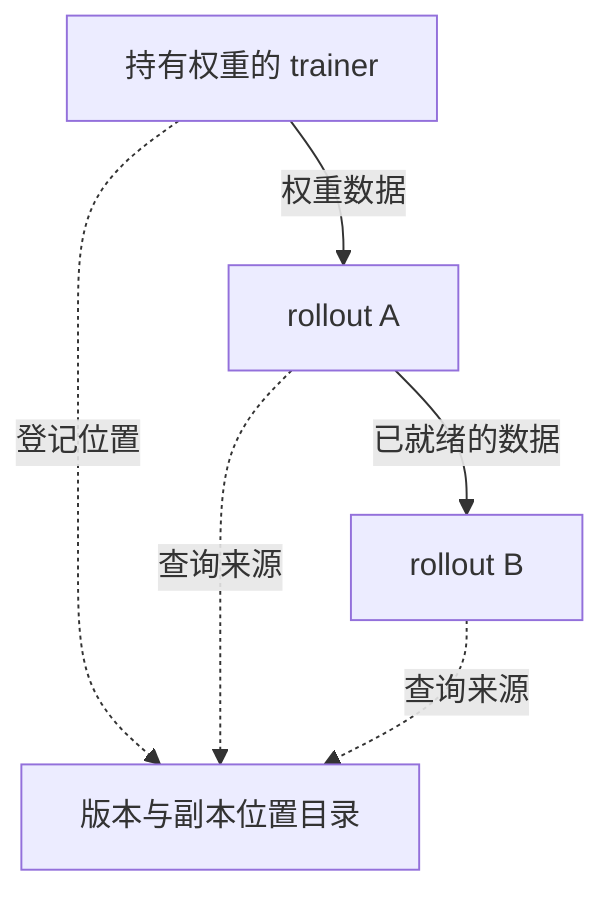
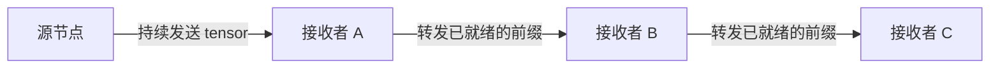
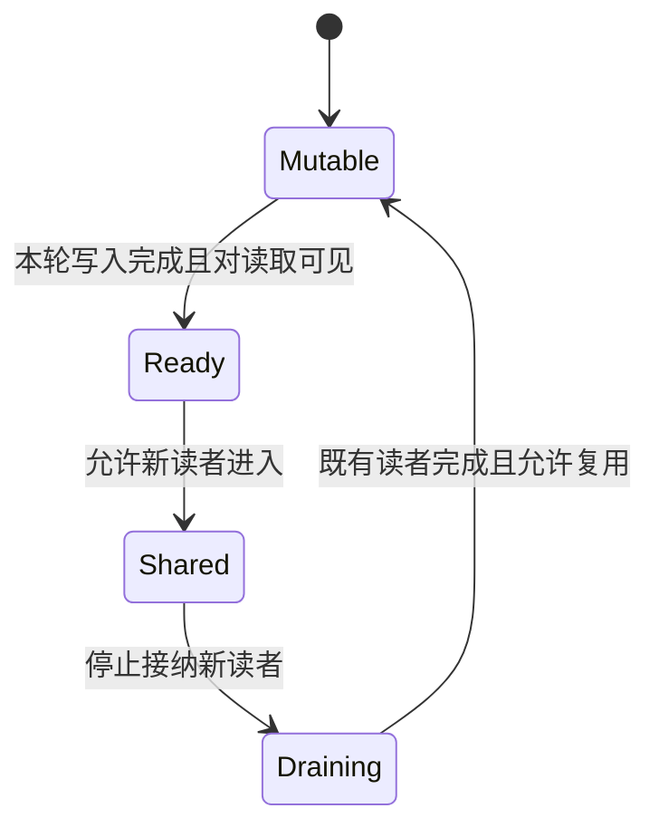

# TensorHub 论文解读：从权重传输到版本分发服务

一次权重更新花了三秒，这个数字意味着什么？

可能是两台机器之间传输花了三秒，也可能是一千张 GPU 全部停下来等了三秒。还可能有一些 rollout 继续生成旧版本样本，传输没有阻塞它们，但这些样本后来因过期而被丢弃。三种情况的网络延迟看起来相近，训练成本却可能差得很远。

TensorHub 研究的是这个问题背后的系统组织方式：当训练器不断产生新权重，而 rollout 分布在大量、动态加入甚至跨机房的节点上时，怎样让它们高效、安全地取得需要的版本？它的核心思路是**管理已有权重副本的引用，让接收者也成为数据来源，并把读取、覆盖和版本选择纳入同一套协议。**

本文解读 ByteDance Seed 与威斯康星大学麦迪逊分校合作的 [TensorHub v1](https://arxiv.org/html/2604.09107v1)。先说明问题和方案，再看实验能够支持什么结论，最后讨论边界与启示。文中的成本公式、示意图和假想例子用于解释机制，均非论文实测；较长的推导放在文末。通信库的补充说明按 2026-09-10 查阅的官方文档给出。

## 权重分发难在哪里：带宽、协调与版本同时变化

RL 训练器更新参数后，rollout 需要取得适合推理使用的权重，继续生成训练样本。只有一个发送者和一个接收者时，问题很容易被理解成一次大文件传输；当接收者数量增加、进度不同、节点随时被抢占时，还必须处理数据来源、更新时机和故障恢复。[论文 §2](https://arxiv.org/html/2604.09107v1#S2)

这些困难会相互放大：

- **权重大、更新频繁、接收者多。** 大量 rollout 同时向 trainer 拉取同一版本，竞争的是同一个源节点的出口带宽。
- **计算进度不同。** 一个 rollout 还在生成长序列，另一个已经准备更新；扩大同步范围会让更多 GPU 等待慢节点。
- **成员和网络环境会变化。** 弹性节点需要随时加入，跨机房节点又受慢链路限制，固定的数据分发路径难以适应所有场景。
- **权重缓冲区必须复用。** 旧版本可能仍被远端读取，而持有者已经准备覆盖它；分片模型还要求各 rank 选择同一个版本。

已有方法各有优势，也各有代价。下表讨论的是论文所比较的权重分发组织方式。

| 方式                 | 已有优势                         | 在这类工作负载中的限制                                                           |
| -------------------- | -------------------------------- | -------------------------------------------------------------------------------- |
| NCCL 集体通信        | 高吞吐、适合预先组织好的通信组   | 论文中的框架集成采用较大范围的同步；成员变化和慢节点会带来协调成本               |
| UCX 点对点传输       | 直接传输、成员关系灵活           | 若接收者都向 trainer 拉取，扇出仍会集中消耗 trainer 的出口；副本选源需要上层调度 |
| 参数服务器或对象存储 | 发布与读取解耦，接收者可按需获取 | 先把权重交给存储，再供接收者读取，可能增加网络、GPU–CPU 搬运或暂存空间           |

这些限制来自论文的基线与工作负载，不能扩展成底层库永远做不到什么。[论文 §2.3](https://arxiv.org/html/2604.09107v1#S2.SS3) 例如 NCCL 官方文档已有 `ncclCommShrink`、`ncclCommGrow`，通过创建新通信组删减或增加 rank，但仍需要相应协调与框架集成；UCX 也提供 RMA put/get、tag matching、active messages 等能力。真正需要比较的是完整的数据流、协调范围与版本约束。[NCCL 通信组管理](https://docs.nvidia.com/deeplearning/nccl/user-guide/docs/usage/communicators.html)、[UCX FAQ](https://openucx.readthedocs.io/en/master/faq.html)

TensorHub 选择保留存储接口的按需读取能力，同时尽量直接利用 worker 已经持有的权重。这个设计利用了两个工作负载特征：**同一版本会被复制到多个推理节点，而每份副本在共享期间可以保持不变。** 新版本可以从单个来源开始，随着复制逐步获得更多数据来源。

## 核心工作：把已有副本组织成可读取的版本

### ROS：登记权重在哪里，让接收者继续提供数据

论文将这个抽象称为 Reference-Oriented Storage（ROS）。引用服务器管理版本及其副本位置，权重数据直接在客户端之间传输。trainer 发布某个版本后，rollout 可以按版本请求数据；rollout 接收完成，又成为该版本的另一个来源。[论文 §3.1](https://arxiv.org/html/2604.09107v1#S3.SS1)

下面的虚线是元数据交互，实线是数据流。图只展示一种可能的来源选择。

这个变化直接影响扇出成本。设权重大小为 $S$，有 $R$ 个接收者，源节点可用总出口带宽为 $B$。如果全部从源节点拉取完整权重，源节点需要输出 $RS$ 字节，全部完成的时间至少为：

$$
T_{\mathrm{all}}\geq\frac{RS}{B}.
$$

接收者能转发后，其他节点的出口也参与分发。每个目的地仍然需要收到数据，改变的是这些字节由哪些链路承担。这里的收益来自利用已有副本和网络资源。

### publish 与 unpublish：共享期间不修改，覆盖前排空读取

直接读取已有权重省去了中间存储，也使缓冲区生命周期成为正确性的核心。设 trainer 发布了版本 100，rollout A 正在读取；如果 trainer 此时把同一缓冲区覆盖成 101，A 就可能读到混合内容。

ROS 的约定是：发布引用意味着承诺内容不可变。需要修改时，持有者先调用 `unpublish()`；服务器停止让新请求选择该来源，并等待已开始的读取结束，之后才允许复用缓冲区。通过复制得到的副本同样需要遵守这一约定。[论文 §3.2](https://arxiv.org/html/2604.09107v1#S3.SS2)

可以用一个必要条件理解它：对于缓冲区 $b$，设 $a_b$ 表示是否仍接纳新读取，$r_b$ 为尚未完成的合法读取数量，那么安全覆盖至少需要：

$$
a_b=\mathrm{false}\quad\land\quad r_b=0.
$$

只观察到某一刻没有读者还不够，因为检查后仍可能进入新读者；只停止新读取也不够，因为已有传输可能尚未完成。设备上的写入可见性还需要单独保证，文末补充讨论这一层。

### retention：主动覆盖最后一份时，保住仍需要的版本

如果所有持有者都撤销了版本 100，引用目录本身无法让它继续存在。对于过旧版本，这通常符合预期；对于仍需保留的版本，则需要额外安排。

ROS 允许使用者声明要保留的版本，例如最近若干版。处理主动 `unpublish` 时，如果即将撤销的是所需版本的最后有效副本，系统会要求把权重卸载到 CPU，并登记为暂存副本。其他副本接过数据，或该版本不再需要保留后，暂存空间可以释放。[论文 §3.3](https://arxiv.org/html/2604.09107v1#S3.SS3)

因此，“利用已有副本”描述的是常见路径。版本保留仍可能产生 CPU 内存和 PCIe 搬运成本，也不等于任意故障下都能找回每一个历史版本。

### 流水复制：接收完整分片之前，就能服务下游

光允许完整副本转发，仍可能让后续接收者等太久。TensorHub 进一步允许正在接收的 worker 成为来源：它维护进度计数器，记录目标版本中已收到的 tensor 数量；下游读取进度，拉取已经就绪的 tensor 前缀，再查询进度并继续读取。[论文 §4.3.3](https://arxiv.org/html/2604.09107v1#S4.SS3.SSS3)

这样，A 接收后续 tensor 时，可以同时向 B 提供前面的 tensor。引用服务器负责选源，优先同机房并考虑当前复制负载；数据在客户端之间流动。流水能否接近理想速度，取决于双向带宽、共享瓶颈、tensor 大小和路径长度，不能推成任意规模下延迟恒定的保证。[论文 §4.3.1–4.3.3](https://arxiv.org/html/2604.09107v1#S4.SS3)

数据面的实现也有条件：长期稳定的缓冲区适合直接注册并通过 RDMA 读取；频繁重新分配时，TensorHub 使用预注册缓冲区和复制路径；没有 RDMA 时使用 TCP。因此应区分“ROS 避免中间存储”和“每一种传输路径都没有内存复制”。[论文 §4.3.2](https://arxiv.org/html/2604.09107v1#S4.SS3.SSS2)

### 组事务：让不同 rank 对 latest 得到相同答案

对于分片模型，传对每个 tensor 还不够。假设一个推理副本包含两个 rank：rank 0 查询 `latest` 得到 100，随后 101 发布，rank 1 查询得到 101。两次查询各自都合法，组合后却不是一个完整版本。

TensorHub 以模型并行组为粒度执行事务。第一个 rank 的请求到达时，服务器代表全组执行请求，把解析出的版本等必要信息保存下来；同一事务的后续请求复用这些信息，事务按启动顺序串行化。因此，即使中途发布了 101，同组 rank 仍会取得共同确定的 100。[论文 §4.4](https://arxiv.org/html/2604.09107v1#S4.SS4)

把它放回推理端，一次完整更新应满足下面这个用于分析的提交条件：

$$
\forall i,j\in G,\quad v_i=v_j=v_{\mathrm{commit}}.
$$

这里 $G$ 是一个模型并行组。共同选择目标版本后，各 rank 还需完成分片接收和安装，才能使用完整的新模型。这个保证不要求所有 rollout 副本同时切换，也不会自动保证训练满足严格 on-policy；样本可以来自哪些版本，仍由算法和训练框架决定。

## 同一套机制怎样支持弹性节点与跨机房

### 弹性节点：从现存副本加入，来源失效后重新选源

引用目录让新 rollout 可以从当前持有者获取权重，健康节点不必为每一次加入重新执行全局广播。正在复制时如果来源失效，接收者报告失败，服务器排除该来源并安排其他副本继续服务。故障按副本粒度处理，避免只移除一个分片却留下不完整模型。[论文 §4.5](https://arxiv.org/html/2604.09107v1#S4.SS5)

这解决了成员变化时的数据来源问题，但恢复仍包含检测、重新调度和补传。能恢复不代表没有延迟代价，也依赖所需版本仍存在于可用来源中。

### 跨机房：先传入一份，再在本地分发

如果远端机房有 $R$ 个完整副本需要同一版、大小为 $S$ 的权重，每个副本都跨机房拉取会产生 $RS$ 的慢链路流量。先传入一份，再通过机房内网络复制，理想情况下可以把跨机房流量缩小到 $S$。

TensorHub 把首先跨机房拉取的副本称为 seeding replica。其余副本随后使用机房内 RDMA 和流水复制。但如果它们过早开始更新，就会一起等待尚未到齐的 TCP 数据。因此论文还加入了两项调度策略：[论文 §4.3.4](https://arxiv.org/html/2604.09107v1#S4.SS3.SSS4)

- **smart skipping**：跨机房播种尚未完成时，`update()` 暂时把该新版本视为不可用，其他 rollout 继续当前工作，稍后再查询。
- **offload seeding**：把跨机房数据先接收到临时 CPU 缓冲区，让播种节点的 GPU 也能继续使用旧权重；后台接收完成后，再在后续更新中使用。

两者分别减少“其他接收者等播种”和“播种节点本身等待”的前台停顿。它们交换的资源是 CPU 空间和新权重的使用时机，慢链路本身并没有因此变快。

## 收益如何：三个加速比衡量的是不同的等待

理解实验前，先定义累计 GPU 等待成本。设第 $i$ 张 GPU 因更新而实际暂停计算的时长为 $s_i$，则：

$$
C_{\mathrm{stall}}=\sum_{i=1}^{N}s_i.
$$

单位是 GPU·秒。它同时受到“每张卡等多久”和“有多少张卡需要等”的影响，不等于训练总耗时，也不包含生成后被丢弃的样本所浪费的全部计算。

论文的主要结果可以按下面的口径阅读：

| 报告的改善 | 对照与实际指标                                        | 实验范围与限定                                                                     |
| ---------- | ----------------------------------------------------- | ---------------------------------------------------------------------------------- |
| 6.7×       | 相对生产版 NCCL 的累计 GPU 等待时间                   | 模拟 1T 模型、1024 GPUs；不是训练总耗时                                            |
| 4.8×       | 相对 UCX，第 10 步末批弹性副本更新等待约 7.2 → 1.5 秒 | 260B，8 张稳定与 24 张弹性 rollout GPUs；固定扩缩事件                              |
| 19×        | 相对 UCX/TCP 的累计 standalone rollout 等待           | 9B，16 张 trainer 与 8 张 rollout GPUs，两个机房；包含 skipping 与 offload seeding |

来源：[§5.2](https://arxiv.org/html/2604.09107v1#S5.SS2)、[§5.3](https://arxiv.org/html/2604.09107v1#S5.SS3)、[§5.4](https://arxiv.org/html/2604.09107v1#S5.SS4)。其中 4.8× 的具体口径依据正文给出的 7.2/1.5；三个数字来自不同实验，不能相乘。

这里的 standalone rollout 是与 trainer 分离、专门负责生成的 GPU；trainer 侧的 GPU 则在训练和同机生成之间切换。模拟 1T 实验使用相同的 768 张 trainer GPU 和 256 张 standalone GPU。TensorHub 发布引用后，trainer 侧可继续自己的生成任务，无需等独立 rollout 全部取得权重；减少的是额外等待，并没有减少参与任务的 GPU 数量。[论文 §5.2](https://arxiv.org/html/2604.09107v1#S5.SS2)

**6.7× 最能说明协调范围的价值。** 论文在该设置中比较了 NCCL 下 1024 张卡每轮约 5.3 秒的等待，与 TensorHub 下仅 256 张 standalone rollout 卡平均约 3.1 秒的等待。累计成本的变化同时包含等待缩短和等待范围缩小。正文秒数经过取整，论文报告的总量改善为 6.7×；不能只把两个延迟相除，也不能把它写成模型训练加速 6.7×。[论文 §5.2](https://arxiv.org/html/2604.09107v1#S5.SS2)

另外两项结果分别对应前面的方法：弹性场景利用稳定副本分担新节点的读取请求；跨机房场景组合了本地复制、暂缓更新与后台接收。Figure 12 只统计 standalone rollout 的等待，未计入 UCX 额外引起的 trainer 等待。这些结果反映整套策略在特定条件下的收益，不能全部归因于单条链路带宽提升。[论文 §5.3–5.4](https://arxiv.org/html/2604.09107v1#S5.SS3)

微基准还提供了更直接的机制证据：单个 shard 传输 50 GB 时，论文报告 TensorHub 约 2.2 秒、22 GB/s，约为理论带宽的 88%；在 1–8 个 rollout 组的突发请求测试中，启用流水复制后的累计等待随组数近似线性增长，而禁用后表现为二次增长。这支持数据面效率与副本转发的价值，结论范围仍是论文测试的硬件和规模。[论文 §5.1.1–5.1.2](https://arxiv.org/html/2604.09107v1#S5.SS1)

比较范围也需要保留：作者承认可以设计更细粒度的协调，但没有穷尽比较所有实现；这里的 NCCL/UCX 基线是 ByteDance 生产框架中的集成方式。[论文 §5.2](https://arxiv.org/html/2604.09107v1#S5.SS2)

作者称已训练真实模型，确认 loss 和 accuracy 与 ByteDance 生产结果一致，但没有展示详细结果。因此论文提供了训练效果验证的声明，公开证据仍不足以独立评估达到相同效果所需的墙钟时间与 GPU·小时。[论文 §5](https://arxiv.org/html/2604.09107v1#S5)

## 局限与疑问：哪些收益还需要放回训练中验证

### 少等一会儿，是否真的增加了有效训练供给

跨机房后台接收期间，GPU 可以继续生成旧版本样本。即使这些样本最后全部被丢弃，GPU 的实际停顿仍然可能很短。因此应当同时报告累计等待、有效样本吞吐，以及达到固定效果的时间与成本。

可以用一个假想例子说明：方案 A 每秒生成 100 条样本，95% 被采用，有效吞吐为 95；方案 B 因更少暂停达到每秒 130 条，但只有 65% 被采用，有效吞吐约为 84.5。原始生成吞吐提高了，训练供给反而减少。

这不是 TensorHub 已发生效果退化的证据，而是采用时仍需核查的问题。样本的质量、长度和策略版本差异还会进一步影响学习效率。对于长轨迹，也需要明确版本标记覆盖整条轨迹、一次请求还是某段生成。

### 传输能够隐藏，容量和安装成本仍然存在

设每秒必须从跨机房链路接收 $\lambda$ 个新版本，每版大小为 $S$，实际可用带宽为 $B_{\mathrm{wan}}$，至少要满足理想平均容量约束：

$$
\lambda S\leq B_{\mathrm{wan}}.
$$

实际部署还需为波动和固定开销留出余量。如果每版 100 GB、带宽 10 GB/s，单次传入至少 10 秒；trainer 每 5 秒产生一版且远端必须接收每一版时，后台执行无法消除积压。允许跳过中间版本时，$\lambda$ 应取必须实际接收的频率，而不是直接取 trainer 更新频率。

此外，收到网络数据并不自动意味着推理引擎可以使用。导出、布局转换、安装和后处理也可能成为关键路径。vLLM 官方接口就区分开始更新、传输和结束更新，并提供暂停与恢复生成的控制。[vLLM Weight Transfer](https://docs.vllm.ai/en/latest/training/weight_transfer/)

这使 CPU 峰值、安装耗时、并发推理干扰与版本滞后都成为必要的评估项。TensorHub 减少某一环节的等待后，应继续检查成本是否转移到其他环节。

### 在线版本保留有明确故障边界

论文对故障假设作了限定：retention 不把 spot 副本计作保留保障；最后一个非 spot 副本失效时，所需版本可能不可用。引用服务器故障后，客户端切换到备份并重新发布，备份不恢复此前的全部元数据。[论文 §4.5](https://arxiv.org/html/2604.09107v1#S4.SS5)

对于主要关心近期权重、允许失效版本不再恢复的工作负载，我认为这个边界可能可以接受。若业务必须恢复某个精确历史版本，仍需要明确的持久化边界。另一个可核查的代价是故障检测：论文的传输中断微基准包含约 4 秒的 RDMA 超时，说明透明恢复依然会影响尾延迟。[论文 §5.1.3](https://arxiv.org/html/2604.09107v1#S5.SS1.SSS3)

更大规模下，单个引用服务器的控制开销也值得继续测试。作者将划分子集群、由多个服务器分别管理列为潜在扩展方向，尚不能据此认定 v1 已实现该架构。[论文 §4.3.1](https://arxiv.org/html/2604.09107v1#S4.SS3.SSS1)

### 增量同步是可组合的方向，还需要基版本协议

TensorHub 主要改变“数据从哪里、沿什么路径分发”；[[foundations/RL/系统/权重同步/veRL增量权重同步方案|veRL 增量权重同步]] 与 [[foundations/RL/系统/权重同步/slime增量权重同步机制|slime 增量权重同步]] 则提示另一个优化方向：减少每次必须传输的字节。

两者有组合空间，但增量 patch 必须作用于正确的基版本。离线很久的节点可能需要先获取完整快照，再进入增量路径；原地应用 patch 也会修改共享缓冲区，仍然要等待合法读者退出。

一个值得验证的后续方案是同时管理 patch 和完整快照，比较额外保留空间、恢复成本与节省的网络流量。这是本文提出的扩展方向，不是 TensorHub v1 已实现增量同步的声明。

## 启示与结论：把数据来源、生命周期和版本策略一起设计

我认为 TensorHub 最值得借鉴的是：**一个已经用于计算的副本，也可以成为系统的数据服务能力。** 当权重在短时间内不可变、同一版本又存在多个副本时，利用这些副本能够分散源节点压力，并减少专门中间存储的搬运。这个判断依赖数据本身的生命周期，不能直接套用到持续原地修改的数据上。

第二个启示是，分发性能取决于协调范围。一次更新让多少 GPU 停下来，与每条链路跑得多快同样重要。ROS 的按需读取、模型并行组事务和跨机房暂缓更新，把协调放在不同范围内；理解这些范围，比只记住一个加速比更有用。

第三个启示是，把性能边界和正确性边界一起写清楚。允许副本转发，就需要管理来源与读取生命周期；允许独立更新，就需要定义组内一致性和样本版本规则；允许后台接收，就需要测量新鲜度、容量与 CPU 代价。这些约束决定了优化能否转化为有效训练进度。

因此，我会把采用决策落到一条证据链上：先确认权重更新造成了多少等待，定位传输与协调各自的贡献，再在相同版本使用条件下比较有效吞吐，最后验证达到相同训练效果的时间与成本。TensorHub 的论文结果为版本分发服务提供了有力的系统证据，具体系统是否值得采用，还要完成后两层验证。

相关基础：[[foundations/RL/系统/权重同步/veRL全量权重同步机制|veRL 全量权重同步机制]]、[[foundations/RL/系统/权重同步/主要RL框架重同步方案|主要 RL 框架权重同步方案]]、[[foundations/RL/算法/GRPO|GRPO]]。

## 补充推导与部署评估

下面保留用于理解和评估这一类系统的通用分析。模型与算例均为本文构造，不能作为 TensorHub 的实测结果或实现保证。

### 一次更新的成本与关键路径

在完全串行的简化模型下：

$$
T_{\mathrm{update}}
=T_{\mathrm{export}}
+T_{\mathrm{transfer}}
+T_{\mathrm{install}}
+T_{\mathrm{coord}}.
$$

协调成本包括等待可更新边界、启动传输以及确认完成。若使用流水或并发，总耗时应按依赖图上的关键路径计算，不能机械相加。

假设导出 1.0 秒、网络 2.0 秒、安装 0.5 秒、协调 1.5 秒，总共 5.0 秒。把网络提升四倍后，总时间仍有 3.5 秒，整体只加速约 1.43 倍。这个算例用于判断下一步该优化哪一个环节。

### 单源扇出与流水复制的理想模型

设一个源节点发送 $S$ 字节给 $R$ 个接收者，总出口带宽为 $B$。忽略协议和共享网络开销，并假设所有接收者同时暂停，完整接收后才恢复。每个接收者先代表一张 GPU。

若所有请求公平共享源节点带宽，每个请求都在约 $RS/B$ 后完成，接收者累计等待为：

$$
C_{\mathrm{fair}}\approx\frac{R^2S}{B}.
$$

若逐个发送，先接收的节点可以提前恢复，累计等待为：

$$
C_{\mathrm{serial}}
=\frac{S}{B}\sum_{j=1}^{R}j
=\frac{R(R+1)S}{2B}.
$$

两者都随 $R^2$ 增长，但调度顺序改变了常数。若排队期间仍继续计算，排队时长不能直接计为 GPU 等待；若每个接收副本由 $g$ 张同步等待的 GPU 组成，上述成本还需乘以 $g$。

再把权重切为 $m$ 个等大块，沿源节点到 $R$ 个接收者组成的链转发。假设每跳带宽均为 $B$，中间节点可以同时收发，各链路不竞争，块完整到达后才可转发。末端完成时间为：

$$
T_{\mathrm{pipe}}
=(m+R-1)\frac{S}{mB}
=\frac{S}{B}\left(1+\frac{R-1}{m}\right).
$$

例如 $S=40$ GB、$B=20$ GB/s、$R=8$、$m=100$。单源直接发送八份的全部完成时间下界为 16 秒；理想流水模型得到约 2.14 秒。它依赖足够的双向带宽和互不竞争的路径，实际 tensor 大小不一时也不会精确成立。

若每跳处理每块还占用不可与下一块传输重叠的串行服务时间 $\alpha$，则：

$$
T_{\mathrm{pipe}}
\approx(m+R-1)\left(\frac{S}{mB}+\alpha\right).
$$

此处 $\alpha$ 不是能与后续块重叠的纯传播时延。块无限变小会增加固定开销，最慢一跳则限制稳定吞吐。这个模型解释流水的收益与条件，不预测 TensorHub 在任意集群中的延迟。

### 引用生命周期之外，还要保证设备可见性

可以用下面的概念状态机检查缓冲区复用。它不是 TensorHub 的源码状态机，也不包含完整故障处理。

Python 函数返回、CUDA 工作入队与设备完成执行，可能是不同时间点。GPUDirect RDMA 文档要求正确处理 CUDA 操作与外部设备访问的内存顺序，不能仅靠普通主机控制流假定正在运行的 kernel 与并发 RDMA 写入一致。[GPUDirect RDMA：内存顺序](https://docs.nvidia.com/cuda/gpudirect-rdma/index.html#synchronization-and-memory-ordering)

因此应找到生产者写入完成、远端读取完成、消费者开始使用之间的明确依赖。引用生命周期和设备数据可见性都要成立。注册缓存与延迟解除固定可以复用映射，但释放和重新分配事件仍需正确处理，不能把稳定地址当成所有训练后端默认满足的条件。[GPUDirect RDMA：设计考虑](https://docs.nvidia.com/cuda/gpudirect-rdma/index.html#design-considerations)

### 后台接收隐藏了多少前台等待

设后台接收耗时为 $T_{\mathrm{fetch}}$，启动接收后 GPU 仍获准继续计算的墙钟窗口为 $W_{\mathrm{run}}$，最终安装耗时为 $T_{\mathrm{install}}$。在接收与计算可以并发、安装串行执行的单次更新模型下：

$$
T_{\mathrm{foreground}}
\approx\max(0,T_{\mathrm{fetch}}-W_{\mathrm{run}})+T_{\mathrm{install}}.
$$

这里的窗口由实际调度决定，不由样本是否最终被采用决定。后台传输 10 秒、GPU 同时生成 10 秒、最后安装 1 秒，即使样本全部被丢弃，前台停顿仍是 1 秒。训练收益则需要另外衡量：同一窗口内，若生成速度为 $q$、样本接纳比例为 $a$，接纳吞吐可写为 $q_{\mathrm{accepted}}=qa$，还需进一步考虑样本长度与质量。

### 稀疏 patch 减少的是载荷

以下只分析通用的稀疏覆盖 patch，不假定某个框架的实现。设权重有 $N$ 个元素，每个值占 $s$ 字节，变化比例为 $r$，每个位置索引占 $i$ 字节。忽略元数据：

$$
D_{\mathrm{full}}=Ns,\qquad
D_{\mathrm{patch}}\approx Nr(s+i).
$$

若 $s=2$、$i=4$、$r=0.02$，patch 大小约为全量的 6%。它改变单次更新的字节量，副本调度改变载荷的分布方式；组合时仍需满足正文讨论的基版本与读取生命周期约束。

### 一组能够支持采用决策的实验

先固定模型、训练与推理并行布局、精度、网络预算和样本接纳规则，再逐层扩大实验。比较传输系统时，应尽量保持版本使用条件一致。

| 实验           | 要固定或控制的条件                     | 主要观察                                   |
| -------------- | -------------------------------------- | ------------------------------------------ |
| 单源到单接收者 | 相同 tensor 布局、内存类型与载荷       | 有效带宽、注册成本、安装耗时               |
| 扇出规模增长   | 每个规模点的方案使用相同资源与源节点数 | 全部完成时间、累计等待、出口占用           |
| 并发推理       | 相同推理负载、不同分发并发度           | decode 吞吐与尾延迟是否受影响              |
| 节点加入与故障 | 相同扩缩时序、不同故障位置             | 恢复时间、补传字节、错误版本提交           |
| 跨机房         | 固定带宽、时延与必须接收的版本频率     | 慢链路字节数、版本滞后、CPU 峰值           |
| 完整训练       | 相同算法、数据、接纳规则与评测         | 有效样本吞吐、GPU·小时、达到目标效果的时间 |

独立改变是否允许副本转发、是否需要全局暂停、是否允许后台接收，检查它们的交互作用，不把分别测得的加速比简单相乘。

正确性测试可使用小规模、可重复的事件序列：读取期间请求覆盖、部分分片收到新版本、复制来源中途失效、控制服务重启，以及错误基版本上应用 patch。还应检查迟到回调：传输 A 超时后启动 B，如果 A 的完成通知迟到，是否会被误认为 B 成功？这是通用审查问题，不表示 TensorHub 存在该缺陷。

最后给指标标明起止点。更新延迟可以从发布开始计时，也可以从 rollout 决定拉取开始计时；延后更新会让后一种口径较短，前一种口径仍包含等待新权重被采用的时间。同时报告两者，才能看清减少停顿与版本新鲜度的关系。
