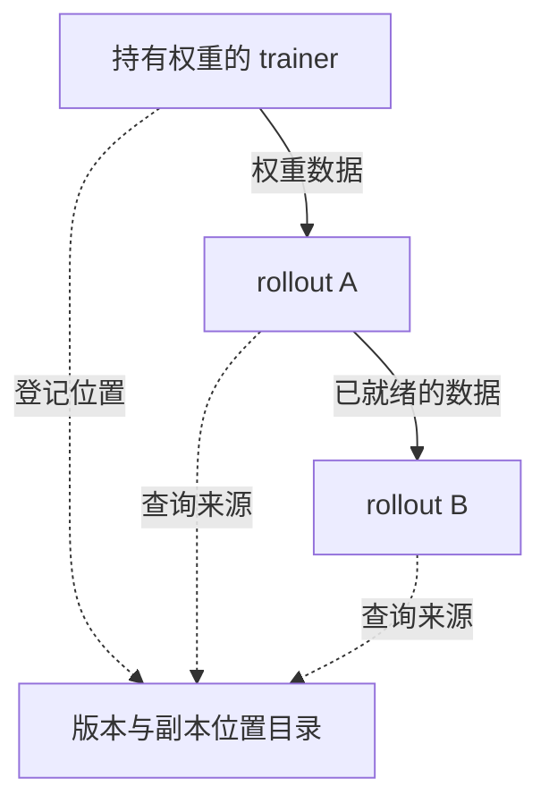
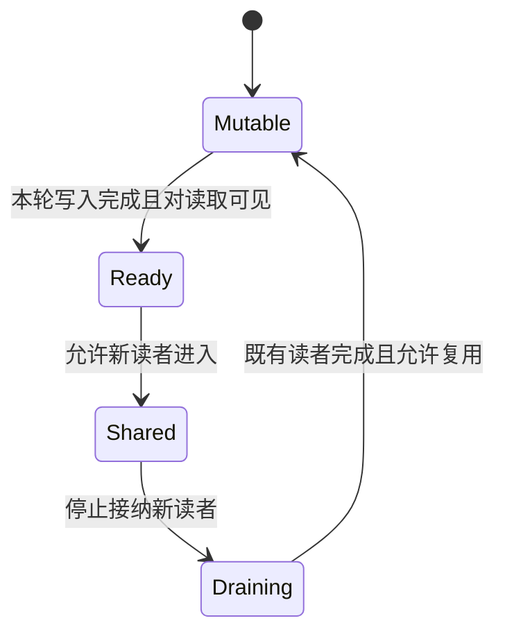

# TensorHub 论文解读：从权重传输到版本分发服务

一次权重更新花了三秒，这个数字意味着什么？

可能是两台机器之间传输花了三秒，也可能是一千张 GPU 全部停下来等了三秒。还可能有一些 rollout 继续生成旧版本样本，传输没有阻塞它们，但这些样本后来因过期而被丢弃。三种情况的网络延迟看起来相近，训练成本却可能差得很远。

TensorHub 要解决的，正是大规模 RL 训练中的这类等待。训练器不断产生新权重，rollout 节点却可能进度不同、随时加入，甚至位于另一个机房。它让这些节点按需获取权重：**系统记录每个版本在哪里，接收者也能继续向其他节点提供数据；至于什么时候可以读取、覆盖或切换版本，则由协议约定。**

这篇论文由 ByteDance Seed 与威斯康星大学麦迪逊分校合作完成，下文以 [TensorHub v1](https://arxiv.org/html/2604.09107v1) 为准。为方便理解，我补充了一些简化模型和算例，与论文实验分开标明，详细推导放在文末。涉及通信库的说明依据 2026-09-10 查阅的官方文档。

## 为什么权重分发会成为瓶颈

RL 训练器更新参数后，rollout 需要取得适合推理使用的权重，继续生成训练样本。只有一个发送者和一个接收者时，问题很容易被理解成一次大文件传输；当接收者数量增加、进度不同、节点随时被抢占时，还必须处理数据来源、更新时机和故障恢复。[论文 §2](https://arxiv.org/html/2604.09107v1#S2)

最直接的瓶颈是源节点的出口：大量 rollout 同时向 trainer 拉取同一版本，接收者越多，带宽竞争越激烈。计算进度又会放大等待。一个 rollout 还在生成长序列，另一个已经准备更新，如果要求它们一起停、一起恢复，快节点就要陪着慢节点等。

加入弹性资源和跨机房节点后，分发路径还得适应成员变化和慢链路。与此同时，GPU 上的权重缓冲区往往需要原地复用：远端可能还在读取旧版本，本地却已经准备覆盖它。模型如果分散在多个 rank 上，还必须保证这些 rank 选中同一个版本。

论文比较了三种常见做法：

| 方式                 | 已有优势                         | 在这类工作负载中的限制                                                           |
| -------------------- | -------------------------------- | -------------------------------------------------------------------------------- |
| NCCL 集体通信        | 高吞吐、适合预先组织好的通信组   | 论文中的框架集成采用较大范围的同步；成员变化和慢节点会带来协调成本               |
| UCX 点对点传输       | 直接传输、成员关系灵活           | 若接收者都向 trainer 拉取，扇出仍会集中消耗 trainer 的出口；副本选源需要上层调度 |
| 参数服务器或对象存储 | 发布与读取解耦，接收者可按需获取 | 先把权重交给存储，再供接收者读取，可能增加网络、GPU–CPU 搬运或暂存空间           |

表中的限制针对论文使用的框架实现。[论文 §2.3](https://arxiv.org/html/2604.09107v1#S2.SS3) 底层库还提供了其他选择：NCCL 的 `ncclCommShrink`、`ncclCommGrow` 可以通过创建新通信组删减或增加 rank，UCX 也有 RMA put/get、tag matching、active messages 等接口。把这些能力用于权重同步，仍需要上层框架安排数据来源、协调参与者，并处理版本关系。[NCCL 通信组管理](https://docs.nvidia.com/deeplearning/nccl/user-guide/docs/usage/communicators.html)、[UCX FAQ](https://openucx.readthedocs.io/en/master/faq.html)

TensorHub 的切入点来自推理过程本身：**同一版本会被复制到多个推理节点，而每份副本在共享期间可以保持不变。** 这些节点手里已经有了别人需要的数据。于是，系统可以提供按版本读取的接口，直接从现有持有者那里取权重。新版本从一个来源开始，每完成一次复制，就多一个可用来源。

## TensorHub 怎样利用已有的权重副本

### ROS：登记权重在哪里，让接收者继续提供数据

论文将这个抽象称为 Reference-Oriented Storage（ROS）。引用服务器管理版本及其副本位置，权重数据直接在客户端之间传输。trainer 发布某个版本后，rollout 可以按版本请求数据；rollout 接收完成，又成为该版本的另一个来源。[论文 §3.1](https://arxiv.org/html/2604.09107v1#S3.SS1)

例如，rollout B 可以从 A 获取权重。图中虚线表示元数据交互，实线表示权重传输。

这个变化直接影响扇出成本。设权重大小为 $S$，有 $R$ 个接收者，源节点可用总出口带宽为 $B$。如果全部从源节点拉取完整权重，源节点需要输出 $RS$ 字节，全部完成的时间至少为：

$$
T_{\mathrm{all}}\geq\frac{RS}{B}.
$$

接收者能转发后，其他节点的出口也参与分发。每个目的地仍要收到完整的数据，但这些流量可以由多个来源分担。

### publish 与 unpublish：共享期间不修改，覆盖前排空读取

直接读取已有权重省去了中间存储，却也带来一个问题：读取还没结束，持有者就想修改权重怎么办？设 trainer 发布了版本 100，rollout A 正在读取；如果 trainer 此时把同一缓冲区覆盖成 101，A 就可能读到混合内容。

ROS 的约定是：发布引用意味着承诺内容不可变。需要修改时，持有者先调用 `unpublish()`；服务器停止让新请求选择该来源，并等待已开始的读取结束，之后才允许复用缓冲区。通过复制得到的副本同样需要遵守这一约定。[论文 §3.2](https://arxiv.org/html/2604.09107v1#S3.SS2)

要覆盖缓冲区 $b$，至少得停止接纳新读取，并等已有读取全部结束。设 $a_b$ 表示是否仍接纳新读取，$r_b$ 为尚未完成的读取数量，这个条件可以写成：

$$
a_b=\mathrm{false}\quad\land\quad r_b=0.
$$

这两个条件缺一不可：检查后可能又进来一个新读者，关闭入口时也可能还有传输尚未完成。实际实现还要处理 GPU 写入对远端何时可见，文末会进一步讨论。

### retention：最后一份副本也要被覆盖时怎么办

如果所有持有者都撤销了版本 100，系统也就找不到这版的权重了。旧版本被淘汰通常没有问题，但有些 rollout 可能仍需要它，最新版本也可能还没来得及被其他节点接走。

ROS 允许使用者声明要保留的版本，例如最近若干版。处理主动 `unpublish` 时，如果即将撤销的是所需版本的最后有效副本，系统会要求把权重卸载到 CPU，并登记为暂存副本。其他副本接过数据，或该版本不再需要保留后，暂存空间可以释放。[论文 §3.3](https://arxiv.org/html/2604.09107v1#S3.SS3)

发生这类暂存时，系统会占用 CPU 内存并产生 PCIe 搬运。它保住了主动覆盖时可能丢失的版本；节点突然故障时能保住什么，后面还要单独讨论。

### 流水复制：接收完整分片之前，就能服务下游

光允许完整副本转发，仍可能让后续接收者等太久。TensorHub 进一步允许正在接收的 worker 成为来源：它维护进度计数器，记录目标版本中已收到的 tensor 数量；下游读取进度，拉取已经就绪的 tensor 前缀，再查询进度并继续读取。[论文 §4.3.3](https://arxiv.org/html/2604.09107v1#S4.SS3.SSS3)

这样，A 接收后续 tensor 时，可以同时向 B 提供前面的 tensor。引用服务器选源时优先考虑同机房、当前复制负载较低的副本。流水的实际速度仍受双向带宽、共享链路、tensor 大小和路径长度限制。[论文 §4.3.1–4.3.3](https://arxiv.org/html/2604.09107v1#S4.SS3)

缓冲区的分配方式还会影响传输路径。长期稳定的缓冲区适合直接注册并通过 RDMA 读取；频繁重新分配时，TensorHub 先把数据复制到预注册缓冲区，再传出去；没有 RDMA 时则使用 TCP。因此，ROS 虽然省去了专门的中间存储，具体路径上仍可能存在内存复制。[论文 §4.3.2](https://arxiv.org/html/2604.09107v1#S4.SS3.SSS2)

### 组事务：让不同 rank 对 latest 得到相同答案

对于分片模型，传对每个 tensor 还不够。假设一个推理副本包含两个 rank：rank 0 查询 `latest` 得到 100，随后 101 发布，rank 1 查询得到 101。两次查询各自都合法，组合后却不是一个完整版本。

TensorHub 以模型并行组为粒度执行事务。第一个 rank 的请求到达时，服务器代表全组执行请求，把解析出的版本等必要信息保存下来；同一事务的后续请求复用这些信息，事务按启动顺序串行化。因此，即使中途发布了 101，同组 rank 仍会取得共同确定的 100。[论文 §4.4](https://arxiv.org/html/2604.09107v1#S4.SS4)

推理副本开始使用新权重时，组内所有 rank 应属于同一个版本。用 $G$ 表示模型并行组，可以把这一要求写成：

$$
\forall i,j\in G,\quad v_i=v_j=v_{\mathrm{commit}}.
$$

选定共同版本之后，各 rank 还需完成分片接收和安装。不同 rollout 副本则可以在各自的时机更新。至于它们产生的样本是否满足严格 on-policy，或者允许落后多少版本，仍要由算法和训练框架决定。

## 节点会离开，数据还要跨机房

### 弹性节点：从现存副本加入，来源失效后重新选源

引用目录让新 rollout 可以从当前持有者获取权重，健康节点不必为每一次加入重新执行全局广播。正在复制时如果来源失效，接收者报告失败，服务器排除该来源并安排其他副本继续服务。故障按副本粒度处理，避免只移除一个分片却留下不完整模型。[论文 §4.5](https://arxiv.org/html/2604.09107v1#S4.SS5)

恢复需要时间：接收者要先发现故障，再等待重新选源和补传。整个过程也有一个前提——还有节点持有所需版本。

### 跨机房：先传入一份，再在本地分发

如果远端机房有 $R$ 个完整副本需要同一版、大小为 $S$ 的权重，每个副本都跨机房拉取会产生 $RS$ 的慢链路流量。先传入一份，再通过机房内网络复制，理想情况下可以把跨机房流量缩小到 $S$。

TensorHub 把首先跨机房拉取的副本称为 seeding replica。其余副本随后使用机房内 RDMA 和流水复制。但如果它们过早开始更新，就会一起等待尚未到齐的 TCP 数据。因此论文还加入了两项调度策略：[论文 §4.3.4](https://arxiv.org/html/2604.09107v1#S4.SS3.SSS4)

- **smart skipping**：跨机房播种尚未完成时，`update()` 暂时把该新版本视为不可用，其他 rollout 继续当前工作，稍后再查询。
- **offload seeding**：把跨机房数据先接收到临时 CPU 缓冲区，让播种节点的 GPU 也能继续使用旧权重；后台接收完成后，再在后续更新中使用。

smart skipping 让其他接收者先继续计算，offload seeding 则让播种节点的 GPU 也能继续工作。代价是暂存占用 CPU 内存，GPU 更晚才用上新权重。数据仍要经过跨机房链路，只是 GPU 可以利用其中一部分传输时间继续计算。

## 6.7×、4.8× 和 19× 分别意味着什么

论文主要用累计 GPU 等待时间衡量浪费了多少计算资源。若第 $i$ 张 GPU 因更新而实际暂停计算 $s_i$ 秒，累计成本就是：

$$
C_{\mathrm{stall}}=\sum_{i=1}^{N}s_i.
$$

单位是 GPU·秒。每张卡等得更短、需要等待的卡更少，都能降低这个数。它衡量实际停顿，与训练总耗时不同；GPU 一直在计算、但样本最终被丢弃的浪费也不在其中。

三个主要结果来自不同场景：

| 报告的改善 | 对照与实际指标                                        | 实验范围与限定                                                                     |
| ---------- | ----------------------------------------------------- | ---------------------------------------------------------------------------------- |
| 6.7×       | 相对生产版 NCCL 的累计 GPU 等待时间                   | 模拟 1T 模型、1024 GPUs；不是训练总耗时                                            |
| 4.8×       | 相对 UCX，第 10 步末批弹性副本更新等待约 7.2 → 1.5 秒 | 260B，8 张稳定与 24 张弹性 rollout GPUs；固定扩缩事件                              |
| 19×        | 相对 UCX/TCP 的累计 standalone rollout 等待           | 9B，16 张 trainer 与 8 张 rollout GPUs，两个机房；包含 skipping 与 offload seeding |

来源：[§5.2](https://arxiv.org/html/2604.09107v1#S5.SS2)、[§5.3](https://arxiv.org/html/2604.09107v1#S5.SS3)、[§5.4](https://arxiv.org/html/2604.09107v1#S5.SS4)。其中 4.8× 对应正文给出的 7.2/1.5。

这里的 standalone rollout 是与 trainer 分离、专门负责生成的 GPU；trainer 侧的 GPU 则在训练和同机生成之间切换。模拟 1T 实验使用相同的 768 张 trainer GPU 和 256 张 standalone GPU。TensorHub 发布引用后，trainer 侧可继续自己的生成任务，无需等独立 rollout 全部取得权重；减少的是额外等待，并没有减少参与任务的 GPU 数量。[论文 §5.2](https://arxiv.org/html/2604.09107v1#S5.SS2)

**6.7× 最能说明协调范围的价值。** 论文在该设置中比较了 NCCL 下 1024 张卡每轮约 5.3 秒的等待，与 TensorHub 下仅 256 张 standalone rollout 卡平均约 3.1 秒的等待。累计成本的变化同时包含等待缩短和等待范围缩小。正文秒数经过取整，论文报告的总量改善为 6.7×；不能只把两个延迟相除，也不能把它写成模型训练加速 6.7×。[论文 §5.2](https://arxiv.org/html/2604.09107v1#S5.SS2)

另外两项结果分别对应前面的方法：弹性场景利用稳定副本分担新节点的读取请求；跨机房场景组合了本地复制、暂缓更新与后台接收。Figure 12 只统计 standalone rollout 的等待，未计入 UCX 额外引起的 trainer 等待。这些改善既来自复制路径，也来自更新调度，反映了整套策略在上述实验设置下的收益。[论文 §5.3–5.4](https://arxiv.org/html/2604.09107v1#S5.SS3)

微基准把传输本身测得更清楚：单个 shard 传输 50 GB 时，论文报告 TensorHub 约 2.2 秒、22 GB/s，约为理论带宽的 88%；在 1–8 个 rollout 组同时发起请求的测试中，启用流水复制后，累计等待随组数近似线性增长，禁用后则表现为二次增长。至少在这组硬件和测试规模下，副本转发确实缓解了源节点的带宽压力。[论文 §5.1.1–5.1.2](https://arxiv.org/html/2604.09107v1#S5.SS1)

这些差距有多少来自 TensorHub 的设计，又有多少来自基线的协调方式？作者也承认，可以为框架设计更细粒度的协调，但没有比较所有实现。文中的 NCCL/UCX 结果代表 ByteDance 生产框架中的集成方式。[论文 §5.2](https://arxiv.org/html/2604.09107v1#S5.SS2)

作者还称，真实模型的 loss 和 accuracy 与 ByteDance 生产结果一致，但没有展示详细数据。读者因而还无法据此判断：达到相同训练效果，究竟能节省多少墙钟时间和 GPU·小时。[论文 §5](https://arxiv.org/html/2604.09107v1#S5)

## 等待减少以后，还有哪些问题

### 多生成的样本，训练能用上多少

跨机房后台接收期间，GPU 可以继续生成旧版本样本。即使这些样本最后全部被丢弃，GPU 的实际停顿仍然可能很短。因此应当同时报告累计等待、有效样本吞吐，以及达到固定效果的时间与成本。

可以用一个假想例子说明：方案 A 每秒生成 100 条样本，95% 被采用，有效吞吐为 95；方案 B 因更少暂停达到每秒 130 条，但只有 65% 被采用，有效吞吐约为 84.5。原始生成吞吐提高了，训练供给反而减少。

实际部署需要测量这种取舍。除了接纳比例，样本的质量、长度和策略版本差异也会影响学习效率。长轨迹尤其容易把问题藏起来：一个版本号描述的是整条轨迹、一次请求，还是其中一段生成，需要先约定清楚。

### 传输能够隐藏，容量和安装成本仍然存在

设每秒必须从跨机房链路接收 $\lambda$ 个新版本，每版大小为 $S$，实际可用带宽为 $B_{\mathrm{wan}}$，至少要满足理想平均容量约束：

$$
\lambda S\leq B_{\mathrm{wan}}.
$$

实际部署还需为波动和固定开销留出余量。如果每版 100 GB、带宽 10 GB/s，单次传入至少 10 秒；trainer 每 5 秒产生一版且远端必须接收每一版时，后台执行无法消除积压。允许跳过中间版本时，$\lambda$ 应取必须实际接收的频率，而不是直接取 trainer 更新频率。

此外，收到网络数据并不自动意味着推理引擎可以使用。导出、布局转换、安装和后处理也可能成为关键路径。vLLM 官方接口就区分开始更新、传输和结束更新，并提供暂停与恢复生成的控制。[vLLM Weight Transfer](https://docs.vllm.ai/en/latest/training/weight_transfer/)

部署时还得看 CPU 内存占用峰值、安装耗时、rollout 落后多少版本，以及接收权重是否拖慢正在进行的推理。传输变快后，这些原先不显眼的开销可能成为新的瓶颈。

### 故障后能恢复到哪一个版本

论文对故障假设作了限定：retention 不把 spot 副本计作保留保障；最后一个非 spot 副本失效时，所需版本可能不可用。引用服务器故障后，客户端切换到备份并重新发布，备份不恢复此前的全部元数据。[论文 §4.5](https://arxiv.org/html/2604.09107v1#S4.SS5)

如果任务只关心近期权重，也允许某个失效版本不再恢复，我认为这样的取舍可以接受。若必须找回某个精确的历史版本，就还需要持久化存储。恢复本身也会带来等待：论文的传输中断微基准包含约 4 秒的 RDMA 超时，这部分时间会反映在尾延迟里。[论文 §5.1.3](https://arxiv.org/html/2604.09107v1#S5.SS1.SSS3)

规模继续扩大时，单个引用服务器会不会忙不过来，也值得测试。作者提出可以划分子集群，由多个服务器分别管理；在 v1 中，这仍是未来工作。[论文 §4.3.1](https://arxiv.org/html/2604.09107v1#S4.SS3.SSS1)

### 能否再结合增量同步

TensorHub 主要改变“数据从哪里、沿什么路径分发”；[[foundations/RL/系统/权重同步/veRL增量权重同步方案|veRL 增量权重同步]] 与 [[foundations/RL/系统/权重同步/slime增量权重同步机制|slime 增量权重同步]] 则提示另一个优化方向：减少每次必须传输的字节。

两者有组合空间，但增量 patch 必须作用于正确的基版本。离线很久的节点可能需要先获取完整快照，再进入增量路径；原地应用 patch 也会修改共享缓冲区，仍然要等待合法读者退出。

沿着这个思路，我想进一步尝试同时管理 patch 和完整快照，看看节省的网络流量是否值得额外的保留空间与恢复成本。TensorHub v1 论文没有展开这部分设计。

## 从 TensorHub 能学到什么

我认为 TensorHub 最值得借鉴的是：**用于推理的权重副本，也能帮其他节点更新权重。** 权重本来就要复制到多个节点，只要在共享期间保持不变，这些副本就能分担源节点的压力，省去一部分中间存储的搬运。对于持续原地修改的数据，想复用这个办法，就得先解决并发读取的问题。

6.7× 的结果也说明，只盯着链路速度会漏掉很大一部分成本。同样一次更新，让全体 GPU 等待，和只让需要新权重的节点等待，消耗的资源可能相差很大。ROS 允许按需读取，组事务约束同一推理副本内的版本选择，跨机房策略则让未准备好更新的节点继续计算；它们都在减少不必要的等待。

不过，减少等待的每一步都会带来具体责任。节点帮别人转发时，自己的缓冲区暂时不能随意覆盖；各个 rollout 独立更新后，训练器要知道哪些样本仍可采用；数据放到后台接收，还要留出 CPU 空间并承受版本滞后。性能优化能否真正帮助训练，取决于这些问题是否处理好了。

实际选型时，我会先看权重更新让哪些 GPU 等了多久，等待主要花在传输还是协调上。减少这些等待后，再检查训练用上的样本是否更多、达到相同效果是否更快。论文较充分地展示了 TensorHub 如何减少分发等待；要判断它对自己的训练任务有多大帮助，后面这两步仍需要实测。

相关基础：[[foundations/RL/系统/权重同步/veRL全量权重同步机制|veRL 全量权重同步机制]]、[[foundations/RL/系统/权重同步/主要RL框架重同步方案|主要 RL 框架权重同步方案]]、[[foundations/RL/算法/GRPO|GRPO]]。

## 补充推导与部署评估

下面把正文用到的几个想法展开计算，并列出部署时值得测量的指标。这些是我补充的简化模型和算例。

### 一次更新的成本与关键路径

在完全串行的简化模型下：

$$
T_{\mathrm{update}}
=T_{\mathrm{export}}
+T_{\mathrm{transfer}}
+T_{\mathrm{install}}
+T_{\mathrm{coord}}.
$$

协调成本包括等待可更新边界、启动传输以及确认完成。若使用流水或并发，总耗时应按依赖图上的关键路径计算，不能机械相加。

假设导出 1.0 秒、网络 2.0 秒、安装 0.5 秒、协调 1.5 秒，总共 5.0 秒。把网络提升四倍后，总时间仍有 3.5 秒，整体只加速约 1.43 倍。此时再优化网络，能省下的时间已经有限，更值得去看导出和协调的开销。

### 单源扇出与流水复制的理想模型

设一个源节点发送 $S$ 字节给 $R$ 个接收者，总出口带宽为 $B$。忽略协议和共享网络开销，并假设所有接收者同时暂停，完整接收后才恢复。每个接收者先代表一张 GPU。

若所有请求公平共享源节点带宽，每个请求都在约 $RS/B$ 后完成，接收者累计等待为：

$$
C_{\mathrm{fair}}\approx\frac{R^2S}{B}.
$$

若逐个发送，先接收的节点可以提前恢复，累计等待为：

$$
C_{\mathrm{serial}}
=\frac{S}{B}\sum_{j=1}^{R}j
=\frac{R(R+1)S}{2B}.
$$

两者都随 $R^2$ 增长，但调度顺序改变了常数。若排队期间仍继续计算，排队时长不能直接计为 GPU 等待；若每个接收副本由 $g$ 张同步等待的 GPU 组成，上述成本还需乘以 $g$。

再把权重切为 $m$ 个等大块，沿源节点到 $R$ 个接收者组成的链转发。假设每跳带宽均为 $B$，中间节点可以同时收发，各链路不竞争，块完整到达后才可转发。末端完成时间为：

$$
T_{\mathrm{pipe}}
=(m+R-1)\frac{S}{mB}
=\frac{S}{B}\left(1+\frac{R-1}{m}\right).
$$

例如 $S=40$ GB、$B=20$ GB/s、$R=8$、$m=100$。单源直接发送八份的全部完成时间下界为 16 秒；理想流水模型得到约 2.14 秒。它依赖足够的双向带宽和互不竞争的路径，实际 tensor 大小不一时也不会精确成立。

若每跳处理每块还占用不可与下一块传输重叠的串行服务时间 $\alpha$，则：

$$
T_{\mathrm{pipe}}
\approx(m+R-1)\left(\frac{S}{mB}+\alpha\right).
$$

这里假定 $\alpha$ 会占住该跳的处理过程；如果只是能与后续块重叠的传播时延，就不能这样相加。块越小，固定开销越明显，最慢一跳又限制了稳定吞吐。实际调优时，需要在这些因素之间选择合适的块大小。

### 引用生命周期之外，还要保证设备可见性

先画一个简化状态机，梳理缓冲区从写入、共享到再次复用的过程。图中只讨论正常读取与覆盖，故障恢复另行处理。

Python 函数返回、CUDA 工作入队与设备完成执行，可能是不同时间点。GPUDirect RDMA 文档要求正确处理 CUDA 操作与外部设备访问的内存顺序，不能仅靠普通主机控制流假定正在运行的 kernel 与并发 RDMA 写入一致。[GPUDirect RDMA：内存顺序](https://docs.nvidia.com/cuda/gpudirect-rdma/index.html#synchronization-and-memory-ordering)

读这类实现时，我会检查三个时刻如何衔接：生产者何时写完，远端何时读完，消费者何时开始使用。缓冲区没有被提前覆盖，还不够证明数据已经对设备可见。注册缓存与延迟解除固定可以复用映射，但训练后端一旦释放或重新分配内存，相关映射也得正确处理。[GPUDirect RDMA：设计考虑](https://docs.nvidia.com/cuda/gpudirect-rdma/index.html#design-considerations)

### 后台接收隐藏了多少前台等待

设后台接收耗时为 $T_{\mathrm{fetch}}$，启动接收后 GPU 仍获准继续计算的墙钟窗口为 $W_{\mathrm{run}}$，最终安装耗时为 $T_{\mathrm{install}}$。在接收与计算可以并发、安装串行执行的单次更新模型下：

$$
T_{\mathrm{foreground}}
\approx\max(0,T_{\mathrm{fetch}}-W_{\mathrm{run}})+T_{\mathrm{install}}.
$$

这里的窗口由实际调度决定，不由样本是否最终被采用决定。后台传输 10 秒、GPU 同时生成 10 秒、最后安装 1 秒，即使样本全部被丢弃，前台停顿仍是 1 秒。训练收益则需要另外衡量：同一窗口内，若生成速度为 $q$、样本接纳比例为 $a$，接纳吞吐可写为 $q_{\mathrm{accepted}}=qa$，还需进一步考虑样本长度与质量。

### 稀疏 patch 减少的是载荷

考虑一种简单的稀疏覆盖 patch：只传变化位置的索引和新值。设权重有 $N$ 个元素，每个值占 $s$ 字节，变化比例为 $r$，每个位置索引占 $i$ 字节。忽略元数据：

$$
D_{\mathrm{full}}=Ns,\qquad
D_{\mathrm{patch}}\approx Nr(s+i).
$$

若 $s=2$、$i=4$、$r=0.02$，patch 大小约为全量的 6%。它改变单次更新的字节量，副本调度改变载荷的分布方式；组合时仍需满足正文讨论的基版本与读取生命周期约束。

### 部署前值得做哪些实验

先固定模型、训练与推理并行布局、精度、网络预算和样本接纳规则，再逐层扩大实验。比较传输系统时，应尽量保持版本使用条件一致。

| 实验           | 要固定或控制的条件                     | 主要观察                                   |
| -------------- | -------------------------------------- | ------------------------------------------ |
| 单源到单接收者 | 相同 tensor 布局、内存类型与载荷       | 有效带宽、注册成本、安装耗时               |
| 扇出规模增长   | 每个规模点的方案使用相同资源与源节点数 | 全部完成时间、累计等待、出口占用           |
| 并发推理       | 相同推理负载、不同分发并发度           | decode 吞吐与尾延迟是否受影响              |
| 节点加入与故障 | 相同扩缩时序、不同故障位置             | 恢复时间、补传字节、错误版本提交           |
| 跨机房         | 固定带宽、时延与必须接收的版本频率     | 慢链路字节数、版本滞后、CPU 峰值           |
| 完整训练       | 相同算法、数据、接纳规则与评测         | 有效样本吞吐、GPU·小时、达到目标效果的时间 |

独立改变是否允许副本转发、是否需要全局暂停、是否允许后台接收，检查它们的交互作用，不把分别测得的加速比简单相乘。

除了性能，我还会给实现安排一些小规模、可重复的测试：读取期间请求覆盖、只有部分分片收到新版本、复制来源中途失效、控制服务重启，以及在错误基版本上应用 patch。一个容易遗漏的场景是迟到回调：传输 A 超时后启动 B，如果 A 的完成通知随后才到，实现能否认出它属于 A？这些是我建议补充的测试场景。

最后给指标标明起止点。更新延迟可以从发布开始计时，也可以从 rollout 决定拉取开始计时；延后更新会让后一种口径较短，前一种口径仍包含等待新权重被采用的时间。同时报告两者，才能看清减少停顿与版本新鲜度的关系。
