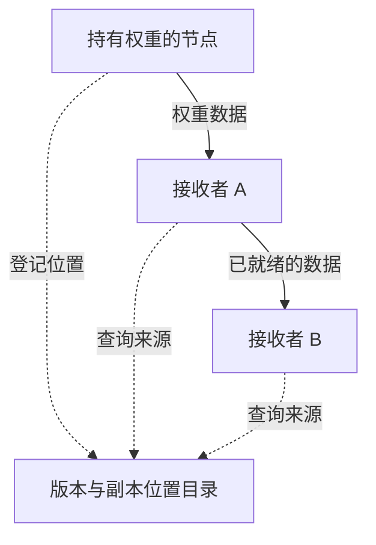
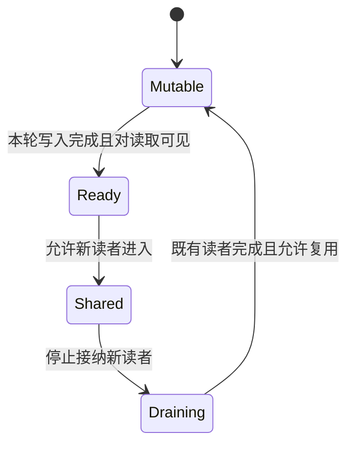

# TensorHub 论文解读：从权重传输到版本分发服务

一次权重更新花了三秒，这个数字意味着什么？

可能是两台机器之间传输花了三秒，也可能是一千张 GPU 全部停下来等了三秒。还可能有一些 rollout 继续生成旧版本样本，传输本身没有阻塞它们，但这些样本后来因过期而被训练器丢弃。三种情况的网络延迟看起来相近，训练成本却可能差得很远。

讨论 RL 权重同步时，首先需要明确：我们希望优化的是传输完成时间、GPU 等待成本，还是达到目标效果所需的训练时间。TensorHub 值得阅读，正是因为它把这个问题带到了通信接口和系统架构层面。

我的判断是：**权重分发应当同时管理数据来源、缓冲区生命周期和版本使用时机。只优化其中的网络路径，很容易把瓶颈转移到另一个环节。**

本文围绕 ByteDance Seed 与威斯康星大学麦迪逊分校合作的 [TensorHub v1](https://arxiv.org/html/2604.09107v1) 展开。下文先简述论文方案，随后使用自行构造的成本模型、时序例子和评估方案分析这一类系统。公式和示意图属于本文推导，示例数值不是 TensorHub 实测；通信库的补充说明按 2026-09-08 查阅的官方文档给出。

## 论文方案与三个实验数字

论文先提出 ROS（Reference-Oriented Storage）：管理既有权重引用，接收者也可成为来源。`publish` 承诺内容不可变，修改前须等待 `unpublish()` 排空读取；`retain` 在所需版本的最后有效副本主动撤销时，可能触发 CPU 卸载。TensorHub 在其上增加拓扑调度、流水复制、组事务与跨机房播种。[论文 §3–4](https://arxiv.org/html/2604.09107v1#S3)

可以用下面这个引用分发示意图理解控制与数据的分工：虚线表示元数据交互，实线表示权重数据流。图只展示一种可能的来源选择。

先把论文最醒目的结果放在正确的位置：

| 报告的改善 | 对照与实际口径                          | 实验范围与限定                                                  |
| ---------- | --------------------------------------- | --------------------------------------------------------------- |
| 6.7×       | 相对生产版 NCCL 的累计 GPU 等待时间     | 模拟 1T，1024 GPUs；不是训练总耗时                              |
| 4.8×       | 相对 UCX，最末批更新等待约 7.2 → 1.5 秒 | 260B，8 张稳定与 24 张弹性 rollout GPUs；固定扩缩事件           |
| 19×        | 相对 UCX/TCP 的累计 standalone 等待     | 9B，16 张 trainer 与 8 张 rollout GPUs，两个机房；skip＋offload |

来源：[§5.2](https://arxiv.org/html/2604.09107v1#S5.SS2)、[§5.3](https://arxiv.org/html/2604.09107v1#S5.SS3)、[§5.4](https://arxiv.org/html/2604.09107v1#S5.SS4)。其中 4.8× 的具体口径是根据正文 7.2/1.5 推得。作者称已训练真实模型，确认 loss 和 accuracy 与 ByteDance 生产结果一致，但因篇幅限制没有展示详细结果。这提供了训练效果验证的声明，尚不足以独立评估达到相同效果所需的时间与成本。[论文 §5](https://arxiv.org/html/2604.09107v1#S5)

这些结果说明权重分发可以显著减少等待。要判断它们对一套具体 RL 系统的意义，还需要把等待、吞吐和数据新鲜度拆开。

## 把一次权重更新拆成可测量的成本

从训练参数到推理引擎可用的权重，中间至少可以区分四类工作：

这是用于分析的通用流程。不同框架可能合并步骤，也可能把其中一些步骤重叠执行。

在完全串行的简化模型下，可以写成：

$$
T_{\mathrm{update}}
=T_{\mathrm{export}}
+T_{\mathrm{transfer}}
+T_{\mathrm{install}}
+T_{\mathrm{coord}}.
$$

这里的协调成本包括等待可更新边界、启动传输以及确认本轮完成。真实系统若使用流水或并发，总耗时应按依赖图上的关键路径计算，不能机械相加。

假设一次更新分别需要导出 1.0 秒、网络 2.0 秒、安装 0.5 秒、协调 1.5 秒，总共 5.0 秒。即使把网络提升四倍，总时间也只是变成 3.5 秒，整体约加速 1.43 倍。进一步优化前，应先确认剩下的 3.0 秒花在哪里。

这也是为什么“换一个更快的通信后端”与“重构整个权重同步流程”可能得到非常不同的结果。前者主要改变传输项，后者还有机会缩小协调范围或改变工作之间的依赖。

推理引擎本身也有更新生命周期。例如当前 vLLM 官方接口把初始化、开始更新、传输和结束更新区分开，并提供暂停与恢复生成的接口；结束阶段可能还包含权重后处理。这说明收到网络数据并不自动等价于模型已可使用。[vLLM Weight Transfer](https://docs.vllm.ai/en/latest/training/weight_transfer/)

## GPU 等待时间为什么值得单独计量

设第 $i$ 张 GPU 因本次更新而实际阻塞、暂停计算的时长为 $s_i$，则累计等待成本为：

$$
C_{\mathrm{stall}}=\sum_{i=1}^{N}s_i.
$$

单位是 GPU·秒。它衡量更新造成的实际停顿，不直接给出训练任务的完工时间，也不把生成后被丢弃的样本所消耗的计算时间计为 stall。

考虑一个自行构造的例子：

| 方案     | 需要等待的 GPU 数 | 每张卡等待 |   累计等待 |
| -------- | ----------------: | ---------: | ---------: |
| 全局暂停 |               100 |       4 秒 | 400 GPU·秒 |
| 局部暂停 |                20 |       2 秒 |  40 GPU·秒 |

累计等待改善十倍，其中两倍来自等待更短，五倍来自等待范围缩小。没有任何一个因素单独提供了十倍的传输提速。

还要进一步检查：获准继续运行的 GPU 在做什么？如果它们处理的是最终会被采用的任务，减少暂停就很有价值；如果它们只是继续产生将被丢弃的样本，表面利用率会上升，训练收益却未必改善。

因此我会把下列三个指标并列报告：

- **累计等待成本**：更新让多少 GPU 停了多久。
- **有效样本吞吐**：单位时间有多少生成结果真正进入训练。
- **达到固定效果的成本**：在相同评测条件下，需要多少墙钟时间和 GPU·小时。

它们分别回答资源调度、数据生产和学习效率三个问题，无法互相替代。

## 扇出为什么会让一个很快的发送端变慢

下面构造一个理想网络模型。一个源节点持有大小为 $S$ 的权重，需要发给 $R$ 个接收者，源节点可用于本次任务的总出口带宽为 $B$。暂时忽略协议开销、交换网络竞争和接收端瓶颈。所有接收者从同一时刻暂停计算，直到各自完整接收后恢复；若排队期间仍继续计算，排队时长就不能直接计入 GPU 等待。这里先令每个接收者代表一张 GPU；若每个接收副本由 $g$ 张同步等待的 GPU 组成，下面的累计等待还需乘以 $g$。

如果所有接收者都直接从源节点取完整权重，源节点必须输出 $RS$ 字节，因此全部完成的时间至少为：

$$
T_{\mathrm{all}}\geq\frac{RS}{B}.
$$

接收端再多，也不会增加这个源节点的出口带宽。

如果 $R$ 个请求同时开始，并公平分享带宽，每个请求约获得 $B/R$，它们都会在约 $RS/B$ 后完成。只计算这些接收者的等待，便有：

$$
C_{\mathrm{fair}}\approx\frac{R^2S}{B}.
$$

改成逐个发送，最早的接收者可以提前结束，等待总和变成：

$$
C_{\mathrm{serial}}
=\frac{S}{B}\sum_{j=1}^{R}j
=\frac{R(R+1)S}{2B}.
$$

两者都随 $R^2$ 增长，但常数不同。这提醒我们：**同样的总流量，调度顺序就能改变累计等待；改变数据来源，则有机会进一步改变扩展趋势。**

当接收者收到数据后也能转发，系统开始使用其他节点的出口。总计仍需要把权重送入每个目的地，网络中的总字节数没有凭空消失；改变的是这些字节由哪些链路承担。

## 流水复制的收益与成立条件

继续使用一个简化模型：把 $S$ 字节切成 $m$ 个等大的块，沿着源节点到 $R$ 个接收者组成的链路转发。每跳带宽均为 $B$，中间节点可同时接收和发送，各链路互不竞争，块完成后才能转发。

每个块经过一跳需要 $S/(mB)$ 秒。第一个块到达最后一个接收者需要经过 $R$ 跳，其余块随后流水到达，因此末端完成时间为：

$$
T_{\mathrm{pipe}}
=\left(m+R-1\right)\frac{S}{mB}
=\frac{S}{B}\left(1+\frac{R-1}{m}\right).
$$

例如 $S=40$ GB、$B=20$ GB/s、$R=8$、$m=100$。单源直接发八份的全部完成时间下界为 16 秒；上述理想流水模型得到约 2.14 秒。

这个计算的用途是解释机制，不是预测实际集群性能。它依赖几个很强的条件：中间节点拥有足够的双向带宽，路径之间没有共享瓶颈，内存访问没有成为限制，控制开销也可以忽略。

若每跳处理每个块时还要占用 $\alpha$ 的串行服务时间，且它不能与该跳的下一块传输重叠，模型就变成：

$$
T_{\mathrm{pipe}}
\approx(m+R-1)\left(\frac{S}{mB}+\alpha\right).
$$

这里的 $\alpha$ 不是可与后续块重叠的纯传播时延。此时无限减小块大小会提高固定开销。另一方面，如果某一跳明显更慢，它就会限制流水的稳定吞吐。流水复制的调优需要同时考虑块大小、链路带宽和路径长度，不能把“接收者能转发”理解成任意规模下的常数延迟保证。

实际权重由大小不一的 tensor 组成，等块模型也不会精确成立。TensorHub 的具体做法是让正在接收数据的 worker 维护一个进度计数器，记录目标版本中已接收的 tensor 数量。引用服务器选择来源时，也可以选择尚未完成复制的 worker；下游先读取其进度，拉取已就绪的 tensor 前缀，再查询进度并继续读取，直到全部完成。因此，转发可以在整个分片接收完成前开始，粒度由已就绪的 tensor 前缀决定。[论文 §4.3.3](https://arxiv.org/html/2604.09107v1#S4.SS3)

这也说明，评价一套实现时，更有用的是检查数据可转发的粒度、首批数据就绪延迟、最慢路径以及并发推理时的干扰。

## 用引用共享数据，必须把生命周期说清楚

对任何共享已有缓冲区的系统，地址都只是描述的一部分。还必须知道：这段内存属于哪个版本、内容是否已经就绪、哪些读取仍可能访问它，以及什么时候可以覆盖。

可以用以下概念状态机审查这一类设计。它不是 TensorHub 的源码状态机，也不包含完整故障处理：

设缓冲区 $b$ 当前仍有 $r_b$ 个合法读取，且 $a_b$ 表示是否继续接纳新读取。能够安全复用的一个必要条件是：

$$
a_b=\mathrm{false}\quad\land\quad r_b=0.
$$

为什么不能只检查一次 $r_b=0$？因为检查与覆盖之间仍可能进入一个新读者。为什么不能只停止接纳新读取？因为旧读者可能还在访问最后几个块。

在实现中，还要把“修改完成”与“修改对远端读取可见”区分开。Python 函数返回、CUDA 工作入队和设备完成执行，可能是不同时间点。NVIDIA 的 GPUDirect RDMA 文档明确要求处理 CUDA 操作与外部设备访问的内存顺序；正在运行的 GPU kernel 与并发 RDMA 写入不能仅靠普通主机控制流假定一致。[GPUDirect RDMA：Synchronization and Memory Ordering](https://docs.nvidia.com/cuda/gpudirect-rdma/index.html#synchronization-and-memory-ordering)

因此，代码审查至少需要找到生产者写入完成、远端读取完成、消费者开始使用三者之间的明确依赖。引用计数解决访问生命周期，设备同步解决数据可见性，两者都需要成立。

频繁分配和释放缓冲区还可能增加内存注册成本。NVIDIA 文档介绍了通过注册缓存和延迟解除固定来复用映射，同时要求正确处理释放与重新分配事件。[GPUDirect RDMA：Design Considerations](https://docs.nvidia.com/cuda/gpudirect-rdma/index.html#design-considerations) 所以稳定地址是一项可利用的工程条件，不能把它当成所有训练后端默认满足的属性。

## “同一个版本”至少包含三个层次

对于分片模型，单个 tensor 的内容正确，还不足以说明整个推理副本正确。

假设一个推理副本由两个 rank 组成。rank 0 在时刻 $t_0$ 查询最新版本，得到 $v=100$；发布事件发生后，rank 1 在 $t_1$ 查询，得到 $v=101$。两次查询各自都可能合法，但把它们组合起来就不是任何一个完整模型。

下面这个表用于区分系统需要证明的属性：

| 层次         | 需要回答的问题                         | 不满足时可能出现的问题                       |
| ------------ | -------------------------------------- | -------------------------------------------- |
| 字节完整性   | 某个 tensor 是否传对了                 | 损坏、截断、混入旧数据                       |
| 副本一致性   | 同一推理副本的所有分片是否属于同一版本 | 不同 rank 使用不相容的参数或走入不同控制分支 |
| 训练可接受性 | 样本所用版本是否满足训练算法要求       | 数据被丢弃，或引入未处理的分布偏移           |

对模型并行组 $G$，可以写出一个用于检查提交条件的不变量：

$$
\forall i,j\in G,\quad v_i=v_j=v_{\mathrm{commit}}.
$$

一次更新可以分为“确定共同目标版本”“准备所有分片”“确认整体可用”“允许使用”几个逻辑阶段。具体实现可以重叠数据传输，但不能把一个只完成部分分片的状态当成完整的新模型提交。

TensorHub 用模型并行组粒度的事务保证请求观察到一致的状态：组内第一个 rank 的请求到达时，服务器启动事务，代表整个组执行请求，并把解析出的目标版本等必要信息保存在事务局部缓冲区；同一事务的后续 rank 请求使用这些已保存的信息。事务按启动顺序串行化。对应前面的例子，若首个请求把 `latest` 解析为 100，即使随后发布了 101，同组其余 rank 仍会得到 100。这保证了共同目标版本；各 rank 收齐并安装分片后，才能使用完整的新模型。[论文 §4.4](https://arxiv.org/html/2604.09107v1#S4.SS4)

再往上看，即使所有分片一致，也不意味着不同 rollout 副本必须同时切换，更不意味着训练天然满足严格 on-policy。通信层能够提供版本身份，算法层仍要定义哪些版本产生的样本可以使用。

对于长轨迹，还应记录版本标记覆盖的粒度：整条轨迹、一次生成请求，还是某段生成。若运行中允许切换权重，仅用轨迹开始时的一个版本号描述所有 token 就可能不够。是否允许这种行为，以及怎样处理，必须由训练与生成策略共同定义。

## 跨机房首先是慢链路容量问题

考虑一个独立的容量模型：一个远端机房有 $R$ 个需要完整权重的副本，每版权重大小为 $S$，跨机房链路可用带宽为 $B_{\mathrm{wan}}$。

如果每个副本分别跨机房读取，慢链路流量为 $RS$。如果只传入一份，再通过机房内部网络复制，跨机房流量可以降到 $S$。节省发生在昂贵的网络边界上，本地接收者仍然需要获得数据。

假设每秒必须接收 $\lambda$ 个新版本，且每个版本都完整传入，那么理想的平均容量约束为：

$$
\lambda S \leq B_{\mathrm{wan}}.
$$

这里使用的是实际可用带宽。在完全确定、无额外开销且到达与服务精确匹配的模型中，等号也可以成立；实际存在波动、排队和固定开销时，应严格小于并保留余量。平均容量足够也不保证满足每次更新的时限。如果系统允许跳过中间版本，式子中的 $\lambda$ 应改成必须实际传入的版本频率，不能直接使用 trainer 的更新频率。

举例来说，每版 100 GB、可用带宽 10 GB/s，单次传入至少需要 10 秒。如果训练器每 5 秒产生一版，而远端要求接收每一版，那么把传输改成后台任务无法消除积压。系统需要减少负载、降低必须接收的版本频率，或增加可用带宽。

这个判断应当先于任何“隐藏传输延迟”的优化，因为后台执行只改变调度方式，不会增加物理容量。

## 隐藏等待以后，怎样计算新鲜度代价

把新权重先接收到 CPU 缓冲区，GPU 可以继续使用当前权重。设后台传输耗时为 $T_{\mathrm{fetch}}$，从启动传输到 GPU 按调度进入更新阶段之间，实际允许继续计算的墙钟窗口为 $W_{\mathrm{run}}$，最终安装耗时为 $T_{\mathrm{install}}$。在一次传输、计算与接收能够并发、安装串行执行的简化模型下：

$$
T_{\mathrm{foreground}}
\approx\max(0,T_{\mathrm{fetch}}-W_{\mathrm{run}})+T_{\mathrm{install}}.
$$

如果旧版本计算可以持续到后台传输结束，前台等待可能主要剩下安装阶段。如果算法要求立即切到新版本，那么可重叠窗口就可能接近零。

这里计算的是实际前台停顿，$W_{\mathrm{run}}$ 不由样本是否最终被接纳决定。例如后台传输 10 秒、GPU 同时生成 10 秒、最后安装 1 秒，即使这些样本全部被丢弃，前台停顿仍是 1 秒，不能按“有效计算为零”把它算成 11 秒。

**减少停顿与增加有效训练进度，需要分别评价。** 上述计算确实隐藏了前台等待，但若样本全部被丢弃，就没有因此增加有效训练供给。

在同一统计窗口内，设原始样本生产速度为 $q$，这些样本最终被接纳的比例为 $a$，可以先用下面的量描述接纳样本吞吐：

$$
q_{\mathrm{accepted}}=qa.
$$

例如方案 A 每秒生成 100 条样本，95% 被接纳，有效吞吐为 95；方案 B 因更少暂停达到每秒 130 条，但只有 65% 被接纳，有效吞吐约为 84.5。更高的生成吞吐未必改善训练供给。

这个模型还没有考虑样本长度和质量差异。真正的训练评估应继续检查被接纳样本的质量、版本滞后以及达到目标效果所需的更新次数。版本差可以作为操作指标，但相同的版本差不一定代表相同的策略差异。

## 可恢复性与版本持久性需要分别设计

对一个保存引用的分发系统，至少有三种不同的目标：

- 在持有者主动覆盖数据前，保证必要的版本仍有可用副本。
- 某个数据来源失效后，从其他来源继续服务。
- 所有在线副本失效后，仍能恢复某个精确版本。

前两个目标可以依靠在线副本及其生命周期协议实现；第三个目标通常需要另一个明确的持久化边界。仅有元数据，无法重新生成已经全部丢失的字节。

TensorHub 的 retention 不计入 spot 副本；最后一个非 spot 副本失效时，版本仍可能不可用。引用服务器故障后，备份等待重新发布，不恢复旧元数据。[论文 §4.5](https://arxiv.org/html/2604.09107v1#S4.SS5)

评估任何类似系统时，我会先写出故障假设：哪些节点会被随时抢占，故障是否可能相关，控制服务重启后如何重新确认持有者，以及旧请求能否继续访问已复用的缓冲区。

尤其需要检查迟到的成功回调。假设传输 A 超时，系统开始传输 B，而 A 的完成通知随后到达；如果缺少版本或操作身份检查，旧通知就可能被误当成 B 的完成。这是应注入测试的通用竞争条件，不表示 TensorHub 存在该缺陷。

同样，恢复时间至少包含检测、重新调度和补传。故障最终被掩蔽，不意味着恢复对尾延迟没有影响。服务可恢复与延迟有界，需要分别测量。

## 比较 NCCL 和 UCX 时，基线边界要画对

通信库提供的能力，与某个训练框架如何使用这些能力，是两个层次。

截至本文查阅时，NCCL 官方文档已提供 `ncclCommShrink` 和 `ncclCommGrow`，通过创建新的通信组删除或增加 rank。增长过程需要既有成员和新成员协调，并要求父通信组没有未完成操作。因此，准确的问题是一次扩缩容需要哪些协调、付出多少代价，以及框架是否完成相应集成。[NCCL：Creating a Communicator](https://docs.nvidia.com/deeplearning/nccl/user-guide/docs/usage/communicators.html)

UCX 也不限于成对调用的阻塞 `send/recv`。官方文档列出 RMA put/get、tag matching、active messages 等接口，以及按网络性能和 NUMA 局部性选择设备的能力；GPU 内存上各类 API 的支持程度需要按具体版本核查。[UCX FAQ](https://openucx.readthedocs.io/en/master/faq.html)

但知道如何选择一块合适的 NIC，与知道“某个模型版本还存在于哪些 rollout 副本”仍然不同。后者需要训练工作负载的语义和全局元数据。

因此，更有解释力的评估应当分两步：先在相同数据流拓扑下比较底层传输，再在相同资源与版本约束下比较完整的分发策略。这样才能区分收益来自更好的数据面、更少的协调，还是更合理的数据来源选择。

这也影响对创新性的判断。我更关注的是上层版本服务如何组织现有通信能力，以及它是否让复杂场景更容易正确实现。某条微基准曲线领先，并不足以单独证明一种底层原语存在不可逾越的限制。

## 与增量权重同步的关系：两个可以组合的优化方向

已有笔记分别讨论了 [[foundations/RL/系统/权重同步/veRL增量权重同步方案|veRL 增量权重同步]] 和 [[foundations/RL/系统/权重同步/slime增量权重同步机制|slime 增量权重同步]]。理解这类方案与分发服务的关系，可以从两个问题入手：

1. 每个接收者必须收到多少字节？
2. 这些字节从哪些来源、沿哪些路径传过去？

下面只讨论一个通用的稀疏覆盖 patch，不假定某个框架的具体实现。设权重有 $N$ 个元素，每个值占 $s$ 字节，变化比例为 $r$，每个位置索引占 $i$ 字节。忽略元数据，则：

$$
D_{\mathrm{full}}=Ns,\qquad
D_{\mathrm{patch}}\approx Nr(s+i).
$$

若 $s=2$、$i=4$、$r=0.02$，patch 大小约为全量的 6%。它改变的是每次更新的载荷，副本调度改变的是载荷的分布方式。

两者组合时，仍需解决至少两个额外问题。第一，patch 必须作用于正确的基版本；一个离线很久的节点不能假定自己满足这个条件。第二，原地应用 patch 会修改正在共享的缓冲区，因此即使载荷很小，也不能绕过读取者的生命周期约束。

可以为一个假想的组合系统定义恢复策略：接收者基版本匹配时应用 patch，基版本缺失时获取完整快照，再重新进入增量路径。进一步的优化可以让节点分发 patch、完整快照，或两者并存，但需要明确各自的保留成本。

这是本文提出的扩展分析，不是 TensorHub v1 已实现增量同步的声明。

## 怎样设计一组能够决定是否采用的实验

我会先固定模型、训练与推理并行布局、精度、网络预算和样本接纳规则，再逐层扩大实验。除非研究目标就是改变版本策略，否则比较传输系统时应尽量保持版本使用条件一致。

| 实验           | 要固定或控制的条件                                       | 主要观察                                   |
| -------------- | -------------------------------------------------------- | ------------------------------------------ |
| 单源到单接收者 | 相同 tensor 布局、内存类型与载荷                         | 有效带宽、注册成本、安装耗时               |
| 扇出规模增长   | 扫描接收者数量；每个规模点的各方案使用相同资源与源节点数 | 全部完成时间、累计等待、出口占用           |
| 并发推理       | 相同推理负载、不同分发并发度                             | decode 吞吐与尾延迟是否受影响              |
| 节点加入与故障 | 相同扩缩容时序、不同故障位置                             | 恢复时间、补传字节、错误版本提交           |
| 跨机房         | 固定带宽、时延与必须接收的版本频率                       | 慢链路字节数、版本滞后、CPU 峰值           |
| 完整训练       | 相同算法、数据、接纳规则与评测                           | 有效样本吞吐、GPU·小时、达到目标效果的时间 |

此外，还应独立改变三个调度因素：是否允许副本转发、是否需要全局暂停、是否允许后台接收。这些因素可能产生交互作用，不能把分别测得的加速比简单相乘。

对于正确性，我会安排小规模但可重复的事件序列：读取期间请求覆盖、部分分片收到新版本、复制中途源节点失效、控制服务重启、迟到完成通知，以及接收者持有错误基版本时尝试应用 patch。它们针对协议边界，比反复运行没有扰动的带宽测试更有诊断价值。

最后，需要给性能指标明确的起止点。“更新延迟”可以从发布开始计时，也可以从 rollout 决定拉取开始计时；如果一个节点延后更新却继续推理，后一种口径可能很短，前一种口径却包含较长的新鲜度延迟。报告二者，才能看清减少等待的代价。

我会把采用决策落到一条完整证据链上：确定权重更新造成了可观的资源浪费，定位浪费来自传输还是协调，再验证优化在同等版本约束下提高了有效吞吐，最终检查同等训练效果的时间与成本。只有走完这条链，漂亮的分发数字才足以支撑生产系统的架构选择。

相关基础：[[foundations/RL/系统/权重同步/veRL全量权重同步机制|veRL 全量权重同步机制]]、[[foundations/RL/系统/权重同步/主要RL框架重同步方案|主要 RL 框架权重同步方案]]、[[foundations/RL/算法/GRPO|GRPO]]。
