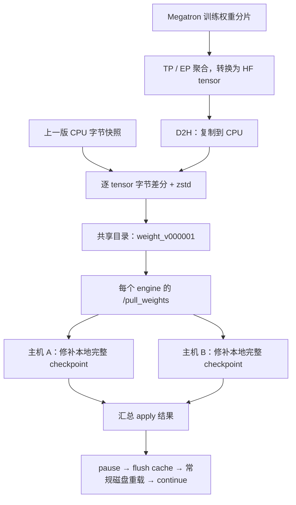

# slime 增量权重同步：用字节差分降低跨集群 RL 的同步成本

一次 RL 参数更新，可能只改变推理权重中的少量字节，却要把几十 GB 的模型重新送到 rollout 集群。slime 的 `examples/delta_weight_sync` 利用相邻权重版本的这种相似性：训练端发布压缩后的字节差分，推理端先修补本地 checkpoint，再通过 SGLang 的常规加载流程切换模型。

**这条路径主要节省跨集群传输，训练端仍要聚合权重，推理端也仍要完整加载模型。** 当两端之间的链路较慢时，少传几十 GB 数据很有价值；链路足够快之后，差分、压缩和本地重载的开销就会变得突出。

> 代码版本：slime [`4c193f1f`](https://github.com/THUDM/slime/tree/4c193f1f37509cca70f0e88807a9305b70f63f4e/examples/delta_weight_sync)，核对日期：2026-09-07。性能数据来自上游 PR，未独立复现多机训练；第 6 节的缺失 shard 问题做了最小 CPU 验证。另可参见[《verl 增量权重同步方案》](veRL增量权重同步方案.md)。

## 1. 为什么 RL 权重值得做增量同步

RL 训练一般同时维护训练模型和生成轨迹的推理模型。训练模型完成若干次 optimizer step 后，rollout engine 需要切换到新的策略权重。一次同步通常包括：

```text
训练 rank 的参数分片
    → 聚合、训练布局转 HF 布局
    → 导出、传输
    → 推理布局转换与加载
    → 切换版本、恢复生成
```

如果训练和推理部署在不同集群，能共同访问的是文件系统或对象存储挂载，整份 checkpoint 的反复发布就会变得昂贵。slime 最初的 [PR #1806](https://github.com/THUDM/slime/pull/1806) 明确以跨数据中心的训推分离为动机：在只有数百 MB/s 带宽的链路上，全量权重传输可能主导一次同步。

BF16 的精度就能解释为什么很多字节可以不传。训练中的微小更新如果没有跨过舍入边界，导出后的位模式就可能不变；即使一个元素变了，它的两个字节也未必都改变。相邻版本的**推理权重字节**因此可能高度相似。具体有多少变化，则取决于学习率、同步间隔、优化器和导出 dtype。

代码将导出的 tensor 视作 `uint8`，逐字节比较新旧值。日志里的 `density` 就是**变化字节数 / 导出 tensor 总字节数**。读后面的实验数据时，要记住它统计的是字节。[差分与指标](https://github.com/THUDM/slime/blob/4c193f1f37509cca70f0e88807a9305b70f63f4e/slime/backends/megatron_utils/update_weight/update_weight_from_disk_delta.py#L224-L294)。

## 2. 先分清版本：现在的 delta 只走 disk

slime 的增量同步经过了两次重要调整。只读最早的 PR，很容易误判当前机制。

| 合入日期   | PR                                                | 设计变化                                                                                     |
| ---------- | ------------------------------------------------- | -------------------------------------------------------------------------------------------- |
| 2026-05-26 | [#1806](https://github.com/THUDM/slime/pull/1806) | 引入变化位置与新值的增量协议，提供 disk 和 NCCL 两种传输；接收端通过特殊加载逻辑覆盖权重     |
| 2026-07-02 | [#2089](https://github.com/THUDM/slime/pull/2089) | 改为磁盘上的字节差分，先修补本地 checkpoint，再常规加载；移除此前的 NCCL delta 路径          |
| 2026-07-07 | [#2181](https://github.com/THUDM/slime/pull/2181) | 将多主机 pull/apply 协调下沉到 SGLang 的 `/pull_weights`，slime 只联系每个 engine 的一个入口 |
| 2026-08-24 | [#2312](https://github.com/THUDM/slime/pull/2312) | 删除文档中遗留的 delta + NCCL 推荐，明确当前约束                                             |

当前实现要求 `delta + disk + 非 colocate`，并指定共享发布目录和推理机本地 checkpoint 目录。配置成 `delta + nccl` 会在参数校验时直接报错。[参数校验](https://github.com/THUDM/slime/blob/4c193f1f37509cca70f0e88807a9305b70f63f4e/slime/utils/arguments.py#L2046-L2079)、[updater 选择](https://github.com/THUDM/slime/blob/4c193f1f37509cca70f0e88807a9305b70f63f4e/slime/backends/megatron_utils/update_weight/__init__.py#L22-L46)。

这里的 `disk` 指通过共享文件系统传输：训练端向共享目录发布差分，推理机从中读取，再更新各自本地的完整模型。

## 3. 一次同步，实际经过哪些步骤

先看稳态下的完整数据路径：



### 3.1 第一次调用只建立共同基线

首次 `update_weights()` 执行 `_capture_baseline()`，不会发布差分，也不会把同步版本加一。训练端从 `--hf-checkpoint` 读取 tensor 的原始字节，保存为 CPU snapshot；同时调用各引擎的 `pull_weights(target_version=0)`。在使用干净本地目录时，每台推理主机会提前从 engine 的 `model_path` 复制出本地 checkpoint。两边必须对应同一份初始权重。

快照从 HF 文件读取，是为了与推理端的初始权重保持一致。Megatron 权重转回 HF 时，会处理 embedding、LM head 等参数的 vocabulary padding，结果未必与初始 checkpoint 逐字节相同。第一份差分以初始文件为基准，才能把转换产生的差异也算进去。只有 HF 文件缺少某个 tensor 时，代码才回退到当前聚合值并记录 warning。[基线初始化](https://github.com/THUDM/slime/blob/4c193f1f37509cca70f0e88807a9305b70f63f4e/slime/backends/megatron_utils/update_weight/update_weight_from_disk_delta.py#L83-L126)。

恢复训练时尤其要注意这一步：首次调用只建立基线，不会把 trainer 恢复后的权重发送给引擎。trainer 当前状态、引擎初始 checkpoint 和同步基线需要一起核对。

### 3.2 差分发生在完整 tensor 聚合之后

`UpdateWeightFromDiskDelta` 继承 `UpdateWeightFromDistributed`，复用两条参数迭代路径：普通参数执行 TP 聚合与 HF 转换；expert 参数还要经过 EP 聚合。得到 HF tensor 后，才复制到 CPU，与历史快照比较。

所以每轮同步仍然要聚合完整参数。负责输出 HF tensor 的 PP source ranks 各自保存一份 CPU 快照，内容是自己负责导出的那部分权重。这些 ranks 对聚合后的 tensor 做差分，其余训练 ranks 参与聚合。[HF 迭代入口](https://github.com/THUDM/slime/blob/4c193f1f37509cca70f0e88807a9305b70f63f4e/slime/backends/megatron_utils/update_weight/update_weight_from_disk_delta.py#L65-L78)、[TP/EP 聚合](https://github.com/THUDM/slime/blob/4c193f1f37509cca70f0e88807a9305b70f63f4e/slime/backends/megatron_utils/update_weight/update_weight_from_distributed.py#L152-L237)。

### 3.3 用 CPU 线程池并行差分和压缩

训练端使用 pinned host buffer 暂存 GPU 到 CPU 的拷贝，CPU 线程池并行完成各 tensor 的差分、zstd 压缩和摘要计算。线程数上限是 32，in-flight futures 也有数量约束，避免任务无限积压。

每次异步 D2H copy 后，主线程都会同步当前设备 stream，再把数据交给线程池。这样，工作线程处理前一个 tensor 时，主线程可以继续聚合、复制后面的 tensor。

压缩结果先积累到 `_delta`，整轮编码完成后，各写入 rank 才生成自己的 safetensors 文件。引擎随后读取这一轮的完整差分。[编码流水线](https://github.com/THUDM/slime/blob/4c193f1f37509cca70f0e88807a9305b70f63f4e/slime/backends/megatron_utils/update_weight/update_weight_from_disk_delta.py#L200-L274)、[线程数](https://github.com/THUDM/slime/blob/4c193f1f37509cca70f0e88807a9305b70f63f4e/slime/utils/disk_delta.py#L10-L12)。

这会占用相当一部分 CPU 内存：历史快照是常驻的 NumPy 数组，pinned buffer 用于传输暂存，编码时还需要新值数组、差分数组和压缩结果。部署时要为这些副本留出空间。

## 4. 两种编码：XOR 与 overwrite

这个方案处理的是导出 tensor 的字节表示。下面用 $b^{old}$、$b^{new}$ 表示等长的旧、新字节数组。

### 4.1 XOR：让不变的字节变成零

默认编码计算：

$$
d_i = b_i^{new} \oplus b_i^{old}
$$

然后用固定 level 1 的 zstd 压缩 $d$。接收端执行：

$$
b_i^{old} \oplus d_i = b_i^{new}
$$

例如，以下是四个字节的十六进制表示：

```text
old:  10 20 30 40
new:  10 21 30 44
xor:  00 01 00 04
```

XOR 得到的数组与原 tensor 等长，但未改变的位置全部变成了零。zstd 压缩这些重复模式，才让最终文件小下来。如果一个 tensor 完全没变，代码会直接跳过它。[XOR 编码](https://github.com/THUDM/slime/blob/4c193f1f37509cca70f0e88807a9305b70f63f4e/slime/backends/megatron_utils/update_weight/update_weight_from_disk_delta.py#L224-L244)。

`density=1%` 表示 99% 的字节没变，最终文件有多大，还要看变化字节的分布、取值和元数据开销。

### 4.2 Overwrite：记录变化位置与新字节

另一种编码先计算 `new != old`，再打包：

```text
变化位置数量：uint32
各变化字节的位置：uint32 数组
这些位置上的新值：uint8 数组
```

接收端执行 `region[positions] = values`，同样在传输前使用 zstd 压缩。[overwrite 格式](https://github.com/THUDM/slime/blob/4c193f1f37509cca70f0e88807a9305b70f63f4e/slime/utils/disk_delta.py#L20-L25)、[接收端覆盖操作](https://github.com/THUDM/slime/blob/4c193f1f37509cca70f0e88807a9305b70f63f4e/docker/patch/latest/sglang-pull_weights.patch#L510-L524)。

对一个共 $M$ 字节、变化字节比例为 $r$ 的 tensor，忽略外层元数据时，overwrite 的未压缩载荷大小为：

$$
B_{overwrite,raw}=4+5rM
$$

每个变化位置需要 4 字节索引和 1 字节新值，因此压缩前的开销相当于变化字节数的 5 倍左右。XOR 和 overwrite 都会继续经过 zstd，选择哪一种更省空间，需要比较实际压缩结果。

### 4.3 重复应用 delta 会发生什么

| 特性               | XOR                          | Overwrite                      |
| ------------------ | ---------------------------- | ------------------------------ |
| 应用操作           | 连续区域按位异或             | 按索引覆盖新字节               |
| 对正确基线应用一次 | 精确恢复目标字节             | 精确恢复目标字节               |
| 对同一位置重复执行 | 再次异或会翻回旧值           | 保持目标新值                   |
| 部分应用后重试     | 需要先恢复可信基线           | 已写位置可重复覆盖             |
| 编码成本           | 无显式位置索引，依赖零值压缩 | 有位置索引，依赖稀疏程度及压缩 |

Overwrite 只覆盖此次发生变化的位置，其余字节会原样保留。因此，即使用 overwrite 重试，也需要确认未覆盖部分的基线是正确的。

两种编码都直接操作字节，没有反复累加浮点 delta 带来的舍入误差。只要基线和载荷正确，应用后就能精确还原**导出后的权重**。量化误差则发生在更早的阶段：`convert_to_hf()` 会按配置执行 `quantize_params()`，之后才做差分。delta 会如实传递这个量化结果。[导出转换顺序](https://github.com/THUDM/slime/blob/4c193f1f37509cca70f0e88807a9305b70f63f4e/slime/backends/megatron_utils/megatron_to_hf/__init__.py#L9-L26)。

## 5. 差分文件怎样变成推理端的新模型

### 5.1 差分文件长什么样

训练端每轮发布一个目录，例如：

```text
/shared/fs/delta-updates/
└── weight_v000001/
    ├── model-00000-of-00002.safetensors
    ├── model-00001-of-00002.safetensors
    └── model.safetensors.index.json
```

文件编号由写入 rank 的集合决定，上面的两个 shard 只是示意。index 包含 tensor 到文件的 `weight_map`，以及以下应用元数据：

```json
{
  "version": "000001",
  "base_version": "000000",
  "delta_encoding": "xor",
  "compression_format": "zstd",
  "checksum_format": "xxh3-128"
}
```

每个 safetensors shard 保存压缩后的 `uint8` 差分 tensor，metadata 则记录各变化 tensor **更新后的目标摘要**。源码把这种目录称为 canonical HF directory，因为它沿用了 HF 的命名、分片和索引格式。但文件里装的是压缩差分，普通 HF loader 无法直接加载，必须先由 `/pull_weights` 将差分应用到本地完整 checkpoint。[文件与 index 写入](https://github.com/THUDM/slime/blob/4c193f1f37509cca70f0e88807a9305b70f63f4e/slime/backends/megatron_utils/update_weight/update_weight_from_disk_delta.py#L134-L169)。

### 5.2 一个 engine 入口覆盖多台主机

推理 engine 可能跨多台主机，但只有一个对外控制入口。slime 调用这个入口的 `/pull_weights` 后，由 SGLang 将请求分发给内部 scheduler ranks，各 rank 调用本地 checkpoint 同步逻辑。同一主机上共享该本地目录的 ranks 通过 `flock` 串行进入；第一个完成应用并推进版本后，其他 ranks 检查到相同版本就跳过。

各 rank 的结果通过 TP CPU group 汇总，再由上层 communicator 合并返回。这样，多主机协调就全部留在 engine 内部，slime 只需调用一个入口。这正是 [#2181](https://github.com/THUDM/slime/pull/2181) 所做的调整。[请求处理与结果汇总](https://github.com/THUDM/slime/blob/4c193f1f37509cca70f0e88807a9305b70f63f4e/docker/patch/latest/sglang-pull_weights.patch#L102-L171)、[本地锁与版本标记](https://github.com/THUDM/slime/blob/4c193f1f37509cca70f0e88807a9305b70f63f4e/docker/patch/latest/sglang-pull_weights.patch#L343-L370)。

接收端根据本地 safetensors header 找到各 tensor 的字节区间，再通过 mmap 原地修改。XOR 路径以最多 2 MiB 的块流式解压、异或并更新摘要；不同 tensor 由线程池并行处理。[本地 apply](https://github.com/THUDM/slime/blob/4c193f1f37509cca70f0e88807a9305b70f63f4e/docker/patch/latest/sglang-pull_weights.patch#L411-L533)。

### 5.3 Pull 成功之后，还要完整 reload

训练端的调用顺序是：

```text
发布差分并完成可见性 hook
    → 所有 engine pull_weights
    → pause_generation
    → flush_cache
    → update_weights_from_disk(本地 checkpoint, 新版本)
    → continue_generation
```

到 `/pull_weights` 返回时，更新的是磁盘文件，GPU 上仍是旧权重。接下来引擎暂停生成、清理 cache，再通过 `update_weights_from_disk` 完整重载 checkpoint。pull 虽然安排在显式 pause 之前，它本身也要经过 scheduler 执行，对在线生成的影响仍需要实测。[引擎更新顺序](https://github.com/THUDM/slime/blob/4c193f1f37509cca70f0e88807a9305b70f63f4e/slime/backends/megatron_utils/update_weight/update_weight_from_disk_delta.py#L171-L191)。

## 6. 同步失败后会怎样

### 6.1 XOR 应用到一半时，不能直接重试

接收端在本地 `.weight_sync/state.json` 保存已应用版本。delta 的 `base_version` 必须匹配当前版本；成功应用过的版本可以跳过。这能防止正常重复请求再次执行 XOR，也能拒绝对错误版本基线进行应用。

但应用过程直接修改 mmap 区域，所有 tensor 完成校验之后才推进 marker。如果中途失败，一部分字节可能已经变成新值，marker 仍停在旧版本。此时直接重放 XOR，会把已经更新的部分再次翻转。当前代码没有为这个过程实现事务回滚。

训练端的快照还会更早推进：收集 diff future 时，CPU snapshot 就被新值替换，此时文件尚未发布，引擎也还没确认。一旦后续步骤失败，发送端快照和接收端 checkpoint 可能停在不同状态，恢复时需要重新对齐两端的基线。[接收端校验及 marker 推进](https://github.com/THUDM/slime/blob/4c193f1f37509cca70f0e88807a9305b70f63f4e/docker/patch/latest/sglang-pull_weights.patch#L426-L545)、[发送端快照推进](https://github.com/THUDM/slime/blob/4c193f1f37509cca70f0e88807a9305b70f63f4e/slime/backends/megatron_utils/update_weight/update_weight_from_disk_delta.py#L246-L252)。

### 6.2 校验漏掉了缺失的 shard

接收端支持 `xxh3-128`、`blake3`、`adler32` 三种摘要算法。每个读到的变化 tensor 在应用后都会重新计算摘要，与训练端记录的目标值比较；未变化的 tensor 则跳过。

这里有一个漏洞：`_apply_delta()` 只读取 index 的 `metadata`，随后用 `glob("*.safetensors")` 枚举可见文件，没有对照 `weight_map` 检查文件是否齐全。**如果 index 已经可见，而某个 shard 还没出现，这个 shard 就可能被直接漏过，版本照常推进。** 摘要能发现已读取 tensor 的错误，却管不到根本没读到的 tensor。[index 读取与文件枚举](https://github.com/THUDM/slime/blob/4c193f1f37509cca70f0e88807a9305b70f63f4e/docker/patch/latest/sglang-pull_weights.patch#L429-L477)、[任务完成与版本推进](https://github.com/THUDM/slime/blob/4c193f1f37509cca70f0e88807a9305b70f63f4e/docker/patch/latest/sglang-pull_weights.patch#L532-L545)。

为确认这一点，测试中构造了一份非空 `weight_map`，让它指向一个不存在的 shard，再调用从上述版本 patch 提取的 `_apply_delta()`。结果是函数正常返回，本地版本从 0 变为 1，权重字节却仍是原来的 `0x2a`。这个最小 CPU 测试复现了文件漏检；由于没有读到 shard，解压和 GPU 加载都未涉及。

在对象存储挂载等需要显式 publish/refresh 的环境里，必须等一个版本的所有文件都可见后，再让 engine 读取。slime 为此提供训练端的 `--custom-update-weight-post-write-path` 和引擎端的 `--sglang-custom-pull-weights-pre-read-hook`。部署时需要实现相应 hook，接收代码也应补上基于 `weight_map` 的文件完整性检查。[共享存储 hooks](https://github.com/THUDM/slime/blob/4c193f1f37509cca70f0e88807a9305b70f63f4e/docs/en/advanced/delta-weight-sync.md#shared-filesystem-visibility-hooks)。

### 6.3 新主机如何追赶版本

`/pull_weights` 可以读取普通 full checkpoint，也可以读取 delta。新主机会向前寻找不晚于目标版本的最近一份 full checkpoint，复制到本地，再顺序应用后续 delta。如果发布目录里只有 delta，就从 engine 的初始 `model_path` 开始重放。

运行时间一长，重放的版本数就会增加。定期插入 full checkpoint 可以缩短这条链，但当前 `UpdateWeightFromDiskDelta` 尚未自动做这件事，也没有自动清理旧 delta。若要自行清理，需要先发布可用的 full 版本，并确认其他主机不再依赖更早的历史来恢复。[full/delta 选择与重放](https://github.com/THUDM/slime/blob/4c193f1f37509cca70f0e88807a9305b70f63f4e/docker/patch/latest/sglang-pull_weights.patch#L250-L307)、[delta updater 生命周期](https://github.com/THUDM/slime/blob/4c193f1f37509cca70f0e88807a9305b70f63f4e/slime/backends/megatron_utils/update_weight/update_weight_from_disk_delta.py#L80-L110)。

换一个训练任务时，也要换一组目录。初始化会清理共享 delta 根目录，但 `pull(0)` 不会重置已有的本地 checkpoint。本地 marker 只存数字版本，没有 run ID：如果旧任务已经到了 v5，新任务请求 v0 或 v1，就可能直接被跳过，继续使用旧权重。[初始化与本地状态判断](https://github.com/THUDM/slime/blob/4c193f1f37509cca70f0e88807a9305b70f63f4e/slime/backends/megatron_utils/update_weight/update_weight_from_disk_delta.py#L103-L110)、[pull 版本判断](https://github.com/THUDM/slime/blob/4c193f1f37509cca70f0e88807a9305b70f63f4e/docker/patch/latest/sglang-pull_weights.patch#L271-L286)。

## 7. 实验中省了多少时间

[PR #2181](https://github.com/THUDM/slime/pull/2181) 报告了 GLM-4.7-Flash 的一组验证：2 个训练节点，另有一个跨 2 节点的 TP16 推理 engine，使用对象存储支持的共享文件系统，每种模式运行 3 个 rollouts。

| 指标                                 | delta / disk | full / disk |
| ------------------------------------ | ------------ | ----------- |
| 每次同步数据量                       | 0.6–0.8 GB   | 约 60 GB    |
| 变化密度                             | 0.3–0.4%     | 不适用      |
| `update_weights` 时间                | 17–55 秒     | 158–371 秒  |
| checksum / size failures             | 0            | 0           |
| trainer 与 rollout 的 logprob 绝对差 | 0.039–0.041  | 0.039–0.041 |

在这套环境里，每轮传输从约 60 GB 降到了不到 1 GB，同步也从几分钟缩短到了几十秒。PR 只给出了耗时范围，没有逐轮配对的数据，因此这里保留原始时间，不计算统一的加速倍数。

表中的 logprob 差异在首次同步前就已约为 0.041。作者将其归因于 SGLang 与 Megatron 的计算数值差异；同步后仍维持在相近范围，说明这次实验没有观察到明显的额外偏差。长期训练效果还需要更长的实验来检验。[实验设置、数据与作者解释](https://github.com/THUDM/slime/pull/2181)。

换一套机器和存储，收益就要重新估算。设完整权重大小为 $M$，差分大小为 $D$，跨集群有效带宽为 $B$，一台主机获取新权重时大约能节省：

$$
\Delta T_{transfer} \approx \frac{M-D}{B}
$$

这部分节省还要抵消新增的字节扫描、CPU 差分与压缩、接收端解压、校验和文件修补开销。训练侧的聚合、HF 转换，以及推理侧的完整加载也都还在。因此，链路越慢，减少传输量越有效；等耗时主要落在 gather 或 reload 上，继续压小差分文件就很难再带来明显提速。

评估时最好把 `perf/update_weights_density`、`perf/update_weights_wire_bytes` 和同步总耗时放在一起看。`wire_bytes` 统计的是生成的 safetensors shard 大小，适合衡量差分文件有多大；实际网络流量还要计入 index、多台主机的重复读取等开销。[指标实现](https://github.com/THUDM/slime/blob/4c193f1f37509cca70f0e88807a9305b70f63f4e/slime/backends/megatron_utils/update_weight/update_weight_from_disk_delta.py#L147-L168)、[全局统计](https://github.com/THUDM/slime/blob/4c193f1f37509cca70f0e88807a9305b70f63f4e/slime/backends/megatron_utils/update_weight/update_weight_from_disk_delta.py#L276-L294)。

即使某一轮所有字节都没变，代码也会推进版本、发布空 `weight_map` 的 index，并执行 pull 和完整 reload。此时日志里的 `wire_bytes` 是 0，同步耗时却依然存在。

## 8. 运行 GLM 示例

把下面的参数加入一份已能运行的非 colocate Megatron 训练配置，即可选择本文分析的更新路径：

```bash
--update-weight-mode delta \
--update-weight-transport disk \
--update-weight-disk-dir /shared/fs/run-001/delta-updates \
--update-weight-local-checkpoint-dir /local/nvme/run-001/rollout-ckpt \
--update-weight-delta-encoding xor \
--update-weight-delta-checksum xxh3-128
```

共享目录必须对训练端和所有推理主机可见；本地目录应在每台推理主机上落到各自的本地存储，并保留足够容量存放完整 checkpoint。目录路径应按训练任务隔离。需要可重放的字节覆盖操作时，可以选择 `overwrite`，同时测量它对压缩大小和应用时间的影响。

仓库中的[示例脚本](https://github.com/THUDM/slime/blob/4c193f1f37509cca70f0e88807a9305b70f63f4e/examples/delta_weight_sync/run-glm4.7-30B-A3B-delta.sh)用 GLM-4.7-Flash 在 DAPO 数学数据上运行 GRPO，学习率为 `1e-6`，共跑 3 个 rollouts。训练配置为 TP2、PP2、CP2、EP8、ETP1；rollout pool 使用 16 张卡，每个 engine 8 张卡。

运行前要先纠正脚本头部的一处注释：它写的是“2 节点、16 GPU”，实际参数却是：

```text
actor-num-nodes = 2
actor-num-gpus-per-node = 8
rollout-num-gpus = 16
colocate = false
```

按当前 placement group 计算，需要的是 **16 张训练 GPU + 16 张 rollout GPU，共 32 张 GPU**。若每节点 8 卡，应准备 4 个节点；仅准备头部注释所写的 16 卡，无法满足原样配置。调整卡数时还需要重新核对训练并行约束。[脚本资源参数](https://github.com/THUDM/slime/blob/4c193f1f37509cca70f0e88807a9305b70f63f4e/examples/delta_weight_sync/run-glm4.7-30B-A3B-delta.sh#L94-L109)、[非 colocate 资源计算](https://github.com/THUDM/slime/blob/4c193f1f37509cca70f0e88807a9305b70f63f4e/slime/ray/placement_group.py#L100-L117)。

SGLang 环境也要检查。这个 slime 版本通过随仓库提供的 patch 添加 `/pull_weights`；自行部署外部 engine 时，需要使用兼容版本并应用对应补丁。只有常规 `update_weights_from_disk` 接口的安装还缺少前面的 pull/apply 步骤。[SGLang `/pull_weights` patch](https://github.com/THUDM/slime/blob/4c193f1f37509cca70f0e88807a9305b70f63f4e/docker/patch/latest/sglang-pull_weights.patch#L1-L29)。

## 9. 与 verl `delta_sharded` 的区别

此前分析的 verl `delta_sharded` 把差分放在训练 rank 的本地 shard 上，slime 则等到完整 tensor 聚合后才做差分。这个位置上的差别，决定了两者能省下哪些开销：

| 维度             | slime 本文路径                               | verl `delta_sharded` 文中路径                      |
| ---------------- | -------------------------------------------- | -------------------------------------------------- |
| 差分位置         | TP/EP 聚合、HF 转换之后                      | 训练 rank 的本地 shard，完整聚合之前               |
| 增量内容         | 字节 XOR 或字节位置与新值，经 zstd 压缩      | HF 坐标中的变化位置与替换值                        |
| 训练内部完整聚合 | 仍然需要                                     | 稳态优先聚合稀疏变化                               |
| 接收对象         | 主机本地完整 HF checkpoint                   | rollout 权重更新路径                               |
| 推理端更新       | 修补文件后普通完整 reload                    | 稀疏 patch apply                                   |
| 主要优化目标     | 降低跨集群发布、拉取的数据量，复用常规加载器 | 同时降低训练侧导出/聚合和 trainer→rollout 传输成本 |

verl 一栏沿用[前文固定版本的分析](veRL增量权重同步方案.md)，这里仅比较实现流程。

slime 在 HF checkpoint 上做差分，可以直接复用原有 loader，让它继续处理 tensor parallel 切片、模型布局和低精度加载。代价是每轮仍要完整导出、完整 reload。字节编码本身通用，但具体模型和量化格式能否使用，还得看导出器、基线文件和推理 loader 是否兼容。[设计动机与后续工作](https://github.com/THUDM/slime/pull/2089)。

对跨集群训练来说，这个实现已经解决了一个很实际的问题：每轮只变一点权重，却要重新传一遍完整模型。下一步如何优化，取决于剩下的时间花在哪里。若主要耗在训练侧聚合，就需要像 `delta_sharded` 那样把差分前移；若主要耗在推理侧重载，就需要修改加载器，让它只处理变化部分。上游已经把“加载时应用差分”和“只加载变化 tensor”列为后续工作。

不过，前面的缺失 shard 测试表明，接收端还有可能在没有更新权重时推进版本。实际用于长期训练前，应先补上文件完整性检查和失败恢复，再考虑更激进的加载优化。
