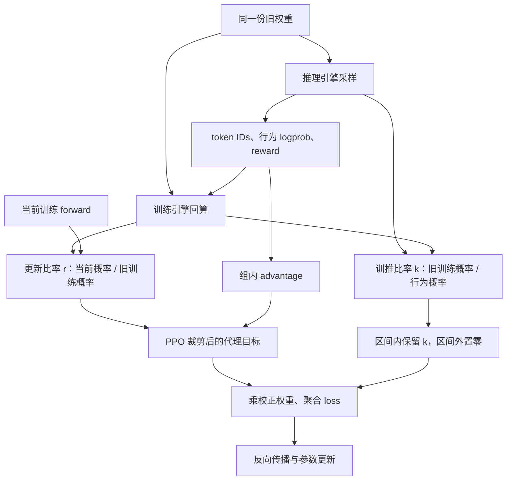

# IcePop 详解：用双侧掩码校正稳定 MoE 强化学习

训练大模型时，一个容易被默认接受的前提是：**同一份权重，就代表同一个策略。** 在使用不同推理、训练引擎的强化学习系统里，这个前提可能不成立。rollout 侧生成了一个 token，训练侧用相同权重回算，却给它不同的概率；优化器随后根据这份不一致的数据继续更新模型。

IcePop 针对的正是这种问题。它出自 Inclusion AI 的 Ring-1T 技术报告，核心机制可以概括为：**对差异适中的 token 做重要性加权，对训推概率比越界的 token，停止使用该位置的策略梯度信号。** [原始论文，§2.3.2](https://arxiv.org/html/2510.18855v2#S2.SS3.SSS2)

理解它的关键，是先分清“训练引擎与推理引擎的差异”和“参数更新带来的策略变化”。下面以原始论文的同步旧策略设定为主，结合数值例子推导目标函数，再讨论实际系统中的变体。资料核对截至 2026 年 9 月 8 日。

## 1. 为什么权重一致，概率仍然不同

LLM 强化学习通常把工作交给两套执行栈：推理引擎负责批量采样，训练引擎负责 logprob、loss 和反向传播。浮点归约顺序、batch 形状、融合算子、精度和并行切分可能不同。即使都使用 BF16，也不能仅凭 dtype 相同就认定数值一致。[Thinking Machines Lab 的实验](https://thinkingmachines.ai/blog/defeating-nondeterminism-in-llm-inference/)具体展示了 batch 依赖与浮点计算路径如何影响推理结果。

MoE 又增加了一层放大机制：router 通常通过 Top-K 选择专家。如果两个候选专家的分数接近，微小数值扰动就可能改变入选专家；后续 token 概率的变化可能远大于最初的扰动。路由对齐是独立的系统问题，相关证据可参见 [R3 论文](https://arxiv.org/html/2510.11370v1)。

先定义后文会用到的三个概率。令 $s_{i,t}=(x,y_{i,<t})$ 为第 $i$ 条回答在第 $t$ 个 token 前的上下文，所有概率都针对**同一个已采样 token 和同一个前缀**：

| 记号              | 定义                                                              | 从哪里获得                     | 本轮更新时是否求梯度 |
| ----------------- | ----------------------------------------------------------------- | ------------------------------ | -------------------- |
| $\mu_{i,t}$       | $\pi_{\mathrm{infer}}(y_{i,t}\mid s_{i,t};\theta_{\mathrm{old}})$ | rollout 当时保存的行为 logprob | 否                   |
| $q_{i,t}$         | $\pi_{\mathrm{train}}(y_{i,t}\mid s_{i,t};\theta_{\mathrm{old}})$ | 训练引擎用旧权重回算           | 否                   |
| $p_{i,t}(\theta)$ | $\pi_{\mathrm{train}}(y_{i,t}\mid s_{i,t};\theta)$                | 当前训练 forward               | 是                   |

由此得到两个职责不同的比率：

$$
\underbrace{k_{i,t}=\frac{q_{i,t}}{\mu_{i,t}}}_{\text{同一旧权重的训推差异}},
\qquad
\underbrace{r_{i,t}(\theta)=\frac{p_{i,t}(\theta)}{q_{i,t}}}_{\text{训练策略的更新幅度}}.
$$

[verl 的 rollout correction 说明](https://verl.readthedocs.io/en/latest/algo/rollout_corr.html#overview)也采用了这一划分，分别处理行为策略、旧训练策略和当前策略之间的差异。

第一次 optimizer step 之前，即使训练计算完全可重复、$p=q$，也只能推出 $r=1$；只要两套执行栈不同，仍可能有 $k\ne1$。这就是为什么“只更新一次”“刚同步过权重”不能自动消除训推不一致。



## 2. 先做校正，再决定哪些信号值得保留

### 2.1 重要性比率为什么是“训练除以推理”

固定一个前缀 $s$。如果希望计算训练分布 $q$ 下的某个期望，但样本来自 $\mu$，在目标分布被行为分布覆盖的前提下，有：

$$
\mathbb E_{a\sim q(\cdot\mid s)}[f(a)]
=
\mathbb E_{a\sim\mu(\cdot\mid s)}
\left[\frac{q(a\mid s)}{\mu(a\mid s)}f(a)\right].
$$

例如，某个 token 在 rollout 中的概率为 $0.1$，在旧训练策略中的概率为 $0.2$，那么 $k=2$。行为分布相对少采了这种动作，因此需要增加其权重；如果两者分别是 $0.2$ 和 $0.1$，则 $k=0.5$，需要减小其权重。

但直接使用 $k$ 也会带来麻烦。假设 $\mu=10^{-5}$、$q=10^{-3}$，则 $k=100$。一个少见 token 就能获得其他普通位置上百倍的权重。若这样的尾部位置又伴随较大的 advantage 或对数概率梯度，它们可能主导一次更新。

IcePop 根据概率比筛选策略损失项，使用的权重函数为：

$$
M(k;\alpha,\beta)
=k\,\mathbf 1\{\alpha\le k\le\beta\}
=
\begin{cases}
k,&\alpha\le k\le\beta,\\
0,&\text{其他情况}.
\end{cases}
$$

这是论文公式 (2) 的机制。**区间内保留连续权重 $k$，区间外彻底置零。** [原式](https://arxiv.org/html/2510.18855v2#S2.SS3.SSS2)

### 2.2 Mask 和 clamp 的差别到底有多大

取 IcePop 区间为 $[0.5,5]$，比较几种方法对同一个 $k$ 给出的权重：

| 原始 $k$ | 普通 IS：$k$ | 上截断 TIS：$\min(k,5)$ | 双侧 clamp：$\operatorname{clip}(k,0.5,5)$ | IcePop：$k\mathbf 1_{[0.5,5]}$ |
| -------: | -----------: | ----------------------: | -----------------------------------------: | -----------------------------: |
|      0.1 |          0.1 |                     0.1 |                                        0.5 |                              0 |
|      0.5 |          0.5 |                     0.5 |                                        0.5 |                            0.5 |
|      1.0 |          1.0 |                     1.0 |                                        1.0 |                            1.0 |
|      3.0 |          3.0 |                     3.0 |                                        3.0 |                            3.0 |
|      5.0 |          5.0 |                     5.0 |                                        5.0 |                            5.0 |
|      8.0 |          8.0 |                     5.0 |                                        5.0 |                              0 |

当 $k=8$ 时，TIS 仍让这个位置贡献一个权重为 5 的训练信号；IcePop 则将该位置的策略损失项置零。

低端也同样如此。$k=0.1$ 表示行为概率是旧训练概率的十倍。虽然重要性加权已经把它降权，但 IcePop 还会根据“相对差异过大”这个规则将其屏蔽。**下界用于拒绝差异过大的位置，不能用“防止权重爆炸”解释。**

另外，双侧不意味着对称。$[0.5,5]$ 在 log-space 中约为 $[-0.693,1.609]$，允许的两个方向的偏差不同。若要在 log-space 关于 0 对称，应满足 $\alpha=1/\beta$。

TIS 和不同截断定义的背景可继续阅读 [[foundations/RL/系统/训练稳定性/精度/训推一致性/TIS：用截断重要性采样缓解LLM RL训推不一致|TIS 详解]]。

## 3. 把 IcePop 放回 GRPO 目标

对每个 prompt 采样 $G$ 条回答，记第 $i$ 条回答的奖励为 $R_i$。为便于说明，可以使用常见的组内标准化 advantage：

$$
\widehat A_i
=\frac{R_i-\operatorname{mean}(R_1,\ldots,R_G)}
{\operatorname{std}(R_1,\ldots,R_G)+\epsilon_A},
\qquad \widehat A_{i,t}=\widehat A_i.
$$

这里沿用 GRPO 的 advantage 计算方式，IcePop 的校正作用于后续的策略目标。GRPO 基础可参见 [[foundations/RL/算法/GRPO|GRPO]]。

定义 PPO 的代理目标（surrogate）：

$$
S(r,A)=\min\left(rA,\operatorname{clip}(r,1-\epsilon,1+\epsilon)A\right).
$$

将论文公式 (1) 用前面的符号重写，得到最大化目标：

$$
J(\theta)
=\mathbb E_{x,\{y_i\}\sim\mu}
\left[
\frac1G\sum_{i=1}^{G}\frac1{T_i}\sum_{t=1}^{T_i}
\left(
M(k_{i,t})S(r_{i,t}(\theta),\widehat A_{i,t})
-\gamma K_{i,t}(\theta)
\right)
\right].
$$

这里 $T_i$ 是回答长度，$K_{i,t}$ 表示与参考策略（reference policy）的 KL 正则项；优化器通常最小化 $\mathcal L=-J$。原论文的 $M(k)$ **只乘代理目标，KL 项位于这个乘积之外**。如果实现把整个 loss 都乘 mask，就改变了含 KL 情况下的目标。[论文公式 (1)](https://arxiv.org/html/2510.18855v2#S2.SS3.SSS2)

### 3.1 两个比率为何要分开

忽略 PPO clipping 和 IcePop masking 时：

$$
k_{i,t}r_{i,t}
=\frac{q_{i,t}}{\mu_{i,t}}\frac{p_{i,t}}{q_{i,t}}
=\frac{p_{i,t}}{\mu_{i,t}}.
$$

这个等式解释了分解的含义：$k$ 负责连接数据来源与旧训练策略，$r$ 负责表达当前训练策略相对旧策略的变化。

但加入非线性截断后，不能任意合并。例如一般情况下：

$$
M(k)S(r,A)\ne S(kr,A).
$$

取 $k=3$、$r=1$、$A=1$、$\epsilon=0.2$。左侧等于 3；如果把 $kr=3$ 直接代入 PPO 的代理目标，右侧等于 1.2，并落在裁剪后的平坦区间。**比率乘积相等，裁剪后的目标值和梯度仍可能不同。**

### 3.2 一次更新就能看出 PPO clipping 的盲点

设第一次更新前 $p=q$，所以 $r=1$。同一个位置可能有 $k=1$，也可能有 $k=8$。只观察 $r$ 的 PPO clipping 在这两种情况下做出完全相同的判断；IcePop 则分别赋权 1 和 0。

因此，两种机制分别约束不同的偏移。它们可以叠加，不能互相替代。

## 4. “屏蔽梯度”与 PPO clipping 为什么不同

### 4.1 PPO 并非把所有越界 token 都置零

PPO 的 $\min$ 会根据 advantage 的正负选择分支。在不讨论边界点次梯度的情况下：

| Advantage | 进入平坦分支的条件 | 含义                                   |
| --------- | ------------------ | -------------------------------------- |
| $A>0$     | $r>1+\epsilon$     | 奖励好的动作已经增加过多，停止继续推动 |
| $A<0$     | $r<1-\epsilon$     | 奖励差的动作已经减少过多，停止继续推动 |

例如 $A<0$、$r$ 很大时，PPO 通常仍然会保留用于降低该动作概率的梯度。它不是“只要 ratio 不在区间内就不训练”的二值筛选器。

原始 IcePop 则先看 $k$ 是否越界，与 advantage 的符号无关。一个越界位置，无论答案奖励好坏，该位置的代理目标都会被乘零。

### 4.2 原始权重为何要固定

由于 $k=q/\mu$ 由旧策略和已保存的 rollout 概率构成，它对当前参数 $\theta$ 应当是常量。在未触发 PPO 平坦分支的位置，有：

$$
\nabla_\theta\left[M(k)r(\theta)A\right]
=M(k)\,r(\theta)A\,\nabla_\theta\log p_\theta.
$$

在可接受区间内，上式的系数是 $(p/\mu)A$；区间外，这一项为零。

这也说明一个实现陷阱：如果误用当前 $p_\theta$ 计算校正权重，又让梯度流过它，就会出现额外导数。例如忽略 mask 时，把 $p_\theta/\mu$ 和 $p_\theta/q$ 两项都参与求导，相当于对含 $p_\theta^2$ 的表达式求导，已经不是原目标。

### 4.3 Mask 的范围只到局部策略损失

“这个 token 被屏蔽”应理解为它的**直接策略损失项不再贡献梯度**，而不能推出以下结论：

- 该 token 从训练输入中消失：它仍在前缀里，后续 token 的预测仍可依赖它。
- 涉及该 token 的参数不再更新：参数与其他位置共享，后续 loss 仍可通过前缀计算图反传。
- 它的概率下一步不变：其他位置的更新也可能改变它的概率。
- 总梯度一定为零：KL、辅助目标或其他位置仍可能贡献梯度，优化器动量和 weight decay 也仍可改变参数。

## 5. IcePop 用什么代价换取稳定

### 5.1 删除尾部意味着引入偏差

固定前缀 $s$，记接受集合为：

$$
\mathcal C_s=\{a:\alpha\le q(a\mid s)/\mu(a\mid s)\le\beta\}.
$$

对前面的重要性采样恒等式加上 IcePop mask，可直接推得：

$$
\mathbb E_{a\sim\mu}\left[M(k(a))f(a)\right]
=\sum_{a\in\mathcal C_s}q(a\mid s)f(a).
$$

相对于完整 $q$ 分布下的期望，估计偏差为：

$$
-\sum_{a\notin\mathcal C_s}q(a\mid s)f(a).
$$

偏差的方向取决于被删掉的训练信号，不能仅凭 mask 比例判断。若这些位置包含重要的推理分支、罕见正确答案或关键错误动作，屏蔽也可能损失有价值的学习机会。将越界 token 称为“噪声”是一种建模和工程判断；概率比只反映两侧概率的差异，无法判断 token 对任务是否有用。

### 5.2 权重有上界，不等于梯度有上界

接受区域内有 $0\le M(k)\le\beta$，但局部梯度还包含 $r$、$A$ 和 $\nabla\log p$。对固定前缀下平方可积的向量信号 $f$，可以得到简单界：

$$
\mathbb E_\mu[\|M(k)f\|^2]
\le\beta^2\mathbb E_\mu[\|f\|^2].
$$

它只说明**校正权重本身**不会无界放大二阶矩。若 $f$ 已经因为 advantage 尺度、训练异常或其他因素很大，IcePop 仍不能独自保证整体梯度稳定。

### 5.3 Token 级校正没有修复前缀访问分布

前面的恒等式刻意固定了 $s$。真实 rollout 中，前缀也是由行为策略生成的。对完整自回归回答：

$$
\frac{q(y\mid x)}{\mu(y\mid x)}
=\prod_{t=1}^{T}\frac{q(y_t\mid x,y_{<t})}{\mu(y_t\mid x,y_{<t})}.
$$

IcePop 每个位置只用当前 token 的 $k_t$，没有使用完整轨迹比率。因此，它构造的是局部校正的代理目标，并不保证完整 on-policy 训练的无偏性。

长轨迹下，完整乘积本身也会遇到方差问题。例如，若连续 1000 个位置的比率都为 1.01，乘积就会达到 $1.01^{1000}\approx20959$。实际序列中，各位置的偏差未必同向，但这个算例说明了乘积对微小偏差的敏感性。

### 5.4 PPO 的 reference KL 也不是训推 KL

参考策略正则通常比较当前策略与某个固定 reference；训推差异比较的则是两套执行栈。两个 KL 的对象不同。reference KL 较小，不能证明训练与 rollout 一致；屏蔽了越界梯度，也不保证下一轮的训推 KL 必然下降。

## 6. 如何理解“误差会越训越大”

一种可能的反馈过程是：训推差异使梯度估计偏离目标，更新又把模型推向更容易发生训推分歧的区域，下一批数据再产生更大的偏差。MoE 的离散路由变化给这种反馈提供了潜在的放大通道。

但“可能形成反馈”与“必然指数爆炸”是两种不同的结论。论文附录的增长命题需要平滑性、偏差与差异增长方向的对齐、on-policy 漂移及梯度有界等条件；其一般形式带有减项，超过一定差异阈值后才得到几何增长下界。[理论分析，附录 §8](https://arxiv.org/html/2510.18855v2#S8)

这项分析支持一种特定的不稳定机制，没有证明所有 MoE 训练都必然发散，也没有给出“加上 IcePop 后全局收敛”的保证。特别是实际 Top-K 路由存在切换边界，把局部平滑分析直接外推到完整训练过程需要额外论证。

在实际训练中，可以观察 **ratio 尾部是否持续扩大，以及这种变化是否伴随 gradient norm、reward 或行为多样性的异常**。确认数据和概率记录无误后，如果这些现象仍然同步出现，就值得用 IcePop 做一组对照实验。

## 7. 实验证据支持到哪里

论文在 Ring-mini-2.0 上比较了基线、TIS 和 IcePop：基线在约 180–200 步后出现训练崩溃，TIS 和 IcePop 在展示的 600 步内保持稳定；默认设置中，被屏蔽的 token 约占 **1–2‰（0.1%–0.2%）**。阈值敏感性实验还显示，收窄到 $[0.5,2]$ 反而导致不稳定。[实验与附录分析](https://arxiv.org/html/2510.18855v2#S9)

屏蔽比例虽小，这些位置对梯度方向和范数的影响却可能很大。因此，诊断时除了统计屏蔽率，还应检查这些位置对梯度的贡献。收窄区间后失稳的结果也表明，阈值越严格未必越好：筛选会改变保留的动作分布，可能删掉有用的学习信号。

这些实验支持 IcePop 在该设置下稳定训练。要判断它在其他模型和任务上是否有效，仍需保持训练预算与采样配置一致，并进行多次对照实验。

Ring-1T 的最终成绩来自完整训练流程，rollout 调度的效率收益则来自相应的调度设计。IcePop 对最终成绩有多少独立贡献，还需要单独做消融实验确认。[Ring-1T 报告](https://arxiv.org/abs/2510.18855v2)

## 8. 按原论文实现 IcePop

下面给出教学实现，采用三个明确命名的 logprob，关闭 KL，保留原目标“每条回答先按长度平均，再对回答平均”的结构。输入形状均为 `[B, T]`，advantage 已广播到 token；每个 prompt 的回答数相同。这里只展示 loss，不包含分布式归约、模型前向和数据管线。

```python
import math
import torch


def icepop_policy_loss(
    current_logp,
    old_train_logp,
    rollout_logp,
    advantages,
    response_mask,
    alpha=0.5,
    beta=5.0,
    eps=0.2,
):
    assert 0 < alpha <= 1 <= beta < math.inf
    assert 0 < eps < 1
    valid = response_mask.bool()
    lengths = valid.sum(dim=-1)
    assert torch.all(lengths > 0), "先处理没有训练 token 的回答"

    # 有效位置必须有可信、有限的概率和 advantage。
    for value in (current_logp, old_train_logp, rollout_logp, advantages):
        assert torch.isfinite(value[valid]).all()

    with torch.no_grad():
        old = old_train_logp.float().detach()
        behavior = rollout_logp.float().detach()
        log_k = torch.where(valid, old - behavior, 0.0)
        accept = valid & (log_k >= math.log(alpha))
        accept = accept & (log_k <= math.log(beta))

        # 先判断再 exp，避免被拒绝位置产生 exp(巨大值)。
        safe_log_k = torch.where(accept, log_k, 0.0)
        weight = safe_log_k.exp() * accept.float()
        advantage = torch.where(accept, advantages.float(), 0.0)

    # 被拒绝位置不计算可能溢出的 ratio，再乘零并不能消除 inf/NaN。
    log_r = torch.where(accept, current_logp.float() - old, 0.0)
    ratio = log_r.exp()
    assert torch.isfinite(ratio[accept]).all(), "检查异常更新幅度"

    unclipped = ratio * advantage
    clipped = ratio.clamp(1.0 - eps, 1.0 + eps) * advantage
    token_objective = weight * torch.minimum(unclipped, clipped)
    assert torch.isfinite(token_objective).all(), "检查 advantage 与加权溢出"

    # 分母是原始有效长度，不能悄悄改成 accept.sum(-1)。
    per_sequence = token_objective.sum(dim=-1) / lengths
    loss = -per_sequence.mean()
    assert torch.isfinite(loss), "检查归约溢出"

    with torch.no_grad():
        total = valid.sum()
        metrics = {
            "icepop/reject_low": (
                (valid & (log_k < math.log(alpha))).sum() / total
            ),
            "icepop/reject_high": (
                (valid & (log_k > math.log(beta))).sum() / total
            ),
            "icepop/retained": accept.sum() / total,
        }
    return loss, metrics
```

把这段示例接入实际训练时，需要保持以下几个约定。

**第一，旧概率要对应正确版本。** `old_train_logp` 应来自这里定义的旧训练策略，不能只因为框架把某个字段叫 `old_log_probs` 就直接使用。它也可能保存的是推理侧概率，或者当前 minibatch 前刚重算的 proximal 概率。

**第二，原版的校正权重在更新过程中固定。** 同一批 rollout 做多个 epoch 时，如果 $q$ 的定义保持不变，$k$ 和 mask 就保持不变，变化的是 $r$。每次用当前策略重算 mask 是另一种设计。

**第三，归一化会改变算法。** 假设一条回答原本有 100 个训练 token，屏蔽后只剩 20 个。除以 100 与除以 20，会使该回答剩余信号相差五倍。全局 token 平均、逐回答平均和按保留权重归一化也不等价，不能把这些差异都归为“实现细节”。

**第四，要检查先 exp 再 mask 的数值陷阱。** `0 * inf` 仍可能产生 NaN，`torch.where` 的两个表达式也可能已经被计算。上面先在 log-space 决定接受区间，再对安全值取指数。有效数据出现非有限值时则直接报错，避免把数据损坏当作正常的越界屏蔽。

**第五，逐回答平均只是这里选择的目标。** 对纯文本 completion，分母可对应 $T_i$；扩展到 Agent 轨迹时，要明确训练 token 是否排除了工具输出、环境观察与 padding。改变长度口径同样会改变样本权重。

## 9. 行为 logprob 的定义，比阈值更基础

假设 rollout 使用 temperature、top-p 或 top-k，而保存的是处理前的 raw model logprob。那么这个数值未必是实际抽样分布 $\mu$ 的 logprob，前面的换测度解释就不能直接套用。

应先说明训练目标到底是什么：要校正到未变换的模型分布，还是经过相同采样变换的策略。若要用前面的 IS 恒等式，分母必须对应实际行为分布，目标与分母还需满足支持集条件：

$$
q(a\mid s)>0\ \Longrightarrow\ \mu(a\mid s)>0.
$$

例如 top-k 将某些动作的行为概率置零，而目标分布仍给它们正概率，重新加权现有 token 无法补回从未采到的动作。仅对已出现的 token 计算出一个有限 ratio，并不足以证明完整分布的校正成立。

这些是重要性采样的数学约束。工程框架可以选择使用近似的 model-probability ratio，但应承认其近似含义，并核对两侧 temperature 与 logits processor 的约定。

概率以外还要保证 token IDs、位置、attention mask 和 loss mask 对齐。尤其不要把 completion 解码成字符串后重新 tokenize，再把旧的 logprob 原样贴回去。IcePop 不能修复这种索引错位；错位数据被大量屏蔽，也不代表管线恢复正确。

## 10. 异步训练与 Online IcePop：名字相同，目标未必相同

### 10.1 旧训练策略与行为策略可能使用不同版本的权重

若行为版本为 $\theta_b$，训练端选取的 proximal anchor 为 $\theta_{\mathrm{old}}$，总比率可以拆成：

$$
\frac{p^{\mathrm{train}}_\theta}{\pi^{\mathrm{infer}}_{\theta_b}}
=
\underbrace{\frac{p^{\mathrm{train}}_\theta}{\pi^{\mathrm{train}}_{\theta_{\mathrm{old}}}}}_{\text{本轮更新}}
\cdot
\underbrace{\frac{\pi^{\mathrm{train}}_{\theta_{\mathrm{old}}}}{\pi^{\mathrm{train}}_{\theta_b}}}_{\text{版本陈旧}}
\cdot
\underbrace{\frac{\pi^{\mathrm{train}}_{\theta_b}}{\pi^{\mathrm{infer}}_{\theta_b}}}_{\text{同版本执行差异}}.
$$

所有项仍然针对同一个 token 与前缀。若直接使用 proximal train / behavior infer 做校正，中间两项就合在一起；不能再把所有越界解释成 MoE kernel 误差。涉及跨版本续写时，甚至同一条回答内不同 token 都可能对应不同的行为版本，因此最好按生成片段记录版本元数据。[verl 对不同 off-policy 来源的区分](https://verl.readthedocs.io/en/latest/algo/rollout_corr.html#overview)

### 10.2 当前策略重算的 mask 为什么会不同

为了分析一种 online 变体，定义：

$$
\widetilde k_t(\theta)=\frac{p_t(\theta)}{\mu_t}.
$$

如果根据这个量判断 token 是否落在接受区间，mask 就会随 minibatch 更新而变化。假设一个 token 原来 $q/\mu=4$，更新后 $p/q=1.5$，则 $p/\mu=6$。使用 $[0.5,5]$ 时，原始 $k$ 仍在区间内，基于当前概率的筛选则会拒绝它；原版还需独立判断其 PPO 分支。

即使两种实现都对权重 `detach`，也只是禁止梯度穿过权重计算，不会让它们的数值、接受集合或策略目标自动相同。

因此，阅读任何名为 IcePop 的配置，都应该沿着 loss 的数据流回答四个问题：

1. 筛选用的是 old train / behavior，还是 current train / behavior？
2. 区间内是乘原比率，还是只留下一个二值 mask？
3. 权重什么时候重算，是否 stop-gradient？
4. 与之相乘的是 PPO 代理目标、直接策略梯度损失，还是另一个目标？

### 10.3 AReaL：要沿着 proximal 的来源往回看

以官方仓库提交 `f289b989bc5d1930d5c6d592d335e2ffaf8c2f01` 为准，AReaL 的核心实现使用：

$$
w_t=\exp\left(\operatorname{sg}(\log\pi_{\mathrm{prox},t})
-\operatorname{sg}(\log\pi_{\mathrm{behave},t})\right),
\qquad r_t=\frac{\pi_{\theta,t}}{\pi_{\mathrm{prox},t}}.
$$

其中 $\operatorname{sg}$ 表示停止梯度。越界位置被 mask，区间内仍乘原始 $w$；聚合使用过滤前记录的 token 数。[校正权重源码](https://github.com/areal-project/AReaL/blob/f289b989bc5d1930d5c6d592d335e2ffaf8c2f01/areal/utils/functional/functional.py#L231)、[PPO loss 与分母处理](https://github.com/areal-project/AReaL/blob/f289b989bc5d1930d5c6d592d335e2ffaf8c2f01/areal/utils/functional/functional.py#L502)

官方 [IcePop 配置示例](https://github.com/areal-project/AReaL/blob/f289b989bc5d1930d5c6d592d335e2ffaf8c2f01/examples/math/gsm8k_icepop.yaml)启用 decoupled loss，并设置 token 级 ratio mask 和区间 $[0.5,5]$。默认 proximal 重算路径下，行为数据可能来自更早的策略版本，因此这里的校正还可以包含异步时滞。

所以，读到 [算法总览](https://areal-ai.io/docs/en/algorithms/grpo_series.html#icepop)中的 current / behavior 描述，不能直接推断“每次 optimizer step 都用新的当前策略重新生成 mask”。实际的 proximal 取值需要查运行路径。显式使用 `reuse_train_logp` 时才复用当前 forward 的 detached logprob；该模式还要求一个 PPO optimizer minibatch。[actor 中的选择逻辑](https://github.com/areal-project/AReaL/blob/f289b989bc5d1930d5c6d592d335e2ffaf8c2f01/areal/trainer/ppo/actor.py#L804)、[配置约束](https://github.com/areal-project/AReaL/blob/f289b989bc5d1930d5c6d592d335e2ffaf8c2f01/areal/api/cli_args.py#L1949)

这类工程实现可以保留原始 IcePop 的“区间内加权、区间外归零”机制，但在 proximal 版本和 loss 聚合口径上有所扩展。与论文做数值复现时，应逐项说明。

### 10.4 slime：同一个文件就能看清 clamp 与 mask

在 slime 提交 `680824dd5e01a2e83750bf87fc366ec6fa98766c` 中，`vanilla_tis_function` 对 train / rollout ratio 做上下界 clamp，`icepop_function` 则在越界时置零，并返回原来的 `loss_masks`。[相邻函数源码](https://github.com/THUDM/slime/blob/680824dd5e01a2e83750bf87fc366ec6fa98766c/slime/backends/megatron_utils/loss.py#L831)

这里两个函数的对照很直观，但 `train_log_probs` 究竟来自哪里仍要看调用者。正常回算路径在 `no_grad` 下执行；跳过回算的路径使用当前 logprob 的 detached 值。[loss 调用处](https://github.com/THUDM/slime/blob/680824dd5e01a2e83750bf87fc366ec6fa98766c/slime/backends/megatron_utils/loss.py#L927)、[forward-only 路径](https://github.com/THUDM/slime/blob/680824dd5e01a2e83750bf87fc366ec6fa98766c/slime/backends/megatron_utils/model.py#L344)

这个例子还有一个命名提醒：框架中叫 TIS 的函数可能支持双侧 clamp，而文献讨论中的 TIS 经常指单侧上截断。比较方法之前，先比较实际权重函数与调用参数。

## 11. 与 TIS、GSPO、R3 怎么比较

下表比较各方法使用的比率、筛选方式及实现要求：

| 方法         | 主要操作对象           | 做了什么                                      | 仍需面对的问题              |
| ------------ | ---------------------- | --------------------------------------------- | --------------------------- |
| PPO clipping | 新旧策略的更新比率     | 根据 advantage 符号裁剪代理目标              | 不会自动校正两套执行栈      |
| 上截断 TIS   | 校正比率 $q/\mu$       | 将过大权重压到上限                            | 异常位置仍可贡献梯度        |
| 原始 IcePop  | token 级 $q/\mu$       | 区间内重要性加权，区间外置零                  | 引入选择偏差，损失部分信号  |
| GSPO         | 长度归一化的序列概率比 | 在序列层面构造与裁剪代理目标                  | 不是逐 token 的相同筛选规则 |
| R3           | MoE 专家路由           | 在训练中重放 rollout 路由                     | 需要记录路由并改造执行路径  |
| 数值执行对齐 | kernel、精度、归约路径 | 从计算源头减小差异                            | 有工程成本，需评估吞吐      |

GSPO 的序列比率与目标见 [原论文](https://arxiv.org/html/2507.18071v2)；R3 的路由重放机制见 [原论文](https://arxiv.org/html/2510.11370v1)。关于 R3 的实现分析，可以继续阅读 [[foundations/RL/系统/训练稳定性/精度/训推一致性/R3：用Rollout Routing Replay解决MoE Agentic RL的训推不一致|R3 技术详解]]。

一种组合方式是先通过数值与路由对齐减小训推差异，再用概率校正与筛选处理剩余的极端比率。如果前者工程成本较高，也可以先评估算法层面的方法。两类措施能否互相补充，需要通过组合实验确认。

IcePop 的公式并不依赖专家索引。因此，Dense 模型若存在相同的概率失配，也可以尝试这种校正。

## 12. 在自己的训练里，应该怎样评估

我会先做同版本回放：固定 checkpoint、token IDs 和上下文，用训练引擎回算 rollout，检查未经任何 clip/mask 的 $\log q-\log\mu$。这一步隔离数值执行差异；随后再加入异步队列和多轮更新，观察额外的版本影响。

至少应同时记录以下几组量：

| 观察量                                              | 它帮助回答的问题                   |
| --------------------------------------------------- | ---------------------------------- |
| 原始 log-ratio 的分位数与尾部                       | 原始训推差异是否持续扩大？         |
| 低端拒绝率、高端拒绝率                              | 差异主要向哪个方向发展？           |
| 保留的 token 数、整条被清空的回答数                 | 有多少训练信息实际进入目标？       |
| 按回答长度、任务、token 位置分桶的拒绝率            | 某些任务或长轨迹是否被系统性削弱？ |
| 原始与处理后权重的 ESS                              | 少数位置是否支配校正权重？         |
| Reward、held-out 指标、entropy、长度、gradient norm | 数值稳定是否真的转化为有效学习？   |
| 行为版本与 proximal 版本                            | 越界主要来自执行栈还是版本陈旧？   |

对非负权重 $w_j$，一个常用诊断量是：

$$
\operatorname{ESS}(w)
=\frac{(\sum_j w_j)^2}{\sum_j w_j^2}.
$$

如果所有权重都是零，这个量没有定义，应单独报告“无有效信号”。LLM 的同序列 token 彼此相关，因此这里的 ESS 更适合作为权重集中度指标，不能直接当成独立样本数量或性能置信区间。

比较原始和处理后 ESS 时也要小心：删除尾部会让权重看起来更均匀，分母采用原始 token 数还是保留 token 数，也会影响归一化 ESS 的解释。**处理后的指标改善，不能证明原始 mismatch 消失。**

做消融时，至少应比较普通基线、上截断 TIS 和 IcePop，并保持 advantage 归一化、loss 聚合方式、采样配置与训练预算一致。研究异步系统时，再单独调整允许的版本延迟；分析数值误差时，则单独改变 kernel 或精度。如果同时改动这些变量，就很难判断最终收益来自哪一项。

阈值可以从论文报告的 $[0.5,5]$ 开始试验，但这只是起点。低端、高端应分别调整；同时记录原始分布、丢弃的数据类型和最终任务效果。若大量回答被清空，优先排查版本、logprob 和 token 对齐，不能只通过扩大区间让拒绝率变得好看。

继续阅读：[[foundations/RL/系统/训练稳定性/精度/训推一致性/Trainning-Inference Mismatch|训推不一致概览]]、[[foundations/RL/系统/训练稳定性/精度/训推一致性/TIS：用截断重要性采样缓解LLM RL训推不一致|TIS]]、[[foundations/RL/系统/训练稳定性/精度/训推一致性/R3：用Rollout Routing Replay解决MoE Agentic RL的训推不一致|R3]]。
