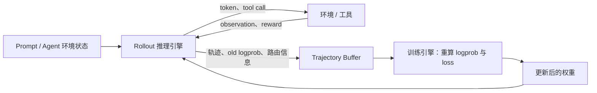
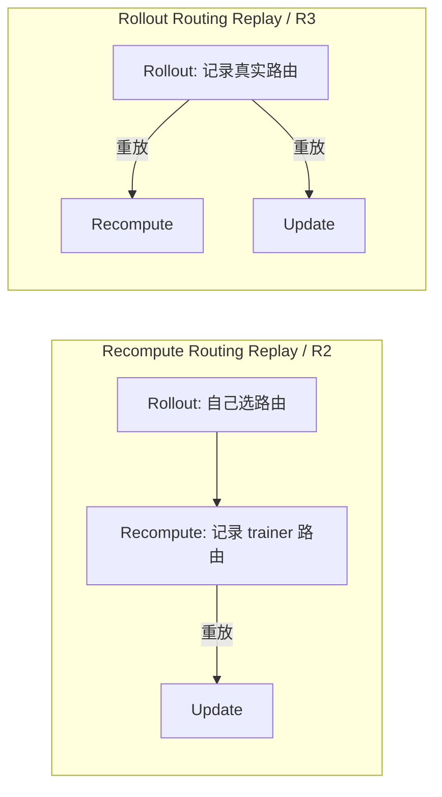

# R3 技术详解：用 Rollout Routing Replay 对齐 MoE Agentic RL 的训推路由

> 本文讨论的 R3 是 **Rollout Routing Replay**，即“Rollout 路由重放”。它针对的是 MoE 模型在 rollout 推理引擎和训练引擎之间的专家路由不一致，而不是一个可以消除所有训推误差的通用算法。
>
> 一句话概括：**模型用哪些专家生成了这条轨迹，训练这条轨迹时就让它重新走同一组专家。**

## 1. 为什么 Agentic RL 会出现“名义 on-policy，实际 off-policy”

典型的大模型强化学习系统不会用同一个执行引擎完成所有工作。为了高吞吐地生成轨迹，rollout 一侧通常使用 SGLang、vLLM 等推理引擎；为了完成反向传播和分布式优化，训练一侧通常使用 Megatron-LM、FSDP 等训练引擎。



这种分工对性能几乎是必需的，但它也引入了一个很容易被低估的问题：即使两侧加载的是同一份权重、输入的是同一串 token，不同模型实现、算子、精度、并行方式和动态 batch 仍可能产生不同的 token 概率。这个现象通常称为 **Training–Inference Mismatch，TIM**。[TIM 诊断工作](https://arxiv.org/html/2605.14220)表明，它不是无害的末位浮点噪声，单独存在时就可能改变优化目标并触发 RL 训练崩溃。

为了看清问题，区分三个分布：

- $\mu=\pi^{\text{rollout}}_{\theta_b}$：rollout 引擎真正用于采样 token 的行为策略；
- $\pi^{\text{train}}_{\theta_{\text{old}}}$：训练引擎在旧权重上重算得到的策略；
- $\pi^{\text{train}}_{\theta}$：当前正在被优化的训练策略。

对于 rollout 中已经采样出的 token $a_t$，正确的行为策略重要性比率应当是：

$$
\rho_t^{\text{total}}
=
\frac{\pi^{\text{train}}_{\theta}(a_t\mid s_t)}
     {\mu(a_t\mid s_t)}.
$$

在异步系统中，$\theta_b$ 可能早于 trainer 用作 proximal reference 的 $\theta_{\text{old}}$。把比率拆成三项，可以避免把权重陈旧和同 checkpoint 的引擎误差混为一谈：

$$
\rho_t^{\text{total}}
=
\underbrace{
\frac{\pi^{\text{train}}_{\theta}(a_t\mid s_t)}
     {\pi^{\text{train}}_{\theta_{\text{old}}}(a_t\mid s_t)}
}_{\rho_t^{\text{update}}\colon\,\text{正常的策略更新偏移}}
\cdot
\underbrace{
\frac{\pi^{\text{train}}_{\theta_{\text{old}}}(a_t\mid s_t)}
     {\pi^{\text{train}}_{\theta_b}(a_t\mid s_t)}
}_{\rho_t^{\text{stale}}\colon\,\text{权重版本陈旧}}
\cdot
\underbrace{
\frac{\pi^{\text{train}}_{\theta_b}(a_t\mid s_t)}
     {\pi^{\text{rollout}}_{\theta_b}(a_t\mid s_t)}
}_{\rho_t^{\text{sys}}\colon\,\text{同权重下的执行栈偏移}}.
$$

$\rho^{\text{update}}$ 是 PPO、GRPO 等算法本来就要管理的 policy drift；$\rho^{\text{stale}}$ 来自异步队列和长 rollout；$\rho^{\text{sys}}$ 才是相同权重下由执行栈额外引入的偏差。同步场景中 $\theta_b=\theta_{\text{old}}$，中间项为 1，但系统项依然可能存在。如果 trainer 直接用自己重算的 old logprob 当分母，$\rho^{\text{sys}}$ 会被隐藏，但数据仍然不是从这个 trainer 分布采样的；如果使用 rollout 保存的 logprob，当训练尚未做任何参数更新时，比率也可能已经明显偏离 1。两种做法都不能从根因上消除 TIM。

R3 的作用，是在 MoE 模型中从计算路径源头压低 $\rho^{\text{sys}}$ 的路由重尾异常；它在 Update 阶段继续使用同一 mask，也会约束 $\rho^{\text{update}}$ 中由路由翻转造成的噪声，但不会消除 $\rho^{\text{stale}}$。

## 2. 为什么 MoE 会把很小的数值误差放大

### 2.1 Dense 网络是连续扰动，Top-K 路由是离散跳变

设某个 token 在一个 MoE 层的输入为 $\mathbf{x}$，router 权重为 $\mathbf{W}_r$，共有 $M$ 个专家，每个 token 激活其中 $K$ 个。普通 MoE 前向计算可以写成：

$$
\mathbf{s}=\mathbf{x}\mathbf{W}_r,
$$

$$
\mathbf{I}=\operatorname{TopKMask}(\mathbf{s}, K),
$$

$$
g_i=
\frac{I_i\exp(s_i)}
     {\sum_{j=1}^{M}I_j\exp(s_j)},
$$

$$
\mathbf{y}=\sum_{i=1}^{M}g_i\mathcal{E}_i(\mathbf{x}).
$$

在 Dense 模型里，隐藏状态出现一个很小的数值扰动，后续输出一般也先表现为连续的小扰动。MoE 中间多了一个 `TopK`：只要两个候选专家位于选择边界附近，极小的 router logit 变化就可能让专家集合发生离散翻转。

例如 rollout 侧的两个边界分数是：

```text
expert_7  = 5.001
expert_12 = 5.000
```

训练侧只需出现千分之一量级的反向扰动，就可能改选 `expert_12`。变化的不再只是一个小数，而是 token 接下来通过了另一套 FFN 参数。这个差异会继续传播到后续层，最终放大成明显的 token logprob 偏差。

更严重的是，训练侧可能把梯度送到另一组专家：**实际参与生成的计算路径与承担这次 policy gradient 的计算路径不再相同。**

### 2.2 误差从哪里来

即使权重和 token 完全相同，下面这些差异也可能改变 router 输入或边界排序：

- rollout 与 trainer 使用不同的模型实现和 fused kernel；
- BF16、FP16、FP8 或量化路径不同；
- reduction 顺序、矩阵分块和原子操作存在非确定性；
- dynamic batching、sequence packing 和 padding 布局不同；
- TP、EP、CP 等并行切分方式不同；
- 专家负载均衡、逻辑专家到物理专家的映射不同。

这些因素在 Dense 网络里也会产生 TIM，但 MoE 的离散路由会充当一个“误差放大开关”。

### 2.3 原论文观察到了多大的偏差

[R3 原论文](https://arxiv.org/html/2510.11370)使用 Qwen3-30B-A3B、SGLang rollout 和 Megatron trainer，对约 2,048 道数学题、约 2,000 万个 response token 做了对比，得到几个非常直观的数字：

- 约 10% 的 token×MoE-layer 路由位置在训推两侧选择了不同专家；
- 94% 的 token 至少在一个 MoE 层上发生了专家选择差异；
- 每个 token 平均约有 6 个 router 出现差异；
- 即使在同一个 Megatron 框架里，对同一序列连续做两次 forward，输出分布的估计 KL 仍达到 $8.4\times10^{-4}$。

论文使用 $k_3$ 估计器度量 rollout 与 trainer 的 KL：

$$
\widehat{D}_{\mathrm{KL}}
=
\frac{1}{|T|}\sum_{t\in T}
\left[
\frac{\pi_{\text{train}}(t)}{\pi_{\text{infer}}(t)}
-1
-\log\frac{\pi_{\text{train}}(t)}{\pi_{\text{infer}}(t)}
\right].
$$

这里的 $t$ 是从 rollout 分布实际采样到的 response token，不是对每个位置的完整词表分布做精确求和。因此它是 chosen-token Monte Carlo 一致性指标；按标准 $k_3$ 解释，在样本来自 rollout 分布时对应 rollout 到 trainer 的 KL 方向。下文沿用论文的“train–inference estimated KL”中性叫法，不把它当作完整词表的精确 KL。

Qwen3-30B-A3B 的估计 KL 为 $1.535\times10^{-3}$，作为 Dense 对照的 Qwen3-8B 为 $6.4\times10^{-4}$。在这组并非规模严格匹配的对照中，MoE 不只是平均误差更大，概率比超过 2 的极端 token 比例还高约一个数量级。少量但很大的 ratio outlier 会给有限 batch 的 RL 梯度带来显著风险。

## 3. R3 的核心：重放专家集合，而不是复制完整前向结果

R3 的全称由三个 R 组成：

> **Rollout Routing Replay**

它做的事情可以分成三步：

1. rollout 引擎生成轨迹时，记录每个 token、每个 MoE 层实际选择的 Top-K 专家；
2. trainer 重算 old logprob 时，不再让自己的 Top-K 决定专家集合，而是使用 rollout 保存的集合；
3. trainer 更新当前策略，以及 activation checkpointing 触发 forward recompute 时，继续重放同一集合。

### 3.1 数学形式

rollout 侧先得到：

$$
\mathbf{s}_{\text{rollout}}
=\mathbf{x}_{\text{rollout}}\mathbf{W}_r,
\qquad
\mathbf{I}_{\text{rollout}}
=\operatorname{TopKMask}(\mathbf{s}_{\text{rollout}},K).
$$

trainer 仍然计算自己的 router logits：

$$
\mathbf{s}_{\text{train}}
=\mathbf{x}_{\text{train}}\mathbf{W}_r,
$$

但不再用它重新选择 Top-K，而是在 rollout mask 内计算 gating weight：

$$
g^{\text{R3}}_i
=
\frac{I_{\text{rollout},i}\exp(s_{\text{train},i})}
     {\sum_{j=1}^{M}I_{\text{rollout},j}\exp(s_{\text{train},j})}.
$$

最后执行 rollout 当时选择的专家：

$$
\mathbf{y}_{\text{R3}}
=
\sum_{i=1}^{M}
g^{\text{R3}}_i\mathcal{E}_i(\mathbf{x}_{\text{train}}).
$$

这里有一个经常被误解的细节：**R3 原方法重放的是 Top-K mask，也就是专家 ID，而不是 rollout 侧的完整 router logits 或 gating weights。** 训练侧仍用自己的 logits 在固定专家集合内做 softmax，因此被选中 gate 的梯度仍能回传到 router。R3 固定的是这批样本的离散计算路径，并没有简单地冻结 router 参数。

换句话说，R3 做了一个有意的折中：

- 用 rollout 路由保证“同一批数据走同一组专家”；
- 用 trainer gate score 保留 router 学习能力；
- 接受两侧 gating weight 和其他数值路径仍可能不完全相同。

因此，更严谨的说法是：**R3 优化的是一个以 rollout route 为条件的 surrogate objective。它显著缩小 TIM，但不保证 bit-exact 的零误差。**

上面的 softmax 公式来自论文的抽象。真实 MoE 还可能使用 sigmoid score、group-limited Top-K、routing bias、shared expert 等机制。通用实现不应把这些逻辑统一改写成 softmax；它只应替换“选择哪几个离散专家”这一步，其余打分、重归一化和 shared-expert 逻辑仍由原模型实现负责。

### 3.2 R2 和 R3 到底差在哪里

普通 PPO/GRPO 风格的 MoE RL 往往包含三个 forward 阶段：

1. **Rollout**：推理引擎用 $\theta_{\text{old}}$ 生成样本；
2. **Recompute**：训练引擎重算 $\pi^{\text{train}}_{\theta_{\text{old}}}$；
3. **Update**：训练引擎在一个或多个 mini-step 中计算 $\pi^{\text{train}}_\theta$ 并更新参数。

[GSPO 工作](https://arxiv.org/html/2507.18071)曾使用 Routing Replay：在 Recompute 阶段记录旧策略的路由，再给 Update 阶段使用。R3 论文把这种方式称为 **Recompute Routing Replay**；后续 [veRL 实现](https://github.com/verl-project/verl/blob/main/examples/router_replay/README.md)把该模式记作 `R2`。



二者的边界很明确：

| 方法 | 路由从哪里记录 | 在哪里重放 | 能解决的问题 |
| --- | --- | --- | --- |
| R2 | trainer 的 Recompute | Update | mini-step/参数更新后路由改变 |
| R3 | rollout 推理引擎 | Recompute 与 Update | 上述问题，以及 rollout/trainer 跨引擎路由差异 |

当 `mini_step=1` 时，Recompute 和 Update 的权重几乎没有阶段性差异，R2 的作用会明显减弱；但 rollout 与 trainer 仍是两个执行栈，因此 R3 依然有意义。

## 4. 为什么 R3 对 Agentic RL 尤其重要

R3 并不是只为 Agent 设计的，但多轮、长上下文和工具调用会同时放大它的价值与工程难度。

### 4.1 长轨迹会累积更多离散路由机会

一次短答案也许只有几百个 token；代码 Agent、浏览 Agent 或终端 Agent 的一次 episode 可能包含数十轮交互和数万 token。每增加一个 token，都要在多个 MoE 层做一次 Top-K 决策。单个 token-layer 上看似不高的错路概率，累积到整条长轨迹后，至少发生一次路径差异的概率会快速升高。

从重要性比率也能看到这种累积：

$$
\rho_{\text{seq}}=\prod_t\rho_t,
\qquad
\log\rho_{\text{seq}}
=\sum_t\left(
\log\pi_{\text{train}}(a_t\mid s_t)
-\log\mu(a_t\mid s_t)
\right).
$$

每个 token 上很小的系统误差会沿 horizon 相加，而 MoE 路由翻转又会制造少量重尾异常。这为 Agentic RL 中平均 mismatch 不大、但尾部风险和训练不稳定性可能随长轨迹加剧提供了一种机制解释；是否最终触发 collapse，仍取决于优化目标采用 token-level 还是长度归一化的 sequence-level ratio，以及 clipping、batch 和超参数等因素。

### 4.2 工具 observation 的路由也不能丢

Agent 轨迹通常是下面这种交错结构：

```text
prompt
→ model reasoning / tool call
→ environment observation
→ model reasoning / tool call
→ environment observation
→ final answer
```

只有模型生成的 action token 参与 policy loss，但 observation token 会在下一轮作为 prompt 被模型消费，其隐藏状态会影响后续 action 的条件概率。因此，R3 数据不能只考虑最终答案；它必须覆盖 trainer 实际重算所需的完整 token 上下文。

### 4.3 R3 依赖 Token-In-Token-Out

路由 trace 本质上是按 token 位置索引的。如果 rollout 后把 tool call 解析成 JSON、重新序列化消息、重新套 chat template，或发生 detokenize–retokenize，trainer 看到的 token 序列就可能和 rollout 不同。此时即使路由数组的 shape 看起来正确，`routed_experts[t]` 也可能已经对应了另一个 token，R3 会悄悄重放错误的专家。

所以，精确 token 对齐是 R3 的必要条件：

$$
\text{trainer token IDs}
=
\text{rollout 实际消费的 token IDs}.
$$

但它不是充分条件。`position_ids`/RoPE offset、attention mask、packing/segment 边界、模型与 adapter 版本，以及 train/eval、dropout、router jitter 等 forward context 也必须一致或受到明确控制。这正是 [[什么是TITO|Token-In-Token-Out（TITO）]] 要维护的第一层不变量。Miles 的 Agentic RL 系统也明确把 token-faithful trajectory 视为 R3 正确性的基础，而不是独立的性能优化。[Miles v0.1 技术说明](https://www.lmsys.org/blog/2026-08-18-miles-v0-1/)

### 4.4 Prefix KV Cache 必须带着路由一起缓存

多轮 Agent 通常会复用前几轮的 KV Cache。命中 prefix cache 后，推理引擎不会再次执行这段 prefix 的完整 prefill，自然也不会重新产生 prefix 的路由结果。

工程上要区分两份用途不同的数据：一份是为 prefix 命中服务的 **KV-slot route cache**，另一份是最终随训练样本传走的 **durable trajectory trace**。

- 冷 prefill 时同时写入 KV 和 route trace；
- prefix cache 命中时，从与 KV slot 对齐的 route cache 取回 prefix 路由；
- KV slot 被抢占、驱逐或释放前，必须把仍属于该 request 的路由物化或快照到 durable trace，不能跟着 KV 一起丢失；
- 权重版本切换后，旧 slot cache 不再用于新 forward，但已经生成轨迹的 durable trace 仍要保留，供 trainer 重放历史事实；
- prompt 路由与 decode 路由最终按真实 token 顺序拼成一条 trace。

R3 论文正是通过这种 route-mask caching，使多轮实验不必为了补路由信息而重新 prefill 整段历史。

### 4.5 异步 Agent RL 的权重陈旧仍需单独处理

Agent episode 很长，rollout 与 trainer 又常被完全异步化。一条轨迹可能由旧版本 $\theta_{k-d}$ 生成，等它进入训练队列时，当前策略已经更新到 $\theta_k$。

R3 可以让 trainer 重演“旧轨迹当时走过的专家路径”，但不能把旧 expert weights、旧 logits 或旧行为策略变成当前版本。工程上仍应：

- 为 trajectory 或 segment 记录 `policy_version`；
- 对同一 episode 尽量 pin 住权重版本，或明确保存每个 segment 的行为策略信息；
- 限制最大 staleness 和队列深度；
- 保存准确的 behavior logprob，并配合 IS、trust region 或过期样本拒绝策略。

## 5. 端到端实现：R3 不只是给 MoE 层加一个参数

一个可靠的 R3 链路至少包含 capture、transport、alignment、replay 和 validation 五部分。

### 5.1 Rollout 侧：捕获真实的逻辑专家 ID

rollout 引擎应在 router 完成 Top-K 后捕获：

```text
[token_position, moe_layer, top_k_slot] -> logical_expert_id
```

这里应记录模型语义上的**全局逻辑专家 ID**，而不是经过 Expert Parallel Load Balancing 后的本地 rank、物理槽位或专家副本 ID。物理放置可以在不同引擎、不同集群拓扑甚至不同 step 间变化，逻辑专家身份才是 trainer 可以重放的稳定契约。

另外，捕获点必须位于实际 routing 规则之后。若模型还包含 expert group、routing bias、capacity 限制或特殊负载均衡规则，只抓一份未经这些规则处理的原始 `topk(router_logits)`，得到的并不是 rollout 真正执行的路径。对于 token dropping、capacity overflow 或 fallback expert，单纯的 expert ID 还不够，contract 需要另带 validity/drop/fallback metadata。

### 5.2 轨迹数据契约

一个简化的轨迹对象可以写成：

```text
Trajectory {
    token_ids:          int[T]
    action_mask:        bool[T-1]   # 对齐 token_ids[1:] 的 label 位置
    rollout_logprobs:   float[T-1]
    rewards:            ...
    policy_version:     int
    sampling_config:    ...
    routed_experts:     int[T_route, L_route, K]  # 由具体 backend contract 定义
}
```

这里展示的是 label-aligned contract。也有框架把 `action_mask` 和 logprob 分配成长度 $T$ 的占位 tensor，再显式 mask 首位或末位。当前 vime/slime–Megatron 对接采用 `[seq_len - 1, num_layers, top_k]`：最后一个已采样 token 通常还没有作为下一次 forward 的输入执行路由，所以没有对应 route row。另一些实现使用 `seq_len`，或只编码真正的 MoE layer；因此 `T_route`、`L_route` 和 layer-to-row 映射必须以所用 backend contract 为准。以 Qwen3-30B-A3B 为例，其 48 层均为 MoE 层，vime/Megatron 的 shape 是 `(T-1, 48, 8)`。[vime 的 R3 对接说明](https://github.com/vllm-project/vime/issues/32)

这个 contract 最容易出错的地方包括：

- prompt 和 generation 两段没有正确拼接；
- BOS、EOS、最后一个 token 的 shift 出现 off-by-one；
- padded position 被误当成真实 token；
- sequence packing 后只移动了 token，没有同步移动 route rows；
- Context Parallel 切片后 token 与路由分片错位；
- PP stage 对 MoE layer 的全局编号理解不同；
- MTP token 或 speculative decoding token 被错误计入主序列。

### 5.3 路由 trace 的体积不能忽略

未压缩路由元数据的大小近似为：

$$
B_{\text{route}}
\approx
T_{\text{route}}\times L_{\text{route}}\times K\times b,
$$

其中 $b$ 是每个 expert ID 的字节数。

如果一条 Agent 轨迹有 65,536 个 token、48 个 MoE 层、Top-8 路由，并使用 `int32`，单条轨迹的 route trace 约为：

$$
65535\times48\times8\times4
\approx 96\ \text{MiB}.
$$

这还没有计算序列、logprob、reward 和序列化开销。若把二进制再转成 base64 或层层经过中心 driver，体积与 CPU 开销会进一步放大。

因此生产实现通常需要考虑：

- 专家数不超过 256 时使用 `uint8`，更大时使用 `uint16`；
- 走二进制、共享内存、对象存储或专用 tensor data plane；
- 让控制面只传 handle 和轻量 metadata，trainer 按需读取大 payload；
- route capture 与 D2H/网络传输异步重叠，避免阻塞 rollout 热路径；
- 对缓存 prefix 复用 route trace，而不是每轮重复复制。

[SGLang 的 R3 roadmap](https://github.com/sgl-project/sglang/issues/16379)也把更紧凑的 `uint8/uint16` 格式、P/D 分离和调度兼容列为专门的工程事项。这说明 R3 算法本身很简单，规模化的数据面并不简单。

一个具体案例是 2026 年 5 月合入的 [vLLM R3 transport 重构](https://github.com/vllm-project/vllm/pull/39568)：它把旧的共享内存与文件锁链路改成 GPU `int32` buffer、pinned CPU 非阻塞 D2H，再复用 `ModelRunnerOutput` 到 scheduler 的现有通道；scheduler 侧还按专家数压缩成 `uint8` 或 `uint16`，并按 KV slot 保存以复用 prefix。这个改动同时处理了 sequence parallel、抢占、请求中止和异步调度时的 route 丢失或错位。它很好地说明：R3 实质上为 trajectory 新增了一条必须与 token、KV cache 和调度状态共同维护的 side-data path。

这也不是“一次合入后所有拓扑自然可用”。该 PR 合入时仍把 PP、DCP/PCP、hierarchical KV cache、P/D disaggregation 和 FlashInfer 列为待支持项；后续状态应以 [vLLM 训推一致性 tracker](https://github.com/vllm-project/vllm/issues/48305)和实际版本测试为准。

### 5.4 Trainer 侧：所有相关 forward 都要重放

trainer 收到 route trace 后，必须在每一次用于计算这条样本的 MoE forward 中注入：

1. 如果采用 trainer-side old-policy logprob recompute，则在该 forward 注入；
2. 在 current-policy loss/update forward 注入；
3. 在 activation checkpointing 触发的 forward recompute 中继续注入。

如果框架直接 bypass trainer-side old-logprob recompute、使用 rollout 返回的 old logprob，第 1 步可以不存在，但 Update 和 backward recompute 仍必须重放。否则第一次 forward 走 rollout experts，backward 前的重算却重新 Top-K，仍可能出现前后计算图不一致。

概念性伪代码如下：

```python
# Rollout engine
tokens, rollout_logprobs, route_trace = rollout(
    policy=theta_old,
    return_routed_experts=True,
)
buffer.put(tokens, rollout_logprobs, route_trace, policy_version)

# Trainer
batch = buffer.get()
assert token_digest(batch.tokens) == batch.rollout_token_digest
validate_route_trace(batch.route_trace, batch.tokens)

# Old-policy path depends on the framework
if recompute_old_logprobs:
    with router_replay(batch.route_trace):
        old_logprobs = forward(theta_old, batch.tokens)
else:
    old_logprobs = batch.rollout_logprobs

for minibatch in split_into_minibatches(batch):
    with router_replay(minibatch.route_trace):
        # activation recompute must inherit the same replay context
        current_logprobs = forward(theta, minibatch.tokens)
        loss = rl_loss(current_logprobs, old_logprobs[minibatch.indices], minibatch)
        loss.backward()
        optimizer.step()
```

### 5.5 不完整 trace 应该 fail closed

R3 的危险之处是：链路断了不一定立刻 crash，它也可能退化成“部分 token 使用 rollout route，部分 token 使用 trainer route”。如果系统没有 coverage 指标，用户只会看到训练偶尔不稳定。

在正式训练前至少应验证：

- shape、dtype 和 token 数严格匹配；
- expert ID 位于 `[0, num_experts)`；
- 同一个 Top-K 集合没有非法重复 ID；
- capacity/drop/fallback 状态与 expert ID 一起被完整编码；
- 每个应重放的 token 和 MoE layer 都有数据；
- prompt、decode、packed batch 和 CP slice 的 token identity 一致；
- old-logprob、train forward 和 activation recompute 都安装了 replay route。

缺失时最稳妥的默认策略是直接失败并报告位置。如果业务必须允许 fallback，应使用独立 validity bitmap 或能无歧义表示状态的 schema，并持续记录 `replay_coverage` 和 `fallback_fraction`。例如模型有 256 个专家时，`uint8` 的 0–255 已全部用于合法 expert ID，不能再偷用一个 in-band 值作 sentinel；此时要么单独传 bitmap，要么提升 dtype。

### 5.6 现有框架里的配置入口

截至 2026 年 8 月，多个开源栈已经提供 R3，但配置名、tensor contract 和 backend 组合仍在变化。以当前文档为例，veRL 的 Megatron 路径可通过下面两个开关启用：

下面是需要追加到 veRL 启动命令后的 Hydra override 片段，不是可以单独执行的 shell 脚本：

```text
actor_rollout_ref.actor.megatron.router_replay.mode="R3" \
actor_rollout_ref.rollout.enable_rollout_routing_replay=True
```

[veRL Router Replay 文档](https://github.com/verl-project/verl/blob/main/examples/router_replay/README.md)

NeMo RL 的入口则是：

```yaml
policy:
  router_replay:
    enabled: true
```

当前 NeMo RL 文档验证的是 Megatron MoE policy training 与 vLLM rollout 的组合，并覆盖同步与异步 RL；Dense 模型不需要开启。[NeMo RL Router Replay](https://docs.nvidia.com/nemo/rl/nightly/guides/router-replay.html)

这些开关只是入口，不是正确性证明。升级 SGLang、vLLM、Megatron 或训练框架后，仍应重新验证 route shape、prompt/decode 拼接、并行切片和 R3-on/R3-off 指标。

## 6. 如何证明 R3 真的生效了

只看到“训练没崩”还不够，因为学习率、数据和随机种子都可能影响稳定性。R3 应先通过同权重、同 token 的一致性实验，再进入长训练。

### 6.1 概率层指标

定义 token 级 logprob 差：

$$
\delta_t
=
\log\pi^{\text{train}}_{\theta_{\text{old}}}(a_t\mid s_t)
-
\log\pi^{\text{rollout}}_{\theta_{\text{old}}}(a_t\mid s_t).
$$

除了 mean absolute difference，至少还应观察：

- $k_3=\exp(\delta_t)-1-\delta_t$ 的均值；
- $|\delta_t|$ 或 probability ratio 的 p95、p99、max；
- PPO/GRPO ratio histogram、clip fraction 和有效样本量；
- 极端 token 分布函数：

$$
F(\tau)
=
\frac{1}{|T|}\sum_{t\in T}
\mathbf{1}\left[
\max\left(
\frac{\pi_{\text{train}}(t)}{\pi_{\text{rollout}}(t)},
\frac{\pi_{\text{rollout}}(t)}{\pi_{\text{train}}(t)}
\right)>\tau
\right].
$$

平均误差很小并不意味着安全。极少数超大 ratio token 就可能主导有限 batch 中的部分梯度，所以 $F(2)$、p99 和 max 通常比只看均值更有诊断价值。

### 6.2 路由层指标

建议记录：

- native route 与 rollout route 的 exact-set match rate；
- Top-K overlap rate；
- 按 MoE layer 分解的 mismatch rate；
- replay coverage、缺失行数和 fallback fraction；
- 重放后的实际 expert IDs 与安装 trace 的一致率。

[NeMo RL 的 Router Replay 文档](https://docs.nvidia.com/nemo/rl/nightly/guides/router-replay.html)把 token identity、TransferQueue、packing、CP slicing、prev-logprob 和 train stage 的端到端 trace 都纳入验证，这比只在 MoE 层里断言 shape 更接近生产所需的验收方式。

### 6.3 训练层指标

最后做配置完全相同的 R3-on/R3-off 对照，比较：

- gradient norm 是否出现尖峰；
- entropy 是否突然坍缩或异常抬升；
- response length 是否无规律发散；
- reward 与 validation metric 是否持续提升；
- TIM 指标恶化是否领先于 crash；
- step time、rollout throughput、主机内存和网络流量。

## 7. 原论文实验结果：R3 到底改善了多少

下面的数字均来自 R3 原论文，主要基于 Qwen3-30B-A3B、veRL、SGLang 和 Megatron。它们说明 R3 在该设置中有效，但不应被直接外推成所有模型和框架的保证。

### 7.1 训推差异

| 模型/方法 | 估计 train–inference KL |
| --- | ---: |
| Qwen3-30B-A3B，未使用 R3 | $1.535\times10^{-3}$ |
| Qwen3-30B-A3B + R3 | $7.5\times10^{-4}$ |
| Qwen3-8B Dense 对照 | $6.4\times10^{-4}$ |

R3 把 MoE 的 KL 大约减半，降到接近 Dense baseline 的水平；概率差异很大的 token 频率约降低一个数量级。论文报告其 rollout 侧总体延迟开销低于 3%，但这是特定实现、硬件和 workload 下的结果。

后续公开投稿版本又补充了跨模型的**一致性诊断**，覆盖不同专家数、softmax/sigmoid router 以及是否带 shared expert 的 MoE：

| 模型 | $F(2)$：原生 / R3 | 估计 KL：原生 / R3 |
| --- | ---: | ---: |
| Qwen3-30B-A3B | $2.54\times10^{-4}$ / $5.83\times10^{-6}$ | $1.37\times10^{-3}$ / $7.03\times10^{-4}$ |
| DeepSeek-V2-Lite-SFT | $2.25\times10^{-3}$ / $2.16\times10^{-4}$ | $4.06\times10^{-3}$ / $1.17\times10^{-3}$ |
| Mixtral-8x7B-SFT | $9.77\times10^{-5}$ / $1.08\times10^{-6}$ | $1.03\times10^{-3}$ / $4.98\times10^{-4}$ |
| Moonlight-16B-A3B-Instruct | $1.73\times10^{-5}$ / $6.94\times10^{-7}$ | $3.67\times10^{-4}$ / $1.92\times10^{-4}$ |

这些结果支持“R3 对不同 MoE router 形态都能减少 chosen-token 概率 mismatch”，但该表没有直接报告 route mismatch rate，也不是四个模型上的完整 RL 收益或稳定性对照，不能据此声称 R3 在所有模型上都提高 reward。Qwen3 的数值与前一张 arXiv v2 主文表略有不同，来自后续投稿版本的另一组附录评测，并非抄写误差。[公开投稿版本附录](https://openreview.net/pdf?id=6LORvHYkV3)

### 7.2 数学 RLVR

论文在 AIME24、AIME25、AMC23 和 MATH500 Level 5 上取平均，并报告训练过程中观测到的最佳分数：

| 模型与设置              | 方法         |   四项平均最佳分 | 论文观测到的 collapse step |
| ------------------ | ---------- | --------: | -------------------: |
| SFT，`mini_step=8`  | GRPO       |     48.84 |                  120 |
| SFT，`mini_step=8`  | GSPO       |     66.76 |      未在 180 step 内崩溃 |
| SFT，`mini_step=8`  | GRPO + R3  |     68.05 |      未在 180 step 内崩溃 |
| SFT，`mini_step=8`  | GSPO + R3  |     69.00 |      未在 180 step 内崩溃 |
| SFT，`mini_step=1`  | GRPO       |     62.23 |                   60 |
| SFT，`mini_step=1`  | GRPO + TIS |     66.24 |                  105 |
| SFT，`mini_step=1`  | GRPO + R3  | **71.83** |      未在 180 step 内崩溃 |
| Base，`mini_step=1` | GRPO       |     61.69 |                  105 |
| Base，`mini_step=1` | GRPO + TIS |     69.22 |      未在 180 step 内崩溃 |
| Base，`mini_step=1` | GRPO + R3  | **70.73** |      未在 180 step 内崩溃 |

几个值得注意的现象：

- 不带 R3 的多组训练在 60、105 或 120 step 附近崩溃；
- 使用 R3 时，论文观察到 $F(2)$ 大部分时间低于 $10^{-4}$；
- SFT、`mini_step=1` 的普通 GRPO 在 step 60、也就是论文记录的 collapse step 附近，$F(2)$ 超过 0.1，即超过 10% 的 token 在两侧相差两倍以上；
- R3 与 GSPO 可以组合，说明系统路径对齐和优化目标设计并非互斥；
- R3 后再加 TIS 没有稳定带来增益，在部分设置中反而略差，说明多个 correction 机制叠加后需要重新调参，不能机械组合。

需要注意，表中是每隔若干 step 评估后取得的 **best checkpoint**，不是统一 final checkpoint；“未崩溃”也只表示在论文的 180 个 global step 内没有观察到 collapse。

### 7.3 多轮 SWE Agent

论文进一步使用 Qwen3-30B-A3B 做软件工程多轮 RL：训练集为 R2E-Gym-Lite，评测为 SWE-bench Verified，最大序列长度 65,536，最多 50 个交互 step。

| 方法 | SWE-bench Verified Pass@1 | 最佳 step | collapse step |
| --- | ---: | ---: | ---: |
| GRPO | 31.8 | 70 | 约 90 |
| GRPO + R3 | **38.6** | 160 | 未在 180 step 内崩溃 |

R3 提升 6.8 个百分点，并让训练继续到实验结束。这个实验很重要，因为它覆盖了长上下文、多轮工具交互，并展示了 route-prefix caching 的可行性，而不只是单轮数学题。

## 8. R3 与其他训推一致性方法是什么关系

训推一致性不是一个单点问题。把不同技术放到同一张表里，更容易看清各自边界：

| 方法 | 作用层 | 主要修复什么 | R3 不能替代它的原因 |
| --- | --- | --- | --- |
| R3 | MoE 离散计算路径 | rollout/trainer 的 Top-K expert set 不同 | R3 本身就是这一层的方案 |
| R2 | trainer 内部路由 | Recompute 到 Update 的 route drift | 看不到 rollout 引擎真实走过的 route |
| Batch-invariant / 统一 kernel | 数值执行 | batch、kernel、精度导致的广泛数值差异 | R3 只固定专家集合，其他算子仍可能不同 |
| TIS / correction IS | Loss | 对剩余训推 ratio 做截断或校正 | 属于事后修正，R3 属于根因修复，可按需组合 |
| Sequence rejection | 数据选择 | 丢弃累计 mismatch 过大的轨迹 | 会牺牲数据，且不修复路由源头 |
| GSPO | 优化目标 | 降低 token-level ratio 噪声，改为 sequence-level clipping | 算法稳定性与执行路径一致性是两个维度 |
| TITO | Token/context | 保证 trainer 使用 rollout 的真实 token 历史 | token 对不上时，R3 trace 也无法正确对齐 |
| Staleness control | 异步调度 | 限制旧 policy 数据、混版本 trajectory | R3 不会消除权重版本差 |
| Sampling replay/correction | 行为分布 | 对齐 temperature、top-k/p、penalty、grammar 后的真实分布 | R3 不处理 vocabulary sampling processor |

最后一项尤其容易遗漏。rollout 真正的行为策略可能经过 temperature、top-k、top-p、min-p、repetition penalty 或 structured decoding。如果 rollout 保存的是处理后、重新归一化的 logprob，而 trainer 比较的是 full-vocabulary raw log-softmax，两者支持集和概率语义本来就不同。R3 对专家路由完全正确，也修不了这个 ratio。

## 9. R3 的局限：为什么它不是“零 mismatch”

### 9.1 它只对 MoE 有直接意义

Dense 模型没有离散 expert routing，不需要 R3。Dense TIM 应从 token、模型实现、kernel、精度和 sampling semantics 等方向处理。NeMo RL 也默认关闭 Router Replay，并明确说明 Dense 模型不需要它。[NeMo RL 文档](https://docs.nvidia.com/nemo/rl/nightly/guides/router-replay.html)

### 9.2 它没有重放 gating weight

R3 固定 $\mathbf{I}_{\text{rollout}}$，但 $g^{\text{R3}}$ 仍由 trainer logits 计算。如果 rollout 认为某专家权重很高，trainer 却认为它很低，两侧虽然专家 ID 相同，混合权重仍可能差很多。

这是 R3 为保留 router 梯度做出的设计选择。2026 年一篇 XoRL 工程博客在单一 Wordle 实验中尝试同时传 expert ID 和 routing weight，并报告其 $k_3$ 低于只传 ID 的方案；代价是 payload 更大，而且如何正确训练 router 变得更棘手。该方法被作者称为 Total Router Recall，不属于原始 R3，也还不能视为跨任务结论。[Total Router Recall 工程实验](https://kiddyboots216.github.io/mismatch/)

### 9.3 它没有对齐其他数值路径

即使专家集合相同，下面这些差异仍然存在：

- trainer 与 rollout 的 router logits；
- 专家 FFN kernel 与精度；
- attention、normalization、lm head；
- quantization scale；
- batch-dependent reduction；
- vocabulary sampling 与 logprob 处理。

这也解释了原论文为什么是把 KL 从 $1.535\times10^{-3}$ 降到 $7.5\times10^{-4}$，而不是降到严格的 0。

### 9.4 Replay 约束了当前 batch 的自然路由

参数更新后，当前 router 可能自然想为某些 token 选择新专家，但 R3 在训练这批旧 rollout 时仍要求使用旧路径。这保证了行为路径一致，也意味着更新是在 rollout-route-conditioned graph 上完成的。GSPO 论文曾指出 Routing Replay 会增加内存、通信开销，并可能限制 MoE 实际使用容量；因此是否启用、重放多长时间以及与什么优化算法组合，都应通过实测决定。

### 9.5 元数据本身成为新的正确性风险

路由数组一旦在 prompt/decode 拼接、packing、CP slicing、缓存驱逐或数据传输中错一行，trainer 可能重放一个合法但属于别的 token 的 expert ID。这样的错误比 shape mismatch 更隐蔽，所以 token digest、coverage、端到端 trace 和 matched A/B test 都是 R3 的组成部分，而不是可选调试功能。

### 9.6 实验证据仍有范围限制

原始 arXiv 版本的完整数学与 SWE Agent 训练对照集中在 Qwen3-30B-A3B，以及 SGLang+Megatron+veRL 组合。后续投稿版本增加了 DeepSeek-V2-Lite-ReasoningSFT 的完整数学 RL 对照：普通 GRPO 的四项平均最佳分为 23.55，并在 step 100 collapse；GRPO+R3 为 26.43，且未在 250 step 内 collapse。不过，Mixtral 和 Moonlight 仍只有一致性诊断，完整的 Agentic/SWE 训练对照也仍只覆盖 Qwen3-30B-A3B。Dense baseline Qwen3-8B 在结构和规模上不是严格匹配的消融，主实验所用的通用 instruction SFT 数据也不是完整公开配方。论文没有给出多随机种子置信区间，因此已有结果很有说服力，但仍需要在更多 MoE 架构、任务、精度、并行拓扑和异步程度下复现。[公开投稿版本附录](https://openreview.net/pdf?id=6LORvHYkV3)

论文实验还明确没有加入 expert-balancing auxiliary loss。生产模型如果带 router aux/load-balancing loss，需要额外定义：负载计数和 auxiliary loss 应基于 trainer 的天然候选路由，还是基于实际重放的 rollout 路由；两种选择对应不同的统计量和梯度语义，必须连同 expert load 一起做消融验证。

后续开源系统提供了一些补充证据。例如 vime 在 Qwen3-30B-A3B、A100、4 张训练 GPU + 4 张推理 GPU 的实验中，启用 R3 后把 `train_rollout_logprob_abs_diff` 从约 0.019 降到约 0.013；这说明 R3 已有开源集成与硬件验证，但结果仍与具体栈和硬件相关。[vime 技术博客](https://vllm.ai/blog/2026-06-09-announcing-vime)

## 10. 一份可执行的 R3 上线清单

### 开启前

- [ ] 模型确实是 MoE，且 rollout backend 能返回真实 Top-K logical expert IDs；
- [ ] rollout 与 trainer 的 tokenizer、chat template 和模型结构一致；
- [ ] token trajectory 满足 TITO，不通过文本重建；
- [ ] `position_ids`、RoPE offset、attention/packing 边界、模型/adapter 版本和 forward mode 一致或受控；
- [ ] 明确 route tensor 的 token shift、layer ordering、Top-K ordering 和 dtype；
- [ ] 明确 prompt、decode、tool observation、padding 和 MTP token 的处理方式；
- [ ] 估算单 trajectory 路由体积和集群总带宽；
- [ ] 为 route trace 记录 policy version、token digest 和 schema version。

### 单步正确性验证

- [ ] 固定同一 checkpoint、同一 token IDs，对比 R3-on/R3-off 的 $\delta_t$、$k_3$、$F(2)$；
- [ ] 验证 replay 覆盖位置的 expert set 与 rollout trace 一致；
- [ ] 检查 prompt + generation 合并后无 off-by-one；
- [ ] 检查 sequence packing、CP、PP、TP、EP 下 token identity 不变；
- [ ] 检查 activation recompute 也使用 replay route；
- [ ] 对非法、重复、越界或缺失 expert ID 直接报错。

### 长训练监控

- [ ] `train_rollout_logprob_abs_diff`、$k_3$、$F(2)$、p99 ratio；
- [ ] native-route exact match、Top-K overlap、replay coverage、fallback fraction；
- [ ] gradient norm、entropy、response length、clip fraction、reward、validation；
- [ ] route payload 大小、D2H 延迟、网络流量、driver CPU、step time；
- [ ] policy staleness、trajectory queue age 和每条轨迹的版本跨度；
- [ ] 定期跑完全相同配置的 R3-off 小规模对照。

## 11. 常见问题

### Q1：R3 会冻结 router 吗？

不会直接冻结参数。它固定当前 rollout batch 的 Top-K expert mask，但 gating weight 仍由 trainer 的 router logits 计算，相关梯度仍可回传。它不会对离散的 Top-K 选择本身求导。

### Q2：既然不同引擎会不一致，为什么不直接让 rollout 和 trainer 使用同一引擎？

这是更彻底的方向，统一模型和 kernel、使用 batch-invariant kernel 可以建立 zero-mismatch baseline。但高性能 serving 与训练反向传播的执行需求不同，完全统一可能牺牲吞吐、模型覆盖或工程灵活性。R3 是对 MoE 最大离散误差源的一次局部、低侵入修复。

### Q3：temperature 设为 0 后还需要 R3 吗？

需要与否和采样随机性无直接关系。R3 处理的是 trainer 重算同一 token 时的 expert path 和 logprob，不是 token 是随机采样还是 greedy 选出的。

### Q4：用了 GSPO 就不需要 R3 吗？

不能一概而论。GSPO 的 sequence-level ratio 对单 token 抖动更不敏感，原 GSPO 工作强调它可减少对 Routing Replay 的依赖；但 R3 论文的相同模型实验中，GSPO+R3 又比 GSPO 单独使用更好。应把二者看作算法目标和系统路径两个维度，并用实际 workload 做 A/B test。

### Q5：R3 和经验回放 Experience Replay 是一回事吗？

不是。R3 replay 的是 MoE 专家路由元数据，不是从历史 replay buffer 中重新采样旧 trajectory。

## 12. 结语

R3 最重要的价值，不只是“缓存一组 expert indices”，而是揭示了 MoE Agentic RL 中一个更深的原则：

> **RL 的训练对象不应只是相同的 token 序列，还应尽可能是产生这些 token 的同一条计算路径。**

当 rollout 用专家 A、B 生成行为，而 trainer 却让专家 C、D 为这个行为承担梯度时，重要性比率、clipping 和 advantage 再精巧，也是在一个被系统误差污染的基础上工作。R3 把最具破坏性的离散路径先对齐，再把剩余的数值误差、采样语义和异步 staleness 留给各自对应的方法处理。

因此，R3 的正确定位是：**MoE RL 训推一致性的关键基础设施，而不是完整的训推一致性终点。**

## 参考资料

1. Ma et al., [Stabilizing MoE Reinforcement Learning by Aligning Training and Inference Routers](https://arxiv.org/html/2510.11370), 2025.
2. Zheng et al., [Group Sequence Policy Optimization](https://arxiv.org/html/2507.18071), 2025.
3. Zhong et al., [Diagnosing Training Inference Mismatch in LLM Reinforcement Learning](https://arxiv.org/html/2605.14220), 2026.
4. veRL, [Router Replay README](https://github.com/verl-project/verl/blob/main/examples/router_replay/README.md).
5. NVIDIA NeMo RL, [Router Replay Guide](https://docs.nvidia.com/nemo/rl/nightly/guides/router-replay.html).
6. SGLang, [Rollout Routing Replay Roadmap](https://github.com/sgl-project/sglang/issues/16379).
7. vLLM, [Training–Inference Consistency for RL RFC](https://github.com/vllm-project/vllm/issues/48305).
8. vime, [Routing Replay R3 RFC](https://github.com/vllm-project/vime/issues/32).
9. LMSYS, [Miles v0.1: Production-level Post-training](https://www.lmsys.org/blog/2026-08-18-miles-v0-1/), 2026.
10. vLLM, [Replace shared-memory routed experts with ModelRunnerOutput transfer and HTTP support](https://github.com/vllm-project/vllm/pull/39568), 2026.
11. OpenReview, [Stabilizing MoE Reinforcement Learning by Aligning Training and Inference Routers：公开投稿版本](https://openreview.net/pdf?id=6LORvHYkV3), 2026.
12. vLLM, [Announcing vime: A Simple, Stable, and Efficient RL Framework for LLMs](https://vllm.ai/blog/2026-06-09-announcing-vime), 2026.
13. Panda, [0 train-infer mismatch for Open-weight MoE RL in Open-source code](https://kiddyboots216.github.io/mismatch/), 2026.
