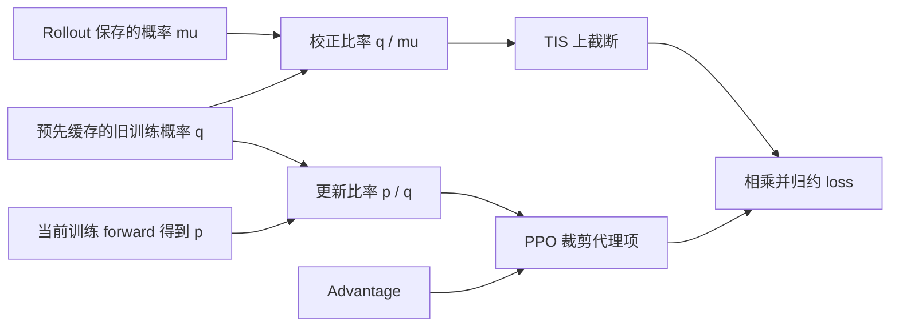

# TIS 详解：用截断重要性采样缓解 LLM RL 训推不一致

TIS（Truncated Importance Sampling，截断重要性采样）给重要性权重设置上限，避免少数样本被过度放大。它在 LLM RL 中常用于校正 rollout 与训练侧的分布差异。

具体代码里的概率比却不总是同一个：有的使用“旧训练概率／rollout 概率”，有的直接使用“当前训练概率／rollout 概率”。这些比率进入 loss 的位置、是否停止梯度，也会不同。理解 TIS，需要先分清它的通用机制，再看它怎样接入具体训练目标。

## 1. 为什么需要 rollout 校正

LLM RL 通常由推理引擎生成回答，再由训练引擎计算 loss 和梯度。vLLM、SGLang 与 FSDP、Megatron 等后端执行同一份模型权重时，仍可能给同一个 token 算出不同的概率。

差异主要来自几类因素：

- **数值计算路径不同。** 逐 token decode 与整段 forward 的矩阵形状不同，kernel、reduction 顺序、KV Cache、并行配置和精度也可能不同；MoE 路由的细微变化还可能改变激活的专家。
- **采样分布经过额外处理。** temperature、top-p、top-k 会改变实际抽样概率，模型原始 softmax 概率未必就是行为概率。
- **权重版本不同。** 异步 rollout 或旧数据复用会引入参数陈旧，这是与同权重数值差异不同的来源。

[On the Rollout-Training Mismatch in Modern RL Systems](https://www.opt-ml.org/papers/2025/paper116.pdf) 展示了同权重下 rollout 与训练后端的概率差异；[vLLM 的位级训推一致性实验](https://vllm.ai/blog/2025-11-10-bitwise-consistent-train-inference)进一步讨论了 batch 形状和 kernel 的影响。

把实际生成样本的策略记作 $\mu$。如果训练希望估计另一个分布下的期望，却直接把 $\mu$ 产生的数据当成目标分布的样本，估计就会出现偏差。重要性采样通过调整每个样本的贡献，补偿这种采样频率差异。本文讨论的是这种 rollout 校正；它与 SFT 中 teacher forcing 引出的 exposure bias 是不同问题。

## 2. 从重要性采样到 TIS

### 2.1 先确定目标分布与行为分布

固定同一个前缀 $s$，用 $\pi_{\mathrm{target}}(a\mid s)$ 表示希望估计期望的目标分布，用 $\mu(a\mid s)$ 表示实际抽取下一个 token 的行为分布。省略共同的条件 $s$，重要性采样恒等式为：

$$
\mathbb E_{a\sim\pi_{\mathrm{target}}}[f(a)]
=\mathbb E_{a\sim\mu}
\left[\frac{\pi_{\mathrm{target}}(a)}{\mu(a)}f(a)\right].
$$

其中，$f(a)$ 是待求平均的量，重要性权重为：

$$
w(a)=\frac{\pi_{\mathrm{target}}(a)}{\mu(a)}
=\exp\left(\log\pi_{\mathrm{target}}(a)-\log\mu(a)\right).
$$

这个等式要求行为分布覆盖目标分布：$\pi_{\mathrm{target}}(a)>0$ 时必须有 $\mu(a)>0$。如果 top-k/top-p 把某些目标动作的行为概率设为零，重加权无法补出从未可能采到的动作。需要扩大行为分布的支持集，或明确将目标也限制在被覆盖的动作上。

这里的 $\pi_{\mathrm{target}}$ 尚未指定为“旧训练策略”或“当前训练策略”。它由训练目标决定，第 3 节再讨论这些选择。这个期望恒等式本身也没有规定权重是否 `detach`；梯度如何流动，要结合后面的代理损失判断。

### 2.2 大权重为什么需要截断

$w>1$ 表示该动作在行为分布中相对少见，需要放大每次出现的贡献；$w<1$ 表示它在行为分布中被相对过度采样，需要降权。

例如，$\mu(a)=10^{-4}$、$\pi_{\mathrm{target}}(a)=5\times10^{-3}$ 时，$w=50$。这个样本的贡献会被乘以 50；若它又伴随较大的 advantage 或对数概率梯度，就可能主导一次更新。

单侧 TIS 为权重设置正上限 $C$：

$$
\boxed{\bar w(a)=\min\left(w(a),C\right)}.
$$

取 $C=2$，可以看到不同权重的处理方式：

| 行为概率 $\mu(a)$ | 目标概率 $\pi_{\mathrm{target}}(a)$ | 原始权重 $w$ | TIS 权重 $\bar w$ |
| ---: | ---: | ---: | ---: |
| 0.20 | 0.30 | 1.50 | 1.50 |
| 0.0001 | 0.005 | 50.00 | 2.00 |
| 0.20 | 0.002 | 0.01 | 0.01 |

精确概率比在满足支持集等条件时能给出无偏的 IS 估计，但可能具有很高的方差。固定上限会改变这种加权，引入偏差，同时抑制极端权重的影响。增大 $C$ 会接近普通 IS；减小 $C$ 会让更多样本触发截断，但不保证训练一定更好。

TIS 原本是通用统计方法，参见 Ionides 的 [Truncated Importance Sampling](https://doi.org/10.1198/106186008X320456)。LLM RL 将它用于训练数据的分布校正，不能因此把某一种框架中的概率比当作 TIS 的唯一含义。

### 2.3 过小的权重已经在降权

上表最后一行的 $w=0.01$ 会原样保留。假想在同一个前缀下重复采样 1000 次，行为分布预计采到该 token 200 次，而目标分布下只应出现 2 次。每次贡献乘以 $0.01$，正好得到 $200\times0.01=2$。

因此，小权重本身就在校正过度采样。**单侧 TIS 没有下界，但并非没有处理小比值。** 如果只说“rollout 概率很小”，则无法判断权重大小：分母 $\mu$ 很小时，比率反而可能很大。

极小权重也可能说明两边概率相差很远。降权会减弱该样本的贡献，却不会根据下界将它直接剔除，也不能单独保证最终梯度很小。是否进一步过滤，要另外选择权重规则。

### 2.4 上截断、双侧 clamp 与 mask

几种规则作用于同一个原始权重 $w$ 时，含义并不相同。假设上限为 2、额外下限为 0.5：

| 规则 | 权重函数 | $w=0.01$ 时 | $w=3$ 时 |
| --- | --- | ---: | ---: |
| 单侧 TIS | $\min(w,2)$ | 0.01 | 2 |
| 双侧 clamp | $\operatorname{clip}(w,0.5,2)$ | 0.5 | 2 |
| 双侧 mask | $w\,\mathbf 1\{0.5\le w\le2\}$ | 0 | 0 |

双侧 clamp 把小权重抬高，会增加这些样本相对于普通 IS 的贡献，引入额外的加权偏差。双侧 mask 则丢弃区间外的策略损失贡献，常见于 MIS（Masked Importance Sampling）和 IcePop 一类方法。

这与 PPO 的 clipping 需要分开理解。代码里出现双侧 `clamp`，可能是在处理校正权重，也可能是 PPO 代理目标的一部分；对象和外层计算决定了它的作用。第 5 节会看到，框架还可能提供下限为 0 的双侧 clamp，默认效果仍是单侧上截断。

## 3. TIS 如何接入策略优化

### 3.1 三种损失形式

进入 PPO/GRPO 的实现后，需要区分三个角色。下面所有概率都对应同一个前缀和同一个 token：

| 符号 | 概率来源 | 更新同一批数据时的角色 |
| --- | --- | --- |
| $\mu$ | 实际 rollout 行为策略 | 固定的采样来源 |
| $q$ | 选定的训练侧旧策略评分 | 使用解耦形式时，作为固定的 PPO 参照 |
| $p_\theta$ | 当前训练策略的 forward | 随参数更新，参与反向传播 |

在同步同权重场景中，$q$ 与 $\mu$ 对应同一份权重在两个引擎上的结果；异步场景中还可能存在版本差异。旧概率怎样获得和缓存，留到第 5 节讨论。

把 PPO 要最大化的单项代理目标记作：

$$
S(r,A)=\min\left(rA,\operatorname{clip}(r,1-\epsilon,1+\epsilon)A\right).
$$

$A$ 是已经计算好的 advantage。GRPO 常用组内相对奖励构造它，例如 $A_i=(R_i-\bar R)/(\sigma_R+\epsilon_A)$，再广播到回答中的 token；这不改变下面对概率比与校正权重的区分。

用 $\operatorname{sg}$ 表示停止梯度，省略聚合、KL 和 mask 后，三种常见损失形式是：

| 形式 | 单项损失 | TIS 使用什么比率 |
| --- | --- | --- |
| 解耦 PPO + TIS | $-\min(q/\mu,C)S(p_\theta/q,A)$ | 旧训练／rollout |
| 直接以 rollout 为参照的 PPO | $-S(p_\theta/\mu,A)$ | 这条基本路径没有独立的 TIS 权重 |
| 当前策略的 IS 加权策略梯度 | $-\operatorname{sg}[\min(p_\theta/\mu,C)]A\log p_\theta$ | 当前训练／rollout |

**“PPO clipping 外再乘 TIS”描述的是第一种形式。** 它不能概括所有名为 PPO/GRPO 或 rollout correction 的配置。[verl 的数学说明](https://verl.readthedocs.io/en/latest/algo/rollout_corr_math.html)分别讨论了这些路径。

### 3.2 解耦 PPO：两个比率分别处理

解耦形式先选择旧训练策略 $q$ 作为 PPO 的参照，再用 rollout 数据估计它的代理目标：

$$
\rho_t=\frac{q_t}{\mu_t},\qquad
r_t(\theta)=\frac{p_{\theta,t}}{q_t}.
$$

$\rho_t$ 校正采样来源与旧训练策略之间的差异，$r_t$ 描述当前训练策略相对旧策略的变化。加入 token-level TIS 后，要最小化的损失为：

$$
\mathcal L(\theta)
=-\mathbb E_{\tau\sim\mu}\left[
\sum_t
\underbrace{\min(\rho_t,C)}_{\text{TIS 校正权重}}
\underbrace{S(r_t(\theta),A_t)}_{\text{PPO/GRPO 代理项}}
\right].
$$

对应的核心伪代码如下。`old_train_logp` 和 `rollout_logp` 是固定评分，`current_logp` 来自正在求梯度的 forward；`masked_mean` 表示只对有效训练位置归约。

```python
import math
import torch

old_logp = old_train_logp.detach().float()
behavior_logp = rollout_logp.detach().float()
logp = current_logp.float()
adv = advantages.detach()

with torch.no_grad():
    log_rho = old_logp - behavior_logp
    # C > 0。先在 log-space 上截断，等价于 min(exp(log_rho), C)。
    tis_weight = torch.exp(log_rho.clamp(max=math.log(C)))

ppo_ratio = torch.exp(logp - old_logp)
unclipped = ppo_ratio * adv
clipped = ppo_ratio.clamp(1.0 - eps_low, 1.0 + eps_high) * adv
surrogate = torch.minimum(unclipped, clipped)
loss = -masked_mean(tis_weight * surrogate, response_mask)
```

公式为便于说明使用对称的 $\epsilon$，代码保留了上下裁剪幅度的独立配置。校正权重在 `no_grad` 中计算，PPO ratio 则保留当前策略的梯度。极小权重可能在浮点计算中下溢为零；这是数值精度的结果，不是人为增加了下限或 mask。

以下流程图展示预先计算并缓存旧训练评分的解耦实现：



忽略截断时，两个比率的乘积满足：

$$
\rho_t r_t=\frac{q_t}{\mu_t}\frac{p_{\theta,t}}{q_t}
=\frac{p_{\theta,t}}{\mu_t}.
$$

分别截断后，这个代数关系不能用来合并两个 loss。例如，$\rho=3$、$r=1$、$A=1$，取 $C=2$、$\epsilon=0.2$，解耦目标的单项贡献是 $2\times1=2$；先合并为 $p_\theta/\mu=3$ 再套 PPO，则得到 $\min(3,1.2)=1.2$。裁剪参照改变后，目标和梯度都不同。

PPO 的下界同样不会抬高 TIS 权重。若 $p_\theta=q=0.002$、$\mu=0.2$，则 $r=1$、$\rho=0.01$。PPO 的 $[0.8,1.2]$ 区间只处理 $r$，因此 TIS 权重仍为 $0.01$，不会被抬到 $0.8$。

### 3.3 直接以 rollout 为 PPO 的参照

另一种做法把实际行为概率直接放进 PPO 的分母：

$$
r_t^{\mathrm{rollout}}(\theta)=\frac{p_{\theta,t}}{\mu_t},
\qquad
\mathcal L_{\mathrm{bypass}}(\theta)
=-\mathbb E_{\tau\sim\mu}\left[
\sum_t S(r_t^{\mathrm{rollout}}(\theta),A_t)
\right].
$$

在代码中，它相当于使用 `exp(current_logp - rollout_logp)` 构造 PPO ratio，并去掉上例外面的独立 `tis_weight`。这条路径可以省掉额外的旧训练评分，但同时把裁剪参照改成了 rollout。前一节的数值例子已经说明，它不是解耦形式在截断后的等价改写。

无论 PPO 的分母选 $q$ 还是 $\mu$，其 clipping 都需要与外层 $\min$ 一起理解：

| Advantage | $S(r,A)$ 对 $r$ 进入平坦分支的条件 | 另一侧越界时 |
| --- | --- | --- |
| $A>0$ | $r>1+\epsilon$ | $r<1-\epsilon$ 时仍保留 $rA$ |
| $A<0$ | $r<1-\epsilon$ | $r>1+\epsilon$ 时仍保留 $rA$ |

例如，$r=0.5$、$\epsilon=0.2$ 时，$A=1$ 给出 $S=\min(0.5,0.8)=0.5$；$A=-1$ 给出 $S=\min(-0.5,-0.8)=-0.8$。后一种情况下，这个局部代理项对 $r$ 的直接梯度为零，前一种仍有梯度。PPO 由此抑制继续朝 advantage 有利方向过度改变概率所能获得的代理收益，并不保证参数或概率变化被硬性限制在区间内。[PPO 原论文](https://arxiv.org/abs/1707.06347)

### 3.4 当前策略的 IS 加权策略梯度

如果直接构造当前策略的 IS 加权策略梯度，可以使用：

$$
w_{\theta,t}=\frac{p_{\theta,t}}{\mu_t},\qquad
\mathcal L_{\mathrm{IS\text{-}PG}}(\theta)
=-\mathbb E_{\tau\sim\mu}\left[
\sum_t\operatorname{sg}\!\left[\min(w_{\theta,t},C)\right]
A_t\log p_{\theta,t}
\right].
$$

这里表示忽略前缀分布校正的 token-level 代理损失，其校正范围见第 4 节。与前面的 PPO 形式相比，梯度通过 $\log p_\theta$ 产生；当前概率与 rollout 的比率只作为停止梯度的权重：

```python
with torch.no_grad():
    log_w = current_logp.float() - rollout_logp.float()
    tis_weight = torch.exp(log_w.clamp(max=math.log(C)))

loss = -masked_mean(
    tis_weight * advantages.detach() * current_logp,
    response_mask,
)
```

它的单项梯度为 $-\bar w_\theta A\nabla_\theta\log p_\theta$。超过上限时，权重被压到 $C$，这个 token 仍可贡献梯度。若直接对可导的 $\min(p_\theta/\mu,C)$ 求导，上限外会进入平坦分支，得到的梯度就不是这里的加权策略梯度。

因此，看到 `current / rollout` 还不足以判断算法：它既可能是参与 PPO 求导的 ratio，也可能是停止梯度后乘到 $\log p_\theta$ 上的 TIS 权重。

## 4. 校正到什么粒度

选定损失形式之后，还需要决定权重覆盖多长的随机过程。TIS 描述如何截断，token、prefix、sequence 描述如何构造截断前的概率比，两者可以分别选择。

继续用通用的目标策略 $\pi_{\mathrm{target}}$ 表示被校正到的分布，定义每个位置的条件概率比：

$$
w_t=\frac{\pi_{\mathrm{target}}(y_t\mid x,y_{<t})}
{\mu(y_t\mid x,y_{<t})}.
$$

### 4.1 Token-level：只校正当前条件动作

每个 token 使用自己的权重 $\bar w_t=\min(w_t,C)$。它实现简单，也避免了多个概率比相乘带来的极端值。

但它只修正“给定这个前缀，下一个 token 怎样采样”，没有修正这个前缀本身被访问到的概率。将它放进整条回答的策略损失时，通常得到有偏的代理目标；即使去掉上截断，这个前缀分布近似也仍然存在。

### 4.2 Prefix-level：校正截至当前位置的分布

截至第 $t$ 个 token 的前缀概率比为：

$$
w_{1:t}=\prod_{k=1}^{t}w_k.
$$

它同时计入之前动作对前缀访问概率的影响，比单个 $w_t$ 覆盖的随机过程更完整。满足支持集条件时，完整的前缀比率可以校正仅由这段前缀决定的量；若估计量还依赖后续采样的回报，就不能仅凭 $w_{1:t}$ 声称完成了全部分布校正。

长前缀仍会面临权重乘积的高方差问题。关于前缀比率与稳定近似的研究，可参见 [A Step Back: Prefix Importance Ratio Stabilizes Policy Optimization](https://arxiv.org/abs/2601.22718)。

### 4.3 Sequence-level：整条回答共用一个权重

对自回归回答 $y=(y_1,\ldots,y_T)$，完整序列比率是：

$$
w_{\mathrm{seq}}
=\frac{\pi_{\mathrm{target}}(y\mid x)}{\mu(y\mid x)}
=\prod_{t=1}^{T}w_t
=\exp\left[\sum_{t=1}^{T}
\left(\log\pi_{\mathrm{target},t}-\log\mu_t\right)\right].
$$

Sequence-level TIS 再取 $\bar w_{\mathrm{seq}}=\min(w_{\mathrm{seq}},C)$，让整条序列共用这个权重。精确的完整序列 IS 在支持集等条件满足时能完成序列分布的换测度；加入固定上限后仍会引入截断偏差。

代价是长序列中的小误差会累积。例如，每个 token 的概率比只偏离 1 一点：

$$
1.01^{1000}\approx20959,\qquad
0.99^{1000}\approx4.3\times10^{-5}.
$$

这解释了长 CoT 和多轮 Agent 轨迹为何容易出现极大或极小的序列权重。实现时应先在 log-space 中求和、截断，再取指数。几何平均比率可以减小长度影响，但它不再等于完整序列的概率比，应作为另外的近似来评估。

选择粒度时，需要同时考虑前缀分布偏差、序列长度与权重方差。单个 token 的差异较小，并不能保证整条轨迹的权重也接近 1。

## 5. 真实框架如何获得这些概率

### 5.1 固定旧概率，不必常驻一份旧模型

代码中的 `old_log_probs` 可能来自 rollout，也可能来自训练后端重算。先沿调用链确认它的来源，才能判断 loss 使用的是第 3 章中的哪条路径。

解耦实现通常在准备 batch 时，用尚未更新的训练模型对生成结果做一次 `no_grad` 评分，保存 $\log q$，同时计算并保存 $q/\mu$ 的校正权重。之后每次训练 forward 计算新的 $\log p_\theta$，旧评分和校正权重随 batch 复用。同一个模型对象先后承担了评分与训练两项工作，固定参照保存在概率张量里。

例如，同一批回答要做两次参数更新：准备数据时保存 $\log q$；第一次计算 loss 时，当前参数尚未变化，$p_\theta/q$ 接近 1；第二次计算 loss 时，分子已经变化，分母仍取保存的 $q$。这样 PPO 才能衡量这批数据开始训练以来的策略变化。若第二次又把分母替换为当前概率，就丢掉了这个参照。

TRL 就采用了这种方式：启用 vLLM rollout correction 后，准备 batch 的代码会强制重算旧训练概率；后续 loss 再使用当前概率与缓存旧概率构造 PPO/GRPO 代理项，并乘上缓存的校正权重。[TRL 的评分与校正代码](https://github.com/huggingface/trl/blob/a04ffd337108285002df29d9ae73ef7e855e03f1/trl/trainer/grpo_trainer.py#L2656-L2707)

因此，“用当前训练模型算概率”还不够明确：评分时模型尚未更新，这次结果可以成为后续更新的固定旧概率；若每次 loss 都重新评分，得到的才是随参数变化的当前概率。

### 5.2 单次更新时复用当前 forward

如果一批数据只对应一次 optimizer step，且满足实现要求，可以省去额外的旧策略评分，直接复用当前 forward：

```python
old_logp = current_logp.detach()
ppo_ratio = (current_logp - old_logp).exp()
tis_weight = (old_logp - rollout_logp).exp().clamp(max=C)
```

此时 PPO ratio 的前向值为 1，TIS 数值上使用当前训练概率除以 rollout 概率。`detach()` 只切断分母的梯度，分子仍参与反向传播，所以不能把 `ppo_ratio` 替换成无梯度的常数 1。这是复用 forward 的实现优化，仍可放在解耦损失里理解。

这里的“一次”指参数真正变化一次。梯度累积中的多个 microbatch 可以共享同一组参数；反过来，生成的一批回答也可能跨过多个 optimizer step。判断能否复用 forward，要看这两种边界是否对齐。即使只有一次参数更新，训练引擎与 rollout 引擎仍可能给出不同概率，TIS 权重也未必等于 1。

slime 的 Megatron 后端在只有一个 optimizer step 且满足其他条件时允许跳过旧评分；loss 收不到训练侧旧评分时，用 `current_logp.detach()` 补齐。若一批数据跨多个参数更新复用，PPO 的旧概率必须保持固定，不能每次都跟着当前策略重置。[省略评分的条件](https://github.com/THUDM/slime/blob/4c193f1f37509cca70f0e88807a9305b70f63f4e/slime/backends/megatron_utils/actor.py#L427-L454)

TRL 的 loss 也有缺少旧评分时的 `detach()` 回退，但正常启用 vLLM correction 时会提前提供旧评分，不走这条回退。只读 loss 中这一行，容易误以为它每个 optimizer step 都重算 TIS 权重。

### 5.3 框架路径与默认配置

下面对照已经核对的源码快照；完整调用链和配置入口见附录 B。

| 框架快照 | 概率与 loss 的处理 | 开关和默认值 |
| --- | --- | --- |
| verl `753aed3` | 解耦路径缓存 `old / rollout`；bypass 的 `ppo_clip` 使用 `current / rollout`；bypass 的 `reinforce` 每次 loss 按 `current / rollout` 计算停止梯度的 IS 权重 | YAML 默认 `rollout_is=null`、`bypass_mode=false`，IS 校正没有开启 |
| slime `4c193f1` | TIS 使用训练侧旧评分，满足单次更新条件时可复用当前 forward；`--use-rollout-logprobs` 则直接把 rollout 评分作为 PPO 分母 | `--use-rollout-logprobs` 与 `--use-tis` 互斥；vanilla TIS 默认下限 0、上限 2 |
| TRL `a04ffd3`（2026-09-14） | vLLM correction 在准备 batch 时重算并缓存旧评分与校正权重，后续使用 `current / old` 的代理项 | correction 默认开启，但模式为 `sequence_mask`，上限 3、下限 `None` |

verl 的 bypass 还要求 actor 进入 `policy_loss.loss_mode=bypass_mode` 分支。其中 `ppo_clip` 明确不再乘独立 IS 权重；`reinforce` 则把校正权重乘到 $-A\log p_\theta$ 上。它把当前 `log_prob` 传给名为 `old_log_prob` 的形参，也说明形参名并不能代替调用链。[verl 的 bypass 分支](https://github.com/verl-project/verl/blob/753aed3e1c286ba6825a74342b28669e72c083ea/verl/trainer/ppo/core_algos.py#L2491-L2541)

框架里的 correction 也不一定是单侧 TIS。slime 的双侧 `clamp` 默认下限为 0，对正概率比的效果仍是上截断；另设正下限才会抬高小权重。TRL 默认会把超过上限的序列权重置零，选 `token_truncate` 或 `sequence_truncate` 才走截断路径，并允许另设正下限。这些下限都独立于 PPO 的 `epsilon`。[TRL 的校正配置](https://github.com/huggingface/trl/blob/a04ffd337108285002df29d9ae73ef7e855e03f1/trl/trainer/grpo_config.py#L920-L957)

配置也要沿执行顺序读：先确认校正开关和 loss 分支，再看 token 或 sequence 粒度，最后看越界后截断还是置零。只看到一个非空阈值，既不能说明校正已经生效，也不能说明这个阈值作用于 PPO 的更新比率。

读一个新实现时，抓住三件事即可：概率来自哪次 forward，结果在什么时候缓存，哪些张量停止梯度。它们共同决定公式中的每个比率实际承担什么作用。

## 6. 实现、监控与排障

### 6.1 先保证概率与样本真实对应

概率比的分母必须对应真正生成该 token 的行为分布。如果记录的是 temperature 或 top-p 处理前的 raw logprob，或者 token、位置发生错位，后续截断也无法恢复正确的统计含义。

接入时可以沿着数据流核对：

- **生成与记录。** 保留原始 token IDs、实际行为 logprob 和 rollout 权重版本，避免解码为文本后重新 tokenize。采样处理改变支持集时，按第 2.1 节确认目标是否仍被覆盖。
- **训练评分。** 对齐 token、position ID、attention mask、response mask；缓存的旧概率必须对应选定的 PPO 参照。跨多个 optimizer step 更新时，不要无意中刷新这个参照。
- **梯度与归约。** 按所选损失形式设置停止梯度；padding、工具返回和环境反馈等非训练位置不应进入策略损失。检查 mask 是否也改变了归约分母，不能仅凭它把权重置零就推断最终 loss 的尺度。
- **数值与重算。** 在足够精度下计算 logprob 差，序列比率先累加 log ratio；activation checkpointing 的重算要保持 token、mask 以及所需模型内部状态一致。

同权重数值差异与异步权重陈旧也要分别记录。同步 checkpoint 只能消除版本差异，不能保证两个执行引擎输出完全相同；附录 A 给出了两类差异的完整比率分解。

### 6.2 阈值要结合权重分布判断

没有跨模型、跨任务通用的最优 $C$。本文核对的 verl 与 slime 配置中，单侧截断阈值可取默认值 2，但校正是否启用需要另外检查开关。框架默认值只能作为实验起点。

判断阈值时，先看实际使用的是哪一种比率、哪一种聚合粒度，再考虑 rollout 长度、advantage 尺度、batch 大小，以及是否叠加了 mask 或其他过滤。相同的 $C$ 用在 token 比率和序列比率上，触发频率可能完全不同。

建议将以下指标放在一起观察：

| 观察对象 | 记录内容 | 帮助判断什么 |
| --- | --- | --- |
| 原始概率比 | $w$ 与 $\log w$ 的分布、尾部分位数、极值 | 分布差异是否在扩大 |
| 处理后的权重 | 上截断率、上下界分别越界的比例、mask 比例 | 多少训练信号被改变或丢弃 |
| 有效样本量 | 截断或 mask 前后的经验 ESS | 权重是否集中在少量样本上 |
| 训练表现 | gradient norm、reward、entropy、回答长度 | 权重变化是否伴随训练异常 |

经验性的归一化有效样本量指标可写成：

$$
\mathrm{ESS}_{\mathrm{norm}}
=\frac{(\sum_i w_i)^2}{N\sum_i w_i^2}.
$$

它是权重集中程度的诊断指标。上截断可能让权重更均匀，提高处理后的 ESS，但不能据此认定原始分布差异已经缩小。做 self-normalized IS 时，也应注明归一化本身会带来有限样本偏差。

还可以在支持集等条件满足时，用原始比率构造非负 K3 估计量：

$$
k_3(w)=w-1-\log w,
\qquad
\mathbb E_{a\sim\mu}[k_3(w(a))]
=D_{\mathrm{KL}}(\mu\Vert\pi_{\mathrm{target}}).
$$

这里的 $w=\pi_{\mathrm{target}}/\mu$ 应使用处理前的概率比；对截断后权重计算同一个表达式，不能直接沿用这个 KL 等式。需要定位来源时，再按 token 位置、序列长度、原始采样概率、权重版本或 MoE expert 分桶。

### 6.3 根据异常来源选择处理方式

如果原始概率可靠，主要问题是少数样本权重极大，TIS 可以限制它们对更新的影响。若还希望排除两个方向上相对差异过大的位置，可以评估 MIS 或 token/sequence rejection，并同时观察被丢弃的数据量与训练效果。选择更严格的过滤，并不自动意味着效果更好。

如果截断率持续升高、原始 ESS 下降，同时出现 gradient norm、entropy 或 reward 异常，就需要检查差异来源。数据错位先修数据链路，版本滞后先查同步和异步调度，持续的数值差异再查精度、kernel 与路由。TIS 只改变贡献权重，不会使两个引擎的 forward 自动一致，也不能保证训推 KL 归零。

对 MoE，router logits 的微小变化可能翻转 Top-K expert，再在后续层中放大。[R3：Rollout Routing Replay](https://arxiv.org/abs/2510.11370)通过记录并重放 rollout 路由减小这类差异，具体机制见同目录的 [R3 技术详解](<./R3：用Rollout Routing Replay解决MoE Agentic RL的训推不一致.md>)。量化 rollout 则需要同时检查行为概率记录与量化误差；[FP8-RL](https://arxiv.org/abs/2601.18150)讨论了使用 TIS/MIS 缓解低精度训练栈中的分布差异。

## 7. 总结

TIS 的通用机制是对“目标分布／行为分布”的重要性权重设置上限，以截断偏差换取对极端权重的控制。目标可以是固定旧训练策略，也可以是当前训练策略；具体选择取决于训练目标。

读一份实现时，最有用的是确认三个问题：

1. **比率来自哪里？** 分子与分母分别是哪次评分，是否缓存，权重版本是否相同？
2. **比率怎样处理？** 按 token、prefix 还是 sequence 聚合，上截断、双侧 clamp 还是 mask？
3. **梯度经过哪里？** 比率参与 PPO 求导，还是停止梯度后乘到 $\log p_\theta$ 上？

这三点决定了训练实际执行的算法，也决定了过大和过小的比值最终如何影响更新。

## 附录 A：分开同权重差异与异步权重陈旧

如果 rollout 使用的行为权重为 $\theta_b$，trainer 的 proximal old policy 为 $\theta_{\mathrm{old}}$，则总概率比可以进一步拆成：

$$
\frac{\pi^{\mathrm{train}}_{\theta}(a_t\mid s_t)}
     {\pi^{\mathrm{rollout}}_{\theta_b}(a_t\mid s_t)}
=
\underbrace{
\frac{\pi^{\mathrm{train}}_{\theta}(a_t\mid s_t)}
     {\pi^{\mathrm{train}}_{\theta_{\mathrm{old}}}(a_t\mid s_t)}
}_{\text{正常 policy update}}
\cdot
\underbrace{
\frac{\pi^{\mathrm{train}}_{\theta_{\mathrm{old}}}(a_t\mid s_t)}
     {\pi^{\mathrm{train}}_{\theta_b}(a_t\mid s_t)}
}_{\text{权重版本陈旧}}
\cdot
\underbrace{
\frac{\pi^{\mathrm{train}}_{\theta_b}(a_t\mid s_t)}
     {\pi^{\mathrm{rollout}}_{\theta_b}(a_t\mid s_t)}
}_{\text{同权重执行栈 mismatch}}.
$$

同步训练只能令中间的 staleness 项等于 1，不能保证最后的系统项也等于 1。监控和排障时应记录 rollout 的 policy version，否则容易把权重陈旧误判成纯数值误差。

## 附录 B：框架源码入口（固定版本）

下面的链接固定到已核对的提交，便于沿着“准备数据 → 保存评分 → 选择 loss → 应用权重”的顺序阅读。表中的行为与默认值对应这些快照。

### verl：`753aed3e1c286ba6825a74342b28669e72c083ea`

| 入口 | 核对内容 |
| --- | --- |
| [Trainer 的 batch 预校正](https://github.com/verl-project/verl/blob/753aed3e1c286ba6825a74342b28669e72c083ea/verl/trainer/ppo/v1/trainer_base.py#L1703-L1715) | 解耦路径基于旧训练评分与 rollout 评分生成 batch 校正权重 |
| [Actor 的 loss 选路](https://github.com/verl-project/verl/blob/753aed3e1c286ba6825a74342b28669e72c083ea/verl/workers/utils/losses.py#L95-L111) | `policy_loss.loss_mode` 如何进入 bypass 分支 |
| [Bypass 比率与两个 loss 分支](https://github.com/verl-project/verl/blob/753aed3e1c286ba6825a74342b28669e72c083ea/verl/trainer/ppo/core_algos.py#L2491-L2541) | `ppo_clip` 直接使用 `current / rollout`，不再乘独立 IS；`reinforce` 按当前概率计算停止梯度的校正权重 |
| [Rollout correction 默认配置](https://github.com/verl-project/verl/blob/753aed3e1c286ba6825a74342b28669e72c083ea/verl/trainer/config/algorithm/rollout_correction.yaml#L5-L28) | 默认 `rollout_is=null`、`bypass_mode=false`；阈值存在不表示 IS 已启用 |

### slime：`4c193f1f37509cca70f0e88807a9305b70f63f4e`

| 入口 | 核对内容 |
| --- | --- |
| [Megatron 后端省略旧评分的条件](https://github.com/THUDM/slime/blob/4c193f1f37509cca70f0e88807a9305b70f63f4e/slime/backends/megatron_utils/actor.py#L427-L454) | 一个 optimizer step 及其他条件如何决定是否额外执行旧策略评分 |
| [Loss 的分母选择与 detach 回退](https://github.com/THUDM/slime/blob/4c193f1f37509cca70f0e88807a9305b70f63f4e/slime/backends/megatron_utils/loss.py#L963-L988) | rollout 评分与训练侧旧评分的选择；缺少训练侧旧评分时复用当前评分的 `detach()` |
| [直接 rollout 分母与 TIS 的互斥检查](https://github.com/THUDM/slime/blob/4c193f1f37509cca70f0e88807a9305b70f63f4e/slime/utils/arguments.py#L1860-L1861) | `--use-rollout-logprobs` 与 `--use-tis` 不能同时开启 |
| [TIS 的默认阈值](https://github.com/THUDM/slime/blob/4c193f1f37509cca70f0e88807a9305b70f63f4e/slime/utils/arguments.py#L1073-L1089) | vanilla TIS 默认下限 0、上限 2；正下限需要另行配置 |

### TRL：`a04ffd337108285002df29d9ae73ef7e855e03f1`（2026-09-14）

| 入口 | 核对内容 |
| --- | --- |
| [准备输入与 batch 复用](https://github.com/huggingface/trl/blob/a04ffd337108285002df29d9ae73ef7e855e03f1/trl/trainer/grpo_trainer.py#L1593-L1605) | 按 `steps_per_generation * num_iterations` 的周期生成、保存并复用 batch |
| [旧评分、校正比率与截断或 mask](https://github.com/huggingface/trl/blob/a04ffd337108285002df29d9ae73ef7e855e03f1/trl/trainer/grpo_trainer.py#L2656-L2707) | vLLM correction 开启时强制重算旧训练评分，在 `no_grad` 下计算校正权重；链接区间包含 truncate 分支，mask 分支紧随其后 |
| [保存评分与校正权重](https://github.com/huggingface/trl/blob/a04ffd337108285002df29d9ae73ef7e855e03f1/trl/trainer/grpo_trainer.py#L2931-L2936) | 旧评分、校正权重和采样评分一起写入 batch |
| [旧评分回退、PPO 比率与裁剪目标](https://github.com/huggingface/trl/blob/a04ffd337108285002df29d9ae73ef7e855e03f1/trl/trainer/grpo_trainer.py#L3153-L3213) | 缺少旧评分时才使用 `current.detach()`；常规比率为 `current / old` |
| [在策略损失上应用校正](https://github.com/huggingface/trl/blob/a04ffd337108285002df29d9ae73ef7e855e03f1/trl/trainer/grpo_trainer.py#L3239-L3240) | 使用 batch 中缓存的校正权重 |
| [校正模式与默认阈值](https://github.com/huggingface/trl/blob/a04ffd337108285002df29d9ae73ef7e855e03f1/trl/trainer/grpo_config.py#L920-L957) | correction 默认开启，模式 `sequence_mask`，上限 3、下限 `None`；truncate 模式与下限单独配置 |

## 参考资料

- [On the Rollout-Training Mismatch in Modern RL Systems](https://www.opt-ml.org/papers/2025/paper116.pdf)
- [Truncated Importance Sampling](https://doi.org/10.1198/106186008X320456)
- [Hugging Face TRL：GRPO Trainer](https://huggingface.co/docs/trl/main/en/grpo_trainer)
- [verl：Rollout Correction](https://verl.readthedocs.io/en/latest/algo/rollout_corr.html)
- [verl：Mathematical Formulations of Rollout Correction](https://verl.readthedocs.io/en/latest/algo/rollout_corr_math.html)
- [Proximal Policy Optimization Algorithms](https://arxiv.org/abs/1707.06347)
- [No More Train-Inference Mismatch: Bitwise Consistent On-Policy Reinforcement Learning with vLLM and TorchTitan](https://vllm.ai/blog/2025-11-10-bitwise-consistent-train-inference)
- [A Step Back: Prefix Importance Ratio Stabilizes Policy Optimization](https://arxiv.org/abs/2601.22718)
- [Stabilizing MoE Reinforcement Learning by Aligning Training and Inference Routers](https://arxiv.org/abs/2510.11370)
- [FP8-RL: A Practical and Stable Low-Precision Stack for LLM Reinforcement Learning](https://arxiv.org/abs/2601.18150)
