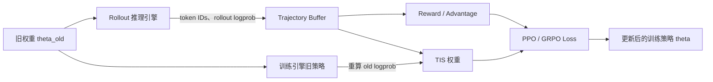

# TIS 详解：用截断重要性采样缓解 LLM RL 训推不一致

> 本文讨论的 TIS 是 **Truncated Importance Sampling（截断重要性采样）**。它不是 Training-Inference Synchronization，也不等于 Token-level Importance Sampling。
>
> 一句话概括：**TIS 使用“训练侧概率 ÷ rollout 侧概率”修正梯度，再截断极端权重，以偏差换取更低的方差和更稳定的训练。**

本文讨论的是 LLM 在线强化学习中 rollout 推理引擎与训练引擎之间的 Training–Inference Mismatch，而不是 SFT 中 teacher forcing 导致的传统 exposure bias。

## 1. 为什么相同权重不等于相同策略

典型的大模型 RL 系统不会用同一个执行引擎完成所有工作：

- vLLM、SGLang 等推理引擎负责高吞吐地生成 rollout；
- FSDP、Megatron、Transformers 等训练后端负责计算 loss 和反向传播。



为了把三种容易混淆的策略分开，记：

$$
\mu_t
=
\pi_{\mathrm{rollout}}
(y_t\mid x,y_{<t};\theta_{\mathrm{old}})
$$

为实际生成 token 的 rollout 行为策略；

$$
q_t
=
\pi_{\mathrm{train}}
(y_t\mid x,y_{<t};\theta_{\mathrm{old}})
$$

为训练后端用同一份旧权重重算出的策略；

$$
p_t
=
\pi_{\mathrm{train}}
(y_t\mid x,y_{<t};\theta)
$$

为当前正在更新的训练策略。

理想情况下应有 $\mu_t=q_t$。但即使 checkpoint 完全相同，以下因素仍可能使二者产生不同的 logits 或 logprob：

- CUDA kernel、融合算子和 reduction 顺序不同；
- rollout 的逐 token decode 与训练的整段 forward 具有不同矩阵形状；
- BF16、FP16、FP8、INT8 等精度或量化路径不同；
- FlashAttention、KV Cache、Tensor Parallel 配置不同；
- `lm_head`、softmax、log-softmax 的计算精度不同；
- dynamic batching 或 batch size 导致系统选择不同 kernel；
- MoE router 的细微误差导致激活不同专家；
- 异步 rollout 使用了陈旧权重；
- temperature、top-p、top-k 等 sampling processor 不一致；
- completion 被 decode 成文本后重新 tokenize，导致 token 序列变化。

[On the Rollout-Training Mismatch in Modern RL Systems](https://www.opt-ml.org/papers/2025/paper116.pdf) 展示了：即使权重一致，vLLM rollout policy 与 FSDP training policy 仍可能产生不同的 token 概率。[vLLM 的位级训推一致性实验](https://vllm.ai/blog/2025-11-10-bitwise-consistent-train-inference)也说明，不同 batch 形状和 kernel 是重要误差来源。

问题在于：样本实际上来自 $\mu$，训练代码却往往默认它来自 $q$。于是一个名义上的 on-policy PPO/GRPO，悄悄变成了 off-policy。

## 2. 从普通重要性采样推导 TIS

假设目标是计算分布 $q$ 下的期望：

$$
\mathbb E_{a\sim q}[f(a)].
$$

但手里的样本来自另一个分布 $\mu$。在满足支持集条件时，可以做换测度：

$$
\mathbb E_{a\sim q}[f(a)]
=
\mathbb E_{a\sim\mu}
\left[
\frac{q(a)}{\mu(a)}f(a)
\right].
$$

其中：

$$
\rho(a)=\frac{q(a)}{\mu(a)}
$$

就是 importance ratio。

放到训推不一致问题中，每个 token 的校正权重为：

$$
\rho_t
=
\frac{q_t}{\mu_t}
=
\exp\left(\log q_t-\log\mu_t\right).
$$

其直观含义是：

- $\rho_t=1$：训练和 rollout 对该 token 的概率完全一致；
- $\rho_t>1$：训练侧认为该 token 应更常出现，需要放大其梯度；
- $\rho_t<1$：rollout 侧过度采到了该 token，需要减小其梯度。

### 2.1 为什么还要截断

普通重要性采样在概率比准确、支持集满足等条件下可以得到无偏估计，但它可能具有极高方差。

例如：

$$
\mu_t=10^{-4},\qquad q_t=5\times10^{-3},
$$

则：

$$
\rho_t=\frac{5\times10^{-3}}{10^{-4}}=50.
$$

这个 token 的一次梯度会被放大 50 倍。少数低概率 token 就可能主导整个 batch，导致 gradient norm 暴涨。

TIS 给权重设置上限：

$$
\bar\rho_t=\min(\rho_t,C).
$$

若 $C=2$，上面的权重就从 50 降为 2。

| Rollout 概率 $\mu_t$ | 训练概率 $q_t$ | 原始权重 $\rho_t$ | $C=2$ 后 |
| ---: | ---: | ---: | ---: |
| 0.20 | 0.30 | 1.50 | 1.50 |
| 0.0001 | 0.005 | 50.00 | 2.00 |
| 0.40 | 0.10 | 0.25 | 0.25 |

因此，TIS 的本质是一个明确的 bias–variance trade-off：

- $C\rightarrow\infty$：趋近普通 IS，截断偏差较小，但方差可能很大；
- $C$ 较小：训练更稳定，但截断引入的偏差更大。

截断重要性采样最早是通用统计方法，可追溯到 Ionides 的 [Truncated Importance Sampling](https://doi.org/10.1198/106186008X320456)。LLM RL 工作将它应用到了 rollout-training mismatch。

### 2.2 单侧截断与双侧裁剪

原始 TIS 通常采用单侧上截断：

$$
\bar\rho=\min(\rho,C_{\max}).
$$

它抑制极端放大的样本，但保留小于 1 的 down-weighting。部分现代框架也提供双侧形式：

$$
\bar\rho
=
\operatorname{clip}
(\rho,C_{\min},C_{\max}).
$$

双侧裁剪会把过小的权重抬高到 $C_{\min}$。这是工程扩展，不是所有名为 TIS 的实现都采用完全相同的定义。阅读配置时应同时确认：

1. 截断是单侧还是双侧；
2. ratio 是 token、prefix 还是 sequence 粒度；
3. 越界样本是裁到边界还是直接置零。

## 3. PPO 已经有 clipping，为什么还需要 TIS

这是最容易混淆的地方。

PPO/GRPO 自己的更新比率是：

$$
r_t(\theta)
=
\frac{p_t}{q_t}
=
\frac{
\pi_{\mathrm{train}}(y_t;\theta)
}{
\pi_{\mathrm{train}}(y_t;\theta_{\mathrm{old}})
}.
$$

它回答的是：当前训练策略相对旧训练策略移动了多少？

TIS 比率则是：

$$
\rho_t=\frac{q_t}{\mu_t}.
$$

它回答的是：实际生成数据的 rollout 策略，与训练代码假设的行为策略相差多少？

| 机制 | 概率比 | 作用 |
| --- | --- | --- |
| PPO clipping | $p_t/q_t$ | 限制本轮参数更新幅度 |
| TIS | $q_t/\mu_t$ | 修正 rollout 与训练后端的分布差异 |
| MIS | $q_t/\mu_t$ | 丢弃训推差异过大的样本或 token |

一个解耦的 TIS-PPO 目标可以写成：

$$
\mathcal L(\theta)
=
-\mathbb E_{\tau\sim\mu}
\left[
\sum_t
\bar\rho_t
\min
\left(
r_t(\theta)A_t,
\operatorname{clip}
(r_t(\theta),1-\epsilon,1+\epsilon)A_t
\right)
\right].
$$

忽略两种截断时：

$$
\rho_t r_t(\theta)
=
\frac{q_t}{\mu_t}
\frac{p_t}{q_t}
=
\frac{p_t}{\mu_t}.
$$

这个等式展示了两个比率的职责：TIS 先把数据从 rollout 分布校正到旧训练策略，PPO ratio 再表示从旧训练策略到当前策略的更新。

即使第一次更新时 $p_t=q_t$，因此 PPO ratio 等于 1，只要 $q_t\neq\mu_t$，TIS ratio 仍然不等于 1。所以 PPO clipping 不能自动解决训推不一致。

### 3.1 同权重 mismatch 与异步 staleness 不应混在一起

如果 rollout 使用的行为权重为 $\theta_b$，trainer 的 proximal old policy 为 $\theta_{\mathrm{old}}$，则总概率比可以进一步拆成：

$$
\frac{\pi^{\mathrm{train}}_{\theta}(a_t\mid s_t)}
     {\pi^{\mathrm{rollout}}_{\theta_b}(a_t\mid s_t)}
=
\underbrace{
\frac{\pi^{\mathrm{train}}_{\theta}(a_t\mid s_t)}
     {\pi^{\mathrm{train}}_{\theta_{\mathrm{old}}}(a_t\mid s_t)}
}_{\text{正常 policy update}}
\cdot
\underbrace{
\frac{\pi^{\mathrm{train}}_{\theta_{\mathrm{old}}}(a_t\mid s_t)}
     {\pi^{\mathrm{train}}_{\theta_b}(a_t\mid s_t)}
}_{\text{权重版本陈旧}}
\cdot
\underbrace{
\frac{\pi^{\mathrm{train}}_{\theta_b}(a_t\mid s_t)}
     {\pi^{\mathrm{rollout}}_{\theta_b}(a_t\mid s_t)}
}_{\text{同权重执行栈 mismatch}}.
$$

同步训练只能令中间的 staleness 项等于 1，不能保证最后的系统项也等于 1。监控和排障时应记录 rollout 的 policy version，否则容易把权重陈旧误判成纯数值误差。

## 4. Token-level、Sequence-level 与 Prefix-level TIS

LLM 是自回归模型，一条回答的概率是：

$$
\mu(y\mid x)=\prod_{t=1}^{T}\mu_t,
\qquad
q(y\mid x)=\prod_{t=1}^{T}q_t.
$$

因此完整序列的重要性权重为：

$$
\rho_{\mathrm{seq}}
=
\frac{q(y\mid x)}{\mu(y\mid x)}
=
\prod_{t=1}^{T}\rho_t
=
\exp\left(
\sum_{t=1}^{T}
(\log q_t-\log\mu_t)
\right).
$$

### 4.1 Token-level TIS

每个 token 独立计算和截断：

$$
\bar\rho_t=\min(\rho_t,C).
$$

优点是方差较低、实现简单，适合轻度的数值 mismatch。缺点是它只修正当前条件动作概率，没有完整修正“这个前缀为什么会被访问到”的状态分布，因此通常是有偏 surrogate。

### 4.2 Sequence-level TIS

整条轨迹共用一个权重：

$$
\bar\rho_{\mathrm{seq}}
=
\min\left(
\prod_t\rho_t,C
\right).
$$

它更接近完整轨迹的换测度，但长序列上的乘积极易爆炸或消失。例如每个 token 只有 1% 的偏差：

$$
1.01^{1000}\approx 20959,
\qquad
0.99^{1000}\approx4.3\times10^{-5}.
$$

这就是长 CoT、Agent 多轮轨迹中，小 logprob 偏差也可能变成重尾权重的原因。

### 4.3 Prefix-level IS

对于第 $t$ 个动作，更严格的因果校正可使用前缀概率比：

$$
\rho_{1:t}
=
\prod_{k=1}^{t}\frac{q_k}{\mu_k}.
$$

它比只使用当前 token 的 $\rho_t$ 更完整，但同样受到长前缀高方差的困扰。近期工作也在研究 prefix ratio 与稳定近似之间的折中，参见 [A Step Back: Prefix Importance Ratio Stabilizes Policy Optimization](https://arxiv.org/abs/2601.22718)。

因此不能简单地说 token-level 或 sequence-level 永远更好：

- mismatch 很小、序列较短：token-level 往往更实用；
- 长轨迹、异步或严重 off-policy：需要评估 prefix、sequence、mask 或 rejection 方案；
- 使用几何平均 ratio 可以降低长度敏感性，但它已经不是严格的序列 IS 权重，而是一种稳定化启发式。

## 5. TIS 在 GRPO 中如何落地

GRPO 使用同一 prompt 下多条回答的组内相对奖励构造 advantage。以常见的标准化形式为例：

$$
\hat A_i
=
\frac{R_i-\operatorname{mean}(R)}
{\operatorname{std}(R)+\varepsilon}.
$$

随后把 $\hat A_i$ 广播到回答中的 token，并计算训推校正权重：

$$
\rho_{i,t}
=
\exp
\left(
\log q_{i,t}-\log\mu_{i,t}
\right).
$$

下面是简化伪代码：

```python
# rollout_logp: rollout 引擎实际采样 token 时的 logprob
# old_train_logp: 训练后端用 rollout 对应的旧权重重算的 logprob
# current_logp: 当前训练策略的 logprob，参与反向传播

with torch.no_grad():
    log_rho = old_train_logp - rollout_logp

    # 这里只是防止 exp 溢出的数值安全边界，不是真正的 TIS 阈值。
    rho = torch.exp(torch.clamp(log_rho, -20.0, 20.0))

    # 原始单侧 TIS。
    tis_weight = torch.clamp(rho, max=C).detach()

ppo_ratio = torch.exp(current_logp - old_train_logp)

surrogate_1 = ppo_ratio * advantages
surrogate_2 = torch.clamp(
    ppo_ratio,
    1.0 - eps_low,
    1.0 + eps_high,
) * advantages

surrogate = torch.minimum(surrogate_1, surrogate_2)

loss = -masked_mean(
    tis_weight * surrogate,
    response_mask,
)
```

真正接入训练系统时，必须保证：

1. `rollout_logp` 对应实际采样分布，而不是 temperature、top-p 处理前的任意 raw logprob；
2. 直接传递生成的 token IDs，不要先解码成文本再重新 tokenize；
3. `old_train_logp` 使用生成该 rollout 时对应的权重版本；
4. token、position ID、attention mask、response mask 严格对齐；
5. IS 权重需要 `detach`；
6. padding、环境反馈、工具返回等非训练 token 不应进入 loss；
7. sequence ratio 必须在 log-space 中累加；
8. top-k/top-p 改变了分布支持集，必须在两端对齐采样 mask；
9. 如果做 self-normalized IS，需要明确它同样会引入偏差；
10. activation checkpointing 触发的重算必须保持相同 token、mask 和必要的模型内部状态。

当前 [TRL 的 GRPO 文档](https://huggingface.co/docs/trl/main/en/grpo_trainer)在使用 vLLM 时默认启用 TIS，并提供 token/sequence、truncate/mask 等模式。[verl 的 Rollout Correction 文档](https://verl.readthedocs.io/en/latest/algo/rollout_corr.html)则明确区分了 rollout 行为策略、旧训练策略和当前策略。

## 6. 阈值 $C$ 应该怎么选

没有跨模型、跨任务通用的最优阈值。

当前 verl 文档以 $C=2$ 为默认值，并将约 1.5～5 列为 token-level 的常见范围，但这只是框架经验，不是理论定律。阈值选择应同时考虑：

- 原始 ratio 的尾部有多重；
- rollout 长度和任务 horizon；
- advantage、reward 的尺度；
- batch size 和有效样本量；
- mismatch 来自轻微数值误差，还是量化、路由、陈旧权重等结构性偏差；
- 是否还叠加了 PPO clipping、MIS、sequence rejection 等机制。

### 6.1 应监控哪些指标

不要只看 reward，至少应记录：

- $|\log q-\log\mu|$ 的均值、P95、P99 和最大值；
- 原始与截断后的 ratio 分布；
- `ratio > C` 的 token 或 sequence 比例；
- 高、低阈值的分别越界比例；
- raw ratio 与 processed ratio 的均值和标准差；
- gradient norm、reward、entropy、回答长度；
- 按 token 位置、样本长度、原始 token 概率和 MoE expert 分桶后的差异；
- rollout policy version 与 trainer policy version 的距离。

一种常见的非负 K3 形式为：

$$
k_3(\rho)=\rho-1-\log\rho.
$$

当样本来自 $\mu$ 且 $\rho=q/\mu$ 时，它可用于估计 $D_{\mathrm{KL}}(\mu\Vert q)$。有效样本量可写成：

$$
\mathrm{ESS}_{\mathrm{norm}}
=
\frac{(\sum_i w_i)^2}
{N\sum_i w_i^2}.
$$

最好同时观察截断前后的 ESS：截断本身会让权重更均匀、提高 processed ESS，但这不代表原始分布差异已经消失。

重点不是寻找一个“超过就必崩”的神奇数字，而是观察趋势：

- clip fraction 持续上升；
- raw ratio 的尾部越来越重；
- raw ESS 持续下降；
- 同期 gradient norm、entropy、回答长度或 reward 出现异常。

这通常说明 TIS 正从安全网变成遮盖系统问题的补丁。

## 7. TIS、MIS 与从根上对齐

TIS 不会让 $\mu$ 和 $q$ 变得相等，它只改变梯度权重。

| 方法 | 如何处理 mismatch | 优点 | 代价 |
| --- | --- | --- | --- |
| TIS | 把极端 ratio 截到边界 | 保留大部分训练信号 | 有偏，异常样本仍会贡献梯度 |
| MIS | 将越界 ratio 对应梯度置零 | 对重尾更保守 | 丢弃样本，ESS 降低 |
| Token/Seq rejection | 按 token 或整条序列拒绝 | 可隔离异常轨迹 | 数据利用率下降 |
| 算子对齐 | 统一 forward kernel | 从源头减小 mismatch | 工程复杂，可能影响吞吐 |
| 精度对齐 | 统一 logits、`lm_head` 等精度 | 修改相对直接 | 不能解决所有 kernel 和路由问题 |
| Routing replay | 训练时重放 rollout 的专家路由 | 针对 MoE 有效 | 需要额外记录和模型支持 |

MIS（Masked Importance Sampling）通常定义为：

$$
w_{\mathrm{MIS}}(\rho)
=
\begin{cases}
\rho,& C_{\min}\le\rho\le C_{\max},\\
0,& \text{otherwise}.
\end{cases}
$$

它不是把异常 ratio 拉回边界，而是放弃对应梯度。轻度 mismatch 下，TIS 往往有更好的数据利用率；严重重尾、错误样本或路由异常明显时，MIS/rejection 更保守，但会减少有效样本。

对于 MoE，router logits 的微小差异可能直接翻转 Top-K expert，随后在多层中级联放大。此时只在最终 token 概率上做 TIS 未必足够。[R3：Rollout Routing Replay](https://arxiv.org/abs/2510.11370)选择记录并重放 rollout 阶段的路由结果。更完整的算法与实现分析可继续阅读同目录的 [R3 技术详解](<./R3：用Rollout Routing Replay解决MoE Agentic RL的训推不一致.md>)。

对于 FP8/INT8 rollout，量化会进一步扩大策略差异。TIS 可以作为低成本校正机制，但前提仍是行为 logprob 可信；[FP8-RL](https://arxiv.org/abs/2601.18150)也采用了 token-level TIS/MIS 变体缓解这种 mismatch。

## 8. TIS 的重要边界

### 8.1 截断后不再严格无偏

普通 IS 的无偏性依赖精确 ratio 和支持集条件。加入固定上限后，TIS 主动引入偏差来换取有限方差。

因此，“TIS 恢复严格 on-policy”并不准确。更准确的说法是：

> TIS 对训推不一致造成的 off-policy 梯度进行受控的近似校正。

### 8.2 TIS 不能修复错误的概率记录

如果 denominator 不是实际生成 token 的行为概率，整个 ratio 就没有正确的统计含义。错误的 sampling logprob、错位 token、错位 mask、错误 chat template 都不是 TIS 能修复的。

### 8.3 TIS 无法创造缺失样本

重要性采样要求目标分布的支持集包含在行为分布支持集中：

$$
q(a)>0\Longrightarrow\mu(a)>0.
$$

如果 top-k/top-p 使某些动作在行为策略中的概率为零，而目标策略仍给这些动作非零概率，普通 IS 和 TIS 都无法恢复从未出现过的样本。可行做法是让两侧使用相同 sampling mask、重新定义目标分布，或者增大行为策略的支持集。

### 8.4 Token-level TIS 不是完整轨迹校正

它稳定、便宜，但没有完整修正前缀状态分布。序列越长、off-policy 程度越高，这个近似越值得警惕。

### 8.5 TIS 不应替代根因排查

如果大量 token 长期触发截断，正确动作通常不是继续增大 $C$，而是检查：

- 权重同步版本；
- token-in/token-out 链路；
- sampling processor；
- attention 与 `lm_head` 精度；
- batch-dependent kernel；
- MoE 路由；
- 异步 rollout staleness；
- prompt、response、tool observation 的 loss mask。

## 9. 常见问题

### 9.1 TIS 能让训推 KL 变成零吗

不能。TIS 不改变两个引擎的 forward 结果，只改变梯度贡献。KL 归零需要数值和系统层面的严格对齐。

### 9.2 使用同一个 checkpoint，为什么仍然是 off-policy

因为策略不仅由参数决定，也由参数的具体数值实现决定。不同 kernel、精度、并行方式和采样处理可以把同一组权重映射成不同的概率分布。

### 9.3 只进行一次 GRPO 更新，还需要 TIS 吗

可能需要。一次更新可以消除多 minibatch 带来的额外参数陈旧，但不能消除 rollout 引擎与训练引擎之间的实现差异。

### 9.4 TIS 是 token-level 还是 sequence-level

TIS 描述的是截断机制；token、prefix、sequence 描述的是 ratio 的聚合粒度。三种粒度都可以与截断结合。

### 9.5 TIS 和 MIS 哪个更好

轻度 mismatch 下，TIS 通常有更好的数据利用率；严重重尾或异常样本明显时，MIS 更保守。最终应依据 raw ratio、越界率、ESS 和训练稳定性选择。

### 9.6 开启 TIS 后还能忽略训推一致性吗

不能。TIS 是算法安全网，不是系统一致性证明。越多样本触发截断，越应该回头排查 mismatch 的来源。

## 10. 总结

TIS 的核心可以浓缩成一条公式：

$$
\boxed{
\bar\rho
=
\min\left(
\frac{\pi_{\mathrm{train,old}}}
{\pi_{\mathrm{rollout}}},
C
\right)
}
$$

但这条公式背后包含三个重要认识：

1. 相同权重不一定产生相同策略；
2. rollout 与训练后端不一致，会把 on-policy RL 变成隐式 off-policy；
3. TIS 用概率比纠偏，用截断控制方差，但代价是引入偏差。

如果把训推不一致比作水管漏水，那么系统和算子对齐是在修水管，TIS 是在下游安装稳压阀。稳压阀很有用，但不会让裂缝消失。

实践中更合理的顺序是：

1. 先保证 token、mask、权重版本与采样概率真实对应；
2. 测量而不是猜测 train-rollout mismatch；
3. 用 TIS 控制剩余的概率偏差；
4. 一旦截断比例持续升高，就回头修复精度、kernel、路由或异步陈旧问题。

## 参考资料

- [On the Rollout-Training Mismatch in Modern RL Systems](https://www.opt-ml.org/papers/2025/paper116.pdf)
- [Truncated Importance Sampling](https://doi.org/10.1198/106186008X320456)
- [Hugging Face TRL：GRPO Trainer](https://huggingface.co/docs/trl/main/en/grpo_trainer)
- [verl：Rollout Correction](https://verl.readthedocs.io/en/latest/algo/rollout_corr.html)
- [No More Train-Inference Mismatch: Bitwise Consistent On-Policy Reinforcement Learning with vLLM and TorchTitan](https://vllm.ai/blog/2025-11-10-bitwise-consistent-train-inference)
- [A Step Back: Prefix Importance Ratio Stabilizes Policy Optimization](https://arxiv.org/abs/2601.22718)
- [Stabilizing MoE Reinforcement Learning by Aligning Training and Inference Routers](https://arxiv.org/abs/2510.11370)
- [FP8-RL: A Practical and Stable Low-Precision Stack for LLM Reinforcement Learning](https://arxiv.org/abs/2601.18150)
