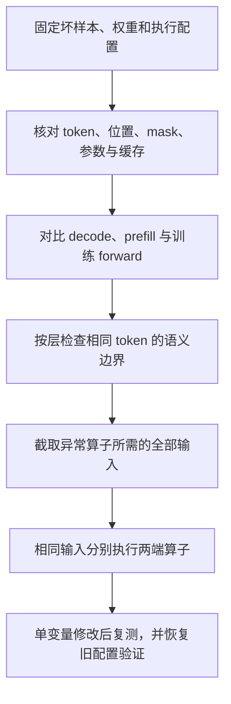

# 训推一致性诊断：从概率偏差到根因定位

LLM 强化学习中有一种难排查的问题：rollout 正常生成，训练 loss 没有明显异常，reward 却逐渐下降。打开重要性采样校正后，训练可能恢复；换个 batch size、推理后端或并行配置，问题又出现了。

这时，单看训练曲线很难区分几件事：优化步长是否太大，rollout 是否用了旧权重，训练侧有没有拿错 token 的概率，以及同一份模型在两套执行引擎中是否真的算出了不同结果。

诊断的起点可以很具体：**暂停参数更新，让 rollout 和 trainer 逐位置使用相同前缀，计算同一目标 token 的 logprob，保存它们第一次出现差异的位置。** 从这个固定反例出发，才能把“训练不稳定”缩小成可以检查的计算问题。

本文聚焦 LLM RL 中的 Training–Inference Mismatch，简称 TIM。这里主要讨论相同权重和输入下，训练、推理执行路径产生的差异；参数陈旧、采样变换和数据传输错误也会进入排查范围，因为它们在日志里经常长得很像。SFT 的 teacher forcing 与自由生成之间的 exposure bias、传统机器学习中的线上线下特征偏移，属于另外的问题。

## 1. 诊断前的准备

### 1.1 明确比较对象与权重版本

同一个模型名称，不足以定义同一个计算过程。更完整的描述至少包括：权重版本、输入 token、位置和 mask、执行后端、计算精度，以及缓存和并行状态。

固定前缀 $s_t=(x,y_{<t})$，令 $a_t$ 为已经生成的 token，定义：

- $p^R_{\theta_v}(a_t\mid s_t)$：rollout 在权重版本 $v$ 下，采样处理前的模型概率。
- $p^T_{\theta_v}(a_t\mid s_t)$：trainer 用同一版本权重，在同一前缀上重算的模型概率。
- $\mu_v(a_t\mid s_t)$：经过 temperature、top-p 等处理后，实际用于抽样的行为概率。
- $p^T_{\theta_k}(a_t\mid s_t)$：当前训练版本 $k$ 的模型概率。

上标 $R$、$T$ 表示执行路径；其余运行配置暂时省略。为了测量实现差异，先比较两个具有相同概率语义的量：

$$
\delta_t^{\mathrm{sys}}
=\log p^T_{\theta_v}(a_t\mid s_t)
-\log p^R_{\theta_v}(a_t\mid s_t).
$$

这里的两个下标都必须是 $v$。如果拿当前训练概率直接减去旧 rollout 的行为概率，会同时混入三类差异：

$$
\begin{aligned}
\log p^T_{\theta_k}-\log\mu_v
={}&\underbrace{\log p^T_{\theta_k}-\log p^T_{\theta_v}}_{\text{参数更新或版本陈旧}}\\
&+\underbrace{\log p^T_{\theta_v}-\log p^R_{\theta_v}}_{\text{同权重实现差异}}\\
&+\underbrace{\log p^R_{\theta_v}-\log\mu_v}_{\text{采样变换}}.
\end{aligned}
$$

这是在同一前缀、同一目标 token 上加减中间项得到的恒等式。它解释了为什么一个汇总的 “off-policy gap” 不能直接告诉我们根因。没有旧权重重算或事先缓存的旧训练概率，通常也无法事后精确拆出中间那一项。

异步 Agent 还要进一步检查版本粒度：一条长轨迹可能跨越多次权重发布，某个请求甚至保留了旧版本构建的 KV Cache。此时只记录整条轨迹的一个 `policy_version` 不够，应按实际切换边界保存版本和缓存来源；混合版本状态不能简单视为某一份干净 checkpoint 的输出。

### 1.2 区分原始概率与行为概率

假设 temperature 为 $T>0$，只做温度变换时：

$$
\mu(a\mid s)=\operatorname{softmax}\left(z(s)/T\right)_a.
$$

它一般不等于 $\operatorname{softmax}(z)_a$。top-p、top-k、重复惩罚、禁词或结构化输出约束还会继续改变 logits、支持集与归一化结果。

推理引擎可以通过参数配置，在生成时返回训练侧所需的 logprob。例如，vLLM V1 的 `logprobs_mode` 控制返回值的含义，服务端对应 `--logprobs-mode`。选择哪种模式，取决于训练侧怎样计算和使用概率：

| 训练侧用途                                 | vLLM V1 返回配置          | 返回值的含义                                                                               |
| ------------------------------------- | --------------------- | ------------------------------------------------------------------------------------ |
| 与 trainer 未经采样处理的 `log_softmax` 做数值对比 | `raw_logprobs`，也是默认模式 | 选中 token 在采样处理前的模型 logprob                                                           |
| 记录普通随机采样的行为 logprob，用于相应的重要性采样分母      | `processed_logprobs`  | 在 $T>0$ 的普通随机采样路径中，返回 temperature、top-k/top-p 等处理并归一化后的 logprob；使用前需确认覆盖了实际采样所用的全部变换 |

模式配置与是否返回 logprob 是两件事。使用 vLLM 离线 Python 接口时，可以在 `LLM(...)` 中设置 `logprobs_mode="raw_logprobs"` 或 `"processed_logprobs"`，再通过 `SamplingParams(..., logprobs=0)` 请求每一步选中 token 的 logprob；需要额外候选 token 的 logprob 时，再把 `logprobs` 设为正整数。训练侧需要概率 $p$ 时，对相应 logprob 取指数即可，这只改变数值表示，不改变它属于原始概率还是行为概率。[vLLM 返回模式说明](https://docs.vllm.ai/en/stable/usage/v1_guide/#logprobs-calculation)、[SamplingParams 文档](https://docs.vllm.ai/en/stable/api/vllm/sampling_params/)

`raw_logprobs` 是接口对 sampler 某个阶段的命名，不天然等于模型最初输出的、尚未经过任何约束的 full-vocabulary log-softmax。以核对过的 vLLM commit `2c88fb1` 的 Model Runner V2 路径为例，执行顺序是“模型产生 logits → 原地施加 structured-output grammar mask → 进入 sampler”；sampler 的 raw 分支使用的是传入的 logits，并不会恢复 grammar mask 之前的分布。外置 logits processor、logit bias 或其他约束也可能位于同一个边界。这个行为随版本、后端和请求配置变化，不能只凭字段名推断，应该在实际调用链中确认概率是在模型输出后、约束后，还是全部采样变换后计算的。[vLLM commit 2c88fb1](https://github.com/vllm-project/vllm/commit/2c88fb1)

例如，模型原始分布为 $p=(0.5,0.3,0.2)$，结构化输出只允许前两个 token，约束后重归一化为 $q=(0.625,0.375,0)$。两端权重和 hidden 完全一致时，若 trainer 记录 $p$ 而 rollout 的 `raw_logprobs` 实际来自 $q$，第一个 token 仍会产生

$$
\delta=\log 0.5-\log 0.625=\log 0.8\approx-0.2231,
$$

这是假阳性的概率口径差异，不是模型前向差异。因此日志除了 `raw/processed` 外，还应记录 `probability_stage`（例如 `model_output`、`after_grammar_mask`、`after_processors`、`after_support_filter`、`after_renormalization`）、实际 processor 的顺序与参数、约束配置、词表支持集及后端 commit。模型执行对齐应选择约束前的同语义概率；行为策略分析则应记录真实采样分布，二者不能通过把 `raw` 改成 `processed` 混为一个修复。

因此，token 按什么分布选出，与接口返回它在哪个分布下的 logprob，需要分别确认。日志应记录返回模式和采样配置，不能仅凭 `rollout_log_probs` 这个字段名判断它就是行为 logprob。若 trainer 自身也对 logits 做了温度等处理，比较时还需匹配这套处理规则；`prompt_logprobs` 则需要单独核对，因为 prompt token 没有经过生成时的采样处理。

以 `temperature=0` 的 greedy 解码为例，它每一步直接选择概率最大的 token。假设两端使用相同权重和前缀，下一个 token 只有 A、B 两种可能：

| 概率 | A | B |
| --- | ---: | ---: |
| 推理端的原始 softmax 概率 $p^R$ | 0.51 | 0.49 |
| 训练端的原始 softmax 概率 $p^T$ | 0.49 | 0.51 |
| 推理端采用 greedy 时的实际选择概率 $\mu$ | 1 | 0 |

推理端会选 A，训练端若按同样的 greedy 规则选择，则会选 B。这就是“greedy 选择翻转”：概率只改变了 0.02，排在第一的 token 却换了。同时，推理端虽然每次都选 A，模型给 A 的原始概率仍是 0.51；实际选择概率为 1，来自“只选第一名”这条规则。

greedy 请求还需要核对返回模式的具体实现。vLLM V1 的纯 greedy 分支即使配置了 `processed_logprobs`，仍会对处理后的 logits 做 `log_softmax`，并不会自动把选中 token 的 logprob 设为 $\log 1=0$。因此，不能仅凭 `processed` 这个名称认定返回值就是 greedy 的行为 logprob。[vLLM sampler 实现](https://docs.vllm.ai/en/stable/api/vllm/v1/sample/sampler/)

重要性采样需要用实际抽样概率作为权重的分母，因此这里 A 对应的分母是 1，不能用原始概率 0.51 代替。重加权可以补偿某个 token 被抽得较少，却无法补回完全抽不到的 token：greedy 在这个前缀下永远不会选 B，只给 A 加权，无法恢复 B 对完整 softmax 分布统计量的贡献。top-p 截断也可能造成同样的问题。要用重要性采样估计目标分布下的统计量，采样分布必须覆盖所有对该统计量有贡献的 token。

如果训练目标本来就要在截断后的行为支持集内计算，可以使用 Sampling Mask / Distribution Replay：rollout 保存每一步经过 top-k/top-p/min-p 等过滤后实际保留的 token 集合 $S_t$，trainer 重放这份旧集合，而不是让当前模型重新计算一个可能已经改变的 top-p 集合。只考虑温度和支持集截断时，训练端可定义

$$
\pi_{\theta,S_t}(a\mid s_t)=
\frac{\mathbf 1[a\in S_t]\exp(z_\theta(a\mid s_t)/T)}
{\sum_{b\in S_t}\exp(z_\theta(b\mid s_t)/T)}.
$$

这能把两端放到同一个受限动作空间中，但它不是无偏恢复原始 full-softmax 目标，而是复用旧支持集构造的训练代理目标。日志和实验应明确是在对齐行为策略、选择受限训练目标，还是估计完整原分布下的量；若还有 penalty、logit bias 或其他 processor，也必须同时保存并匹配，保存 $S_t$ 本身不能代表完整概率语义。vLLM 文档中该能力的具体支持还受版本和路径限制，核对过的 Model Runner V2 配置要求启用 `--return-sampling-mask`、使用正温度、正的 `top_k` 并使用 processed logprobs；与 speculative decoding、diffusion models 和 engine-level custom logits processors 等组合不兼容，并可能关闭 FlashInfer fused sampler。因此它有明确的性能和兼容性代价，不能作为无条件的开关。[Sampling Mask（Distribution Replay）文档](https://docs.vllm.ai/en/latest/training/sampling_mask/)

如果只是检查两端的数值计算是否一致，就可以先固定一条 token 序列，让两端逐位置使用完全相同的前缀，对同一个目标 token 计算 raw 概率或 logprob。例如，固定检查 A，就比较表中的 0.51 和 0.49；这一步不要求 A 是按某个分布随机抽到的，greedy 生成的轨迹也可以使用。不过，只比较轨迹中 token 的概率，结论就只覆盖这些前缀和 token；若要直接比较某个前缀下的完整分布，需要额外取得全词表概率，见 §2.4。

### 1.3 保存真实输入，核对 token 序列

如果 rollout 返回文本后，trainer 又重新分词，应优先检查重建的 token 序列是否发生变化。空格、特殊 token、工具调用格式、截断和多轮拼接，都可能让重建出的 token ID 与实际生成时不同。

vLLM 与 Agent Lightning 团队专门讨论过 retokenization drift，并通过返回 token ID 保留生成轨迹。Hugging Face 的 chat template 文档也提醒：模板已经插入特殊 token 后，再 tokenize 时额外添加 BOS/EOS，可能造成重复。[vLLM 的 token ID 接口说明](https://vllm.ai/blog/2025-10-22-agent-lightning)、[Hugging Face chat templates](https://huggingface.co/docs/transformers/main/en/chat_templating)

第一次核验应直接对齐整数序列。找到首个不同的 ID，再查看它附近的原始字节、模板边界和消息角色。只比较解码后的文本，可能把问题隐藏起来。

对多轮 Agent，工具返回的内容通常不计入策略梯度损失，却仍然是生成后续 token 时的条件上下文。计算损失时排除这些位置，不等于可以从重放输入中删掉它们。若系统对历史做了摘要、滑窗或截断，应保存每一轮实际送入模型的上下文，不能默认最终拼出的完整对话就是当时的输入。

长程 Agent 还应把上下文长度与动作长度分开记录。**实际上下文长度**是某次调用真正可见的 token 数，包含工具返回、系统消息和模板内容，主要用于定位 attention、position、缓存和长度边界；**策略动作长度**是轨迹中模型实际作出决策的 token 数，主要用于 ratio 累积、训练权重和长程统计。一条逻辑轨迹很长，不代表每次 forward 都有同样长的上下文；工具输出撑大的上下文，也不等于模型生成了同等数量的动作。建议至少保存 `context_length`、`action_length` 以及各自的边界，并按两条长度轴分别分组实验，不要把它们压成一个 `sequence_length`。

还要区分三种常被统称为 mask 的东西：**上下文可见性 mask**决定某个位置能看到哪些 token；**loss mask**决定哪些位置进入策略梯度损失；**策略决策或轨迹概率 mask**决定哪些动作位置被纳入整条轨迹的概率分解。工具输出可以不计入 loss，却仍然改变后续动作的状态；反过来，一个由策略生成、后来从训练损失中排除的动作，也不会因此自动从轨迹概率中消失。若 $\mathcal A$ 是需要纳入概率分解的策略决策集合，轨迹权重应写成

$$
W(\tau)=\prod_{t\in\mathcal A}
\frac{\pi(a_t\mid h_t)}{\mu(a_t\mid h_t)},
$$

不能简单用当前的 loss mask 代替 $\mathcal A$。这几个 mask 的具体语义和 shape 都应随样本保存，尤其在 packing、多轮工具调用和截断后核对它们是否仍对应同一位置。

即使每个动作位置的概率比都在支持集上被正确重加权，也不代表整条长程交互已经严格 on-policy。在支持集条件满足时，动作级校正至多给出

$$
\mathbb E_{s\sim d^\mu,\,a\sim\mu}
\left[\frac{\pi(a\mid s)}{\mu(a\mid s)}f(s,a)\right]
=\mathbb E_{s\sim d^\mu,\,a\sim\pi}[f(s,a)],
$$

右侧的状态分布仍是行为策略产生的 $d^\mu$，没有自动变成 $d^\pi$。因此，token 级 ratio 或 Sampling Mask 可以修正动作概率口径，却不能单独消除长程状态分布偏移；报告时应把动作级数值对齐与轨迹级分布结论分开。

### 1.4 对齐 token 与 logprob 的位置

自回归模型中，输入位置 $j$ 的 logits 用来预测位置 $j+1$ 的 token。假设输入为：

```text
输入位置       0      1      2      3
input_ids     BOS     A      B     EOS
目标 token     A      B     EOS     —
```

因此，logits 与目标 token 的位置对应关系是：

```python
target_ids = input_ids[:, 1:]
logits_for_targets = logits[:, :-1, :]
```

计算 response 第一个 token 的 logprob 时，应对最后一个 prompt 位置的 logits 做 `log_softmax`，再读取该 token ID 对应的值。诊断时要核对 response 起点、EOS 是否被返回、截断是否保留末 token，以及 logprob 数组中是否存在空值或占位符。

### 1.5 保存版本、概率与执行状态

要重现当时的计算，一条诊断记录至少需要保存以下信息。

| 内容   | 至少保存什么                                                | 用途                      |
| ---- | ----------------------------------------------------- | ----------------------- |
| 样本身份 | request、trajectory、turn、原始 token 位置                   | packing、排序和切片之后还能找回同一位置 |
| 实际输入 | prompt/response IDs、上下文截断边界、position IDs、attention 语义 | 确认两端比较的是同一个条件概率         |
| 有效位置 | 原始 response/loss mask、缺失概率标记、结束原因                     | 排除 padding，区分缺失记录与有效的零值 |
| 版本   | checkpoint/adapter 版本、权重同步完成标记、缓存版本                   | 分开陈旧权重和同权重差异            |
| 概率   | 生成当时的 chosen-token logprob、raw/processed 标记、`probability_stage`、processor 顺序与参数、约束配置和支持集 | 保留实际 decode 时的概率语义与 logprob |
| 执行条件 | 后端及 commit、GPU、dtype、TP/EP/CP、batch 与 chunk 信息        | 恢复触发问题的形状和数值路径          |
| 扩展证据 | 少量异常位置的 logits、hidden、KV 状态或 MoE routes               | 从最终概率追到局部计算             |

多模态模型还需要保存实际的预处理结果或足以重建它们的版本与参数，例如图像切块、尺寸、视觉 token 布局。相同的图片文件不自动保证相同的模型输入。

表中的 TP、EP、CP 分别指张量并行、专家并行和上下文并行；后文的 PP 指流水线并行。它们分别改变张量、专家、序列和模型层在设备间的划分方式。

### 1.6 区分生成时记录的 logprob 与事后重算结果

假设 rollout 逐 token decode 生成了一条回答，并保存了每一步的 logprob。事后使用同一版本权重，将原始 prompt 和回答的 token IDs 拼接，作为一个新请求的输入，再请求 `prompt_logprobs`，引擎会重新计算这些已知 token 在各自前缀下的条件 logprob。按 §1.4 的位置对齐规则取出原回答对应的结果，得到的就是每个回答 token $y_t$ 的 $\log p^R(y_t\mid x,y_{<t})$。

在 vLLM 中，这次重算通过 prefill 路径执行。输入中虽然包含完整回答，因果 attention mask 与预测位置对齐仍保证 $y_t$ 的概率只依赖 prompt 和此前的回答 token。相比生成时逐步 decode，即使权重和 token 序列相同，prefill 的矩阵形状、attention 路径和缓存使用方式也可能不同，因此重算值不一定与生成时保存的值完全一致。[vLLM prompt logprobs 说明](https://docs.vllm.ai/en/stable/usage/v1_guide/#prompt-logprobs-with-prefix-caching)

因此，同一前缀、同一目标 token 上至少要区分三个 logprob：

$$
\ell_t^{R,\mathrm{decode}},\qquad
\ell_t^{R,\mathrm{prefill}},\qquad
\ell_t^{T,\mathrm{forward}}.
$$

第一个优先使用生成当时保存的值，另两个留作后续对照。用新的 prefill 结果覆盖原始 rollout logprob，会丢掉最需要解释的现场。

还要把 trainer 内部的执行路径拆开记录。一个“trainer logprob”可能来自诊断打分、真正产生 loss 的前向，或 backward 时由 activation checkpointing 触发的重算；它们不应默认视为同一个量。

| 路径 | 实际作用 | 必须核对 |
| --- | --- | --- |
| Rollout decode | 现场生成轨迹 | token、logprob、缓存和权重版本 |
| Trainer scoring | 重算 old logprob 或做诊断 | 是否与 loss 前向使用同一输入、mask、dtype 和 kernel |
| Trainer loss forward | 产生参与更新的 current logprob | packing、label shift、归一化和所有 loss mask |
| Checkpoint recomputation | 反向传播时重算被保存的激活 | 重算值、随机状态、路由和梯度是否与原前向一致 |

可以在固定轨迹上先测训练端内部差异，再测跨端差异：

$$
\ell_t^{T,\mathrm{loss}}-\ell_t^{R,\mathrm{decode}}
=\underbrace{\ell_t^{T,\mathrm{loss}}-\ell_t^{T,\mathrm{score}}}_{\text{训练端内部路径差异}}
+\underbrace{\ell_t^{T,\mathrm{score}}-\ell_t^{R,\mathrm{decode}}}_{\text{打分路径与生成路径差异}}.
$$

只验证第二项，可能得到“训推已经对齐”的结论，而真正用于更新的第一项仍然有问题。Activation checkpointing 也不能只看是否报错：如果 backward 阶段调用的函数与 forward 不同，可能出现静默的错误梯度；PyTorch 默认的 `determinism_check` 主要检查重算张量的 shape、dtype 和 device，并不保证逐元素数值相等。[PyTorch checkpoint 文档](https://docs.pytorch.org/docs/2.14/checkpoint.html)。因此应在可承受的规模上比较关键中间值，并做有、无 checkpoint 的梯度对照；不必强行让 checkpoint 重算完整 logprob，因为它可能只重算局部计算。

要重放 decode，应固定每一步喂回的 token，同时保留由采样处理前的模型 logits 计算出的 raw logprob；不能通过把其他 token 的 logits 全设为负无穷来“强制输出”，然后比较被修改后的概率。当前 vLLM 的 Trace Replay 提供了这样的调试入口：按指定 token ID 继续 decode，并保留模型对这些 token 的 logprob。具体版本是否支持，应以安装版本的功能文档为准。[Trace Replay 官方示例](https://docs.vllm.ai/en/latest/examples/generate/trace_replay_offline/)

## 2. 怎样发现训推不一致

在这一节，默认两端权重版本相同，目标 token 与前缀已对齐，比较的都是 raw 模型 logprob。所有统计只使用两侧都有有效 logprob 的位置。

有效覆盖率、缺失记录和 NaN/Inf 数量应单独报告。没有有效位置时返回“无可比较数据”，不能返回差异为零；也不能把缺失 logprob 填成零，因为有效的 logprob 为零表示该 token 概率为 1。

### 2.1 观察 logprob 差与比率尾部

令：

$$
\delta_t=\ell_t^T-\ell_t^R,\qquad
w_t=\exp(\delta_t)=\frac{p_t^T}{p_t^R}.
$$

建议同时记录 $\delta$ 的有符号均值，以及 $|\delta|$ 的均值、P50、P95、P99、最大值和最大值所在位置。有符号均值可以揭示偏向，但正负差异会抵消；绝对值均值不会抵消，却仍可能掩盖少量异常 token。

一个纸面例子：rollout 给某 token 的概率是 $10^{-6}$，trainer 给的是 $10^{-4}$。概率绝对差仅为 $9.9\times10^{-5}$，但概率比是 100，logprob 差约为 4.605。若这个 token 进入重要性加权，它的影响与“概率差很小”的直觉完全不同。

进一步可以画比率尾部：

$$
F(c)=\frac{1}{N}\sum_t
\mathbf 1\!\left[|\delta_t|>\log c\right],\qquad c>1.
$$

它表示概率比落在 $[1/c,c]$ 外的 token 比例。取一组 $c$ 查看尾部，比只报一个平均值更容易识别偶发的大偏差。这里的 $c$ 是诊断刻度；它不自动等于训练中的 TIS 或 PPO 阈值。

序列维度也要保留。对第 $i$ 条回答，可以记录 $S_i=\sum_t\delta_{i,t}$、$S_i/T_i$ 和 $\max_t|\delta_{i,t}|$：前者观察沿序列累积的对数比，后两者帮助区分长度效应和局部尖峰。不要把 $\exp(S_i/T_i)$ 这个几何平均比率当成整条轨迹的联合概率比；只有完整条件链满足对应定义时，$\exp(S_i)$ 才有那个含义。

### 2.2 核对框架指标的实际计算

一个具体例子是 verl 的 `training/rollout_probs_diff_*`。在本文核对的提交 `8bda42207cc08a947a49587d38315647740b9e14` 中，代码先对两组 logprob 做 `exp`，再调用差值函数。虽然相关注释写着 logprob，最终统计的实际是 $|p^T-p^R|$。[verl 源码](https://github.com/verl-project/verl/blob/8bda42207cc08a947a49587d38315647740b9e14/verl/utils/debug/metrics.py#L98)

这个指标衡量的是概率绝对差，排查重要性比率时还需要看 $|\log p^T-\log p^R|$。因此，查看仪表盘时最好顺着计算代码确认输入、单位、mask 和聚合方式。

### 2.3 确认 KL 的方向与采样分布

如果 $a_t$ 确实从 $p^R(\cdot\mid s_t)$ 抽样，而且两端分布归一化并满足相应支持集条件，那么：

$$
\mathbb E_{a_t\sim p^R}[-\delta_t]
=D_{\mathrm{KL}}\!\left(p^R(\cdot\mid s_t)\Vert p^T(\cdot\mid s_t)\right).
$$

常见的 K3 形式为：

$$
k_3(\delta_t)=\exp(\delta_t)-1-\delta_t.
$$

当 $p^R$ 覆盖 $p^T$ 的支持集时，$\mathbb E_{p^R}[\exp(\delta)]=1$，因此 K3 的期望也对应上面的方向。有限样本中，$-\delta$ 的均值可能为负；K3 在精确算术下逐点非负。这些估计形式也可以在 [verl 的 off-policy 指标实现](https://github.com/verl-project/verl/blob/8bda42207cc08a947a49587d38315647740b9e14/verl/trainer/ppo/rollout_corr_helper.py#L961)中看到。

但生产 rollout 若按 top-p 或其他行为分布 $\mu$ 抽样，直接平均 raw 概率差，并不自动得到 $D_{\mathrm{KL}}(p^R\Vert p^T)$。它仍然能描述“这些实际观察到的 token 上有多大偏差”，但应按这个含义命名。按 reward 筛选或拒绝采样之后，样本分布也会变化。

另外，K3 很小时存在浮点抵消，显示为 `0.0000` 更不能证明位级一致。小差异可用 `expm1(delta) - delta` 改善数值计算；若目标是 bitwise 一致，应直接检查有效位置的原始 logprob 位模式、dtype 和非有限值，而不是用 KL 的打印结果代替。

### 2.4 从生成 token 扩展到完整分布

只保存实际生成 token 的概率，成本低，适合持续监控。但它只能观察一个坐标：未被选中的候选可能已经变化。

对少量异常前缀，可以额外导出完整词表的 logprobs，计算条件 KL，检查 top-1 是否翻转，以及 top-1 与 top-2 的间隔。完整条件分布上的比较不要求目标 token 来自该分布采样；不过抽查了哪些前缀，仍决定结论覆盖哪些状态。

只有 top-k 候选时，应把结果称为候选集比较，不能把剩余词表当作不存在后声称算出了完整 KL。比较 logits 本身也要注意：所有 logits 同加一个常数，softmax 不变。因此可以先比较 log-softmax 或中心化后的 logits，再沿计算图追原始数值差异。

对于同一个前缀，若原 top-1/top-2 的 logit 间隔为 $m$，且所有候选 logit 的绝对扰动不超过 $\varepsilon$，那么 $m>2\varepsilon$ 是 top-1 不翻转的充分条件。这个简单界说明：输出相同可能只是候选间隔足够大，概率本身仍然不一致。

### 2.5 按样本与运行条件查看差异

全局均值出现变化后，至少按序列长度、token 位置、对话轮次、首个 response token、工具返回边界、batch 形状和 worker 分组查看。对 RL，再按 reward 和 advantage 符号分组；对 MoE，增加层号和路由是否变化。advantage 即优势值 $A$，表示动作或回答相对基线的好坏；$A>0$ 倾向提高其概率，$A<0$ 倾向降低。

不同的异常分布对应不同的排查重点：只有某个 worker 异常，优先检查权重与配置；误差从特定长度边界出现，检查 position、chunk 或 KV 路径；首个 response token 大面积异常，检查 prompt 拼接和 label shift。

### 2.6 检查过滤前后的指标与 ESS

所有原始差异指标都应在 TIS、IcePop 或 rejection mask 生效前保留一份，处理后再记一份，并报告保留的 token/序列数量。否则，把最异常的样本过滤掉，就会让曲线看起来“恢复一致”。

有效样本量也适合作为辅助信号。对非负权重，常见的相对 ESS 为：

$$
\frac{\mathrm{ESS}}{N}
=\frac{(\sum_t w_t)^2}{N\sum_t w_t^2}.
$$

它描述权重是否集中在少数样本上。所有权重即使都等于 2，ESS 仍可达到 $N$，所以高 ESS 不足以证明概率匹配；token 之间的相关性也使它不能直接等同于独立样本数。verl 上述版本的相关指标使用了截断后的权重，读数应按处理后的权重集中度理解。[ESS 计算代码](https://github.com/verl-project/verl/blob/8bda42207cc08a947a49587d38315647740b9e14/verl/trainer/ppo/rollout_corr_helper.py#L754)

分布式统计必须在全局有效样本上聚合，不能简单平均各 rank 的结果。比如 rank 0 的权重为 $[1,1]$、rank 1 的权重为 $[100,100]$ 时，每个 rank 的相对 ESS 都是 1，但全局相对 ESS 只有：

$$
\frac{(1+1+100+100)^2}{4(1^2+1^2+100^2+100^2)}\approx0.510.
$$

因此，均值要按有效数量聚合，ESS 至少要汇总全局的 $\sum w$ 与 $\sum w^2$，P99 等分位数要用全局样本或明确的近似算法；TP 中复制的记录和 checkpoint 重算产生的重复记录不能重复计数。对 $w_i=\exp(\delta_i)$，还应优先在 log-space 计算：

$$
\log\frac{\mathrm{ESS}}N
=2\,\operatorname{logsumexp}_i(\delta_i)-\operatorname{logsumexp}_i(2\delta_i)-\log N.
$$

全无有效位置、全零有效权重等情况要单独标记，不能包装成“完全一致”。长轨迹还应同时报告 `token_weighted_mean` 和先按轨迹聚合后的 `trajectory_weighted_mean`；前者让长轨迹占更高权重，后者回答的是另一种统计问题。

不存在适用于所有模型的统一合格阈值。应在已核验的模型、精度和执行配置上建立分位数与尾部基线，再判断版本升级或配置变化是否造成回归。最大值要连同样本量一起看，抽取更多 token 本来就更容易遇到极端值。

## 3. 用零更新实验缩小范围

收集完现场后，先暂停参数更新和权重发布，用一份固定 checkpoint 跑一组对照实验。测试集要保留已经发现的坏样本，再补入短回答、长回答、多轮边界和接近 chunk/page 边界的长度。

先原样复现生产前向，包括当时的 train/eval 状态和随机层配置；随后再控制这些因素。`no_grad()` 只关闭梯度记录，不会自动关闭 dropout，也不会自动让训练后端切换为推理引擎的 kernel。诊断程序应显式管理模型状态，并在最后重新验证真实训练前向。

### 3.1 检查单侧稳定性与跨端差异

下面的实验每次只改变一个因素，所有 logprob 都在固定 token 轨迹上计算。

| 对照                            | 固定什么，改变什么                     | 发现差异后的调查方向                             |
| ------------------------------- | -------------------------------------- | ------------------------------------------------ |
| R 对 R，重复运行                | 同权重、同 shape、同路径重复执行       | 随机层、非确定性算子、未初始化状态或缓存生命周期 |
| T 对 T，重复计算 logprob                | 同权重、同输入重复计算 trainer logprob             | trainer 自身的状态或计算不稳定                   |
| R 对 R，改变 batch              | 同一个请求放入不同大小、位置和长度组合 | batch 相关的 kernel、归约或调度路径              |
| T 对 T，改变 microbatch/packing | 保持样本的真实可见上下文不变           | padding、packing、位置、训练侧 shape 相关差异    |
| R decode 对 R prefill           | 同权重、同前缀和目标 token             | KV/state 更新、prefill/decode 算子差异           |
| R prefill 对 T forward          | 同权重、同完整输入                     | 跨后端模型定义、权重映射、attention/FFN/head     |
| 同侧改变 TP/EP/CP               | 逻辑输入与模型不变，只改变并行布局     | 分片、dispatch、跨卡归约或对应 kernel            |

改变 batch 的测试可以很简单：固定一条待测请求，加入若干不同长度的干扰请求，移动它在 batch 中的位置，再比较它每一步的 logprob。vLLM 的 batch invariance 测试就包含这种“固定请求加 filler”的设计，并单独比较 decode 与逐前缀 prefill 的 logprob。[vLLM 官方测试](https://github.com/vllm-project/vllm/blob/main/tests/v1/determinism/test_batch_invariance.py)

这里有三个经常被混同的性质：同一执行条件下重复运行得到相同结果，称为确定性；改变 batch 仍保持单个样本结果，称为 batch invariance；跨训练、推理引擎保持结果，是训推一致性。前一项成立，不能自动推出后一项。Thinking Machines 对浮点归约和 batch 形状的分析，给出了这种区别背后的计算原因。[Defeating Nondeterminism in LLM Inference](https://thinkingmachines.ai/blog/defeating-nondeterminism-in-llm-inference/)

TP 不变性还需要单独验证。即使单卡 kernel 对 batch 不敏感，改变 TP 数量也可能同时改变本地矩阵乘的求和分组和跨卡 all-reduce 顺序。TBIK 研究用统一归约树对齐这两部分，说明“打开 batch-invariant kernel”并不能概括所有并行配置下的一致性。[TBIK 论文 §3.3](https://arxiv.org/html/2511.17826)

### 3.2 用 prefill 区分跨端差异与缓存路径差异

两端直接相减时，差异可能来自任何地方。加入推理侧 prefill 后，同一位置的差异可以分解成：

$$
\ell_t^{T,\mathrm{forward}}-\ell_t^{R,\mathrm{decode}}
=\left(\ell_t^{T,\mathrm{forward}}-\ell_t^{R,\mathrm{prefill}}\right)
+\left(\ell_t^{R,\mathrm{prefill}}-\ell_t^{R,\mathrm{decode}}\right).
$$

若前一项很小、后一项大，优先调查推理引擎内部的 prefill/decode 差异；若后一项很小，跨引擎 forward 的差异就更值得追。两项都大时，需要分别定位，不能预设只有一个根因。

缓存还值得增加一组更窄的对照：同一输入的 cold prefill 与命中前缀缓存的 hot prefill。两边都走 prefill，能进一步减少 decode/prefill 阶段切换带来的混杂。SGLang 的确定性测试专门区分了这两种比较，避免把“首次 decode 与后续缓存 prefill 不同”直接判成缓存错误。[SGLang 缓存对照测试](https://github.com/sgl-project/sglang/blob/main/python/sglang/test/test_deterministic.py)

还可以在训练侧逐步使用 KV Cache 解码，或关闭缓存，每一步对完整前缀做前向计算，读取下一个目标 token 的 logprob；也可以增加使用统一模型定义的参考路径。各路径得到的 logprob 应单独保存，再与生产路径的结果比较。

对带线性注意力、SSM 或其他递归状态的模型，缓存中未必只有标准 attention 的 K/V。需要比较 prefill 写出的状态、每次 decode 更新后的状态，以及训练分块计算在同一 token 边界对应的状态。只核对输出 logits，容易错过更早发生的状态分歧。

### 3.3 缩减反例并保留触发条件

可以逐步删除无关样本、缩短后缀、减少生成步数和并行设备，但每一步都要确认差异仍然存在。

如果问题只在长上下文或多人 batch 出现，把输入压成一条短 prompt 后误差消失，说明缩减过程移除了触发条件。此时应保留最小的上下文长度、填充请求或 chunk 配置，再继续缩小其他部分。

最好同时保存“坏配置”和一个接近它的“好配置”，例如同一前缀在两种 chunk 大小下的差异。两套配置的差别越少，后面的局部定位就越容易。

## 4. 从首个差异追到具体算子

经过上一轮实验，问题通常已经缩到了输入链路、缓存路径或不同后端的前向计算。接下来要回答：差异第一次在哪里产生，后续又在哪里被放大？



### 4.1 核对有效权重与缓存版本

加载成功、checkpoint 文件名相同、版本号相同，都不保证 worker 中的有效参数相同。需要在两端的逻辑参数空间核对 shape、dtype 和内容，重点包括 embedding、LM head、QKV、MoE expert、router、LoRA 及量化 scale。

分片、QKV 融合、转置、专家重排之后，原始张量字节未必能直接比较。应先恢复同一个逻辑布局；若推理侧量化或合并 LoRA，则分别确认转换输入、转换规则和转换后的有效权重。先抽查可以降低成本，但抽查一致只能排除被检查的参数。

版本切换后突然出现大面积偏差，尤其值得检查同步是否覆盖所有 rank，以及旧 KV/state 是否按该后端的更新协议失效。权重已经更新、缓存仍来自旧版本，是另一种状态不一致。

### 4.2 对齐中间状态，查找首个差异

对固定前缀中的同一 token，先保存 embedding 输出、每个 Transformer block 的残差状态和最终 normalization 输出。使用绝对误差、相对范数误差和非有限值计数一起观察，避免高余弦相似度掩盖少数异常维度。

两套后端的模块边界未必对应。例如，一端在上一个 block 末尾做 residual add，另一端把 add 融入下一个 RMSNorm。比较“名字相同的模块输入”之前，必须确认它们在数学上表示同一个状态。

可以先稀疏检查若干层来缩小范围，再补查相邻边界。误差沿深度并不保证单调增加：某层可能放大差异，下一层也可能压小，所以不能把简单二分搜索当成严格的首错定位算法。

确定某一层附近开始异常后，再拆成 normalization、QKV projection、RoPE、attention、输出投影、FFN/MoE 和 residual。最后一层概率差最大，并不说明 LM head 是最初的误差源。

### 4.3 用相同输入重放两端算子

假设两个 block 的输出分别为：

$$
y_R=f_R(h_R),\qquad y_T=f_T(h_T).
$$

若 $h_R\ne h_T$，看到 $y_R\ne y_T$，还不能判断当前算子有问题，因为差异可能完全来自上游。

更有区分力的实验是保存一份输入 $h^\star$，分别计算：

$$
f_R(h^\star),\qquad f_T(h^\star).
$$

这份“输入”必须足够完整。对 attention，它还包括 Q/K/V、mask、位置和缓存状态；对 MoE 的专家计算与合并，包括专家选择与混合权重，检查 router 本身时则固定 hidden 和选路配置；对归一化层，可能还包括尚未相加的 residual。相同的逻辑输入进入不同布局时，也要确认转换本身没有引入差异。

如果局部差异仍然存在，就可以继续检查公式语义、计算 dtype、中间值舍入、归约顺序和 kernel 选择。如果相同输入下算子一致，而原生输入下输出不同，则应沿上游继续追踪，或研究该算子如何放大上游扰动。必要时对两端原生输入分别做一次交叉实验，避免结论只依赖某一份特定输入。

XoRL 的工程记录提供了一个具体案例：两个 RMSNorm 路径虽然都使用 `tl.sum`，但其中一个路径多了存储操作，编译器因此选择不同布局，改变了归约的加法顺序。作者进一步检查编译产物，并重放该顺序验证输出。[XoRL：RMSNorm 案例](https://kiddyboots216.github.io/mismatch/)

开启 hook 或导出中间值之后，也应确认原始差异仍然可复现：额外的存储、同步或 eager fallback，本身就可能改变编译布局与执行条件。

这个排查方式也适用于 LM head。可以分别核对选中 token 的 logit 与全词表的 `logsumexp`：选中 logit 相同而 logprob 不同，差异就可能在归一化或词表分片归约，而不是该 token 的输出投影。

### 4.4 用精度与执行开关做单变量对照

把某一段换成更高精度，若差异缩小，说明这一段对数值路径敏感；但 dtype 改变也可能连带更换 kernel，因此还需要局部相同输入实验。

只把已经算出的 BF16 logits 转成 FP32，不能恢复此前丢掉的精度。要区分权重/激活存储精度、乘法精度、累加精度、算子输出精度，以及 softmax/logprob 的精度。[PyTorch 数值精度说明](https://docs.pytorch.org/docs/2.14/notes/numerical_accuracy.html)

FP16 与 BF16 也不是简单的高低关系：FP16 尾数更细，BF16 指数范围更大。FP16 可能减小某些舍入差异，却带来不同的溢出风险。相关论文和 TRL 团队的实验支持把精度作为一个值得检查的因素，但不构成对任意模型统一切换 dtype 的依据。[Defeating the Training-Inference Mismatch via FP16](https://arxiv.org/abs/2510.26788)、[TRL 的精度分析](https://aminedirohf-trainer-generator-bf16-mismatch.hf.space/)

同理，关闭 CUDA Graph、切换 eager、改变 attention backend 或禁用某种缓存优化，都应一次只改一个因素，并记录实际生效的 kernel。一次关闭所有优化后恢复一致，只能说明根因位于被一起改变的范围内。

## 5. MoE 专项：路由与专家计算

MoE 多了一次离散选择。router 分数的小变化，可能让第 $k$ 与第 $k+1$ 个专家交换位置，随后进入完全不同的 FFN 参数。因此它既可能是差异产生的位置，也可能是上游误差被放大的位置。

R3 论文在 Qwen3-30B-A3B、SGLang 与 Megatron 的实验中，观察到约 10% 的 token-layer 路由位置选择不同，约 94% 的 token 至少有一层路由不同。两个比例的分母不同，后者不表示这些 token 生成错误。论文的 replay 固定专家选择 mask，混合权重仍由训练侧重算，所以它也不保证整个前向结果一致。[R3 论文 §3.2、§4.1](https://arxiv.org/html/2510.11370v1)

### 5.1 核对路由记录的位置与专家编号

一行 route 至少应能定位到：样本、输入 token 位置、全局 Transformer 层号，以及全局逻辑专家 ID。输入位置 $j$ 的 route 属于 $x_j$ 的计算，该位置的末层 logits 则用于预测下一个 token $x_{j+1}$。**logprob 的 label shift 不能原样套在 route 元数据上。**

需要沿着“router 实际输出 → capture buffer → 传输 payload → packing/切片 → trainer 实际采用值”逐站抽查。尤其检查：全零或缺失行、top-k 中重复 ID、prompt/cache 部分的覆盖率，以及 PP/EP 下的层号和专家映射。

这类问题有真实修复记录。vLLM 的 PR #33013 修复了 capturer 初始化时机导致记录未生效、缓冲区保持全零的问题；它还把捕获点移到专家负载均衡映射之前，因为推理端的物理专家编号不能直接当成 trainer 期望的逻辑编号。该 PR 于 2026 年 1 月合并。[vLLM PR #33013](https://github.com/vllm-project/vllm/pull/33013)

检查 trace 时，除了数值范围，还要确认两端的同一个整数确实指向同一个逻辑专家。

### 5.2 依次固定输入、专家集合与混合权重

对一个已经出现差异的 token-layer，建议按下面的顺序重放。每次增加一个受控变量，观察误差是否缩小。

| 实验                                 | 比较对象                        | 能缩小到的范围                                          |
| ------------------------------------ | ------------------------------- | ------------------------------------------------------- |
| 固定同一份输入 hidden                | 两侧 router logits              | router 参数映射、计算精度和矩阵乘                       |
| 固定同一份 router 分数及其他选路输入 | 两侧 top-k 专家集合             | group selection、correction bias、tie-breaking、ID 语义 |
| 固定 hidden 与专家集合               | 两侧 gating weights 和 MoE 输出 | 混合权重计算，或专家内部计算                            |
| 再固定 gating weights                | 各 expert 输出                  | 专家权重、量化、FFN kernel                              |
| 固定各 expert 输出                   | dispatch/combine 后结果         | 排列恢复、跨卡传输、归约和加和顺序                      |

对于普通 top-k，可记录边界 margin $m=s_{(k)}-s_{(k+1)}$。在相同候选集且每个分数扰动不超过 $\varepsilon$ 时，$m>2\varepsilon$ 保证集合不变；小 margin 只表示敏感，不能证明实现错误。分组路由还要检查组选择的边界。

如果只固定专家集合就让误差明显下降，可以说明离散路由在放大差异；最初的扰动仍可能来自 attention 或 normalization。若还要固定 gating weights 才明显改善，则混合系数也参与了差异。后者是用于隔离问题的实验，不应直接当作训练修复，因为替换 gating weights 会改变梯度语义。

### 5.3 对照 R3 重放与原生路由

路由监控可以包括集合完全匹配率、平均 top-k overlap 和 replay coverage。匹配率的分母是有有效对应数据的 token-layer 行；coverage 则应相对于预期重放的行数，并区分 prompt、response 与 cache 来源。TP/EP 中复制的行和 activation checkpointing 的重复前向，不应被当作新的样本重复计数。

应在覆盖 native 路由之前采集差异，覆盖之后再比较通常只会得到预期中的“一致”。verl 的公开讨论提出了类似指标，但它是诊断功能 RFC，不能把提案中的配置名当作所有已发布版本都支持的功能。[verl Discussion #6805](https://github.com/verl-project/verl/discussions/6805)

在 R3 前向中，即使还没替换当前层的路由，native router 收到的 hidden 也来自前面各层执行 replay 后的结果。此时观察到的是“沿此前 replay 路径走到这里，这一层会如何选择”，不等于完整关闭 replay 后的原生模型。因此，要判断实际部署路径的一致性，还应完整关闭 replay，沿同一条固定 token 轨迹重新计算 logprob。

R3 的详细机制可继续阅读 [[foundations/RL/系统/训练稳定性/精度/训推一致性/R3：用Rollout Routing Replay解决MoE Agentic RL的训推不一致|R3 技术详解]]。


### 5.4 MiMo-V2.6：把一致性修复拆成可单独验证的记录

MiMo-V2.6 报告把训练与 rollout 的对齐落实成几条不同粒度的记录，适合放进前面的排查顺序，而不是把“训推一致”当成一个总开关：

| 记录或机制 | 固定的对象 | 它排除的差异 |
| --- | --- | --- |
| QDQ | rollout 与 training engine 使用的 MXFP4 expert 权重 | 量化权重转换和反量化路径不一致 |
| R3 | rollout 时实际选择的 expert index | router 的离散选择不同；不等于专家输出已经完全一致 |
| top-p candidate-set replay | rollout 实际看到的候选集合，再由训练侧归一化 | top-p 截断、候选集和采样归一化口径不同 |
| Context Cache | 跨 turn 的 KV、expert index 和多模态状态 | 工具等待或多轮续写时状态被重新构造 |

这些机制的共同点是保留 rollout 的事实，而不是事后猜测它当时走了哪条路径。报告还把空闲的 context state 下沉到 host memory，以换取 HBM 容量；这属于容量与一致性的共同约束，不能只用 logprob 差值判断是否有效。[MiMo-V2.6 技术报告，第 32 页](https://huggingface.co/XiaomiMiMo/MiMo-V2.6-Pro-RL/resolve/main/MiMo_V2_6_technical_report.pdf#page=32)

报告还提供了一个稳定性侧的反例：router 可训练时，某层 expert-load 的 CV 从 0.78 升到 2.0，峰值负载从 6 倍升到 16 倍，cold expert 比例从 0.5% 升到 22%；冻结 router 后负载恢复稳定。[MiMo-V2.6 技术报告，第 23–24 页](https://huggingface.co/XiaomiMiMo/MiMo-V2.6-Pro-RL/resolve/main/MiMo_V2_6_technical_report.pdf#page=23) 这说明路由记录既是数值诊断材料，也是容量故障的早期信号。实际排查时应同时看 logprob 差、route overlap、expert-load CV 和 OOM/超时记录，避免把系统容量问题误判为单纯的概率偏差。

## 6. 验证差异是否影响训练

同权重下发现 mismatch，证明了两端计算不同；要把某次 reward 退化归因于它，还需要连接到更新过程。

### 6.1 识别 PPO ratio 的监控盲区

若 PPO 使用 trainer 重算的旧概率，那么：

$$
r_t^T=\frac{p^T_{\theta_k}(a_t\mid s_t)}{p^T_{\theta_v}(a_t\mid s_t)}.
$$

当 $\theta_k=\theta_v$ 且两次 trainer 前向一致时，$r_t^T=1$。这个等式没有使用 rollout 概率，因此无法证明 $p^T_{\theta_v}=p^R_{\theta_v}$。

Zhong 等人的《Diagnosing Training Inference Mismatch in LLM Reinforcement Learning》直接研究了这一盲区。论文用 VeXact 建立零差异对照，在所测 GRPO recomputation 配置中，reward 已开始退化时，基于 PPO ratio 的 K1/K3 仍接近对照。其同步 REINFORCE 实验也比较了 Qwen3-1.7B 和 Qwen3-30B-A3B 的训练稳定性。证据支持在这些配置下把 TIM 作为独立排查因素，但模型、任务与规模覆盖有限。[论文 §3、§4.1、附录 A.1](https://arxiv.org/html/2605.14220v1)

因此，仪表盘应该把两类量并排放置：当前策略相对训练侧旧策略的更新幅度，以及旧权重下 trainer 相对 rollout 的实现差异。`reference model KL` 又是第三种比较；它约束策略相对参考模型的偏离，也不能替代前两项。

### 6.2 比较概率差对损失和梯度的影响

为简化讨论，假设采样没有额外改变分布，定义：

$$
r_t^R=\frac{p^T_{\theta_k}}{p^R_{\theta_v}},\qquad
c_t=\frac{p^T_{\theta_v}}{p^R_{\theta_v}},\qquad
r_t^R=r_t^T c_t.
$$

相同 token 的两个 ratio，可以代入同一个 PPO 代理损失：

$$
L_{\mathrm{clip}}(r,A)
=-\min\!\left(rA,\operatorname{clip}(r,1-\epsilon,1+\epsilon)A\right).
$$

固定 advantage、mask 和归一化方式，比较：

$$
\Delta L_t
=L_{\mathrm{clip}}(r_t^T,A_t)
-L_{\mathrm{clip}}(r_t^R,A_t).
$$

这是更换分母的对照实验。右侧的分子与梯度仍由 trainer 计算，不能视为已经消除了 TIM 的理想训练目标。

把它按 $A_t>0$、$A_t<0$ 分开统计，同时检查哪些 token 因为更换概率分母而跨过 clipping 边界。正 advantage 与负 advantage 的裁剪方向不同，单一的平均 ratio 无法呈现这种差异。

这里要区分 ratio 的数值变化和策略梯度是否仍然激活。对普通 PPO 代理损失，在 advantage、旧概率和 mask 都视为常量，忽略边界恰好相等的情形，有：

$$
\nabla_\theta L_{\mathrm{clip}}
=-A\,r\,C(A,r)\,\nabla_\theta\log p_\theta,
$$

其中

$$
C(A,r)=
\begin{cases}
1,&A>0,\quad r<1+\epsilon,\\
1,&A<0,\quad r>1-\epsilon,\\
0,&\text{其他情况}.
\end{cases}
$$

$C$ 表示这个 token 的 PPO 策略梯度是否被裁剪关掉。于是同一个概率偏差可能改变 $r$ 的权重、改变 $C$ 的开关，或改变训练前向本身的 $\nabla\log p_\theta$。例如 $r_t^T=1$、$c_t=1.3$、$\epsilon=0.2$ 且 $A_t>0$ 时，$r_t^R=1.3$：使用 $r_t^T$ 时该 token 仍有策略梯度，使用 $r_t^R$ 时它越过 $1.2$ 的上界，策略梯度被裁成零。变化不是“梯度增大 30%”，而是“本来有梯度，现在不再由 PPO 策略项更新”。若完整目标还含 KL、熵或其他辅助损失，这些项仍可能提供梯度。

重要性校正放在 clipping 外面或放进 ratio 里也不等价：

$$
\boxed{c\,L_{\mathrm{clip}}(r^T,A)\neq L_{\mathrm{clip}}(c\,r^T,A)}.
$$

前者通常保留原来的裁剪决策，再改变损失尺度；后者会改变是否越过裁剪边界。实际 TIS 还可能截断 $c$、加 rejection mask 或做归一化，因此报告中应写出完整表达式，标明 correction、clipping、mask、归一化和 `detach` 的位置。

比一个平均 KL 更有解释力的指标包括：裁剪决策不一致率，按 advantage 正负区分的有效梯度位置增减，以及这些位置对应的 $|A|r$ 权重占比。只有在这些 token 级指标之后，才适合比较实际反向传播得到的梯度范数、方向和分层差异。没有确定可信的目标对照时，应称为“裁剪决策不一致”，不要预先把某一侧叫作“错误裁剪”。

如果实际训练还乘了 TIS 权重、使用 IcePop、sequence ratio 或额外 KL 项，就应在实际的损失函数中做同样的对照，保留原有的 `detach` 处理和分母定义。简化的 PPO 公式不足以反映这些训练目标。

各 token 对损失的贡献仍不等于梯度大小：梯度还包含 $\nabla_\theta\log p^T$，不同 token 之间也可能相互抵消。资源允许时，可以在同一小批数据、相同模型状态下做两次反向传播，固定 advantage 和优化器状态，仅改变待验证的概率处理方式，比较裁剪前梯度范数、方向及各层差异。这里只比较梯度，不更新参数。

随后进行短训练，同时跟踪原始 mismatch 尾部、有效样本比例、梯度裁剪触发率、reward 与固定验证集成绩。如果误差减小的同时，训练也恢复稳定，就比单看“某条 KL 曲线变小”更有说服力。

### 6.3 检查一步更新在真实 rollout 路径是否生效

固定一组前缀和目标 token，记录训练一步前后的完整权重版本。令 $\theta$ 为更新前、$\theta'$ 为真实训练一步后的权重，分别在 trainer loss 路径和实际 rollout 引擎中测量：

$$
u_t^T=\ell_t^T(\theta')-\ell_t^T(\theta),\qquad
u_t^R=\ell_t^R(\theta')-\ell_t^R(\theta),
$$

并定义：

$$
\eta_t=u_t^T-u_t^R.
$$

若静态差异记为 $\delta_t^{\mathrm{sys}}(\theta)=\ell_t^T(\theta)-\ell_t^R(\theta)$，则：

$$
\boxed{\eta_t=\delta_t^{\mathrm{sys}}(\theta')-\delta_t^{\mathrm{sys}}(\theta)}.
$$

静态 mismatch 测的是当前差多少，这个实验测的是一次更新以后差异如何变化。应检查 $u^T$ 与 $u^R$ 是否反号、变化量差异，以及 $u^R$ 是否整体朝 advantage 指示的方向移动；接近零的变化要使用单独的数值容差。两端必须使用对应的完整权重、已同步的缓存和同一种概率语义。这个实验是固定输入和特定更新方向上的局部诊断，不能单独证明长期 reward 一定提高。

### 6.4 用零差异参考实现做训练对照

VeXact 的工程价值在于提供一条与训练端对齐的 rollout 路径。当前项目主要面向 VeOmni FSDP；MoE 需要相应模型/kernel 适配，带有训练、推理不同算子的线性注意力模型也不能默认获得同样保证。[VeXact 项目说明](https://github.com/verl-project/vexact)

vLLM 与 TorchTitan 也报告过通过统一模型与数值路径获得位级一致的 RL 实验。这说明可以建立更严格的对照，但保证依赖被验证的模型、算子和运行配置。[vLLM 与 TorchTitan 的实验](https://vllm.ai/blog/2025-11-10-bitwise-consistent-train-inference)

应用到自己的训练时，可以分两层验证：先让生产路径与参考路径对同一份固定数据逐 token 计算 logprob，确认数值差异；再做算法、数据、更新预算和评估协议一致的短训练，比较稳定性和学习效果。

完整训练会生成不同的后续轨迹，还可能有吞吐和调度变化，所以这种实验更适合判断系统差异是否影响训练，不能独自指出“某一个 attention kernel 就是根因”。定位具体实现仍要回到前面的固定输入局部重放。结论对训练曲线有依赖时，还应报告随机种子或重复实验的波动。

## 7. 修复验收与回归测试

### 7.1 验证根因与修复效果

比较有说服力的根因报告，应能串起四件事：

1. 固定 checkpoint、样本和执行条件时，问题可重复出现。
2. 首个异常边界已经定位；同输入的局部实验能解释差异来自哪里。
3. 只改变相关实现后差异消失或回到基线；恢复旧实现，问题重新出现。
4. 同一坏样本、生产 batch/长上下文和真实训练前向下，修复仍然有效。

报告中还应把四种判断分开写：首次出现数值差异，说明两条路径从哪里开始分叉，但不等于该处就是 bug；差异被明显放大，说明某个算子或离散决策对扰动敏感，但最初扰动可能来自上游；偏离模型或接口语义，说明存在正确性问题，但不自动说明它是主要性能瓶颈；只有当差异改变了有效梯度、一步更新方向或训练结果，才有证据说明它造成了训练损害。某个归约产生首个正常舍入差异，后续 MoE 路由或 PPO clipping 才把它放大时，“第一个不同的 bit”与“应该优先修哪里”就不是同一个问题。

至少应保留一个从现场到训练后果的完整案例。一个 Dense 模型案例可以按以下顺序记录：

```text
异常指标和现场记录
→ 固定轨迹重现
→ 排除概率语义与数据问题
→ 定位局部计算
→ 单项干预并恢复旧实现验证
→ 梯度与一步更新对照
→ 短训练和回归测试
```

每一步标明这是“观测”“推断”还是“干预证据”。对高度相关的变量（例如 dtype 与 prefill/decode 路径）应做少量交叉实验；单独换 FP32 后误差下降，只能说明这一组执行变化有效，不能直接证明尾数精度就是唯一根因。

可以用下面的表决定下一步动作。它是排查优先级，不能单凭某个症状直接判定根因。

| 观察到的证据                              | 优先检查                                | 验收重点                           |
| ----------------------------------------- | --------------------------------------- | ---------------------------------- |
| token 或边界已经不同                      | 模板、retokenization、截断、label shift | 实际输入 IDs、目标 token 与 logprob 位置完全对应    |
| 只在同步后或某个 worker 出现              | rank 参数、adapter、版本屏障、旧缓存    | 逻辑权重一致，缓存按更新协议处理   |
| 单独运行正常，加入其他请求后异常          | batch/chunk 选择、归约、调度路径        | 同一请求在多种形状和位置下保持基线 |
| 推理 prefill 与 trainer 接近，decode 偏离 | KV/state、位置、decode attention        | 固定轨迹各步的 logprob 与缓存状态对齐         |
| 同 hidden 下 router 选路仍不同            | 选路输入、group/top-k、逻辑 ID          | 选择规则、专家集合及覆盖率可核验   |
| 专家输出相同，combine 后不同              | dispatch、排列、跨卡归约                | 相同专家贡献能恢复一致的组合结果   |
| logits 对齐，logprob 不齐                 | sampling processor、logsumexp、词表归约 | 相同语义下的概率一致               |
| 差异指标只在过滤后改善                    | TIS/IcePop/RS 权重与 mask               | 原始尾部、保留率和梯度尺度一起报告 |

### 7.2 记录临时缓解措施的效果与代价

TIS 和 IcePop 可以在系统尚未完全对齐时抑制异常样本的影响，但它们改变的是更新贡献；R3 固定专家选择，也仍需检查其他算子。具体原理可参考 [[foundations/RL/系统/训练稳定性/精度/训推一致性/TIS：用截断重要性采样缓解LLM RL训推不一致|TIS 详解]] 与 [[foundations/RL/系统/训练稳定性/精度/训推一致性/IcePop：用双侧掩码校正稳定MoE强化学习|IcePop 详解]]。

如果暂时采用这些缓解措施，应明确记录保留比例、loss 分母和计算成本。把一部分系数设为零，与删除 token 后按剩余 token 重新平均，未必产生相同的梯度尺度。训练恢复之后，原始差异监控仍应保留。

### 7.3 建立日常回归测试

完整导出每个 token、每一层和整个词表通常代价太高。更实用的方式是分级采集：常态保留原始 IDs、版本、生成 logprob 和差异摘要；异常时保存一小批轨迹；局部复现阶段才导出 hidden、缓存和算子输入。

日志本身也可能改变系统行为。例如，额外同步会改变动态 batch；请求不同 logprob 模式可能切换 sampler 路径。vLLM v0.18.2 的实现中，processed 概率模式与 FlashInfer sampling 快路径的选择存在关联。因此应记录开启诊断后的实际配置，必要时验证无诊断和有诊断时是否仍能触发同一个问题。[vLLM v0.18.2 sampler 实现](https://docs.vllm.ai/en/v0.18.2/api/vllm/v1/sample/ops/topk_topp_sampler/)

修复后，把曾触发问题的样本加入回归集。模型代码、kernel、量化配置、tokenizer、并行策略或权重同步逻辑变化后，先在不更新参数的情况下比较 logprob，并完成必要的 batch/cache 对照，再决定是否投入完整训练。

对于位级一致的路径，检查有效 logprob 的位模式；对于允许数值误差的生产路径，检查约定配置下的误差分位数、尾部越界率和短训练结果。两种验收目标都需要明确写出覆盖范围，不能从一个短 prompt 的结果推到所有长度和执行形状。

最后留下的诊断记录，应包含能复现问题的样本与配置、修复前后的 logprob 对比和训练结果，以及对应的回归测试。下次更换后端或并行配置时，这些记录能帮助判断旧问题是否再次出现。

## 参考资料

- [Diagnosing Training Inference Mismatch in LLM Reinforcement Learning](https://arxiv.org/html/2605.14220v1)：重点看 §3 的零差异对照、§4.1 的 PPO 监控盲区和 §6 的局限。
- [Defeating Nondeterminism in LLM Inference](https://thinkingmachines.ai/blog/defeating-nondeterminism-in-llm-inference/)：理解确定性、batch 形状和浮点归约顺序。
- [TBIK：Deterministic Inference across Tensor Parallel Sizes](https://arxiv.org/html/2511.17826)：理解跨 TP 配置为何还需要额外对齐。
- [Stabilizing MoE Reinforcement Learning by Aligning Training and Inference Routers](https://arxiv.org/html/2510.11370v1)：理解路由差异、R3 及其没有消除的误差。
- [XoRL 的算子对齐记录](https://kiddyboots216.github.io/mismatch/)：查看从局部输入、编译结果到状态重放的真实工程案例。
- [vLLM batch invariance 测试](https://github.com/vllm-project/vllm/blob/main/tests/v1/determinism/test_batch_invariance.py)、[Trace Replay](https://docs.vllm.ai/en/latest/examples/generate/trace_replay_offline/)、[VeXact](https://github.com/verl-project/vexact)：寻找可迁移到自身系统的对照入口。

本文依据论文、框架文档和上游修复记录整理，未实际运行 GPU 复现，文中的示意数字仅用于解释计算。资料核查截至 2026 年 9 月 15 日；涉及 `main`、`latest` 的链接会继续变化，复现时应固定框架 commit、模型版本与硬件环境。
