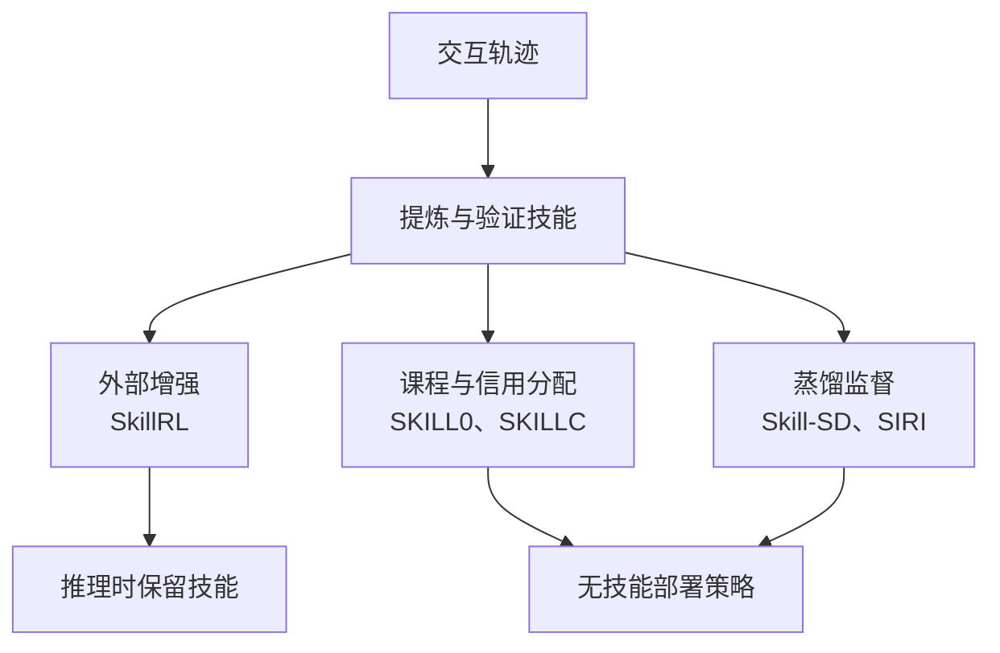

# 从 Skill 增强到 Skill 内化：Agent RL 如何把经验变成能力

一个 Agent 成功完成过一次任务，不代表它下次就能稳定做好。完整轨迹里混着有效策略、偶然成功和无用试错；直接把它们塞回上下文，模型还得重新判断哪些经验适用。即使把经验整理成精练的 skill，另一个问题也会出现：Agent 到底学会了做事，还是学会了依赖提示？

围绕这个问题，几项研究给出了不同答案：SkillRL 让经验成为可复用的外部技能库；SKILL0 逐步撤去技能提示；Skill-SD 用技能增强的教师监督无技能提示的学生；SKILLC 直接修改信用分配，让训练区分依靠提示与自主完成；SIRI 则把技能生成、验证和内化连成循环。

这个方向还在沿着不同问题展开：SDAR、OVCSD 研究技能教师是否可靠，SKALD 将内化用于数学推理，Skill0.5、AUSO 保留读取新技能的能力，UCOB 根据局部回报决定蒸馏方向，LifeSkill 则把内化延伸到部署过程。DGO、SGSD、SGCD 提供了经验内化和结果验证驱动学习的邻近视角。

我更看好这个方向中的一个具体问题：**哪些程序性知识值得写入参数，怎样证明模型已经吸收它们，又该为哪些知识保留外部更新接口。** 完全移除技能提示提供了一种清晰的检验条件；在知识持续变化的任务中，内化与外部技能利用也可能长期共存。这需要同时处理探索、监督质量和训练与推理的分布差异。

> 本文讨论截至 2026-09-07 公开的代表性研究，首发日期与引用版本见文末。作者单位按对应版本的首页署名列出。论文事实附章节、表格或 PDF 页码；跨论文解释和研究建议属于本文分析。这里的“无技能推理”仍然保留任务说明、环境观察、交互历史和工具接口，“zero-shot”不表示模型从未在该任务分布上训练。部署时继续更新参数或通过技能重试的结果，会单独标明。

## 先弄清楚，这里的 skill 是什么

SkillRL、SKILL0、Skill-SD、SKILLC 和 SIRI 使用的 skill，主要是自然语言形式的程序性知识，例如适用条件、行动策略、注意事项和工作流程。它们没有统一要求把技能变成一个可以独立调用、具有明确终止条件的子策略。

可以用一个自行构造的购物例子理解：

```text
适用条件：商品页已经打开，但还需要选择规格。
策略：先把需求拆成必须满足的约束，再检查商品与选项是否全部匹配。
关键步骤：选择规格 → 复查价格与属性 → 确认后购买。
```

这份 skill 舍弃了某个商品 ID、具体点击坐标和一次执行中的偶然顺序，试图保留能迁移到其他商品的决策结构。它是否真的有用，需要环境反馈验证；写得像经验总结并不构成证据。

SkillRL 用结构化条目记录技能及适用条件，并区分通用技能与任务专属技能；SIRI 的抽取模板明确要求输出适用条件、策略和关键步骤，并避免具体对象、位置和商品 ID。[SkillRL §3.2，PDF 第 3 页](https://arxiv.org/pdf/2602.08234v1#page=3)；[SIRI 附录 C、D，PDF 第 12–14 页](https://arxiv.org/pdf/2606.02355v1#page=12)。

这给 skill 一个很有价值的位置：它位于原始经验与模型参数之间，既能被检查和修改，又可以参与训练。成功轨迹告诉我们“发生过什么”，skill 尝试回答“下次遇到类似情况该怎么做”，而参数更新决定模型最终保留下来什么。

## 技能怎样进入 Agent 学习

下面以 SkillRL、SKILL0、Skill-SD、SKILLC 和 SIRI 为例，按技能参与学习的机制归类。表格表达问题之间的联系，不代表严格的继承关系，也不用于性能排名。

| 工作                                           | 技能从哪里来                                           | 技能怎样进入学习                                           | 推理时是否需要技能 | 核心问题                           |
| ---------------------------------------------- | ------------------------------------------------------ | ---------------------------------------------------------- | ------------------ | ---------------------------------- |
| [SkillRL](https://arxiv.org/abs/2602.08234v1)  | 外部强模型从成功与失败经验中提炼，训练中更新 SkillBank | 检索技能后进行 rollout，再用 GRPO 更新策略                 | 需要               | 怎样把经验变成更有效的探索指导     |
| [SKILL0](https://arxiv.org/abs/2604.02268v2)   | 沿用 SkillRL 的初始 SkillBank，按类别组织              | 技能与历史渲染为视觉上下文，用帮助程度和递减预算控制撤除   | 不需要             | 怎样逐步消除对技能提示的依赖       |
| [Skill-SD](https://arxiv.org/abs/2604.10674v1) | 外部摘要模型持续总结 Agent 轨迹                        | 只有教师看技能，对学生自己的 rollout 提供 token 级蒸馏信号 | 不需要             | 怎样把技能变成稳定、密集的训练监督 |
| [SKILLC](https://arxiv.org/abs/2605.27899v1)   | 按 SKILL0 的技能学习提示构建任务类别技能               | 同任务配对采样有技能与无技能轨迹，直接修改优势估计         | 不需要             | 怎样在策略更新中体现自主完成的价值 |
| [SIRI](https://arxiv.org/abs/2606.02355v1)     | 当前策略从自身成功的无技能轨迹中总结                   | 在线验证技能效用，再按动作优势选择性蒸馏                   | 不需要             | 怎样自行发现、筛选并吸收有效技能   |

用统一的信息流来看，这些方法在三个位置使用 skill：改变采样出来的经验、改变这些经验获得的训练权重、提供额外的蒸馏目标。



图中归类是本文的分析框架。SIRI 同时涉及探索和蒸馏，SKILLC 也包含课程控制，因此这些路径可以组合。

## SkillRL：先让经验成为有用的探索先验

> **作者与单位**：前三位作者 Peng Xia、Jianwen Chen、Hanyang Wang 均署名**北卡罗来纳大学教堂山分校（UNC-Chapel Hill）**，Hanyang Wang 同时署名**芝加哥大学**。其他合作单位包括**加州大学圣迭戈分校、NEC Labs America、加州大学伯克利分校、加州大学圣克鲁兹分校**。通讯作者为 UNC-Chapel Hill 的 Peng Xia 和 Huaxiu Yao。[论文首页](https://arxiv.org/pdf/2602.08234v1#page=1)。

SkillRL 的起点很实际：长轨迹含有大量冗余信息，简单存储与检索并不能保证经验复用。它使用更强的模型提炼成功策略与失败教训，组织成分层 SkillBank。Agent 接收通用指导和相关任务技能，在这种上下文中采样，再通过 GRPO 更新参数。训练过程中，低成功率任务上的失败还会用于更新技能库，让外部知识与策略共同演化。[SkillRL §3，PDF 第 3–5 页](https://arxiv.org/pdf/2602.08234v1#page=3)。

如果把任务与历史合写成 $x$、检索得到的技能写成 $s$，可以把它的主要训练目标概括为：

$$
J_{\mathrm{aug}}(\theta)
=\mathbb{E}_{x,\;s\sim\mathrm{Retrieve}(\mathcal B,x),\;\tau\sim\pi_\theta(\cdot\mid x,s)}[R(\tau)].
$$

这是本文用于比较的简化表达，不是论文原公式。它强调的是：优化与部署的对象都是能够获得技能上下文的策略。这个目标本身合理，因为外部技能可以修订、扩充，并在任务变化时立即生效。

SkillRL 的主表中，Qwen2.5-7B-Instruct 在 ALFWorld 上达到 89.9%，表中 GRPO 为 77.6%；WebShop 成功率为 72.7%，GRPO 为 66.1%。但完整系统还包含外部 o3 生成的冷启动数据与技能提炼，因此这些差值不能全部归因于“给 GRPO 加了一份技能文本”。[SkillRL 表 1，PDF 第 6 页](https://arxiv.org/pdf/2602.08234v1#page=6)。附录记载的冷启动 SFT 数据量分别为 ALFWorld 7,500 条、WebShop 2,400 条。[SkillRL 附录 B.1、表 4，PDF 第 14 页](https://arxiv.org/pdf/2602.08234v1#page=14)。

消融也提醒我们重视冷启动：移除 SFT 后，ALFWorld 从 89.9 降到 65.2；只移除技能库的动态演化，则降到 84.4。在这套设置中，教会策略如何使用技能，与持续维护技能库都很重要，不能把全部收益解释为库在不断增长。这些消融并非可相加的独立贡献。[SkillRL 表 3，PDF 第 7 页](https://arxiv.org/pdf/2602.08234v1#page=7)。

这篇论文支持的结论是：**经过提炼、组织并持续更新的经验，可以成为有效的行为先验。** 至于模型是否已经在不看技能时掌握了这些策略，需要另外设计训练目标和评测。

## SKILL0：逐步撤去提示，让训练走向部署条件

> **作者与单位**：作者来自**浙江大学、美团、清华大学**。第一作者 Zhengxi Lu 同时署名浙江大学与美团，论文注明工作在美团实习期间完成；通讯作者为美团的 Qi Gu 和浙江大学的 Yongliang Shen。[论文首页](https://arxiv.org/pdf/2604.02268v2#page=1)。

如果模型一直在 $\pi_\theta(\cdot\mid x,s)$ 下成功，不能直接假设它在 $\pi_\theta(\cdot\mid x)$ 下也能成功。SKILL0 把这种输入条件的差异变成课程问题：初期提供技能帮助探索，后期逐步减少技能，最后在不提供技能的条件下完成训练和评测。

它估计不同技能文件对当前策略的帮助程度。用统一记号可以写成：

$$
\Delta_k=\operatorname{SR}_{\mathrm{with},k}-\operatorname{SR}_{\mathrm{without},k}.
$$

如果某类任务仍然明显受益于技能，就有理由继续保留相应指导；如果帮助已经很小，就可以优先撤除。实际方法还受到预设递减预算约束，因此“动态”主要体现在预算内保留哪些技能，而不是完全取消时间日程。[SKILL0 §3.3，PDF 第 4–5 页](https://arxiv.org/pdf/2604.02268v2#page=4)。

**SKILL0 v2 有一个不能略过的设计：它使用 Qwen2.5-VL，把技能和交互历史渲染成图像上下文。** 因此实验同时涉及技能课程与上下文表示，不能直接理解为在普通文本 GRPO 上删几段 prompt。[SKILL0 §3.1，PDF 第 4 页](https://arxiv.org/pdf/2604.02268v2#page=4)。对于机制判断，更值得看同为视觉上下文的 AgentOCR 对照：3B 模型在 ALFWorld 上从 78.2 提升至 87.9，在 WebShop 上从 56.3 提升至 66.4。[SKILL0 表 1、表 2，PDF 第 6 页](https://arxiv.org/pdf/2604.02268v2#page=6)。

更直接的证据来自撤技能消融：全程固定预算为 `[6,6,6]` 时，ALFWorld 成功率在有技能测试下为 85.9%，撤去技能后降到 72.6%；采用 `[6,3,0]` 预算并按帮助程度筛选的完整课程，有技能和无技能测试分别为 86.3%、87.9%。这支持课程减轻提示依赖的行为结论，并不等于已经识别出参数内部的某个技能表征。[SKILL0 表 3、表 5，PDF 第 9、17 页](https://arxiv.org/pdf/2604.02268v2#page=17)。

这条路线的优势是容易理解，也不要求额外设计一个技能蒸馏损失。它的局限在于，技能帮助程度主要用于控制课程，策略更新仍沿用原本的奖励优化。训练器知道什么时候该撤去提示，却没有直接把“这次成功依赖了多少提示”变成信用分配信号。

另一个需要谨慎解读的指标是 token 开销。论文报告的低于 0.5k 的平均每步上下文 token 数，与视觉压缩和技能撤除共同有关。这个数字不能直接换算成同等比例的端到端延迟下降；图像渲染、视觉编码、输出长度和工具调用成本仍需要单独测量。

## Skill-SD：学生一直不看技能，让教师提供密集监督

> **作者与单位**：作者单位包括 **vivo AI Lab、中国科学院大学杭州高等研究院、香港中文大学、中国科学技术大学、中国科学院大学**，其中杭州高等研究院与中国科学院大学在论文中分列署名。共同第一作者为 Hao Wang（国科大杭州高等研究院、vivo AI Lab）、Guozhi Wang（vivo AI Lab）和 Han Xiao（香港中文大学）；通讯作者为中国科学院大学的 Honggang Qi。论文还注明 Hao Wang 为 vivo 实习生，Guozhi Wang 为项目负责人。[论文首页](https://arxiv.org/pdf/2604.10674v1#page=1)。

Skill-SD 选择了另一种训练与推理对齐方式：学生从一开始就使用普通任务提示。它自己与环境交互，随后教师在额外获得技能信息的条件下，为学生已经生成的 token 重新计算概率，形成密集蒸馏信号。

可以把一次更新中的两种条件写为：

$$
\underbrace{\pi_\theta(a_t\mid x,h_t)}_{\text{学生：普通任务上下文}}
\qquad\longleftarrow\qquad
\underbrace{\pi_{\bar\theta}(a_t\mid x,h_t,s)}_{\text{教师：额外获得技能}}.
$$

这里的关键是 **$h_t$ 来自学生自己的交互轨迹**。教师对学生实际遇到的状态和生成的 token 提供反馈，无需先独立采样一整条示范，再让学生照搬。教师与学生在每轮开始时同步参数，教师在该轮优化中停止梯度；随着学生进步，教师也会更新。[Skill-SD §3，PDF 第 4–8 页](https://arxiv.org/pdf/2604.10674v1#page=4)。

Skill-SD 联合优化 $\mathcal L_{\mathrm{GRPO}}+\lambda\mathcal L_{\mathrm{SDL}}$：环境完成率奖励继续驱动 RL，技能教师额外提供蒸馏监督。它没有用蒸馏完全替代环境反馈。

论文的另一个重点是蒸馏梯度。令 $\ell$ 为当前学生与固定教师对同一 token 的 log-prob 差，常用估计量 $k_3(\ell)=e^{-\ell}-1+\ell$ 直接作为损失反传，不能得到目标 reverse-KL 的正确梯度。Skill-SD 优化重要性加权的 $\rho_t k_3(\ell)$，其中：

$$
\rho_t=
\frac{\pi_\theta(a_t\mid x,h_t)}
{\operatorname{sg}[\pi_{\theta_{\mathrm{old}}}(a_t\mid x,h_t)]}.
$$

分母是生成这些样本的旧学生策略，分子是当前学生策略，而且分子必须保留梯度，不能误写成学生与技能教师的概率比。论文关于梯度正确性的推导限定在固定前缀条件下的 token 分布，不能据此宣称它已经修正整条多轮轨迹的状态分布偏差。[Skill-SD §3.3、附录 D、E](https://arxiv.org/pdf/2604.10674v1)。

在 Qwen3-4B-Instruct-2507 上，Skill-SD 的 AppWorld accuracy 为 64.9%，vanilla GRPO 为 50.9%；Sokoban 为 62.5%，GRPO 为 51.6%。这对应 **14.0 和 10.9 个百分点**。需要明确：这里的 AppWorld 成绩来自官方开发集的 57 个任务，并非 test-normal；Sokoban 评测包含 64 个关卡，论文没有报告多种子方差。这是两个环境下支持该训练方式的结果，证据强度仍受评测规模和协议限制。[Skill-SD §4.1、表 1，PDF 第 7–9 页](https://arxiv.org/pdf/2604.10674v1#page=9)。

这里还要区分两种“自己”：策略教师可以由学生同步得到，但技能摘要在实现中由外部 Seed1.8 生成。因此，自蒸馏不等于整个管线完全没有外部模型。[Skill-SD 附录 F，PDF 第 24 页](https://arxiv.org/pdf/2604.10674v1#page=24)。

这篇论文对方向的启发是，skill 不必作为部署输入才能发挥价值。它还可以是**训练专用的额外信息**：帮助教师形成更好的监督分布，再把这部分收益转给普通输入条件下的学生。

## SKILLC：把有无技能的差异直接用于信用分配

> **作者与单位**：四位作者 Hongxiang Lin、Zhirui Kuai、Erpeng Xue、Lei Wang 均署名**美团（Meituan）**。第一作者为 Hongxiang Lin，通讯作者为 Erpeng Xue。[论文首页](https://arxiv.org/pdf/2605.27899v1#page=1)。

SKILLC 进一步追问：如果最终关心自主完成，那么两条同样得到成功奖励的轨迹，一条依赖技能提示，一条没有提示，是否应该在训练中被完全同等对待？

它对同一个任务，在同一次策略更新中同时采样有技能和无技能两组轨迹。忽略平滑与截断时，其原始对比量为：

$$
\widehat\Delta(x)=\overline R^+(x)-\overline R^-(x).
$$

其中 $+$ 表示有技能，$-$ 表示无技能。训练中还会对该差值进行 EMA 平滑和截断。与 SKILL0 主要在验证阶段用差值控制课程相比，这个训练信号直接进入 SKILLC 的优势估计；另一个按任务类别聚合、经过平滑的验证信号再用于控制课程。[SKILLC §3.2–3.4，PDF 第 3–4 页](https://arxiv.org/pdf/2605.27899v1#page=3)。

它的 CSCA 优势估计同时保留两种信息：一个分量让两组轨迹处于共同的奖励尺度，另一个分量保留各自条件内部的相对表现，并加入对比修正。只看修正的方向，可以示意为：

$$
C(x)\propto\max(\widehat\Delta(x),0),\qquad
A^+\leftarrow A^+-C(x),\quad
A^-\leftarrow A^-+C(x).
$$

这只是方向示意，省略了论文的归一化、混合权重和门控强度。当有技能分支仍然更强时，修正会降低该分支的相对信用，提高无技能分支的相对信用；当差值不为正时，不反过来鼓励重新依赖技能。

有两个细节容易被摘要掩盖。第一，“one-sided”指的是只对正差值触发修正，**触发后两组轨迹都会受到影响**。第二，分支偏移作用于该分支的轨迹，并不是仅给无技能的成功样本加奖励。因此，它是带有自主性偏好的训练规则，不能理解成对某次成功来源的精确因果分解。

SKILLC 的主表报告 ALFWorld 90.6%、WebShop 74.0%，表中 SKILL0 基线为 85.9%、70.9%。摘要的 5.5% 和 4.4% 是相对提升，绝对差值为 4.7 和 3.1 个百分点。论文使用 Qwen2.5-7B-Instruct，声明结果为五次独立运行的平均，但主表没有同时给出误差范围。[SKILLC §4.1、表 1，PDF 第 5–6 页](https://arxiv.org/pdf/2605.27899v1#page=5)。

平均收益也掩盖了差异：相对表中的 SKILL0，Heat、Cool、Pick2 提升较大，Pick 和 Look 却分别下降 11.5、6.0 个百分点。另外，消融没有直接比较“保留配对与分条件归一化、只令 $C=0$”的版本，所以还不能干净地隔离对比修正项本身的增益。[SKILLC 表 1、表 2，PDF 第 6 页](https://arxiv.org/pdf/2605.27899v1#page=6)。

> **实现核对。** SKILLC v1 的 Figure 2 中，对比修正的正负方向标注与式 (6)、正文不一致。本文按公式和文字解释；复现时应核对实现，而不能只照流程图抄写。[SKILLC Figure 2、式 (6)，PDF 第 4 页](https://arxiv.org/pdf/2605.27899v1#page=4)。

## SIRI：自行提出技能假设，再用环境筛选

> **作者与单位**：作者来自**厦门大学、美团、澳门理工大学（Macao Polytechnic University）**。共同第一作者 Zhongyu He 同时署名厦门大学与美团，Yuanfan Li 署名美团；标注为通讯作者的 Siyuan Chen 和 Xingyang Li 均来自美团。[论文首页](https://arxiv.org/pdf/2606.02355v1#page=1)。

SIRI 把问题继续往技能来源推进。它不使用外部强模型负责技能总结，而是先让策略学会基本交互，再从自己成功完成的无技能轨迹中提炼技能。

完整训练分成三个阶段：

1. **预热。** 使用 GiGPO 积累基本交互能力与成功经验。GiGPO 同时利用轨迹级和可对齐状态上的动作级优势。
2. **技能挖掘与验证。** 当前策略的冻结快照总结成功的无技能轨迹；新技能先作为候选，通过有无技能的配对 rollout 估计效用，再决定激活或淘汰。
3. **选择性内化。** 对有帮助的技能引导轨迹，在移除技能的上下文下训练策略预测其中有价值的动作 token。

这套安排减少了一种循环依赖：技能的原始证据来自不依赖技能提示的成功行为，之后再验证它能否帮助其他执行。新技能的文字再流畅，也不直接获得可信监督的地位。[SIRI §4、Algorithm 1，PDF 第 4–6、15 页](https://arxiv.org/pdf/2606.02355v1#page=4)。

SIRI 的内化损失具有很明确的筛选条件。用省略归一化的记号表示，某个 token 的权重大致为：

$$
w_{i,t,\ell}\propto
\mathbf 1[\text{来自有技能分支}]
\mathbf 1[\Delta_g>0]
\mathbf 1[\text{属于动作 token}]
\max(A_{i,t},0).
$$

之后，在无技能上下文下对这些动作 token 做加权负对数似然优化。它保留环境奖励的 RL 损失，并额外增加内化损失。[SIRI 式 (14)–(18)，PDF 第 6 页](https://arxiv.org/pdf/2606.02355v1#page=6)。

这与 Skill-SD 有一个实质差异：Skill-SD 在学生访问的轨迹上，用教师分布监督学生；SIRI 的内化项来自技能引导的轨迹，再移除技能条件拟合其中选中的动作。后者仍要面对这些历史状态是否会被无技能策略自然访问的问题。SIRI 的无技能分支训练和最终评测能提供经验检验，但动作拟合本身并不消除这项分布差异。

SIRI 最有解释力的证据是 WebShop 消融：

| 配置              | 推理时提供技能 | 成功率 |
| ----------------- | -------------- | ------ |
| GiGPO 基线        | 否             | 72.8%  |
| 不做 Phase 2 内化 | 是             | 80.5%  |
| 不做 Phase 2 内化 | 否             | 71.9%  |
| 完整 SIRI         | 否             | 81.3%  |

来源：[SIRI 表 2，PDF 第 7 页](https://arxiv.org/pdf/2606.02355v1#page=7)。

这个消融先展示了依赖：移除内化阶段后，有技能时表现很好，直接撤去技能却明显退化。随后，完整方法在无技能推理条件下恢复并提高了表现。这比只给出最终最高分，更接近我们真正想检验的“内化”。不过，80.5 与 81.3 之间仅相差 0.8 个百分点，论文附录给定随机种子为 0；不能把这一小差值单独包装成有统计把握的优势。

“无需外部技能生成器”也有明确边界。SIRI 训练时仍然维护技能库，使用 embedding 模型检索，并承担配对 rollout 与额外前向计算。作者还明确承认：目前没有专门优化技能总结能力的训练信号，技能质量主要伴随策略能力提升而改善。[SIRI 附录 A，PDF 第 11 页；Limitations，PDF 第 9 页](https://arxiv.org/pdf/2606.02355v1#page=9)。

## 技能内化的几条新路线

教师可靠性、外部技能利用、在线学习和数学推理，正在成为技能内化的不同研究分支。下表按首发日期列出代表性工作，日期均为 2026 年。DGO、SGSD、SGCD 分别从经验学习、结果验证驱动的自蒸馏和信用分配切入，与狭义的技能库加 Agent RL 有所区别。

| 工作                                            | 首发日期 | 主要改变                              | 部署或评测条件                       |
| ----------------------------------------------- | -------- | ------------------------------------- | ------------------------------------ |
| [DGO](https://arxiv.org/abs/2603.24093v1)       | 03-25    | 经验引导 RL，再将独立推理链蒸馏进参数 | 同时评测无经验与经验增强推理         |
| [SDAR](https://arxiv.org/abs/2605.15155v1)      | 05-14    | 对技能自蒸馏的 token 信号进行门控     | 无技能推理                           |
| [Skill0.5](https://arxiv.org/abs/2605.28424v1)  | 05-27    | 内化通用技能，保持任务专属技能利用    | 保留专属技能输入                     |
| [SGSD](https://arxiv.org/abs/2605.28791v4)      | 05-27    | 用验证结果决定技能教师的指导方向      | 数学推理；学生不看技能               |
| [LifeSkill](https://arxiv.org/abs/2606.04815v2) | 06-03    | 优化技能抽取器，在线吸收成功经验      | 测试期间更新参数，失败后可用技能重试 |
| [SGCD](https://arxiv.org/abs/2606.12634v1)      | 06-10    | 将教师分歧转化为 GRPO 信用权重        | 不使用训练期的步骤指导               |
| [UCOB](https://arxiv.org/abs/2606.29502v1)      | 06-28    | 按相同状态的后续回报选择蒸馏方向      | 支持有技能、无技能两种推理           |
| [OVCSD](https://arxiv.org/abs/2607.27937v1)     | 07-30    | 技能教师从失败状态实际接管并验证      | 无技能推理                           |
| [SKALD](https://arxiv.org/abs/2608.09826v1)     | 08-10    | 将抽象技能卡用于 GRPO 与自蒸馏        | 数学推理；测试无技能、无教师         |
| [AUSO](https://arxiv.org/abs/2608.21292v1)      | 08-21    | 在动作层面协调技能内化与利用          | 保留技能库；OOD 评测提供对应技能     |

### SDAR 与 OVCSD：技能教师需要什么证据

> **SDAR 作者与单位**：第一作者 Zhengxi Lu，作者单位包括**浙江大学、美团、清华大学**。本文使用 2026-05-14 的 v1。[论文首页与 §3](https://arxiv.org/html/2605.15155v1)。

SDAR 保留 GRPO 主目标，并给技能自蒸馏增加 token 级 sigmoid 门控。学生在普通上下文中采样，技能教师对这些 token 评分；门控强化教师支持的正向概率差，对教师否定学生的信号作软衰减。部署时移除技能。

与 Skill-SD 对蒸馏梯度的关注相比，SDAR 更关注**不可靠教师会把学生往哪里推**。但概率差与门控仍然来自模型评分，不能等同于教师在对应状态下实际执行过并获得更高回报。[SDAR §3.1–3.2](https://arxiv.org/html/2605.15155v1)。

> **OVCSD 作者与单位**：第一作者 Xu Xia，作者单位包括**东南大学、中关村学院、清华大学、山东大学、中国科学技术大学**。本文使用 2026-07-30 的 v1。[论文首页](https://arxiv.org/pdf/2607.27937v1#page=1)。

OVCSD 把验证向前推进了一步。当学生整组失败、结果奖励无法提供有效区分时，它构建失败轨迹的共享前缀树，恢复到学生访问过的环境状态，让技能教师实际接管。若教师失败，就向更早的状态回退；只有成功续写进入监督。

训练也区分两种信号：在共同状态的首次动作分叉处，强化教师的成功动作、抑制学生的失败动作；在分叉之后，对教师完成任务的后续轨迹做 KL 蒸馏，并与 GRPO 联合优化。这比单纯重评分更接近“验证过的局部纠错”。[OVCSD §3，式 3–9](https://arxiv.org/pdf/2607.27937v1#page=3)。

在该文 Qwen2.5-7B 的同表对照中，Skill-SD 到 OVCSD 的 ALFWorld 成功率为 85.1% → 92.2%，WebShop accuracy 为 76.5% → 84.4%，两者均标为无技能部署。这里引用的是该文表中的 Skill-SD 行。另一方面，方法依赖可恢复的环境状态；论文所说的额外交互低于 3%，也只是回放和教师动作占环境交互的比例，不能理解成总计算成本只增加 3%。[OVCSD 表 1、表 2](https://arxiv.org/pdf/2607.27937v1#page=5)。

### SKALD 与 SGSD：从交互流程扩展到数学技能

> **SKALD 作者与单位**：第一作者 Yubo Jiang，作者单位包括**北京航空航天大学宇航学院、美团 Longcat Interaction Team、北航天目山实验室**。本文使用 2026-08-10 的 v1。[论文首页](https://arxiv.org/html/2608.09826v1)。

SKALD 将技能写成经过显式答案过滤的抽象卡片，只提供给教师。学生始终在自己的推理前缀上接受监督，训练目标明确包含 GRPO 与门控技能蒸馏。它使用退火的 tilted cross-entropy，减弱学生当前几乎无法生成、教师却偏好的 token 带来的不稳定影响。默认门控根据初始模型采样估计的教师收益构建，训练中保持固定，因此不保证教师始终更强。

这篇论文特别研究了**组内奖励全相同**的训练样本：无论全对还是全错，基于组内相对奖励的优势都可能为零，技能教师仍可能提供有区分度的 token 监督。论文还给出相同 FLOPs 下的 GRPO 对照，帮助区分技能信号收益与额外计算收益。测试只有问题，没有技能和教师；但技能卡由离线 Qwen3-14B 提取筛选，因此自蒸馏不表示整个准备过程没有外部模型。实验对象是数学推理，不能直接外推到多轮工具操作。[SKALD 方法、实验与消融](https://arxiv.org/html/2608.09826v1)。

> **SGSD 作者与单位**：第一作者 Jiazhen Huang，所读 v4 的单位为**清华大学、威斯康星大学麦迪逊分校、X-Humanoid、香港城市大学、华中科技大学**。论文首发 2026-05-27，本文使用 2026-09-03 的 v4。[论文首页](https://arxiv.org/html/2605.28791v4)。

SGSD 同样让学生只看数学问题，但把检索到的技能与常见错误组合成多个教师上下文。所有教师评价同一条学生轨迹，再由最终验证结果判断指导方向：支持成功行为或压低失败行为的教师提供正向监督，方向相反的教师信号会被反转，不确定的信号则被忽略。

它的重点是把技能教师当成需要验证的假设。其目标是结果验证驱动的门控自蒸馏，梯度可以写成策略梯度形式，但原文并非通常的“GRPO 损失加蒸馏损失”。这与 SKALD 的明确联合目标应当区分。[SGSD §2.4–3，式 13–20](https://arxiv.org/html/2605.28791v4)。

### Skill0.5 与 AUSO：内化之后，仍要会读新技能

> **Skill0.5 作者与单位**：第一作者 Jiapeng Zhu，作者来自**华东师范大学、美团 Longcat 团队**。本文使用 2026-05-27 的 v1。[论文首页](https://arxiv.org/pdf/2605.28424v1#page=1)。

Skill0.5 明确区分通用技能与任务专属技能：前者内化，后者保留外部利用能力。训练按难度分配信号，难任务使用技能教师成功轨迹的 JSD 蒸馏，中等任务主要用 GRPO，易任务则通过有无技能对照促进专属技能利用。它与 SKILLC 的差异很有意思：有无技能的表现差值，不仅能用来鼓励自主完成，也能用来训练模型更好地使用新指导。[Skill0.5 §3](https://arxiv.org/pdf/2605.28424v1#page=4)。

> **AUSO 作者与单位**：第一作者 Huizu Lin，署名单位包括**中国科学技术大学、新南威尔士大学、中国科学院大学、西交利物浦大学、合肥综合性国家科学中心**，另有独立研究者。本文使用 2026-08-21 的 v1。[论文首页](https://arxiv.org/html/2608.21292v1)。

AUSO 将内化与利用的控制细化到动作层面。GRPO 贯穿三个阶段：早期对整组失败任务加入技能教师的动作级 JSD 蒸馏；中期撤去教师项，巩固自主行为；后期在相同学生状态比较有无技能的动作分布，再结合组成功率门控重加权优势。这里的 JSD 衡量分布变化，不能直接解释成某个动作的因果收益。[AUSO §3.3、附录 A.3](https://arxiv.org/html/2608.21292v1)。

这两篇应当改变我们对方向的描述：**内化与外部技能利用已经是可以共同优化的目标。** 但证据有输入条件。AUSO 的 ALFWorld OOD 表中，Skill0.5 为 58.5%，AUSO 为 67.9%；该评测提供对应 OOD 技能库。Skill0.5 本身也在未见任务类别上提供新的专属技能。因此，这些结果检验的是获得新技能后的泛化，不能和完全无技能的跨类别泛化直接排名。[Skill0.5 附录 D](https://arxiv.org/pdf/2605.28424v1#page=13)；[AUSO 表 1、附录 B](https://arxiv.org/html/2608.21292v1)。

### UCOB：由局部回报决定谁教谁

> **UCOB 作者与单位**：第一作者 Songjun Tu，作者单位为**中国科学院自动化研究所、鹏城实验室、Memorax AI**。本文使用 2026-06-28 的 v1。[论文首页](https://arxiv.org/html/2606.29502v1)。

UCOB 不预先指定技能分支永远是教师。有技能、无技能两种上下文都进行环境交互和 GiGPO 更新；训练再把相同任务中可对齐的 anchor state 归组，选取后续回报最高的记录，在回报差超过阈值时监督另一种上下文。

当有技能分支更好时，知识向无技能分支转移；当无技能分支更好时，学习方向反转，用自主行为纠正错误的技能利用。同一批 rollout 还用于更新技能效用、技能记忆和技能写作者。[UCOB §4.2–4.4](https://arxiv.org/html/2606.29502v1)。

这使“技能是否有用”从全任务平均差值细化到局部状态，也承认教师角色可能在一条轨迹中变化。原文表 1 标明支持无技能推理，§6.4 比较两种输入条件；由于主结果表没有清楚逐项标明默认使用哪一种条件，本文不将其中最高分当作无技能成绩引用。[UCOB 表 1、§6.4](https://arxiv.org/html/2606.29502v1)。

### LifeSkill：内化也可以发生在部署过程中

> **LifeSkill 作者与单位**：第一作者 Bo Mao，作者单位为**华东师范大学计算机科学与技术学院、华东师范大学软件工程研究所、上海人工智能实验室**。论文首发 2026-06-03，本文使用 2026-06-19 的 v2。[论文首页](https://arxiv.org/pdf/2606.04815v2#page=1)。

LifeSkill 把执行器与技能抽取器分成两个独立的 LoRA。执行器失败后，抽取器生成技能，执行器在指导下重试；这些尝试的下游验证成功率，又成为训练抽取器的 DAPO 奖励。这为 SIRI 提到的“技能总结能力缺少专门优化信号”提供了一种具体回应。

执行器的内化采用另一种目标：移除技能输入，对成功轨迹进行奖励加权的对数似然训练。不能把两个模型的更新都概括成 DAPO 或 GRPO。更关键的是，执行器会在测试任务流中继续更新参数。[LifeSkill §3.2–3.4，式 18](https://arxiv.org/pdf/2606.04815v2#page=5)。

在 LifelongAgentBench 上，同底座 Llama-3.1-8B 的平均准确率由 RFT 的 0.52 提升到 LifeSkill 的 0.59。这个结果反映的是在线系统的表现：初次失败后仍可能使用临时技能，并进行参数更新；表中的“Experience=0”不等于固定权重、从不读取技能的单次推理。评估它应报告任务顺序、重试预算、在线训练成本和后续任务收益。[LifeSkill 表 1 与评测设置](https://arxiv.org/pdf/2606.04815v2#page=7)。

### DGO 与 SGCD：经验可以通过不同目标进入参数

> **DGO 作者与单位**：第一作者 Fei Bai，作者单位为**中国人民大学、IQuest Research、北京航空航天大学**。本文使用 2026-03-25 的 v1。[论文首页](https://arxiv.org/html/2603.24093v1)。

DGO 的基本单位是从轨迹中提炼的经验。它用经验库辅助 GRPO 探索，并逐轮降低经验引导比例；随后将引导轨迹改写成不引用外部经验的独立推理链，再进行监督蒸馏。论文同时研究无外部经验的能力与经验增强推理，因此不能概括为彻底取消经验库。它把课程撤除与显式内化结合起来，也展示了经验学习与技能学习在训练机制上的联系。[DGO §3.2.3–3.3](https://arxiv.org/html/2603.24093v1)。

> **SGCD 作者与单位**：三位作者 Tianyu Ding、Jianhong Xin、Juan Pablo De la Cruz Weinstein 均署名 **Amazon Web Services**。本文使用 2026-06-10 的 v1。[论文首页](https://arxiv.org/html/2606.12634v1)。

SGCD 从同任务的成功与失败轨迹中提炼训练专用的步骤信用参考，不维护持续检索的技能库。教师与学生的分布差异经过停止梯度和有界变换，转化为 GRPO 的 token 优势权重，保持原优势的正负方向；参数更新没有独立的教师模仿损失。[SGCD §4，式 2–5](https://arxiv.org/html/2606.12634v1)。

这篇论文值得放进讨论，是因为它在长程工具任务中观察到直接自蒸馏可能强化跳过工具的行为，损害需要真实改变状态的任务。它提供了一种不同选择：让经验帮助 RL 判断哪里应该获得更多信用。这个诊断有其具体任务和训练配置，不能外推成所有蒸馏都不适合 Agent。[SGCD §3、§5.3](https://arxiv.org/html/2606.12634v1)。

综合这些研究，本文更倾向于用三个问题组织这个方向：**额外知识在哪里参与学习，教师信号凭什么可信，最终在什么输入和更新条件下评测。** 单看是否出现 skill bank、是否使用自蒸馏，已经不足以判断两个方法是否在解决同一个问题。

## 这些实验能够支持多强的结论

多项研究反复使用 ALFWorld、WebShop 等环境，但模型、训练预算与评测条件并不相同。下面选取几组论文内部的对照，说明同名环境下的数字为什么不能直接拼成排行榜。

| 论文      | 选取的文内对照                               | 改进幅度       | 需要保留的限定                                                   |
| --------- | -------------------------------------------- | -------------- | ---------------------------------------------------------------- |
| SkillRL   | ALFWorld：GRPO 77.6 → SkillRL 89.9           | +12.3 个百分点 | 完整管线包含冷启动、外部技能生成与推理检索；部分基线沿用既有结果 |
| SKILL0 v2 | ALFWorld，VL-3B：AgentOCR 78.2 → SKILL0 87.9 | +9.7 个百分点  | 同为视觉上下文的对照更有解释力                                   |
| Skill-SD  | AppWorld dev：GRPO 50.9 → Skill-SD 64.9      | +14.0 个百分点 | 使用 Qwen3-4B，评测为 57 个开发集任务                            |
| SKILLC    | WebShop：表中 SKILL0 70.9 → SKILLC 74.0      | +3.1 个百分点  | 该表的 SKILL0 行与 SKILL0 v2 的配置和结果需要区分                |
| SIRI      | WebShop：GiGPO 72.8 → SIRI 81.3              | +8.5 个百分点  | 基础算法不同，附录给出单个种子设置                               |

来源分别为：[SkillRL 表 1](https://arxiv.org/pdf/2602.08234v1#page=6)、[SKILL0 表 1](https://arxiv.org/pdf/2604.02268v2#page=6)、[Skill-SD 表 1](https://arxiv.org/pdf/2604.10674v1#page=9)、[SKILLC 表 1](https://arxiv.org/pdf/2605.27899v1#page=6)、[SIRI 表 1](https://arxiv.org/pdf/2606.02355v1#page=7)。

**第一，跨论文的同名基线未必是同一个实验对象。** SKILL0 v2 的 7B 结果是 ALFWorld 89.8、WebShop accuracy 74.2，采用 Qwen2.5-VL 与视觉上下文；SKILLC 表中的 SKILL0 是 85.9、70.9，实验总设置写的是 Qwen2.5-7B-Instruct，未交代与 SKILL0 v2 的结果对应关系。因此，既不能用前者反驳后者的文内改进，也不能拿后者宣称优于 SKILL0 v2 的配置。

**第二，固定评测条件下的无技能成功率提高，是内化的主要行为证据。** 单独观察 $\Delta=\operatorname{SR}_{\mathrm{with}}-\operatorname{SR}_{\mathrm{without}}$ 变小是不够的：无技能能力提高可以缩小差值，有技能能力下降也可以。应对同一冻结 checkpoint，在相同工具和试次预算下检查两条绝对性能曲线，并比较额外训练成本。对于 LifeSkill 这样的在线系统，则需要单独记录更新前后的能力、重试成功与后续任务收益，不能把它们合成一个固定权重的无技能分数。

**第三，泛化必须连同输入条件一起报告。** SkillRL 和 SKILL0 包含搜索 QA 的跨数据集测试，Skill-SD 扩展到 AppWorld 与 Sokoban，SKALD 研究数学推理，Skill0.5 与 AUSO 测试获得新技能后的未见任务类别。这些拓展有价值，但还不能证明模型学会了通用、可任意组合的技能系统。新商品、新任务组合、新工具协议，以及是否提供对应技能，是不同的评测条件。

**第四，推理省下的开销可能转移到了训练。** Skill-SD 增加教师评分与技能摘要；SKILLC 增加不同条件下的验证与训练调度；SIRI 增加技能挖掘、检索和内化前向。SKILLC 表 3 中，第 50 步的中位每步耗时为 1,187 秒，GRPO 为 941 秒。这个局部对比已经说明，不能把“配对轨迹仍在同一 group 预算内”理解为总成本没有增加。[SKILLC 表 3，PDF 第 8 页](https://arxiv.org/pdf/2605.27899v1#page=8)。

新的方法还要核算环境恢复、教师接管和在线参数更新。OVCSD 的额外交互比例、SKALD 的 FLOPs 对照、LifeSkill 的流式任务收益，测量的是不同成本维度。尤其在在线学习中，训练与部署已经交错，应比较整个任务流的累计成功数、时间和计算量。[OVCSD 表 2](https://arxiv.org/pdf/2607.27937v1#page=6)；[SKALD 消融](https://arxiv.org/html/2608.09826v1)；[LifeSkill §4](https://arxiv.org/pdf/2606.04815v2#page=7)。

## 我认为接下来最值得做的研究

### 把技能的“有用”与“可内化”分开测量

现有方法经常用有无技能的短期奖励差来判断价值。但这个差值回答的是“当前模型读到它有没有帮助”，不是“训练一段时间后，无提示策略能否吸收它”。

一份包含任务特定线索的技能可能立即提高成功率，却难以迁移；一个结构简单、反复适用的错误恢复流程，短期增益未必最大，却可能更容易学进参数。一个更具体的研究问题是：能否在受控预算下，预测某份技能经过训练后带来的无技能验证增益，并用这个量指导筛选？下游成功率、教师回报差和动作分布差已经提供了不同信号，这个建议关注的是它们对后续内化收益的预测能力。

### 让技能效用估计更接近可信的归因

SKILLC 和 SIRI 的配对比较比“成功轨迹里的技能都有效”更进一步，但同任务配对还不足以得到单个 skill 的独立因果贡献。多个技能同时注入、分支访问不同状态、采样方差，都可能影响差值。SIRI 还把组级效用用于更新被检索技能，因此多个技能一起出现时，如何拆分贡献仍然是问题。

UCOB 的相同 anchor state 比较、OVCSD 的实际接管、SGCD 的局部优势重加权已经在改善信号粒度。但状态归组仍可能忽略历史差异，成功续写也可能同时受多个技能和采样结果影响；它们还不能直接识别某条技能的独立贡献。[UCOB §4](https://arxiv.org/html/2606.29502v1)；[OVCSD §3](https://arxiv.org/pdf/2607.27937v1#page=3)；[SGCD §4.4](https://arxiv.org/html/2606.12634v1)。

更有说服力的实验可以固定任务和初始环境状态，控制采样预算，重复比较，并加入随机技能、错配技能、同长度无关文本以及逐个删除技能的对照。这样才能排除额外上下文长度、模板变化或偶然轨迹差异的影响。

### 对稳定策略做内化，同时保留可更新知识的外部接口

技能是否应该全部内化，取决于部署需求。稳定的工具使用习惯、约束检查顺序和错误恢复流程，适合长期保留在参数中；频繁变化的业务规则、工具版本说明与临时任务约束，仍然适合通过外部上下文提供。

Skill0.5 与 AUSO 已经把通用能力内化和外部技能利用放进同一训练过程。它们的“通用／专属”划分，与这里建议的“稳定／易变”划分并不完全相同：专属技能也可能长期稳定。接下来更值得研究的是如何依据知识变化频率、学习难度和维护代价决定边界，并测试旧技能被修订后模型能否及时纠正参数中的旧行为。[Skill0.5 §3](https://arxiv.org/pdf/2605.28424v1#page=4)；[AUSO §3](https://arxiv.org/html/2608.21292v1)。

完全撤去技能仍是一种清晰的研究条件；实际部署还应比较保留更新接口后，成功率、维护成本与更新速度是否更好。

### 用一套实验把探索收益与内化收益拆开

如果继续做这个方向，我会先固定底座模型、环境划分、上下文表示和 RL 算法，再用下列对照定位收益来源。所有配置都应计入额外验证、摘要和教师前向成本。

| 想验证的问题                 | 必要对照                                       | 主要观察                                   |
| ---------------------------- | ---------------------------------------------- | ------------------------------------------ |
| 技能是否改善探索             | 普通 RL、技能增强 RL                           | 同等交互预算下的成功样本数量与学习曲线     |
| 撤去技能是否造成依赖暴露     | 同一 checkpoint 分别有技能、无技能评测         | 两条绝对成功率曲线与差值                   |
| 内化方法是否优于继续训练     | 普通 RL 延长训练、课程撤除、对比归因、蒸馏     | 同等 GPU 时间下的无技能测试表现            |
| 有效的是技能内容还是额外输入 | 真实技能、随机技能、错配技能、长度匹配文本     | 无技能最终收益与错误类型                   |
| 是否具备组合泛化             | 留出完整任务类别或技能组合                     | 已见与未见组合的性能差距                   |
| 新技能利用是否独立于内化能力 | 固定权重下分别无技能、正确新技能、过期技能评测 | 自主表现、读取新指导的增益与纠错能力       |
| 在线内化是否改善后续任务     | 匹配重试预算，比较冻结策略与在线更新策略       | 首次尝试成功率、后续任务收益和累计成本     |
| 是否值得部署                 | 保留检索与完成内化的策略                       | 成功率、端到端延迟、训练成本和规则更新代价 |

还应报告多个种子的均值与方差，并给技能生成、筛选和课程控制使用的数据单独划分验证集。技能文本会总结经验，技能生命周期会依据反馈调整；这些环节同样可能间接适配评测集，不能只检查梯度更新是否使用了测试样本。

这些研究把经验复用拆成了可以分别检验的步骤：经验能否被提炼、提炼物能否帮助行为、这种帮助能否转移到无提示策略。随着方法的发展，还需要验证教师是否值得学习、学习方向是否应该反转，以及模型内化之后是否仍能有效使用新指导。

我会优先关注两类证据：在相同预算下提高未见任务的无技能表现，以及在知识变化时保留利用新指导、纠正旧行为的能力。前者检验经验是否进入参数，后者检验这些参数能否继续适应环境。两者都需要清楚说明收益来自哪里的实验。

## 论文与版本

以下按首次公开日期排列，并标明本文引用的版本。

1. Peng Xia et al. **SkillRL: Evolving Agents via Recursive Skill-Augmented Reinforcement Learning**. 2026-02-09，本文使用 v1。[arXiv](https://arxiv.org/abs/2602.08234v1)。
2. Fei Bai et al. **Towards Effective Experiential Learning: Dual Guidance for Utilization and Internalization**（DGO）. 2026-03-25，本文使用 v1。[arXiv](https://arxiv.org/abs/2603.24093v1)。
3. Zhengxi Lu et al. **SKILL0: In-Context Agentic Reinforcement Learning for Skill Internalization**. 首版 2026-04-02，本文使用 2026-05-15 的 v2。[arXiv](https://arxiv.org/abs/2604.02268v2)。
4. Hao Wang et al. **Skill-SD: Skill-Conditioned Self-Distillation for Multi-turn LLM Agents**. 2026-04-12，本文使用 v1。[arXiv](https://arxiv.org/abs/2604.10674v1)。
5. Zhengxi Lu et al. **Self-Distilled Agentic Reinforcement Learning**（SDAR）. 2026-05-14，本文使用 v1。[arXiv](https://arxiv.org/abs/2605.15155v1)。
6. Hongxiang Lin et al. **SKILLC: Learning Autonomous Skill Internalization in LLM Agents via Contrastive Credit Assignment**. 2026-05-27，本文使用 v1。[arXiv](https://arxiv.org/abs/2605.27899v1)。
7. Jiapeng Zhu et al. **Skill0.5: Joint Skill Internalization and Utilization for Out-of-Distribution Generalization in Agentic Reinforcement Learning**. 2026-05-27，本文使用 v1。[arXiv](https://arxiv.org/abs/2605.28424v1)。
8. Jiazhen Huang et al. **Skill-Conditioned Gated Self-Distillation for LLM Reasoning**（SGSD）. 首版 2026-05-27，本文使用 2026-09-03 的 v4。[arXiv](https://arxiv.org/abs/2605.28791v4)。
9. Zhongyu He et al. **SIRI: Self-Internalizing Reinforcement Learning with Intrinsic Skills for LLM Agent Training**. 2026-06-01，本文使用 v1。[arXiv](https://arxiv.org/abs/2606.02355v1)。
10. Bo Mao et al. **Learning While Acting: A Skill-Enhanced Test-Time Co-Evolution Framework for Online Lifelong Learning Agents**（LifeSkill）. 首版 2026-06-03，本文使用 2026-06-19 的 v2。[arXiv](https://arxiv.org/abs/2606.04815v2)。
11. Tianyu Ding et al. **Keep Policy Gradient in Charge: Sibling-Guided Credit Distillation for Long-Horizon Tool-Use Agents**（SGCD）. 2026-06-10，本文使用 v1。[arXiv](https://arxiv.org/abs/2606.12634v1)。
12. Songjun Tu et al. **UCOB: Learning to Utilize and Evolve Agentic Skills via Credit-Aware On-Policy Bidirectional Self-Distillation**. 2026-06-28，本文使用 v1。[arXiv](https://arxiv.org/abs/2606.29502v1)。
13. Xu Xia et al. **From Scoring to Acting: Outcome-Verified Comparative Self-Distillation for LLM Agents**（OVCSD）. 2026-07-30，本文使用 v1。[arXiv](https://arxiv.org/abs/2607.27937v1)。
14. Yubo Jiang et al. **Distill Skills into Weights, Not Prompts: Abstract Skills as Privileged Signals for On-Policy Self-Distillation**（SKALD）. 2026-08-10，本文使用 v1。[arXiv](https://arxiv.org/abs/2608.09826v1)。
15. Huizu Lin et al. **AUSO: Action-Level Unified Skill Optimization from Internalization to Utilization**. 2026-08-21，本文使用 v1。[arXiv](https://arxiv.org/abs/2608.21292v1)。

相关基础：[[foundations/RL/算法/GRPO|GRPO]]、[[foundations/RL/index|强化学习]]。
